<div style="border-bottom: 1px solid var(--vp-c-divider); padding-bottom: 1rem; margin-bottom: 2rem;">
  <h1 style="margin-bottom: 0.5rem;">Application Architecture</h1>
  <div style="display: flex; gap: 1rem; flex-wrap: wrap; font-size: 0.9rem; color: var(--vp-c-text-2);">
    <span style="display: flex; align-items: center; gap: 0.25rem;">
      🏗️ <strong>Architecture</strong>
    </span>
    <span style="display: flex; align-items: center; gap: 0.25rem;">
      📝 <strong>475</strong> words
    </span>
    <span style="display: flex; align-items: center; gap: 0.25rem;">
      ⏱️ <strong>3</strong> min read
    </span>
  </div>
</div>

LoanFlow implements a **page-based, linear multi-step form architecture** where each route represents a distinct step in the loan application process. The application uses React Router to manage navigation between eight sequential pages, creating a guided workflow from initial landing through final success confirmation.

## Core Architecture Pattern

The application follows a **single-page application (SPA) model** with client-side routing. All pages are mounted within a single React component tree, and navigation between steps is handled entirely by React Router without full page reloads.

```tsx
// src/App.tsx - Root routing configuration
\<Router\>
  <div className="min-h-screen bg-gray-50">
    \<Routes\>
      <Route path="/" element={<LandingPage />} />
      <Route path="/get-started" element={<GetStartedPage />} />
      <Route path="/refinance-amount" element={<RefinanceAmountPage />} />
      <Route path="/education-details" element={<EducationDetailsPage />} />
      <Route path="/personal-info" element={<PersonalInfoPage />} />
      <Route path="/employment" element={<EmploymentPage />} />
      <Route path="/review" element={<ReviewPage />} />
      <Route path="/success" element={<SuccessPage />} />
    </Routes>
    <Toaster />
  </div>
</Router>
```

## Application Flow

The eight routes form a linear progression through the loan application lifecycle:

```mermaid
graph LR
    A["Landing Page<br/>path: /"] --> B["Get Started<br/>path: /get-started"]
    B --> C["Refinance Amount<br/>path: /refinance-amount"]
    C --> D["Education Details<br/>path: /education-details"]
    D --> E["Personal Info<br/>path: /personal-info"]
    E --> F["Employment<br/>path: /employment"]
    F --> G["Review<br/>path: /review"]
    G --> H["Success<br/>path: /success"]
    
    style A fill:#f0f0f0
    style B fill:#e8f5e9
    style C fill:#e8f5e9
    style D fill:#e8f5e9
    style E fill:#e8f5e9
    style F fill:#e8f5e9
    style G fill:#fff3e0
    style H fill:#c8e6c9
```



### Step Descriptions

| Step | Route | Purpose |
|------|-------|---------|
| 1 | `/` | Initial landing page introducing the refinancing platform |
| 2 | `/get-started` | Onboarding page explaining the process, benefits, and timeline |
| 3 | `/refinance-amount` | Capture loan refinance amount details |
| 4 | `/education-details` | Collect education-related information |
| 5 | `/personal-info` | Gather personal identification and contact details |
| 6 | `/employment` | Capture employment and income information |
| 7 | `/review` | Final review of all submitted information before submission |
| 8 | `/success` | Confirmation page displayed after successful application submission |

## Separation of Concerns

Each page is implemented as an independent component with clear responsibilities:

- **Page Components**: Located in `src/pages/`, each page handles its own UI rendering, form inputs, and local state management for that step.
- **Navigation**: Pages use the `useNavigate()` hook from React Router to programmatically advance to the next step. Navigation is typically triggered by button clicks after form validation.
- **Shared UI Components**: Reusable UI elements (buttons, cards, inputs, progress indicators) are imported from `src/components/ui/` and used consistently across pages.
- **Global State**: Application-wide state (such as form data persistence across steps) is managed separately from individual page components, though the specific state management implementation is documented in [State Management](./state-management.md).

### Example: GetStartedPage Navigation

The `GetStartedPage` demonstrates the navigation pattern:

```tsx
const navigate = useNavigate();

<Button
  onClick={() => navigate("/refinance-amount")}
>
  Start a Rate Check
</Button>
```

Each page is responsible for determining when the user is ready to proceed and calling `navigate()` with the next route path.

## Progress Tracking

Pages include visual progress indicators (such as `ProgressBar` component) to communicate the user's position within the multi-step flow. This provides context and encourages completion by showing how many steps remain.

## Layout and Styling

All pages share a consistent layout structure:
- Minimum full-screen height (`min-h-screen`)
- Centered container with responsive padding
- Consistent background color (`bg-gray-50` or `bg-white`)
- Responsive typography and spacing

This consistency is achieved through shared CSS classes and component composition rather than a centralized layout wrapper, allowing individual pages flexibility while maintaining visual coherence.

## Related Documentation

For deeper understanding of how this architecture connects to other systems:
- [Application Routes](./application-routes.md) — Detailed route definitions and page-specific behaviors
- [State Management](./state-management.md) — How form data persists across the multi-step flow
- [UI Components](./ui-components.md) — Reusable components used throughout the application
- [Form Validation](./form-validation.md) — Validation logic applied at each step