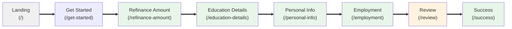

  <h1 style="margin-bottom: 0.5rem;">Application Routes</h1>
  

    
      📚 <strong>Reference</strong>
    
    
      📝 <strong>737</strong> words
    
    
      ⏱️ <strong>4</strong> min read
    
  

The LoanFlow application implements a linear, step-by-step loan refinancing workflow through eight distinct routes. Each route corresponds to a page in the application flow, guiding users from initial landing through successful application submission.

## Route Overview

The application defines all routes in `src/App.tsx` using React Router. The following table summarizes each route, its path, and its purpose in the user journey:

| Route | Path | Purpose | Step |
|-------|------|---------|------|
| Landing | `/` | Initial entry point; introduces the application | — |
| Get Started | `/get-started` | Initiates the application flow | — |
| Refinance Amount | `/refinance-amount` | Collects estimated loan refinance amount | 1 of 3 |
| Education Details | `/education-details` | Gathers degree type, graduation date, and Parent Plus loan status | 1 of 3 |
| Personal Info | `/personal-info` | Captures name, email, and phone number | — |
| Employment | `/employment` | Records employment status and annual income | — |
| Review | `/review` | Displays all collected information for verification and final submission | 3 of 3 |
| Success | `/success` | Confirmation page after successful application submission | — |

## User Flow Progression

The application enforces a linear progression through the refinancing workflow. Users navigate sequentially through the steps, with each page validating input before allowing progression to the next route.

## Route Details

### Landing (`/`)
The entry point of the application. Renders `LandingPage` component.

### Get Started (`/get-started`)
Initiates the formal application process. Renders `GetStartedPage` component.

### Refinance Amount (`/refinance-amount`)
**Purpose:** Collect the estimated loan amount to refinance.

**Key behaviors:**
- Validates that the entered amount is at least $5,000
- Displays validation error if minimum threshold is not met
- Navigates to `/education-details` on successful validation
- Progress indicator shows step 1 of 3

**Validation rule:** Minimum refinance amount is $5,000.

### Education Details (`/education-details`)
**Purpose:** Gather educational background information.

**Collected fields:**
- Degree type (Undergraduate, Graduate, High School)
- Graduation date or last attendance date (MM/YYYY format)
- Parent Plus loan status (Yes/No)

**Key behaviors:**
- Requires all three fields to be completed before proceeding
- Navigates to `/personal-info` on successful validation
- Progress indicator shows step 1 of 3
- Provides back navigation to previous step

### Personal Info (`/personal-info`)
Captures personal identification details. Renders `PersonalInfoPage` component.

### Employment (`/employment`)
Records employment and income information. Renders `EmploymentPage` component.

### Review (`/review`)
**Purpose:** Display all collected information for user verification before final submission.

**Key behaviors:**
- Displays all previously entered information organized by category:
  - Loan Details (refinance amount, loan purpose)
  - Education Details (degree type, graduation date, Parent Plus status)
  - Personal Information (name, email, phone)
  - Employment Information (employment status, annual income)
- Provides edit buttons for each section, allowing users to navigate back to specific pages to modify information
- Requires explicit agreement to Terms of Service and Privacy Policy via checkbox
- Simulates a 2-second API call on submission
- Navigates to `/success` after successful submission
- Progress indicator shows step 3 of 3

**Edit navigation:** Each section includes an edit button that navigates directly to the corresponding route:
- Loan Details → `/refinance-amount`
- Education Details → `/education-details`
- Personal Information → `/personal-info`
- Employment Information → `/employment`

### Success (`/success`)
Confirmation page displayed after successful application submission. Renders `SuccessPage` component.

## Navigation Patterns

### Forward Navigation
Users progress through the workflow by clicking "Next" buttons on each page. Each page validates its form data before allowing progression to the next route.

### Backward Navigation
- All pages (except Landing) include a back button that uses `navigate(-1)` to return to the previous page
- The Review page provides direct edit links to specific form pages, allowing users to jump back to modify particular sections without traversing the entire flow

### Conditional Navigation
The Review page's submit button is disabled until the user checks the terms agreement checkbox, preventing premature submission.

## Progress Tracking

The application uses a `ProgressBar` component to indicate progress through the workflow. The progress bar displays different step counts depending on the current page:

- **Step 1 of 3:** Refinance Amount, Education Details
- **Step 3 of 3:** Review

> **Note:** The exact step numbering for Personal Info and Employment pages is not visible in the provided code samples. The ProgressBar component is instantiated on these pages but the specific step values are not shown in the available codebase files.

## Related Documentation

For additional context on how routes integrate with the broader application architecture, see:
- [Application Architecture](./application-architecture.md) — Component structure and organization
- [State Management](./state-management.md) — How form data persists across route transitions
- [Form Validation](./form-validation.md) — Validation logic applied at each step