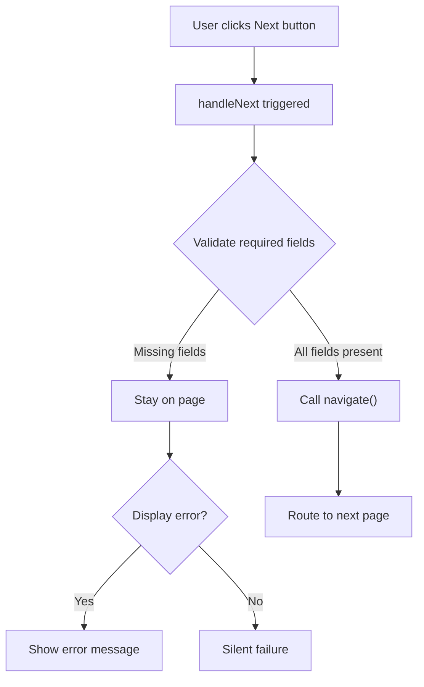

<div style="border-bottom: 1px solid var(--vp-c-divider); padding-bottom: 1rem; margin-bottom: 2rem;">
  <h1 style="margin-bottom: 0.5rem;">Form Validation</h1>
  <div style="display: flex; gap: 1rem; flex-wrap: wrap; font-size: 0.9rem; color: var(--vp-c-text-2);">
    <span style="display: flex; align-items: center; gap: 0.25rem;">
      📖 <strong>Guide</strong>
    </span>
    <span style="display: flex; align-items: center; gap: 0.25rem;">
      📝 <strong>627</strong> words
    </span>
    <span style="display: flex; align-items: center; gap: 0.25rem;">
      ⏱️ <strong>4</strong> min read
    </span>
  </div>
</div>

## Overview

Form validation in LoanFlow is implemented as a **client-side, page-level strategy** that prevents navigation until required fields contain values. Validation occurs synchronously before route transitions, with errors communicated through conditional UI rendering and disabled navigation buttons.

The approach prioritizes user experience by blocking incomplete submissions at the page level rather than allowing users to proceed with missing critical information.

## Validation Strategy

### Location and Timing

Validation is performed **at the page level before navigation**, triggered by user interaction with the "Next" button. Each page independently validates its form state before allowing the user to navigate to the next step in the application flow.

The validation check occurs in the button's `onClick` handler:

```typescript
const handleNext = () => {
  const requiredFields = ["firstName", "lastName", "email", "phone", "dateOfBirth", "ssn"];
  const isValid = requiredFields.every((field) => formData[field as keyof typeof formData]);
  
  if (isValid) {
    navigate("/employment");
  }
};
```

If validation fails, the navigation does not occur—the user remains on the current page.

### What Gets Validated

Validation checks differ by page based on business requirements:

| Page | Required Fields | Validation Type |
|------|-----------------|-----------------|
| **PersonalInfoPage** | firstName, lastName, email, phone, dateOfBirth, ssn | Non-empty string check |
| **EmploymentPage** | employmentStatus, annualIncome | Non-empty string check |
| **RefinanceAmountPage** | amount | Non-empty + minimum value ($5,000) |
| **EducationDetailsPage** | graduationDate, isParentLoan | Non-empty string check |
| **ReviewPage** | agreed (checkbox) | Boolean true check |

Optional fields (e.g., address, city, state, zipCode on PersonalInfoPage) are not validated and do not block navigation.

### Validation Patterns

#### Pattern 1: Required Field Presence Check

The most common pattern uses `Array.every()` to verify all required fields contain truthy values:

```typescript
const requiredFields = ["firstName", "lastName", "email", "phone", "dateOfBirth", "ssn"];
const isValid = requiredFields.every((field) => formData[field as keyof typeof formData]);
```

This pattern is used on PersonalInfoPage and EducationDetailsPage.

#### Pattern 2: Required Field + Business Logic Validation

EmploymentPage combines field presence with conditional logic:

```typescript
const handleNext = () => {
  if (formData.employmentStatus && formData.annualIncome) {
    navigate("/review");
  }
};
```

#### Pattern 3: Value Range Validation

RefinanceAmountPage validates both presence and minimum value:

```typescript
const handleNext = () => {
  if (!amount) {
    setError("Please enter an amount");
    return;
  }
  if (parseInt(amount) < 5000) {
    setError("The minimum loan amount is $5,000.");
    return;
  }
  navigate("/education-details");
};
```

#### Pattern 4: Checkbox Validation

ReviewPage validates that the user has explicitly agreed to terms:

```typescript
const handleSubmit = async () => {
  if (!agreed) return;
  // proceed with submission
};
```

## Error Handling

### Error Display

Errors are communicated through two mechanisms:

1. **Inline Error Messages**: RefinanceAmountPage displays validation errors in an alert card below the input field:

```typescript
{error && (
  <div className="mt-4 p-4 bg-amber-50 border border-amber-200 rounded-lg flex items-start gap-3">
    <AlertCircle className="w-5 h-5 text-amber-600 flex-shrink-0 mt-0.5" />
    <div>
      <p className="font-semibold text-amber-900 mb-1">Minimum Refi Amount</p>
      <p className="text-sm text-amber-800">{error}</p>
    </div>
  </div>
)}
```

2. **Silent Failure**: Most pages (PersonalInfoPage, EmploymentPage, EducationDetailsPage) silently prevent navigation without displaying error messages. The user remains on the page with no explicit feedback.

### Real-Time Validation

RefinanceAmountPage implements real-time validation that updates error state as the user types:

```typescript
const handleAmountChange = (e: React.ChangeEvent\<HTMLInputElement\>) => {
  const value = e.target.value.replace(/[^0-9]/g, "");
  setAmount(value);
  
  if (value && parseInt(value) < 5000) {
    setError("The minimum loan amount is $5,000.");
  } else {
    setError("");
  }
};
```

This provides immediate feedback without requiring a button click.

### Button State Management

Navigation buttons are disabled when validation would fail:

- **EducationDetailsPage** disables the "Next" button using the `disabled` attribute:
  ```typescript
  <Button
    onClick={handleNext}
    disabled={!graduationDate || !isParentLoan}
  >
    Next
  </Button>
  ```

- **ReviewPage** disables submission until the terms checkbox is checked:
  ```typescript
  <Button
    onClick={handleSubmit}
    disabled={!agreed || loading}
  >
    {loading ? "Processing..." : "Submit Application"}
  </Button>
  ```

Other pages do not visually disable buttons; they simply prevent navigation in the handler.

## Validation Flow



## State Management

Form data is managed locally within each page component using React's `useState` hook:

```typescript
const [formData, setFormData] = useState({
  firstName: "",
  lastName: "",
  email: "",
  // ... other fields
});
```

Validation state (errors) is also local:

```typescript
const [error, setError] = useState("");
```

There is no evidence of global state management (Redux, Context API) for form validation in the inspected codebase. Each page maintains its own validation state independently.

## Limitations and Observations

> **No server-side validation**: The codebase shows only client-side validation. No API calls or server-side checks are performed before navigation.

> **No validation utilities**: Validation logic is inline within each page component. There are no extracted validation functions, schemas, or utility libraries (e.g., Zod, Yup) visible in the codebase.

> **Inconsistent error feedback**: Some pages display errors (RefinanceAmountPage), while others fail silently (PersonalInfoPage, EmploymentPage). This inconsistency may confuse users about why navigation is blocked.

> **No field-level validation**: Validation occurs only at the page level before navigation. Individual fields are not validated as the user types (except RefinanceAmountPage's real-time minimum check).

> **HTML5 validation attributes present but not enforced**: Input elements include `required` attributes and `type="email"`, but these are not relied upon for validation logic. The application implements its own checks instead.

## Related Pages

- [Application Routes](./application-routes.md) — Documents the navigation flow between pages
- [State Management](./state-management.md) — Explains how form data persists across the application
- [UI Components](./ui-components.md) — Details the Button, Input, and Label components used in forms