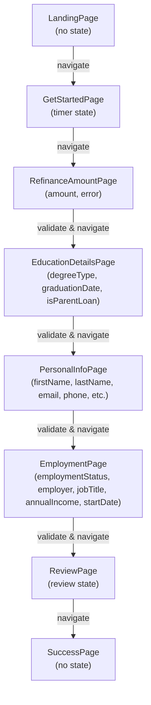

<div style="border-bottom: 1px solid var(--vp-c-divider); padding-bottom: 1rem; margin-bottom: 2rem;">
  <h1 style="margin-bottom: 0.5rem;">State Management</h1>
  <div style="display: flex; gap: 1rem; flex-wrap: wrap; font-size: 0.9rem; color: var(--vp-c-text-2);">
    <span style="display: flex; align-items: center; gap: 0.25rem;">
      📖 <strong>Guide</strong>
    </span>
    <span style="display: flex; align-items: center; gap: 0.25rem;">
      📝 <strong>534</strong> words
    </span>
    <span style="display: flex; align-items: center; gap: 0.25rem;">
      ⏱️ <strong>3</strong> min read
    </span>
  </div>
</div>

## Overview

LoanFlow manages application state through **local component state** using React's `useState` hook. Each page in the loan application flow maintains its own isolated form state, with no global state management solution implemented across the application.

This approach means form data is scoped to individual page components and is not persisted across page navigation unless explicitly handled by the developer.

## Local State Pattern

Every form page in the application follows the same state management pattern:

```typescript
const [formData, setFormData] = useState({
  field1: "",
  field2: "",
  // ... additional fields
});

const handleChange = (e: React.ChangeEvent\<HTMLInputElement\>) => {
  setFormData({
    ...formData,
    [e.target.name]: e.target.value,
  });
};
```

Each page component independently manages its form fields. For example:

- **PersonalInfoPage** maintains: `firstName`, `lastName`, `email`, `phone`, `dateOfBirth`, `ssn`, `address`, `city`, `state`, `zipCode`
- **EmploymentPage** maintains: `employmentStatus`, `employer`, `jobTitle`, `annualIncome`, `startDate`
- **RefinanceAmountPage** maintains: `amount` and `error` state

## Navigation and Validation

Navigation between pages is controlled through React Router's `useNavigate` hook. Before allowing navigation to the next page, each page component performs validation on its local form state:

```typescript
const handleNext = () => {
  const requiredFields = ["firstName", "lastName", "email", "phone"];
  const isValid = requiredFields.every((field) => formData[field as keyof typeof formData]);
  
  if (isValid) {
    navigate("/employment");
  }
};
```

Validation logic is **embedded within each page component** and executed before calling `navigate()`. If validation fails, navigation does not occur and the user remains on the current page.

### Validation Examples

| Page | Validation Logic |
|------|------------------|
| PersonalInfoPage | Checks that required fields (`firstName`, `lastName`, `email`, `phone`, `dateOfBirth`, `ssn`) are non-empty |
| EmploymentPage | Requires `employmentStatus` and `annualIncome` to be populated |
| RefinanceAmountPage | Validates that `amount` is provided and meets minimum threshold of $5,000 |
| EducationDetailsPage | Requires both `graduationDate` and `isParentLoan` to be selected |

## Application Flow



## State Isolation and Limitations

### Key Characteristics

- **No persistence across navigation**: If a user navigates backward using the browser back button or the "Back" button in the UI, the form state is lost. Returning to a previous page resets all fields to their initial empty state.
- **No global context**: There is no Redux, Zustand, Context API, or similar global state management solution. Each page is completely independent.
- **No cross-page data sharing**: One page cannot directly access or modify the state of another page.
- **No session storage or local storage**: Form data is not automatically saved to browser storage.

### Implications

1. **User experience**: Users cannot safely navigate away from a page and return without losing their input.
2. **Multi-step workflows**: The application assumes a linear forward progression through pages. Backward navigation is not fully supported for data recovery.
3. **Review and edit**: The ReviewPage (referenced in the routing but not fully inspected) would need to either re-collect data or implement a workaround to display previously entered information.

## Toast Notifications

While not directly part of form state management, the application includes a custom `useToast` hook that manages UI notification state. This hook uses a reducer pattern with in-memory state and listener subscriptions, separate from form data management:

```typescript
const { toast, dismiss } = useToast();
toast({ title: "Success", description: "Form submitted" });
```

Toast state is global and persists across page navigation, but it is limited to UI notifications only and does not store application data.

## Recommendations for Enhancement

If multi-page state persistence becomes a requirement, consider:

- **Session storage**: Save form data to `sessionStorage` on each page and restore on mount
- **URL query parameters**: Encode form state in the URL for bookmarkability and back-button support
- **Context API**: Implement a React Context to share state across page components
- **State management library**: Introduce Redux, Zustand, or similar for complex workflows

See [Application Architecture](./application-architecture.md) for the broader system design and [Form Validation](./form-validation.md) for validation strategy details.