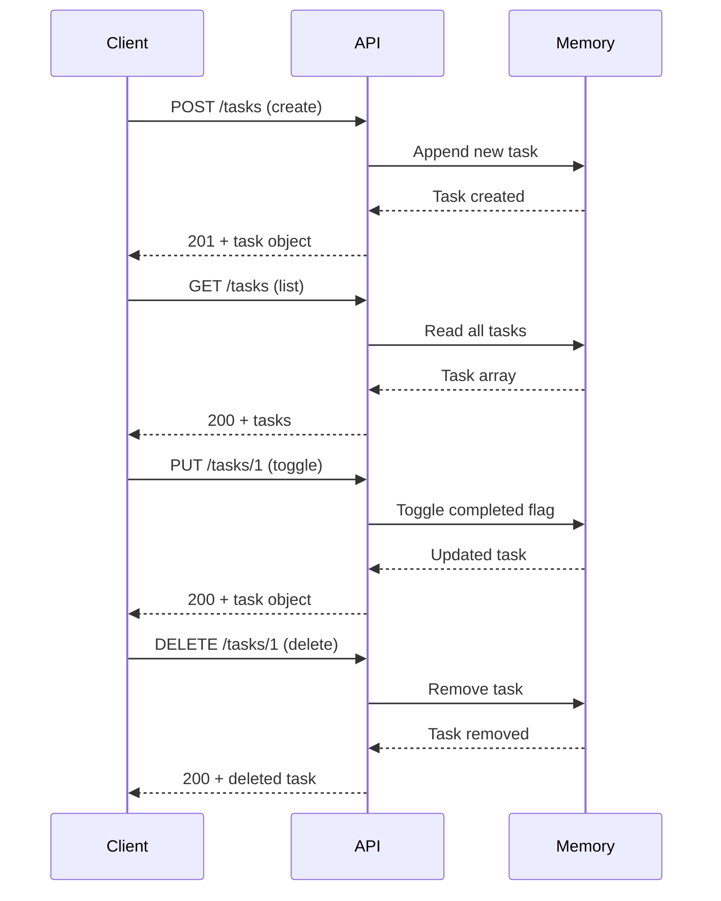

<div style="border-bottom: 1px solid var(--vp-c-divider); padding-bottom: 1rem; margin-bottom: 2rem;">
  <h1 style="margin-bottom: 0.5rem;">API Reference</h1>
  <div style="display: flex; gap: 1rem; flex-wrap: wrap; font-size: 0.9rem; color: var(--vp-c-text-2);">
    <span style="display: flex; align-items: center; gap: 0.25rem;">
      ⚡ <strong>Api</strong>
    </span>
    <span style="display: flex; align-items: center; gap: 0.25rem;">
      📝 <strong>517</strong> words
    </span>
    <span style="display: flex; align-items: center; gap: 0.25rem;">
      ⏱️ <strong>3</strong> min read
    </span>
  </div>
</div>

The Nano Task Manager exposes a REST API for managing tasks. All endpoints use JSON for request and response bodies and are served by a Flask backend running on port 3000.

## Endpoints Overview

| Method | Path | Purpose |
|--------|------|---------|
| GET | `/` | Serve the frontend application |
| POST | `/tasks` | Create a new task |
| GET | `/tasks` | Retrieve all tasks |
| PUT | `/tasks/\<id\>` | Toggle task completion status |
| DELETE | `/tasks/\<id\>` | Delete a task |

## Endpoint Details

### GET /

Serves the frontend HTML application.

**Request**
```
GET / HTTP/1.1
```

**Response**
- **Status:** 200 OK
- **Content-Type:** text/html
- **Body:** HTML document (index.html)

**Purpose:** Provides the user interface for the task manager application.

---

### POST /tasks

Creates a new task with the provided text.

**Request**
```
POST /tasks HTTP/1.1
Content-Type: application/json

{
  "task": "Buy groceries"
}
```

**Request Body**
| Field | Type | Required | Description |
|-------|------|----------|-------------|
| `task` | string | Yes | The task description text |

**Response**
- **Status:** 201 Created
- **Content-Type:** application/json
- **Body:**
```json
{
  "id": 1,
  "text": "Buy groceries",
  "completed": false
}
```

**Response Fields**
| Field | Type | Description |
|-------|------|-------------|
| `id` | integer | Unique task identifier (auto-incremented) |
| `text` | string | The task description |
| `completed` | boolean | Task completion status (always `false` for new tasks) |

---

### GET /tasks

Retrieves all tasks in the system.

**Request**
```
GET /tasks HTTP/1.1
```

**Response**
- **Status:** 200 OK
- **Content-Type:** application/json
- **Body:**
```json
[
  {
    "id": 1,
    "text": "Buy groceries",
    "completed": false
  },
  {
    "id": 2,
    "text": "Write documentation",
    "completed": true
  }
]
```

**Response Format:** Array of task objects. Returns an empty array `[]` if no tasks exist.

---

### PUT /tasks/\<id\>

Toggles the completion status of a task. If the task is completed, it becomes incomplete, and vice versa.

**Request**
```
PUT /tasks/1 HTTP/1.1
```

**Path Parameters**
| Parameter | Type | Description |
|-----------|------|-------------|
| `id` | integer | The task ID to toggle |

**Response (Success)**
- **Status:** 200 OK
- **Content-Type:** application/json
- **Body:**
```json
{
  "id": 1,
  "text": "Buy groceries",
  "completed": true
}
```

**Response (Task Not Found)**
- **Status:** 404 Not Found
- **Content-Type:** application/json
- **Body:**
```json
{
  "error": "Task not found"
}
```

---

### DELETE /tasks/\<id\>

Deletes a task from the system.

**Request**
```
DELETE /tasks/1 HTTP/1.1
```

**Path Parameters**
| Parameter | Type | Description |
|-----------|------|-------------|
| `id` | integer | The task ID to delete |

**Response (Success)**
- **Status:** 200 OK
- **Content-Type:** application/json
- **Body:**
```json
{
  "id": 1,
  "text": "Buy groceries",
  "completed": false
}
```

**Response (Task Not Found)**
- **Status:** 404 Not Found
- **Content-Type:** application/json
- **Body:**
```json
{
  "error": "Task not found"
}
```

---

## Request/Response Flow



## Data Model

All tasks are stored in memory as objects with the following structure:

| Field | Type | Description |
|-------|------|-------------|
| `id` | integer | Unique identifier, auto-incremented starting from 1 |
| `text` | string | Task description provided by the user |
| `completed` | boolean | Completion status; toggled by PUT requests |

> **Note:** Tasks are stored in memory only. Data is not persisted to disk and will be lost when the server restarts. See [Limitations & Considerations](./limitations-and-future.md) for more details.

## CORS Support

The API has Cross-Origin Resource Sharing (CORS) enabled, allowing requests from different origins. This enables the frontend to communicate with the backend without cross-origin restrictions.

## Error Handling

The API returns appropriate HTTP status codes:

- **201 Created:** Task successfully created
- **200 OK:** Request successful (GET, PUT, DELETE)
- **404 Not Found:** Task ID does not exist (PUT, DELETE)

Error responses include a JSON body with an `error` field describing the issue.