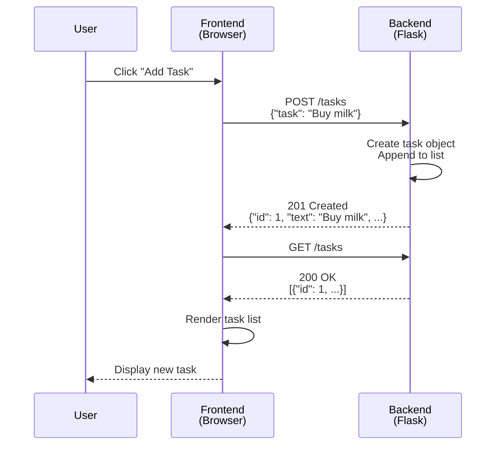

# Architecture & Design

Nano Task Manager follows a straightforward client-server architecture with a Flask backend serving a single-page frontend application. The system prioritizes simplicity and immediate responsiveness over persistence, making it suitable for temporary task management within a single session.

## System Overview

The application is structured as two distinct layers that communicate exclusively through HTTP:


The **frontend** (static HTML/CSS/JavaScript) runs in the browser and handles all user interaction and rendering. The **backend** (Flask application) manages business logic, task storage, and API endpoints. Communication occurs exclusively through RESTful HTTP requests and JSON responses.

## Backend Architecture

The Flask backend (`app.py`) implements a minimal REST API with four core endpoints:

| Endpoint | Method | Purpose |
|----------|--------|---------|
| `/` | GET | Serves the static frontend (index.html) |
| `/tasks` | GET | Retrieves all tasks |
| `/tasks` | POST | Creates a new task |
| `/tasks/\<id\>` | PUT | Toggles task completion status |
| `/tasks/\<id\>` | DELETE | Removes a task |

### Data Storage

All task data is stored in a module-level Python list (`tasks = []`) that persists only for the duration of the application runtime. Each task is a dictionary with three fields:

```python
{
    "id": 1,
    "text": "Task description",
    "completed": False
}
```

Task IDs are generated sequentially using a global counter (`task_id_counter`) that increments with each new task. **No database or file-based persistence is implemented.** When the Flask server restarts, all tasks are lost. See [Limitations & Considerations](./limitations-and-future.md) for context on this design choice.

### CORS Configuration

The backend explicitly enables Cross-Origin Resource Sharing (CORS) via the `flask_cors` library:

```python
from flask_cors import CORS
CORS(app)
```

This allows the frontend to make cross-origin requests to the backend without browser security restrictions. In the current deployment, both frontend and backend are served from the same origin (`/`), so CORS is not strictly necessary but is included to support flexible deployment scenarios.

## Frontend Architecture

The frontend is a single HTML file (`static/index.html`) containing embedded CSS and JavaScript. It implements a reactive task management interface that:

1. **Loads tasks** on page initialization via `GET /tasks`
2. **Renders tasks** dynamically in the DOM based on the current state
3. **Sends mutations** (add, toggle, delete) to the backend via POST/PUT/DELETE requests
4. **Refreshes the task list** after each mutation to reflect server state

The frontend uses the Fetch API for all HTTP communication and maintains no persistent local state—the server is the single source of truth.

## Request-Response Flow

The following sequence illustrates how the frontend and backend interact for a typical task operation:



## RESTful API Design

The API follows REST conventions:

- **Resource-oriented**: Tasks are the primary resource, identified by numeric IDs
- **Standard HTTP methods**: GET (retrieve), POST (create), PUT (update), DELETE (remove)
- **HTTP status codes**: 201 for successful creation, 200 for successful operations, 404 for not found
- **JSON payloads**: All request and response bodies use JSON format
- **Stateless**: Each request is independent; the server does not maintain session state

The API does not implement pagination, filtering, or advanced query parameters. All endpoints operate on the complete task collection.

## Deployment Model

The Flask application serves both the API and the static frontend from a single process:

- The root route (`/`) serves `index.html` from the `static/` directory
- API routes (`/tasks`, `/tasks/\<id\>`) handle task operations
- The application runs on port 3000 in debug mode by default

This unified deployment simplifies setup and eliminates cross-origin complexity in typical local or single-server deployments.

## Design Constraints and Tradeoffs

> **In-Memory Storage**: All task data exists only in RAM. Restarting the server clears all tasks. This is an intentional design choice for a minimal proof-of-concept application, not a limitation of the architecture itself.

> **No Concurrency Control**: The in-memory list is not protected by locks or transactions. Simultaneous requests from multiple clients may produce race conditions. This is acceptable for single-user or low-concurrency scenarios.

> **Synchronous Rendering**: The frontend reloads the entire task list after each mutation. This is simple but not optimized for large task counts or high-frequency updates.

For additional context on these design decisions and potential future improvements, see [Limitations & Considerations](./limitations-and-future.md).

## Related Documentation

- [API Reference](./api-reference.md) — Detailed endpoint specifications and examples
- [Data Model](./data-model.md) — Task structure and field definitions
- [Backend Implementation](./backend-structure.md) — Flask application code organization
- [Frontend Implementation](./frontend-structure.md) — Browser-side code and UI logic
- [Technology Stack](./technology-stack.md) — Framework and library versions