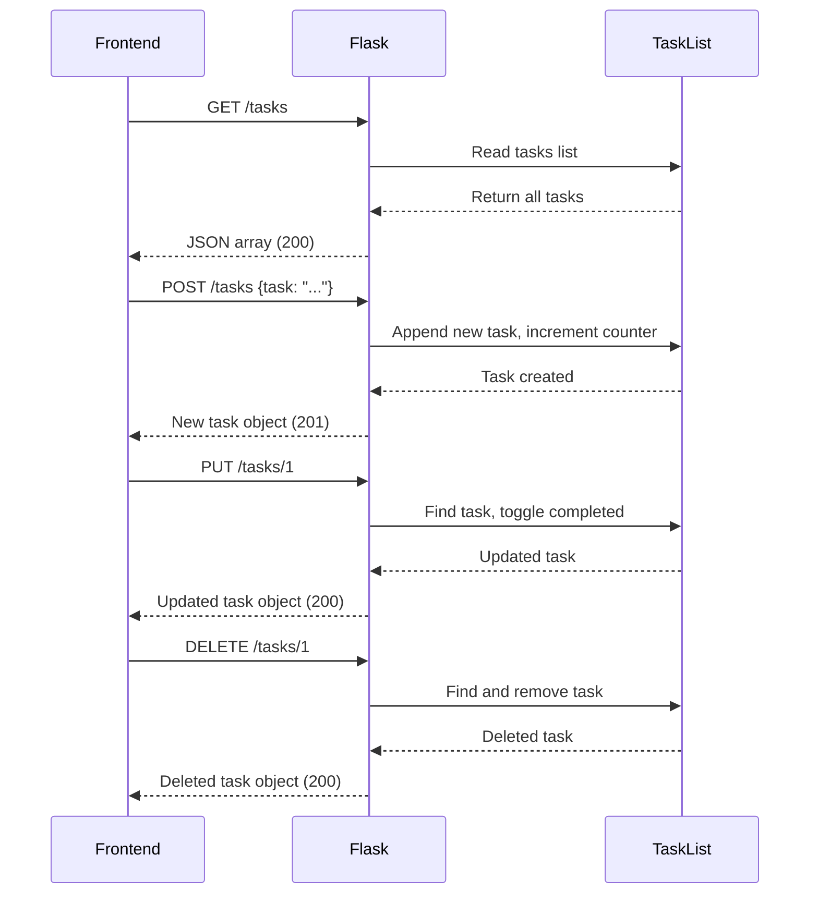

# Backend Implementation

The Nano Task Manager backend is a minimal Flask application that serves a single-page frontend and provides a RESTful API for task management. All backend logic is contained in a single `app.py` file with no external configuration files or environment variables.

## Flask Application Initialization

The backend initializes Flask with a static folder configuration to serve frontend assets:

```python
app = Flask(__name__, static_folder='static')
CORS(app)
```

**CORS Configuration**: Cross-Origin Resource Sharing (CORS) is enabled globally via `flask_cors.CORS(app)`, allowing the frontend to make requests to the backend without cross-origin restrictions.

**Static File Serving**: The `static_folder='static'` parameter designates the `static/` directory as the source for static assets. The root route (`/`) serves `index.html` from this directory:

```python
@app.route("/")
def index():
    return send_from_directory('static', 'index.html')
```

## In-Memory Task Storage

Tasks are stored in a module-level Python list with no persistence layer:

```python
tasks = []
task_id_counter = 1
```

- **`tasks`**: A list of task dictionaries. Each task contains `id`, `text`, and `completed` fields.
- **`task_id_counter`**: A global integer that increments with each new task to generate unique IDs. IDs are sequential integers starting from 1.

> **Important**: All data is lost when the application restarts. There is no database or file-based persistence.

## Task ID Generation

Task IDs are generated using a simple counter mechanism:

1. When a new task is created via the POST endpoint, the current value of `task_id_counter` is assigned as the task's `id`.
2. `task_id_counter` is then incremented by 1.
3. This ensures each task receives a unique, sequential integer ID.

IDs are never reused, even if tasks are deleted. For example, if tasks with IDs 1, 2, and 3 exist and task 2 is deleted, the next new task will receive ID 4.

## API Routes

The backend implements four REST endpoints for task management:

### POST /tasks — Create a Task

**Request**:
```json
{
  "task": "Task description text"
}
```

**Response** (201 Created):
```json
{
  "id": 1,
  "text": "Task description text",
  "completed": false
}
```

**Implementation**:
```python
@app.route("/tasks", methods=["POST"])
def add_task():
    global task_id_counter
    data = request.get_json()
    task_text = data.get("task")

    new_task = {
        "id": task_id_counter,
        "text": task_text,
        "completed": False
    }
    tasks.append(new_task)
    task_id_counter += 1

    return jsonify(new_task), 201
```

The endpoint extracts the `task` field from the JSON request body, creates a new task object with the current counter value as its ID, appends it to the tasks list, increments the counter, and returns the created task with HTTP 201 status.

### GET /tasks — Retrieve All Tasks

**Response** (200 OK):
```json
[
  {
    "id": 1,
    "text": "First task",
    "completed": false
  },
  {
    "id": 2,
    "text": "Second task",
    "completed": true
  }
]
```

**Implementation**:
```python
@app.route("/tasks", methods=["GET"])
def get_tasks():
    return jsonify(tasks), 200
```

This endpoint returns the entire tasks list as a JSON array. It is called by the frontend on page load and after any task modification to refresh the UI.

### PUT /tasks/\<task_id\> — Toggle Task Completion

**Response** (200 OK):
```json
{
  "id": 1,
  "text": "Task description",
  "completed": true
}
```

**Response** (404 Not Found):
```json
{
  "error": "Task not found"
}
```

**Implementation**:
```python
@app.route("/tasks/<int:task_id>", methods=["PUT"])
def toggle_task(task_id):
    for task in tasks:
        if task["id"] == task_id:
            task["completed"] = not task["completed"]
            return jsonify(task), 200
    return jsonify({"error": "Task not found"}), 404
```

The endpoint searches the tasks list for a task matching the provided `task_id`. If found, it toggles the `completed` boolean field and returns the updated task. If no matching task exists, it returns a 404 error. The route parameter `<int:task_id>` ensures only integer IDs are accepted.

### DELETE /tasks/\<task_id\> — Delete a Task

**Response** (200 OK):
```json
{
  "id": 1,
  "text": "Deleted task",
  "completed": false
}
```

**Response** (404 Not Found):
```json
{
  "error": "Task not found"
}
```

**Implementation**:
```python
@app.route("/tasks/<int:task_id>", methods=["DELETE"])
def delete_task(task_id):
    for i, task in enumerate(tasks):
        if task["id"] == task_id:
            deleted_task = tasks.pop(i)
            return jsonify(deleted_task), 200
    return jsonify({"error": "Task not found"}), 404
```

The endpoint iterates through the tasks list to find a task with the matching ID. If found, it removes the task from the list using `pop(i)` and returns the deleted task object. If no match is found, it returns a 404 error.

## Request Flow



## Runtime Configuration

The application runs with the following configuration:

```python
if __name__ == "__main__":
    app.run(debug=True, port=3000)
```

- **Debug Mode**: Enabled (`debug=True`). This provides automatic code reloading on file changes and detailed error pages during development.
- **Port**: The application listens on port 3000.
- **Host**: Defaults to `127.0.0.1` (localhost only). The application is not accessible from other machines without explicit host configuration.

## Configuration and Environment

The backend has **no configuration files or environment variables**. All settings are hardcoded:

- Port 3000 is fixed in the code.
- Debug mode is always enabled.
- CORS is globally enabled with no restrictions.
- The static folder path is hardcoded as `'static'`.

To modify any of these settings, the `app.py` file must be edited directly.

## Connection to Frontend

The backend serves the frontend via the root route and provides the API endpoints that the frontend consumes. See [Frontend Implementation](./frontend-structure.md) for details on how the frontend interacts with these endpoints.

For a complete overview of the system architecture, refer to [Architecture & Design](./architecture.md).