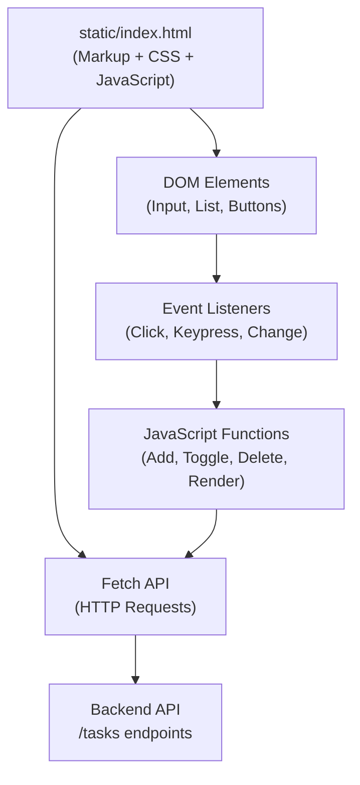

<div style="border-bottom: 1px solid var(--vp-c-divider); padding-bottom: 1rem; margin-bottom: 2rem;">
  <h1 style="margin-bottom: 0.5rem;">Frontend Implementation</h1>
  <div style="display: flex; gap: 1rem; flex-wrap: wrap; font-size: 0.9rem; color: var(--vp-c-text-2);">
    <span style="display: flex; align-items: center; gap: 0.25rem;">
      📖 <strong>Guide</strong>
    </span>
    <span style="display: flex; align-items: center; gap: 0.25rem;">
      📝 <strong>826</strong> words
    </span>
    <span style="display: flex; align-items: center; gap: 0.25rem;">
      ⏱️ <strong>5</strong> min read
    </span>
  </div>
</div>

# Frontend Implementation

The frontend of nano-task-manager is a single static HTML file (`static/index.html`) that contains all markup, styling, and client-side logic in one self-contained unit. There are no build tools, bundlers, or external dependencies—the application runs directly in the browser with vanilla JavaScript.

## Architecture Overview

The frontend follows a simple, monolithic structure:



## File Structure

The entire frontend is contained in a single file:

- **`static/index.html`** — Complete frontend application (markup, styles, and JavaScript)

The Flask backend (`app.py`) serves this file at the root route (`/`) and provides API endpoints at `/tasks` for all data operations.

## UI Layout and Components

The interface consists of three main sections:

### Header
- Displays the application title "Nano Task Manager"
- Styled with a purple gradient background
- Fixed at the top of the container

### Input Section
- Text input field (`#taskInput`) with placeholder "What needs to be done?"
- "Add Task" button (`#addTaskBtn`) to submit new tasks
- Supports both button click and Enter key submission
- Input is cleared after successful task addition

### Task List
- Dynamic container (`#taskList`) that renders all tasks
- Shows a loading state on initial page load
- Displays an empty state message when no tasks exist
- Each task item includes:
  - Checkbox for marking completion
  - Task text (with strikethrough styling when completed)
  - Delete button for removal

## JavaScript Functionality

The frontend uses vanilla JavaScript with the Fetch API to communicate with the backend. All logic is contained in a single `\<script\>` block at the end of the HTML file.

### Core Functions

**`loadTasks()`**
- Fetches all tasks from `GET /tasks`
- Calls `renderTasks()` to display the retrieved tasks
- Handles errors by displaying an error message in the task list

**`addTask()`**
- Validates that the input field is not empty
- Sends a POST request to `/tasks` with the task text
- Clears the input field on success
- Reloads the task list to reflect the new task
- Shows an alert on failure

**`toggleTask(taskId)`**
- Sends a PUT request to `/tasks/{taskId}` to toggle completion status
- Reloads the task list to reflect the updated state
- Shows an alert on failure

**`deleteTask(taskId)`**
- Sends a DELETE request to `/tasks/{taskId}`
- Reloads the task list to reflect the removal
- Shows an alert on failure

**`renderTasks(tasks)`**
- Generates HTML for all tasks using template literals
- Applies the `completed` CSS class to finished tasks
- Binds `toggleTask()` and `deleteTask()` to checkbox and button elements
- Displays an empty state if the task array is empty

**`escapeHtml(text)`**
- Sanitizes task text to prevent XSS vulnerabilities
- Uses `textContent` to safely encode HTML entities

### Event Handling

| Event | Trigger | Handler |
|-------|---------|---------|
| Click | "Add Task" button | `addTask()` |
| Keypress | Enter key in input field | `addTask()` |
| Change | Task checkbox | `toggleTask(taskId)` |
| Click | Delete button | `deleteTask(taskId)` |
| Page load | Document ready | `loadTasks()` |

## API Communication

The frontend communicates with the backend exclusively through the Fetch API. All requests target the `/tasks` endpoint:

```javascript
const API_URL = '/tasks';
```

### Request Patterns

- **Load tasks**: `GET /tasks` → returns array of task objects
- **Add task**: `POST /tasks` with JSON body `{ task: "text" }` → returns created task
- **Toggle completion**: `PUT /tasks/{taskId}` → returns updated task
- **Delete task**: `DELETE /tasks/{taskId}` → returns deleted task

All requests include error handling with try-catch blocks and user feedback via alerts or DOM updates.

## Styling

The frontend uses embedded CSS with a modern, gradient-based design:

- **Color scheme**: Purple gradient (`#667eea` to `#764ba2`) for primary elements
- **Layout**: Centered container with max-width of 600px
- **Responsive**: Uses flexbox for layout and includes viewport meta tag
- **Interactions**: Hover effects, transitions, and visual feedback on buttons and task items
- **Accessibility**: Focus states on input fields, semantic HTML structure

> **Note**: All CSS is embedded in the `\<style\>` tag within the HTML file. There are no external stylesheets.

## State Management

The frontend does not maintain local state. Instead, it treats the backend as the source of truth:

- After any operation (add, toggle, delete), `loadTasks()` is called to refresh the entire task list
- The DOM is completely re-rendered on each update
- No client-side caching or state persistence exists

This approach simplifies the implementation but means every user action triggers a full list refresh from the server.

## No Build Tools

The frontend requires no build process, bundlers, or transpilation:

- Vanilla JavaScript (ES6 features like arrow functions and template literals are used, but these are natively supported in modern browsers)
- No npm dependencies or package management
- No minification or optimization step
- The file is served directly by Flask without preprocessing

This makes the application extremely lightweight and easy to deploy, but also means all code is visible in the browser and there is no module system for code organization.

## Connection to Backend

The frontend is tightly coupled to the backend API structure defined in [API Reference](./api-reference.md). The Fetch calls directly reference the endpoint paths and JSON structure expected by the Flask routes. See [Backend Implementation](./backend-structure.md) for details on how the API handles these requests.

For an overview of how the frontend fits into the overall system architecture, see [Architecture & Design](./architecture.md).