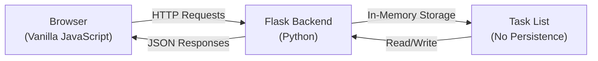

  <h1 style="margin-bottom: 0.5rem;">Project Overview</h1>
  

    
      🏠 <strong>Overview</strong>
    
    
      📝 <strong>428</strong> words
    
    
      ⏱️ <strong>3</strong> min read
    
  

# Project Overview

**nano-task-manager** is a minimal web-based task management application designed as an educational and demonstration project. It provides a straightforward interface for creating, viewing, toggling, and deleting tasks through a simple client-server architecture.

## Purpose

This project serves as a learning resource and proof-of-concept for building a basic full-stack web application. It demonstrates fundamental patterns in web development without the complexity of production-grade systems, making it suitable for understanding core concepts in task management applications.

## Architecture at a Glance

The application follows a simple client-server model:

**Frontend**: A single HTML file with embedded CSS and vanilla JavaScript that communicates with the backend via fetch API calls.

**Backend**: A Flask application that exposes REST endpoints for task operations and serves the static frontend.

**Storage**: Tasks are stored in memory as a Python list (`tasks = []`). All data is lost when the server restarts—there is no database or file-based persistence.

## Technology Stack

The entire application is built with minimal dependencies:

- **Backend**: [Flask](https://flask.palletsprojects.com/) (Python web framework) with CORS support
- **Frontend**: Vanilla JavaScript (no frameworks), HTML5, and CSS3
- **Communication**: JSON over HTTP

See [Technology Stack](./technology-stack.md) for detailed dependency information.

## Codebase Size

The project consists of **2 core files**:

| File | Purpose |
|------|---------|
| `app.py` | Flask backend with REST API endpoints and server configuration |
| `static/index.html` | Frontend UI with embedded styles and client-side logic |

This minimal footprint makes the codebase easy to understand and modify for learning purposes.

## Key Characteristics

- **No Persistence**: Tasks exist only in the current server session. Restarting the server clears all data.
- **In-Memory Storage**: A simple Python list manages all task state.
- **Stateless API**: Each request is independent; no session management or authentication.
- **Single-Page Application**: The frontend loads once and communicates with the backend asynchronously.
- **Educational Focus**: The code prioritizes clarity and simplicity over production concerns like error handling, validation, or scalability.

## What You Can Do

Users can:
- Add new tasks via text input
- View all tasks in a list
- Mark tasks as complete/incomplete by toggling a checkbox
- Delete tasks individually

See [Getting Started](./getting-started.md) to run the application, or [API Reference](./api-reference.md) for details on the available endpoints.

## Important Limitations

> **Data Loss on Restart**: All tasks are lost when the server stops. This is by design for a demo application.

> **No Validation**: The backend accepts any task text without sanitization or length constraints beyond what the frontend provides.

> **Single-User**: There is no concept of users, authentication, or multi-user isolation.

For a comprehensive discussion of constraints and potential improvements, see [Limitations & Considerations](./limitations-and-future.md).