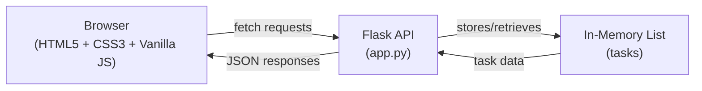

# Technology Stack

Nano Task Manager is built on a deliberately minimal technology stack designed for simplicity and rapid development. The project uses only essential technologies with no build tools, bundlers, or databases.

## Core Technologies

### Backend

**Flask** (Python web framework)
- Lightweight Python web framework handling all server-side logic
- Serves the static frontend and provides REST API endpoints for task operations
- Configured to run on port 3000 with debug mode enabled during development
- Manages in-memory task storage and request routing

**Flask-CORS** (Cross-Origin Resource Sharing)
- Enables cross-origin requests between frontend and backend
- Initialized at application startup to allow the frontend to communicate with API endpoints without CORS restrictions

### Frontend

**Vanilla JavaScript** (no frameworks)
- Pure JavaScript without frameworks or libraries
- Handles all client-side interactivity: task rendering, form submission, API communication
- Uses native `fetch()` API for HTTP requests to backend endpoints
- Implements event listeners for user interactions (button clicks, keyboard input, checkbox changes)

**HTML5**
- Semantic markup structure for the application interface
- Single-page application served from `static/index.html`
- Includes meta tags for character encoding and viewport configuration

**CSS3**
- All styling embedded directly in the HTML `\<style\>` tag
- Uses modern CSS features: flexbox layout, gradients, transitions, and media-aware font stacks
- No external stylesheets or CSS preprocessors

## Dependency Footprint

The project has a minimal dependency footprint:

| Dependency | Purpose | Version |
|---|---|---|
| Flask | Web framework | (not pinned in codebase) |
| Flask-CORS | CORS handling | (not pinned in codebase) |

> **Note:** No `requirements.txt` or `package.json` is visible in the provided codebase. Dependencies are assumed to be managed externally or documented elsewhere.

## Architectural Choices

### Why This Stack?

1. **No Build Tools or Bundlers**
   - Frontend is served as-is without compilation, transpilation, or bundling
   - Reduces setup complexity and eliminates build step overhead
   - Suitable for a nano-scale project where simplicity outweighs optimization

2. **No Database**
   - Tasks are stored in a Python list (`tasks = []`) in application memory
   - Data persists only for the duration of the application session
   - Eliminates database setup, migrations, and query complexity
   - Appropriate for a demonstration or lightweight task manager

3. **Vanilla JavaScript**
   - No framework overhead (React, Vue, Angular, etc.)
   - Direct DOM manipulation and event handling
   - Smaller payload and faster initial load
   - Suitable for a single-page application with limited interactivity

4. **Embedded Styling**
   - CSS is inline in HTML rather than external files
   - Reduces HTTP requests and file management
   - Acceptable for a small application

## Data Flow

## Related Documentation

- [Architecture & Design](./architecture.md) — System structure and design patterns
- [Backend Implementation](./backend-structure.md) — Flask application details
- [Frontend Implementation](./frontend-structure.md) — Client-side code organization
- [API Reference](./api-reference.md) — Endpoint specifications and request/response formats