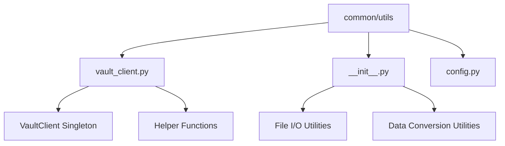
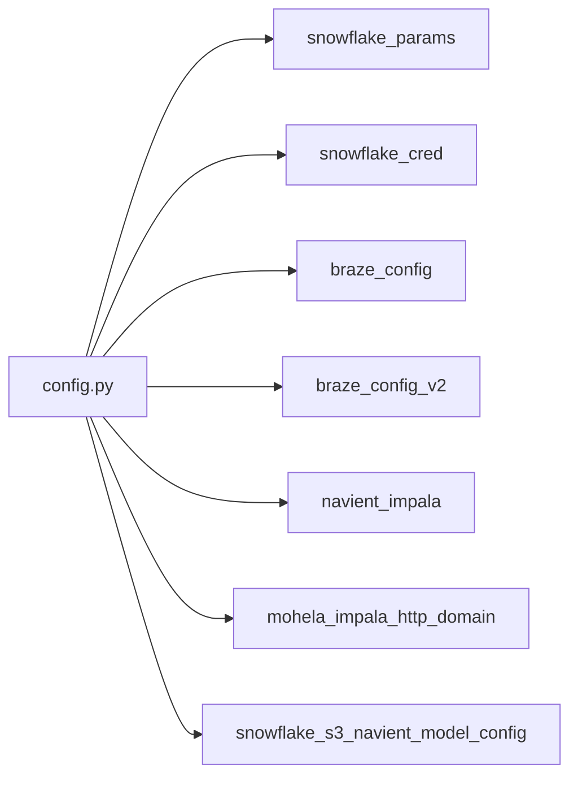
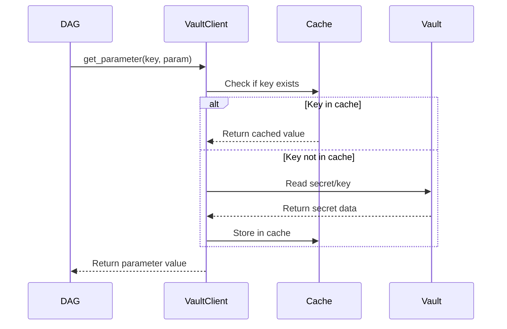

<div style="border-bottom: 1px solid var(--vp-c-divider); padding-bottom: 1rem; margin-bottom: 2rem;">
  <h1 style="margin-bottom: 0.5rem;">Common Utilities</h1>
  <div style="display: flex; gap: 1rem; flex-wrap: wrap; font-size: 0.9rem; color: var(--vp-c-text-2);">
    <span style="display: flex; align-items: center; gap: 0.25rem;">
      📚 <strong>Reference</strong>
    </span>
    <span style="display: flex; align-items: center; gap: 0.25rem;">
      📝 <strong>683</strong> words
    </span>
    <span style="display: flex; align-items: center; gap: 0.25rem;">
      ⏱️ <strong>4</strong> min read
    </span>
  </div>
</div>

The `common/utils` module provides shared utility functions and services used across DAGs in the data-airflow-dags repository. This includes configuration management, Vault integration for secrets, file I/O operations, and helper functions for common data transformations.

## Module Structure

The utilities module is organized into the following components:



## Vault Integration

### VaultClient Class

The `VaultClient` is implemented as a singleton that manages connections to HashiCorp Vault for retrieving secrets. It requires three environment variables to be set:

- `VAULT_URL`: The Vault server URL
- `VAULT_PORT`: The Vault server port
- `VAULT_TOKEN`: Authentication token for Vault access

**Key Methods:**

| Method | Purpose | Usage Pattern |
|--------|---------|---------------|
| `load_instance()` | Initialize or retrieve singleton instance | Called before any Vault operations |
| `get_parameter(key, parameter)` | Retrieve a specific parameter from a secret | Used to fetch individual secret values |
| `write_b64_secret_to_pem(...)` | Write base64-encoded secret to PEM file | Used for SSL certificates and keys |
| `write_pg_ssl_bundle_b64(...)` | Write PostgreSQL SSL bundle (CA, cert, key) | Returns dict suitable for DB SSL config |

**Example Usage in DAGs:**

```python
from common.utils.vault_client import set_envs_from_vault

# Load multiple secrets into environment variables
set_envs_from_vault(
    "snowflake_user",
    "snowsql_private_key",
    "snowsql_private_key_passphrase",
    "xcom_encrytion_secret"
)
```

### Helper Functions

#### `set_envs_from_vault(*args, cast_to_string=None)`

Reads parameters from Vault and sets them as environment variables. Requires `VAULT_KEY` environment variable to specify which Vault secret to read from.

- Converts parameter names to uppercase when setting environment variables
- Converts parameter keys to lowercase when reading from Vault
- Optional `cast_to_string` parameter to force string conversion

#### `get_secret_from_vault(arg)`

Retrieves a single secret value from Vault without setting it as an environment variable.

#### `print_vault_keys()`

Debugging utility that prints all keys available in the configured Vault secret.

### SSL Certificate Management

The VaultClient provides specialized methods for managing SSL certificates:

```python
# Write individual PEM file
VaultClient.write_b64_secret_to_pem(
    key="database_ssl",
    parameter="server_ca",
    path="/tmp/certs/server_ca.pem",
    mode=0o644,
    create_dirs=True,
    overwrite=True
)

# Write complete PostgreSQL SSL bundle
ssl_config = VaultClient.write_pg_ssl_bundle_b64(
    key="postgres_ssl",
    dest_dir="/tmp/pg_certs"
)
# Returns: {
#   "sslrootcert": "/tmp/pg_certs/server_ca.pem",
#   "sslcert": "/tmp/pg_certs/client_cert.pem",
#   "sslkey": "/tmp/pg_certs/client_key.pem"
# }
```

> **Note:** The `write_pg_ssl_bundle_b64` method sets appropriate file permissions: 0644 for CA and client certificates, 0600 for private keys.

## File I/O Utilities

The `common/utils/__init__.py` module provides basic file operations and data conversion utilities:

### File Operations

| Function | Purpose | Return Type |
|----------|---------|-------------|
| `read_file(path)` | Read text file contents | `str` |
| `write_binary_file(path, content)` | Write binary content to file | `None` |

### Data Conversion Utilities

| Function | Purpose | Return Type |
|----------|---------|-------------|
| `decode_b64(content)` | Decode base64-encoded string | `bytes` |
| `seconds_to_datetime(seconds)` | Convert Unix timestamp to datetime | `datetime.datetime` |
| `datetime_to_str(date)` | Format datetime as YYYYMMDDHHMMSS | `str` |
| `if_none(obj, replacement)` | Return replacement if obj is None | `Any` |

**Example Usage:**

```python
from common.utils import decode_b64, datetime_to_str, if_none
import datetime

# Decode base64 content
decoded = decode_b64("SGVsbG8gV29ybGQ=")

# Format datetime
timestamp = datetime_to_str(datetime.datetime.now())
# Returns: "20250115143022"

# Provide default value
value = if_none(None, "default_value")  # Returns "default_value"
```

## Configuration Management

The `common/utils/config.py` module (referenced but not provided in codebase files) centralizes configuration parameters used across DAGs. Based on usage patterns observed in the codebase:

### Common Configuration Objects



**Observed Configuration Usage:**

| Configuration | Used In | Purpose |
|---------------|---------|---------|
| `snowflake_params` | Multiple DAGs | Database connection parameters |
| `snowflake_cred` | Braze DAGs | Snowflake credentials for custom operations |
| `braze_config` / `braze_config_v2` | Braze DAGs | Braze API and S3 bucket configuration |
| `navient_impala` | Maintenance DAGs | Navient Impala connection details |
| `mohela_impala_http_domain` | Maintenance DAGs | Mohela Impala HTTP connection details |
| `snowflake_s3_navient_model_config` | Navient export DAG | S3 bucket and Snowflake target configuration |

> **Note:** The actual structure of `config.py` is not available in the provided codebase files. The configurations listed above are inferred from import statements and usage patterns.

## Integration with DAGs

### Common Usage Pattern

Most DAGs follow this initialization pattern:

```python
from common.utils.vault_client import set_envs_from_vault
from common.utils.config import snowflake_params
from common.repo import get_repository
from common.db.snowflake import SnowflakeDB

# 1. Load secrets from Vault
environment_variables = [
    "snowflake_user",
    "snowsql_private_key",
    "snowsql_private_key_passphrase",
    "xcom_encrytion_secret"
]
set_envs_from_vault(*environment_variables)

# 2. Configure database parameters
snowflake_params["database"] = "TARGET_DB"

# 3. Create repository connection
get_repository_op_kwargs = {
    "repository_type": SnowflakeDB,
    "db_params": snowflake_params,
    "secret_keys": ("snowflake_user")
}
```

### Vault Secret Caching

The VaultClient implements in-memory caching of retrieved secrets:



This caching mechanism reduces API calls to Vault when multiple parameters are requested from the same secret key.

## When to Add New Utilities

Based on the existing structure, add new utilities to this module when:

1. **Shared Across Multiple DAGs**: The functionality is needed by 3+ DAGs
2. **Configuration Management**: New external system connections require centralized configuration
3. **Secret Management**: New secret types or retrieval patterns are needed
4. **Data Transformation**: Common data format conversions used across pipelines
5. **File Operations**: Specialized file I/O patterns repeated in multiple places

> **Important:** Utilities should remain stateless and side-effect-free where possible. For stateful operations (like VaultClient), use the singleton pattern to ensure consistent behavior across the application.

## Related Documentation

- [Configuration Management](./configuration-management.md) - Detailed configuration patterns and environment setup
- [Database Abstraction Layer](./database-abstraction.md) - How utilities integrate with database connections
- [Creating New DAGs](./creating-new-dags.md) - Best practices for using utilities in new DAGs
- [External System Integrations](./external-integrations.md) - Integration patterns that leverage these utilities