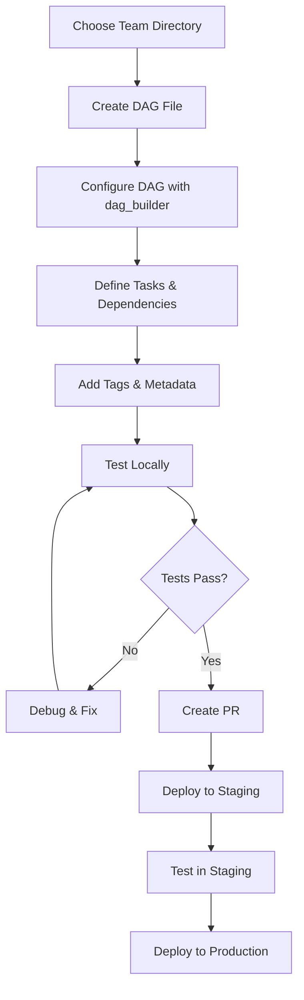
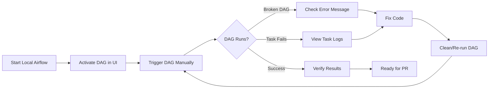
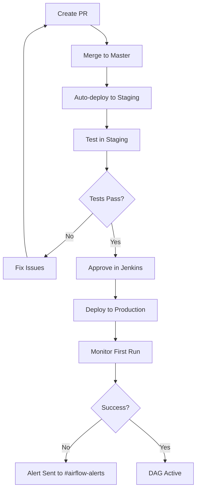

<div style="border-bottom: 1px solid var(--vp-c-divider); padding-bottom: 1rem; margin-bottom: 2rem;">
  <h1 style="margin-bottom: 0.5rem;">Creating New DAGs</h1>
  <div style="display: flex; gap: 1rem; flex-wrap: wrap; font-size: 0.9rem; color: var(--vp-c-text-2);">
    <span style="display: flex; align-items: center; gap: 0.25rem;">
      🎓 <strong>Tutorial</strong>
    </span>
    <span style="display: flex; align-items: center; gap: 0.25rem;">
      📝 <strong>809</strong> words
    </span>
    <span style="display: flex; align-items: center; gap: 0.25rem;">
      ⏱️ <strong>5</strong> min read
    </span>
  </div>
</div>

This guide walks through the complete process of creating a new DAG in the data-airflow-dags repository, from initial setup through deployment to production.

## Overview

Creating a new DAG involves several key steps:

1. Choosing the appropriate team directory
2. Using the `dag_builder` framework to define your DAG
3. Configuring scheduling and dependencies
4. Adding appropriate tags and metadata
5. Testing locally
6. Following the deployment workflow



## Step 1: Choose the Team Directory

All DAGs must be created under the `dags/` folder in a team-specific directory. Based on the codebase, team directories include:

- `dags/data_platform_team/` - Data platform operations
- `dags/servicing_team/` - Servicing-related data pipelines
- Other team directories as appropriate

Within team directories, DAGs are typically organized by type:
- `extract/` - Data extraction DAGs
- `transform/` - Data transformation DAGs
- Other functional subdirectories

## Step 2: Import Required Components

Every DAG file requires the `dag_builder` framework and supporting utilities:

```python
from airflow.operators.empty import EmptyOperator
from airflow.operators.python import PythonOperator
from common.dag_builder import airflow_DAG
from common.schedule import get_timezone_aware_date
from datetime import datetime
```

Additional imports depend on your DAG's functionality:
- `common.utils.config` - For database connections and configuration
- `common.utils.vault_client` - For secrets management
- Team-specific utilities from `scripts/` or team common modules

## Step 3: Define DAG Metadata

Create a description string with contact information and scheduling details:

```python
description = """
Description: Brief description of what this DAG does
Cron-job:
    - Backfill: Description of backfill behavior
    - Incremental: Schedule description (e.g., "Each hour PST")
Contact:
    - Email: your.email@earnest.com
    - Slack: @your_slack_handle
"""
```

## Step 4: Create the DAG Using dag_builder

Use the `airflow_DAG` function from the dag_builder framework:

```python
dag = airflow_DAG(
    dag_id="your_dag_name",
    description=description,
    schedule_interval="0 * * * *",  # or None for manual
    start_date=get_timezone_aware_date(date=(2021, 1, 1)),
    tags=["extract", "your_source", "your_destination", "your-team"],
    catchup=False,
    max_active_runs=1,
)
```

### Key Parameters

| Parameter | Purpose | Example Values |
|-----------|---------|----------------|
| `dag_id` | Unique identifier for the DAG | `"incremental_slo_user_ids"` |
| `description` | Documentation string | See description format above |
| `schedule_interval` | Cron expression or `None` | `"0 * * * *"`, `None` |
| `start_date` | When DAG becomes active | `datetime(2021, 1, 1)` or `get_timezone_aware_date()` |
| `tags` | Searchable metadata | `["extract", "postgres_to_postgres", "team-name"]` |
| `catchup` | Whether to backfill missed runs | `False` (recommended) |
| `max_active_runs` | Concurrent run limit | `1` (common for data pipelines) |
| `force_schedule` | Override schedule in non-prod | `True` (for scheduled DAGs) |

> **Note**: Set `schedule_interval=None` during local development to avoid automatic triggering. Update to the actual schedule before creating your PR.

## Step 5: Define Tasks and Dependencies

### Basic Pattern with Start/End Tasks

```python
with dag:
    start = EmptyOperator(task_id="start", dag=dag)
    end = EmptyOperator(task_id="end", dag=dag)
    
    # Your task definition
    task = PythonOperator(
        task_id="your_task_name",
        python_callable=your_function,
        op_kwargs={
            "param1": value1,
            "param2": value2,
        },
    )
    
    # Define dependencies
    start >> task >> end
```

### Multiple Tasks Pattern

For DAGs with multiple sequential tasks:

```python
with dag:
    start = EmptyOperator(task_id="start", dag=dag)
    end = EmptyOperator(task_id="end", dag=dag)
    
    last_task = start
    for create_task_func in task_list:
        current_task = create_task_func(dag=dag)
        last_task >> current_task
        last_task = current_task
    last_task >> end
```

### Conditional Task Flow

For DAGs with different flows based on configuration:

```python
with dag:
    start = EmptyOperator(task_id="start", dag=dag)
    task = create_task(query=query, incremental=incremental)
    end = EmptyOperator(task_id="end", dag=dag)
    
    if incremental:
        start >> task >> end
    else:
        begin_txn = create_begin_transaction()
        end_txn = create_end_transaction()
        truncate = create_truncate_task()
        start >> begin_txn >> truncate >> task >> end_txn >> end
```

## Step 6: Common DAG Patterns

### Backfill and Incremental Pattern

Many DAGs follow a pattern of having separate backfill and incremental versions:

```python
def create_dag(dag_id, query, schedule_interval, start_date_, catchup, incremental):
    dag = airflow_DAG(
        dag_id=dag_id,
        force_schedule=True,
        start_date=start_date_,
        description=description,
        schedule_interval=schedule_interval,
        tags=["extract", "your_tags"],
        catchup=catchup,
        max_active_runs=1,
    )
    
    # Task creation logic
    return dag

# Create both versions
backfill_dag = create_dag(
    dag_id="backfill_your_dag",
    query=backfill_query,
    schedule_interval=None,
    start_date_=start_date,
    catchup=False,
    incremental=False,
)

incremental_dag = create_dag(
    dag_id="incremental_your_dag",
    query=incremental_query,
    schedule_interval="0 * * * *",
    start_date_=start_date,
    catchup=False,
    incremental=True,
)
```

### Multiple Related DAGs Pattern

For creating multiple related DAGs from a configuration list:

```python
from collections import namedtuple
from functools import partial

DAGConfig = namedtuple("DAGConfig", ["name", "description", "schedule", "tasks"])

dag_configs = [
    DAGConfig(
        name="case_backfill",
        description="Backfills case table data",
        schedule="30 23 * * *",
        tasks=[partial(create_task, config, param) for param in params],
    ),
    DAGConfig(
        name="case_increment",
        description="Incremental load of case table",
        schedule="30 5-19 * * *",
        tasks=[partial(create_task, config)],
    ),
]

# Build DAGs
for dag_config in dag_configs:
    dag_id = f"source_{dag_config.name}"
    
    globals()[dag_id] = airflow_DAG(
        dag_id=dag_id,
        description=dag_config.description,
        schedule_interval=dag_config.schedule,
        start_date=get_timezone_aware_date(date=(2021, 1, 1)),
        tags=["extract", "source", "s3"],
    )
    
    with globals()[dag_id] as _dag:
        start = EmptyOperator(task_id="start", dag=_dag)
        end = EmptyOperator(task_id="end", dag=_dag)
        
        last_task = start
        for create_task in dag_config.tasks:
            current_task = create_task(dag=_dag)
            last_task >> current_task
            last_task = current_task
        last_task >> end
```

## Step 7: Local Development and Testing

### Initial Configuration

1. **Set schedule to None** during development:
   ```python
   schedule_interval=None
   ```

2. **Disable catchup** to avoid backfilling:
   ```python
   catchup=False
   ```

### Testing Workflow



### Debugging Broken DAGs

If your DAG doesn't appear or shows an error in the UI:

```bash
docker exec -it data-airflow-dags_dev_1 bash -c "airflow list_dags"
```

This displays the full Python stacktrace for any DAG parsing errors.

### Debugging Task Failures

1. Navigate to your DAG in the Airflow UI
2. Click on "Graph View"
3. Click on the failed task (red border)
4. Click "View Log" to see execution logs

### Making Changes

After fixing issues:
1. Save your changes
2. The DAG will automatically reload in local Airflow
3. Trigger the DAG again to test

## Step 8: Naming Conventions

### DAG ID Conventions

Based on observed patterns:

- **Backfill DAGs**: `backfill_\<entity\>_\<description\>`
  - Example: `backfill_slo_user_ids`
  
- **Incremental DAGs**: `incremental_\<entity\>_\<description\>`
  - Example: `incremental_slo_user_ids`
  
- **Source-prefixed DAGs**: `\<source\>_\<operation\>`
  - Example: `agiloft_case_backfill`

### Task ID Conventions

- Use descriptive, snake_case names
- Include the operation and entity: `load_slo_user_ids_to_servicing`
- Standard markers: `start`, `end` for boundary tasks
- Transaction tasks: `begin_txn_\<operation\>`, `end_txn_\<operation\>`

### Tag Conventions

Tags should include:

1. **Operation type**: `extract`, `transform`, `load`
2. **Source/destination**: `postgres_to_postgres`, `s3`, `agiloft`
3. **Entity**: `loan_user_ids`, `case_table`
4. **Team**: `servicing-team`, `data-platform-team`

Example:
```python
tags=["extract", "postgres_to_postgres", "loan_user_ids", "servicing-team"]
```

## Step 9: Pre-PR Validation

Before creating your pull request:

1. **Update schedule_interval** to the production value:
   ```python
   schedule_interval="0 * * * *"  # or appropriate cron
   ```

2. **Run validation**:
   ```bash
   ./go validate
   ```

3. **Run tests**:
   ```bash
   ./go test
   ```

4. **Commit your changes** with a descriptive message

## Step 10: Deployment Workflow



### Deployment Steps

1. **Create and merge PR** to master branch
2. **Automatic staging deployment** (takes ~5 minutes)
3. **Test in staging** by manually triggering the DAG
4. **Production approval** - Someone must approve in Jenkins (notification sent to #airflow-alerts)
5. **Production deployment** - Automatic after approval
6. **Verify production run** - Check for alerts in #airflow-alerts

### Schedule Behavior by Environment

| Environment | Schedule Behavior |
|-------------|-------------------|
| Local | Disabled - manual trigger only |
| Staging | Disabled - manual trigger only |
| Production | Active - runs on schedule |

> **Important**: Schedules are disabled in local and staging to avoid unnecessary CPU usage. Only production runs on the configured schedule.

### Testing in Development Environment

To test in the development environment before staging:

```bash
git checkout development
git reset --hard $your-feature-branch
git push origin development -f
```

DAGs sync from the development branch every hour.

> **Warning**: The development branch is unstable. Never checkout from it for new work.

## Complete Example: Creating a User ID Extraction DAG

Here's a complete example showing all components together:

```python
from airflow.operators.empty import EmptyOperator
from airflow.operators.python import PythonOperator
from common.dag_builder import airflow_DAG
from common.utils.config import get_db_params, executor_config
from servicing_team.common.batch_copy import copy_from_source_to_destination
from datetime import datetime

description = """
Description: Extraction job that loads user IDs from source to destination DB
Cron-job:
    - Backfill: All data from 2017-01-01 UTC
    - Incremental: Each hour PST
Contact:
    - Email: developer@earnest.com
    - Slack: @developer
"""

def create_task(query, incremental):
    return PythonOperator(
        task_id="user_id_extraction",
        python_callable=copy_from_source_to_destination,
        op_kwargs={
            "source_query": query,
            "source_db_credentials": get_db_params("sourcedb"),
            "destination_schema": "public",
            "destination_table": "user_ids",
            "destination_offset_query": destination_offset_query,
            "destination_db_credentials": get_db_params("destdb", True),
            "operation_name": "load-user-ids",
            "incremental": incremental,
        },
        executor_config=executor_config,
    )

def create_dag(dag_id, query, schedule_interval, start_date_, catchup, incremental):
    dag = airflow_DAG(
        dag_id=dag_id,
        force_schedule=True,
        start_date=start_date_,
        description=description,
        schedule_interval=schedule_interval,
        tags=["extract", "postgres_to_postgres", "user_ids", "your-team"],
        catchup=catchup,
        max_active_runs=1,
    )

    start = EmptyOperator(task_id="start", dag=dag)
    task = create_task(query=query, incremental=incremental)
    end = EmptyOperator(task_id="end", dag=dag)
    
    start >> task >> end
    return dag

# Define queries
backfill_query = """
    SELECT user_id, created_at 
    FROM users 
    WHERE created_at > TO_TIMESTAMP('2017 Jan','YYYY MON')
"""

incremental_query = """
    SELECT user_id, created_at 
    FROM users 
    WHERE created_at > '{offset_time}'
"""

destination_offset_query = """
    SELECT max(created_at) as offset_time FROM user_ids
"""

start_date = datetime(2021, 9, 22)

# Create DAG instances
backfill_dag = create_dag(
    dag_id="backfill_user_ids",
    query=backfill_query,
    schedule_interval=None,
    start_date_=start_date,
    catchup=False,
    incremental=False,
)

incremental_dag = create_dag(
    dag_id="incremental_user_ids",
    query=incremental_query,
    schedule_interval="0 * * * *",
    start_date_=start_date,
    catchup=False,
    incremental=True,
)
```

## Related Documentation

- [DAG Builder Framework](./dag-builder-framework.md) - Detailed documentation on the `airflow_DAG` function
- [DAG Organization and Structure](./dag-organization.md) - How DAGs are organized in the repository
- [Local Development Setup](./local-development-setup.md) - Setting up your local Airflow environment
- [Testing Strategy](./testing-strategy.md) - Writing tests for your DAGs
- [Common Utilities](./common-utilities.md) - Available utility functions and helpers
- [Configuration Management](./configuration-management.md) - Managing database connections and secrets