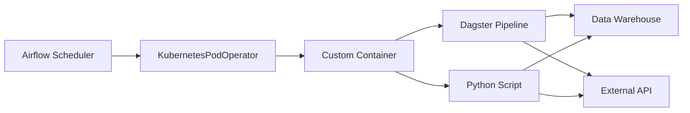
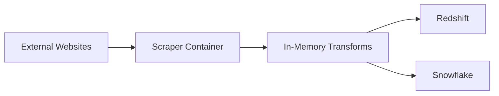
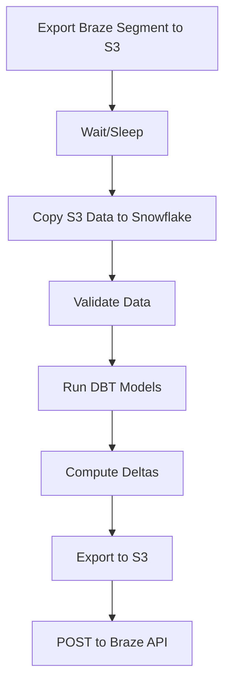
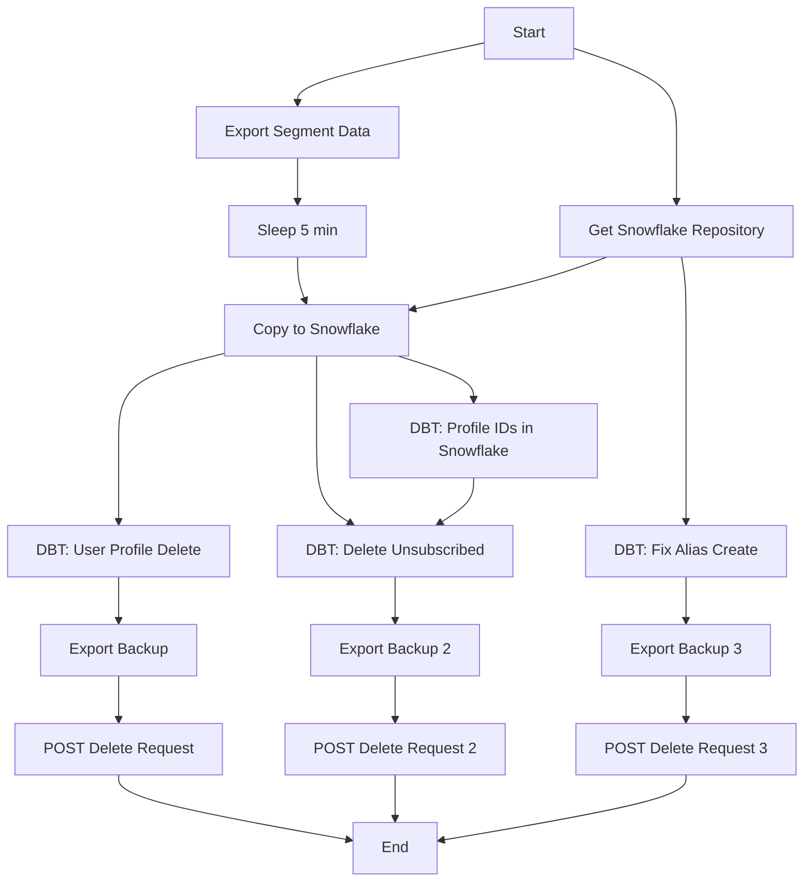
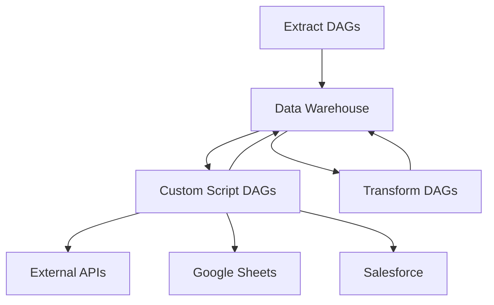

<div style="border-bottom: 1px solid var(--vp-c-divider); padding-bottom: 1rem; margin-bottom: 2rem;">
  <h1 style="margin-bottom: 0.5rem;">Custom Script DAGs</h1>
  <div style="display: flex; gap: 1rem; flex-wrap: wrap; font-size: 0.9rem; color: var(--vp-c-text-2);">
    <span style="display: flex; align-items: center; gap: 0.25rem;">
      📚 <strong>Reference</strong>
    </span>
    <span style="display: flex; align-items: center; gap: 0.25rem;">
      📝 <strong>1,026</strong> words
    </span>
    <span style="display: flex; align-items: center; gap: 0.25rem;">
      ⏱️ <strong>6</strong> min read
    </span>
  </div>
</div>

Custom script DAGs are specialized Airflow workflows that execute business-specific processes outside the standard extract-transform-load patterns. These DAGs typically run containerized Python scripts or Dagster pipelines to handle domain-specific requirements such as forecasting, competitive analysis, and third-party integrations.

## Overview

Custom script DAGs are distinguished by their use of `KubernetesPodOperator` to execute workloads in isolated containers, often using the `earnest/data-custom-scripts` Docker image. Unlike standard [Extract DAGs](./extract-dags.md) or [Transform DAGs](./transform-dags.md), these workflows encapsulate complex business logic that doesn't fit the conventional data pipeline patterns.



## SLR Forecast DAG

### Purpose
The SLR (Student Loan Refinance) forecast DAG executes a Dagster pipeline that generates weekly forecasts, reading from data warehouses and writing results to Google Sheets.

### Configuration

The DAG is generated for both Redshift and Snowflake warehouses:

| Parameter | Value |
|-----------|-------|
| **DAG IDs** | `slr_forecast_redshift`, `slr_forecast_snowflake` |
| **Schedule** | `0 15 * * MON-FRI` (8 AM PST, Monday-Friday) |
| **Tags** | `slr_forecast`, `custom_script` |
| **Memory** | 2Gi (limits and requests) |
| **Module** | `dagster_files.slr_weekly_forecast.features_dag` |

### Implementation Details

```python
dagster_cmd = f"""
    dagster pipeline execute -m {module} --preset {warehouse}
"""
```

The DAG uses Dagster presets to configure warehouse-specific execution, allowing the same pipeline code to target different data sources.

**Contacts:**
- Email: chris.evans@earnest.com, areyes@earnest.com, mainak.pyne@earnest.com
- Slack: @chris.evans, @anselmo, @mainak.pyne

## SLR Automation DAG

### Purpose
Generates rate map data using statistical inference (t-test) and stores results in S3. This DAG runs a specialized container image for rate map automation.

### Configuration

| Parameter | Value |
|-----------|-------|
| **DAG ID** | `slr_automation` |
| **Schedule** | `30 15 * * *` (8:30 AM PST daily) |
| **Tags** | `slr_rate_map_automation` |
| **Image** | `earnest/slr-rate-map-automation` |

### Execution Flow

The DAG sources Redshift credentials from Vault and executes a Python inference script:

```bash
source ./dev_tools/set_up_airflow_secrets.sh redshift_violin_user redshift_violin_password &&
python rate_map_generation/t_test/inference.py
```

**Contacts:**
- Email: hani.ramezani@earnest.com, areyes@earnest.com, mainak.pyne@earnest.com
- Slack: @hani.ramezani, @anselmo, @mainak.pyne

## Competitor Rates DAG

### Purpose
Scrapes competitor rate data from external websites and loads it into data warehouses for competitive analysis.

### Configuration

Generated for both Redshift and Snowflake:

| Parameter | Value |
|-----------|-------|
| **DAG IDs** | `competitor_rates_redshift`, `competitor_rates_snowflake` |
| **Schedule** | `55 6 * * MON-FRI` (55 minutes after 6 AM UTC, Monday-Friday) |
| **Tags** | `competitor_rates`, `scraper`, `custom_script` |
| **Memory** | 2Gi (limits and requests) |
| **Module** | `dagster_files.competitor_rates.dag` |

### Data Flow



**Contacts:**
- Email: chris.evans@earnest.com, areyes@earnest.com
- Slack: @chris.evans, @anselmo

## Braze Integration DAGs

The Braze integration consists of multiple DAG versions (v1, v2, v3) that synchronize user data between Snowflake and the Braze marketing platform using cloud data ingestion.

### Architecture Pattern

All Braze DAGs follow a common workflow:



### Braze V3 DAGs

#### Weekday DAG

| Parameter | Value |
|-----------|-------|
| **DAG ID** | `braze_test_cloud_ingestion_dag_weekday` |
| **Schedule** | `0 6-20/2 * * *` (Every 2 hours from 6-20, weekdays) |
| **Tags** | `braze`, `v3` |
| **Team Owner** | `data_platform_team` |

**Key Operations:**
- **User Identification**: Matches Snowflake users with Braze profiles
- **Alias Creation**: Creates new user aliases in Braze
- **Attribute Sync**: Synchronizes user attributes bidirectionally
- **Event Sync**: Pushes custom events to Braze

**DBT Models Used:**
- `data_team.braze_v3.user_profile_ids_in_braze`
- `data_team.braze_v3.user_profile_ids_in_snowflake`
- `data_team.reverse_etl.braze.user_events.*`
- `data_team.reverse_etl.braze.user_attributes.*`
- `data_team.braze_v3.delta_profiles_identify`
- `data_team.braze_v3.delta_profiles_alias_create`
- `data_team.braze_v3.user_unsubscribes`

#### Delete Users DAG

| Parameter | Value |
|-----------|-------|
| **DAG ID** | `braze_cloud_ingestion_dag_delete_users` |
| **Schedule** | Manual (None) |
| **Tags** | `braze`, `v3`, `adhoc` |

**Purpose:** Handles user deletion workflows including:
- Archiving profiles before deletion
- Deleting unsubscribed/deactivated users
- Fixing alias creation issues

**Parallel Execution Paths:**



### Braze V2 DAGs

#### Weekday and Weekend Variants

| DAG ID | Schedule | Days |
|--------|----------|------|
| `braze_dag_weekday_v2` | `0 6-20/4 * * 1-5` | Monday-Friday |
| `braze_dag_weekend_v2` | `30 6-18/4 * * 6,0` | Saturday-Sunday |

**Key Differences from V3:**
- Uses different DBT model paths (`data_team.braze_v2.*`)
- Simpler delta computation logic
- Combined attributes model (`user_combined_all_sources`)
- Separate event delta processing

**Resource Configuration:**
Both POST tasks use custom Kubernetes executor config:
```python
executor_config={
    "KubernetesExecutor": {
        "request_memory": "500Mi",
        "limit_memory": "750Mi"
    }
}
```

### Braze V1 DAG

| Parameter | Value |
|-----------|-------|
| **DAG ID** | `braze_dag` |
| **Schedule** | `0 5,11 * * *` (5 AM and 11 PM PST) |
| **Tags** | `braze` |

**Legacy Implementation:**
- Uses SQL-based delta computation instead of DBT
- Separate processing for SLR and SLO attributes
- Direct SQL file formatting and execution

**Contact:**
- Email: irene.lee@earnest.com
- Slack: @irene.lee

## ExactTarget DAG

### Purpose
Executes Dagster pipelines that send data to Salesforce ExactTarget (Marketing Cloud) for marketing campaigns.

### Configuration

Two variants are generated:

| Variant | Schedule | Description |
|---------|----------|-------------|
| `exact_target_user_stories_snowflake` | `45 6,12,18 * * MON-FRI` | User story data sync |
| `exact_target_refi_away_snowflake` | `0 12 * * MON-FRI` | Refinance away data sync |

### Implementation

| Parameter | Value |
|-----------|-------|
| **Memory** | 3.5Gi (limits and requests) |
| **Module** | `dagster_files.exact_target.dag` |
| **Tags** | `exact_target`, `\<name\>`, `custom_script` |
| **Start Date** | Timezone-aware: 2021-01-01 |

**Contacts:**
- Email: chris.evans@earnest.com, areyes@earnest.com
- Slack: @chris.evans, @anselmo

## Common Dependencies

All custom script DAGs share these dependencies:

### Kubernetes Configuration
- **Secrets**: `vault_token_secret` for Vault authentication
- **Environment Variables**: `vault_envs` for runtime configuration
- **Defaults**: `k8s_defaults` from [Configuration Management](./configuration-management.md)

### Vault Integration
Custom script DAGs requiring Snowflake access use:
```python
environment_variables = [
    "snowflake_user",
    "snowsql_private_key",
    "snowsql_private_key_passphrase",
    "xcom_encrytion_secret",
]
set_envs_from_vault(*environment_variables)
```

### Database Connections
Braze DAGs use the [Database Abstraction Layer](./database-abstraction.md) through:
- `SnowflakeDB` repository type
- `snowflake_params` and `snowflake_cred` from configuration
- `get_repository()` helper for connection management

## Integration with Broader Architecture

### Relationship to Other DAG Types



Custom script DAGs typically:
- **Consume** data from warehouses populated by [Extract DAGs](./extract-dags.md)
- **May trigger** [DBT Integration](./dbt-integration.md) models for transformations
- **Write to** external systems not covered by standard [External Integrations](./external-integrations.md)
- **Store artifacts** in [S3 Storage](./s3-storage.md) for archival or handoff

### DBT Integration Pattern

Braze DAGs demonstrate tight integration with DBT:

```python
dbt_settings_tables = {
    "dbt_settings_user_profile_ids_in_braze": {
        "warehouse": "snowflake",
        "models": "data_team.braze_v3.user_profile_ids_in_braze",
    },
    # ... more models
}

for id_dbt_model in dbt_settings_tables:
    all(get_dbt_tasks(
        dbt_settings=dbt_settings_tables[id_dbt_model],
        task_id_suffix=id_dbt_model.split("dbt_settings")[1],
    ))
```

This pattern uses the [DAG Builder Framework](./dag-builder-framework.md)'s `get_dbt_tasks()` helper to dynamically generate DBT operation tasks.

## Environment-Specific Behavior

### Database and Schema Selection

Braze DAGs adjust target databases based on environment:

```python
target_db_for_delta_profiles = (
    "PRODUCTION" if os.environ["ENVIRONMENT"] == "production" else "DEVELOPMENT"
)
target_schema_for_delta_profiles = (
    "PUBLIC" if os.environ["ENVIRONMENT"] == "production" else "DEVELOPMENT"
)
```

### Production Table Exposure

Some DAGs conditionally expose tables to production:

```python
def expose_table_production_dispatcher(
    database: str, schema: str, table: str
) -> List[Optional[str]]:
    return (
        [expose_table_production(database, schema, table)]
        if os.environ["ENVIRONMENT"] == "production"
        else []
    )
```

> **Note:** Schedule intervals work differently across environments. Per deployment documentation, schedules are disabled in local and staging environments to avoid unnecessary CPU usage. All DAGs must be triggered manually in non-production environments.

## Retry and Error Handling

Most custom script DAGs configure retry behavior:

```python
default_args={"retries": 2}
```

Braze POST operations explicitly disable retries for certain tasks:

```python
retries=0  # For attributes_post_task and custom_events_post_task
```

This prevents duplicate API calls that could corrupt Braze data.

## Monitoring and Alerting

Custom script DAGs integrate with the broader [Monitoring and Alerting](./monitoring-alerting.md) infrastructure through:
- Contact information embedded in DAG descriptions
- Slack notifications to `#airflow-alerts` channel
- Team ownership tags (e.g., `team_owner="data_platform_team"`)

## Related Documentation

- [DAG Organization and Structure](./dag-organization.md) - How custom scripts fit into the overall DAG taxonomy
- [Creating New DAGs](./creating-new-dags.md) - Guidelines for adding new custom script DAGs
- [External System Integrations](./external-integrations.md) - Related integration patterns
- [Deployment Guide](./deployment-guide.md) - How custom script DAGs are deployed to production