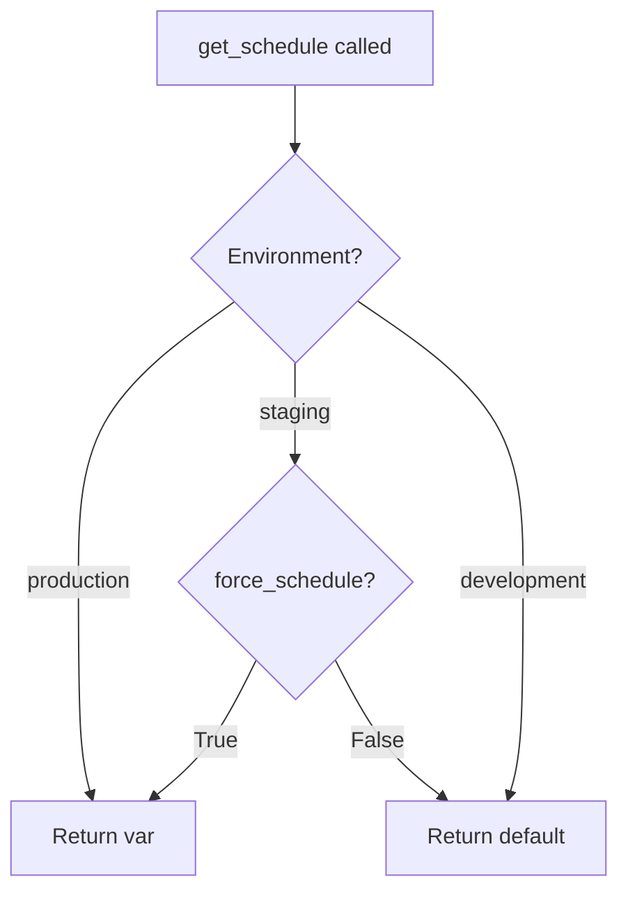
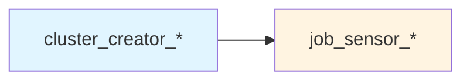
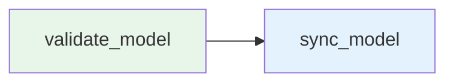
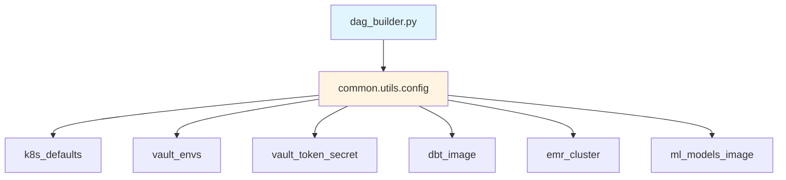

<div style="border-bottom: 1px solid var(--vp-c-divider); padding-bottom: 1rem; margin-bottom: 2rem;">
  <h1 style="margin-bottom: 0.5rem;">DAG Builder Framework</h1>
  <div style="display: flex; gap: 1rem; flex-wrap: wrap; font-size: 0.9rem; color: var(--vp-c-text-2);">
    <span style="display: flex; align-items: center; gap: 0.25rem;">
      📖 <strong>Guide</strong>
    </span>
    <span style="display: flex; align-items: center; gap: 0.25rem;">
      📝 <strong>1,103</strong> words
    </span>
    <span style="display: flex; align-items: center; gap: 0.25rem;">
      ⏱️ <strong>6</strong> min read
    </span>
  </div>
</div>

The `dag_builder.py` module in `dags/common` provides a standardized framework for creating Airflow DAGs across the data-airflow-dags repository. It offers specialized builder functions for different DAG types (DBT, EMR, ML models) and handles environment-specific configuration, scheduling, and resource allocation.

## Core DAG Creation

### Base DAG Builder: `airflow_DAG()`

The `airflow_DAG()` function is the foundation for all DAG creation in the repository. The function name intentionally contains "airflow" and "DAG" to ensure Airflow's DAG detection mechanism recognizes it.

```python
from common.dag_builder import airflow_DAG

dag = airflow_DAG(
    dag_id="my_custom_dag",
    description="DAG description",
    schedule_interval="0 6 * * *",
    tags=["extract", "custom"],
)
```

**Key Features:**

- **Environment-aware scheduling**: Automatically disables schedules in non-production environments unless `force_schedule=True`
- **Default arguments injection**: Merges user-provided `default_args` with configuration defaults from `Config().get_property("dag_args")`
- **Catchup disabled by default**: Sets `catchup=False` unless explicitly overridden
- **Team ownership**: Supports optional `team_owner` parameter for notification routing

**Parameters:**

| Parameter | Type | Required | Description |
|-----------|------|----------|-------------|
| `dag_id` | str | Yes | Unique identifier for the DAG |
| `force_schedule` | bool | No | Force schedule execution in staging environment |
| `team_owner` | str | No | Team owner for notifications (overrides folder-based detection) |
| `**kwargs` | Dict | No | Standard Airflow DAG parameters (schedule_interval, default_args, tags, etc.) |

### Schedule Management

The `get_schedule()` helper function implements environment-specific scheduling logic:



This ensures DAGs only run on schedule in production, preventing unintended executions in lower environments.

## DBT DAG Builders

The framework provides three functions for creating DBT-based DAGs, each serving different use cases.

### Standard DBT DAG: `dbt_airflow_DAG()`

Creates production and optional pre-production DBT DAGs with standardized operations (debug → run → test).

```python
from common.dag_builder import dbt_airflow_DAG

dbt_settings = {
    "warehouse": "snowflake",
    "models": "data_team.boarding_service+",
}

pre_prod_dag, prod_dag = dbt_airflow_DAG(
    dag_id="dbt_boarding_service",
    dbt_settings=dbt_settings,
    description="Boarding service DBT models",
    schedule_interval="0 6 * * *",
    tags=["dbt", "boarding"],
)
```

**Behavior:**

- Creates a production DAG with the specified `dag_id`
- In production environment with Redshift warehouse: creates an additional pre-production DAG with `pre_prod_` prefix
- Pre-production DAGs have `schedule_interval=None` (manual trigger only)
- Automatically adds `"dbt"` tag to all DAGs
- Adds `"pre_prod"` tag to pre-production DAGs

**DBT Settings:**

| Setting | Type | Required | Description |
|---------|------|----------|-------------|
| `warehouse` | str | Yes | Target warehouse: "snowflake" or "redshift" |
| `models` | str | No | DBT model selector (e.g., "data_team.model_name+") |
| `exclusions` | str | No | Models to exclude (e.g., "tag:disable") |
| `full_refresh` | bool | No | Force full refresh of incremental models |
| `pre_prod` | bool | No | Internal flag set automatically for pre-prod DAGs |

### Custom Operations DBT DAG: `dbt_build_airflow_DAG()`

Creates a DBT DAG with custom operations instead of the default debug/run/test sequence.

```python
from common.dag_builder import dbt_build_airflow_DAG

dbt_settings = {
    "warehouse": "snowflake",
    "models": "data_team.direct_mail.pl_direct_mail_selections",
    "exclusions": "tag:disable",
    "full_refresh": True,
}

dag = dbt_build_airflow_DAG(
    dag_id="dbt_ad_hoc",
    operations=("build",),
    dbt_settings=dbt_settings,
    schedule_interval=None,
    tags=["DBT", "ad_hoc"],
)
```

**Use Cases:**

- Ad-hoc model execution with specific operations
- Custom DBT command sequences (e.g., only "build", or "seed" → "run")
- Testing and development workflows

### DBT Documentation Task: `dbt_docs_task()`

Creates a standalone task for generating DBT documentation artifacts.

```python
from common.dag_builder import airflow_DAG, dbt_docs_task

dbt_settings = {"warehouse": "snowflake"}

with airflow_DAG(dag_id="dbt-docs-generator", schedule_interval="0 6,14 * * *") as dag:
    generate_docs = dbt_docs_task(dbt_settings=dbt_settings)
```

This task generates documentation JSON files consumed by the DBT documentation microservice.

### DBT Task Generation

The `get_dbt_tasks()` function creates KubernetesPodOperator tasks with environment-specific behavior:

**Production Environment:**
- Executes DBT commands via `execute_dbt_commands.sh` script
- Includes Monte Carlo integration for data observability
- Uses Vault for credential management

**Non-Production Environments:**
- Retrieves credentials directly from Vault
- Creates private key files for Snowflake authentication
- Executes DBT commands directly

**Node Selector Support:**

```python
node_selector = {"node_type": "high_memory"}

tasks = get_dbt_tasks(
    dbt_settings=dbt_settings,
    operations=("debug", "run", "test"),
    node_selector=node_selector
)
```

Node selectors are only applied in production environments, allowing resource-intensive DBT jobs to run on specialized Kubernetes nodes.

## EMR DAG Builder

### `emr_airflow_DAG()`

Creates DAGs that provision EMR clusters, execute Spark jobs, and monitor completion.

```python
from common.dag_builder import emr_airflow_DAG

command = "spark-submit --class com.earnest.MyJob s3://bucket/my-job.jar"

dag = emr_airflow_DAG(
    dag_id="emr_spark_job",
    command=command,
    instance_count=5,
    schedule_interval="0 8 * * *",
    tags=["spark", "etl"],
)
```

**Generated DAG Structure:**



**Parameters:**

| Parameter | Type | Default | Description |
|-----------|------|---------|-------------|
| `dag_id` | str | Required | DAG identifier |
| `command` | str | Required | Spark-submit command to execute |
| `instance_count` | int | 2 | Total EMR cluster instances (including master) |
| `**kwargs` | Dict | - | Standard DAG parameters |

**Cluster Configuration:**

The builder automatically:
- Configures cluster name as `{dag_name}-{environment}`
- Wraps the command in an EMR step configuration
- Adds `"emr"` and `"spark"` tags
- Sets up retry logic (1 retry with 60-second delay for sensor)

**Spark Resource Optimization:**

The `add_custom_params_to_step()` function calculates optimal Spark executor configuration based on instance count:

- **Cores per machine**: 8 vCPU
- **Memory per machine**: 25.5 GB (32 GB - 6.5 GB overhead)
- **Executor cores**: 4 (recommended for throughput)
- **Dynamic calculation**: Automatically computes `num_executors` and `executor_memory` based on cluster size

> **Note:** The `add_custom_params_to_step()` function is defined but not currently used in the EMR DAG creation flow. It appears to be available for manual command optimization.

## ML Model Training DAG Builder

### `ml_training_airflow_DAG()`

Creates DAGs for machine learning model training and deployment workflows.

```python
from common.dag_builder import ml_training_airflow_DAG

ml_model_settings = {
    "model": "sample-model/ml_config.yaml"
}

dag = ml_training_airflow_DAG(
    dag_id="ml_model_sample_training",
    ml_model_settings=ml_model_settings,
    schedule_interval=None,
    description="ML model training pipeline",
    tags=["example", "model_training"],
)
```

**Generated DAG Structure:**



**Default Operations:**

1. **validate_model**: Validates model configuration and training data
2. **sync_model**: Syncs trained model artifacts to storage

**ML Model Settings:**

| Setting | Type | Required | Description |
|---------|------|----------|-------------|
| `model` | str | Yes | Path to ML model configuration YAML file |

**Task Configuration:**

Each ML task runs as a KubernetesPodOperator with:
- ML models Docker image (`ml_models_image`)
- Vault integration for secrets
- Child pod resources for task execution
- Parent pod resources for executor configuration
- 1 retry with 5-second delay

### Custom ML Operations

The `get_ml_training_tasks()` function supports custom operation sequences:

```python
tasks = get_ml_training_tasks(
    ml_model_settings=ml_model_settings,
    operations=("validate_model", "train_model", "sync_model"),
    task_id_suffix="_custom"
)
```

This allows extending the default validate → sync workflow with additional steps.

## Configuration Integration

All builder functions integrate with the centralized configuration system:



**Key Configuration Elements:**

- **k8s_defaults**: Base Kubernetes configuration for all pod operators
- **vault_envs**: Environment variables for Vault integration
- **vault_token_secret**: Kubernetes secret for Vault authentication
- **dbt_image**: Docker image for DBT tasks
- **emr_cluster**: Base EMR cluster configuration
- **ml_models_image**: Docker image for ML model tasks
- **Resource configurations**: Pod resource limits and requests for different task types

See [Configuration Management](./configuration-management.md) for detailed configuration options.

## Usage Patterns

### Pattern 1: Simple Extract DAG

```python
from common.dag_builder import airflow_DAG
from airflow.operators.python import PythonOperator

dag = airflow_DAG(
    dag_id="extract_agiloft",
    description="Extract data from Agiloft",
    schedule_interval="30 5-19 * * *",
    tags=["extract", "agiloft"],
)

with dag:
    extract_task = PythonOperator(
        task_id="extract_data",
        python_callable=extract_function,
    )
```

### Pattern 2: DBT Transform DAG

```python
from common.dag_builder import dbt_airflow_DAG

dbt_settings = {
    "warehouse": "snowflake",
    "models": "data_team.my_models+",
}

pre_prod_dag, prod_dag = dbt_airflow_DAG(
    dag_id="transform_my_models",
    dbt_settings=dbt_settings,
    schedule_interval="0 8 * * *",
    tags=["transform"],
)
```

### Pattern 3: Custom Script with Kubernetes

```python
from common.dag_builder import airflow_DAG
from airflow.providers.cncf.kubernetes.operators.pod import KubernetesPodOperator
from common.utils.config import k8s_defaults, vault_token_secret, vault_envs

dag = airflow_DAG(
    dag_id="custom_forecast",
    schedule_interval="0 21 * * WED",
    tags=["forecast"],
)

task = KubernetesPodOperator(
    image="earnest/slr-forecast",
    name="forecast_task",
    task_id="forecast_task",
    secrets=[vault_token_secret],
    env_vars=vault_envs,
    arguments=["python production/train_forecast.py"],
    dag=dag,
    **k8s_defaults,
)
```

### Pattern 4: Dynamic DAG Generation

```python
from common.dag_builder import airflow_DAG
from functools import partial

# Define DAG configurations
dag_configs = [
    {"name": "case_backfill", "schedule": "30 23 * * *"},
    {"name": "case_increment", "schedule": "30 5-19 * * *"},
]

# Generate DAGs dynamically
for config in dag_configs:
    dag_id = f"agiloft_{config['name']}"
    
    globals()[dag_id] = airflow_DAG(
        dag_id=dag_id,
        schedule_interval=config['schedule'],
        tags=["extract", "agiloft"],
    )
```

## Best Practices

### Environment Handling

- Use `force_schedule=False` (default) for most DAGs to prevent unintended production-like behavior in staging/development
- Set `force_schedule=True` only for DAGs that must run on schedule in staging for testing purposes
- Leverage automatic schedule disabling in non-production environments

### Tag Management

- Always include descriptive tags for DAG categorization
- Builder functions automatically add type-specific tags (`"dbt"`, `"emr"`, `"ml_model"`)
- Add team or domain tags for organizational filtering

### DBT DAG Creation

- Use `dbt_airflow_DAG()` for standard model execution with automatic pre-prod support
- Use `dbt_build_airflow_DAG()` for ad-hoc or custom operation sequences
- Specify `node_selector` for resource-intensive DBT jobs in production
- Always set `warehouse` in `dbt_settings`

### Resource Configuration

- DBT tasks use `dbt_child_pod_resources` for execution pods
- ML tasks use `ml_models_child_pod_resources` for tasks and `ml_models_parent_pod_resources` for executors
- Custom tasks should reference appropriate resource configurations from `common.utils.config`

### Error Handling

- DBT tasks: 1 retry with 120-second delay
- EMR sensor: 1 retry with 60-second delay
- ML tasks: 1 retry with 5-second delay
- Override retry behavior in `**kwargs` when needed

## Related Documentation

- [Creating New DAGs](./creating-new-dags.md) - Step-by-step guide for creating DAGs
- [DBT Integration](./dbt-integration.md) - Detailed DBT integration patterns
- [Configuration Management](./configuration-management.md) - Configuration system reference
- [Common Utilities](./common-utilities.md) - Additional utility functions
- [DAG Organization and Structure](./dag-organization.md) - Repository DAG organization