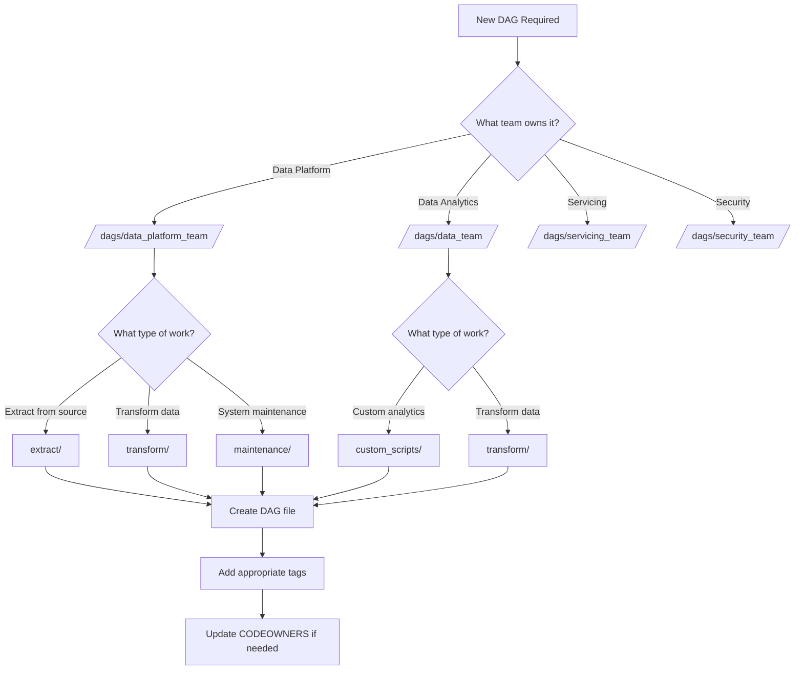

<div style="border-bottom: 1px solid var(--vp-c-divider); padding-bottom: 1rem; margin-bottom: 2rem;">
  <h1 style="margin-bottom: 0.5rem;">DAG Organization and Structure</h1>
  <div style="display: flex; gap: 1rem; flex-wrap: wrap; font-size: 0.9rem; color: var(--vp-c-text-2);">
    <span style="display: flex; align-items: center; gap: 0.25rem;">
      📚 <strong>Reference</strong>
    </span>
    <span style="display: flex; align-items: center; gap: 0.25rem;">
      📝 <strong>645</strong> words
    </span>
    <span style="display: flex; align-items: center; gap: 0.25rem;">
      ⏱️ <strong>4</strong> min read
    </span>
  </div>
</div>

The data-airflow-dags repository organizes DAGs using a team-based directory structure combined with functional categorization. This structure supports ownership boundaries, notification routing, and logical grouping of data workflows.

## Team-Based Directory Structure

DAGs are organized into four primary team directories under `/dags`:

```mermaid
graph TD
    A[/dags] --> B[data_platform_team/]
    A --> C[data_team/]
    A --> D[servicing_team/]
    A --> E[security_team/]
    A --> F[common/]
    
    B --> B1[extract/]
    B --> B2[transform/]
    B --> B3[maintenance/]
    
    C --> C1[custom_scripts/]
    C --> C2[transform/]
    
    D --> D1[Team-specific DAGs]
    E --> E1[Team-specific DAGs]
    
    F --> F1[Shared utilities]
    
    style F fill:#e1f5ff
```

### Team Directories

| Directory | Purpose | Code Ownership |
|-----------|---------|----------------|
| `data_platform_team/` | Platform infrastructure, core extracts, and maintenance DAGs | @dhananjay-earnest @ellenwentz @luisNicolasB @markjacksonest @kyle-roark @nihaarshah1996 @antoniarubell |
| `data_team/` | Analytics-focused custom scripts and transformations | @meetearnest/data @dhananjay-earnest @luisNicolasB @nihaarshah1996 |
| `servicing_team/` | Servicing operations and business process DAGs | @earlye @dhananjay-earnest @luisNicolasB @meetearnest/servicing-squad @nihaarshah1996 |
| `security_team/` | Security and compliance-related workflows | @sgshilpa-github-io @dhananjay-earnest @luisNicolasB @nihaarshah1996 |

> **Note**: Code ownership is enforced through the `CODEOWNERS` file, which automatically assigns reviewers based on the directory path.

## Functional Categories

Within team directories, DAGs are further organized by functional category:

### Extract DAGs

Located primarily in `data_platform_team/extract/`, these DAGs pull data from external systems into S3 or data warehouses.

**Example**: `agiloft_dags.py`
```python
globals()[dag_id] = airflow_DAG(
    dag_id=dag_id,
    description=agiloft_dag.description,
    schedule_interval=agiloft_dag.schedule,
    start_date=get_timezone_aware_date(date=(2021, 1, 1)),
    tags=["extract", "agiloft", "s3"],
)
```

**Characteristics**:
- Tags include `"extract"` and source system identifiers
- Typically scheduled at regular intervals
- Output to S3 or direct warehouse loads
- Examples: `agiloft_dags.py` (Agiloft → S3)

### Transform DAGs

Transform DAGs process and reshape data, often using dbt or custom transformation logic.

**Characteristics**:
- Tags include `"transform"` or specific transformation types
- May depend on extract DAGs
- Located in `transform/` subdirectories within team folders

### Custom Script DAGs

Located in `data_team/custom_scripts/`, these DAGs run specialized analytics or business logic.

**Example**: `slr_forecast_dag.py`
```python
globals()[dag_id] = airflow_DAG(
    dag_id=dag_id,
    description=description,
    schedule_interval="0 15 * * MON-FRI",
    tags=["slr_forecast", "custom_script"],
)
```

**Characteristics**:
- Tags include `"custom_script"` and domain-specific identifiers
- Often use KubernetesPodOperator for containerized execution
- May integrate with external tools (e.g., Dagster, Google Sheets)
- Examples: `slr_forecast_dag.py` (SLR forecasting pipeline)

### Maintenance DAGs

Maintenance DAGs handle operational tasks like cleanup, monitoring, and system health checks.

**Characteristics**:
- Tags include `"maintenance"` or operational identifiers
- Typically located in `data_platform_team/maintenance/`
- May run on less frequent schedules

## DAG Naming Conventions

### File Naming

DAG files follow these patterns:

1. **Descriptive naming**: `{source_system}_{operation}_dag.py`
   - Example: `agiloft_dags.py`
   - Example: `slr_forecast_dag.py`

2. **Team context**: Files inherit team context from directory location
   - `data_platform_team/extract/agiloft_dags.py`
   - `data_team/custom_scripts/slr_forecast_dag.py`

### DAG ID Naming

DAG IDs are constructed programmatically or explicitly defined:

```python
# Pattern 1: Programmatic construction
dag_id = f"agiloft_{agiloft_dag.name}"  # Results in: agiloft_case_increment

# Pattern 2: Explicit with warehouse variant
dag_id = f"slr_forecast_{warehouse}"  # Results in: slr_forecast_redshift

# Pattern 3: Direct assignment
dag_id = "sync_dag_test"
```

**Observed patterns**:
- Source system prefix (e.g., `agiloft_`, `slr_forecast_`)
- Operation suffix (e.g., `_increment`, `_backfill`)
- Environment or variant indicators (e.g., `_redshift`, `_snowflake`)

## Team Ownership and Notifications

The repository implements two mechanisms for determining team ownership:

### 1. Folder-Based Ownership (Default)

Team ownership is inferred from the directory path:

```python
def get_team_folder(dag_path: str) -> str:
    levels = dag_path.split("/")
    if len(levels) >= 2:
        return levels[1]  # Returns: data_platform_team, data_team, etc.
    return DEFAULT_TEAM
```

**Path resolution**:
```
/opt/airflow/dags/repo/dags/data_platform_team/extract/agiloft_dags.py
                        └─────┬─────┘
                         Team folder (index 1)
```

### 2. Explicit Team Owner Property

DAGs can override folder-based ownership using the `team_owner` parameter:

```python
with airflow_DAG(
    dag_id="my_dag",
    schedule_interval="0 12 * * *",
    team_owner="data_platform_team",  # Explicit ownership
) as dag:
    # DAG tasks...
```

**Resolution priority**:
1. Check `team_owner` property on DAG object
2. Fall back to folder-based determination
3. Use `DEFAULT_TEAM` ("data_platform_team") if neither works

This mechanism is implemented in `common/notifications.py`:

```python
def get_team_owner_from_dag_or_folder(context: Dict) -> str:
    # First try to get team_owner from DAG property
    dag_owner = extract_owner_from_dag(context)
    if dag_owner:
        return dag_owner
    
    # Fall back to folder-based determination
    full_dag_path = context.get("dag").full_filepath
    dag_path = full_dag_path.replace(DAGS_PATH, "dags")
    folder_team = get_team_folder(dag_path)
    return folder_team
```

## Guidelines for Placing New DAGs

### Decision Flow



### Placement Rules

1. **Determine team ownership**:
   - Who maintains the DAG?
   - Who receives failure notifications?
   - Check existing CODEOWNERS assignments

2. **Identify functional category**:
   - **Extract**: Pulling data from external systems → `extract/`
   - **Transform**: Processing or reshaping data → `transform/`
   - **Custom Script**: Specialized analytics or business logic → `custom_scripts/`
   - **Maintenance**: Operational tasks → `maintenance/`

3. **Create subdirectory if needed**:
   - Group related DAGs in subdirectories (e.g., `custom_scripts/adhoc_ingest_s3_analyst/`)
   - Use descriptive subdirectory names

4. **Apply consistent tagging**:
   ```python
   tags=["extract", "agiloft", "s3"]  # Extract DAG
   tags=["slr_forecast", "custom_script"]  # Custom script DAG
   tags=["transform", "dbt", "snowflake"]  # Transform DAG
   ```

### Example Placements

| DAG Type | Location | Tags |
|----------|----------|------|
| Agiloft data extraction | `data_platform_team/extract/agiloft_dags.py` | `["extract", "agiloft", "s3"]` |
| SLR forecast analytics | `data_team/custom_scripts/slr_forecast_dag.py` | `["slr_forecast", "custom_script"]` |
| Ad-hoc S3 ingestion test | `data_team/custom_scripts/adhoc_ingest_s3_analyst/test_dag.py` | (varies) |

## Common Utilities

The `/dags/common/` directory contains shared utilities available to all teams:

- `dag_builder.py` - DAG construction helpers
- `notifications.py` - Failure notification logic
- `s3/` - S3 interaction utilities
- `schedule.py` - Timezone and scheduling helpers
- Database connection modules

> **Important**: Common utilities are not team-specific and should contain only reusable, cross-team functionality.

## Related Documentation

- [DAG Builder Framework](./dag-builder-framework.md) - Details on the `airflow_DAG()` function
- [Extract DAGs](./extract-dags.md) - Comprehensive guide to extraction patterns
- [Transform DAGs](./transform-dags.md) - Transform DAG implementation details
- [Custom Script DAGs](./custom-script-dags.md) - Custom script patterns and examples
- [Creating New DAGs](./creating-new-dags.md) - Step-by-step guide for new DAG development
- [Configuration Management](./configuration-management.md) - Team-specific configuration patterns