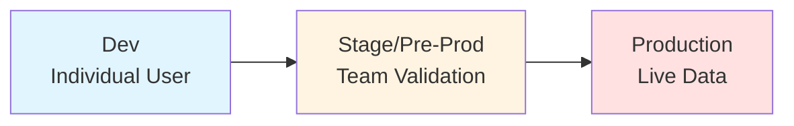
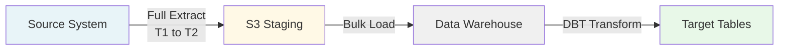
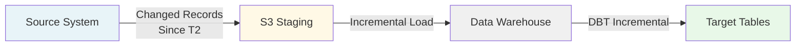
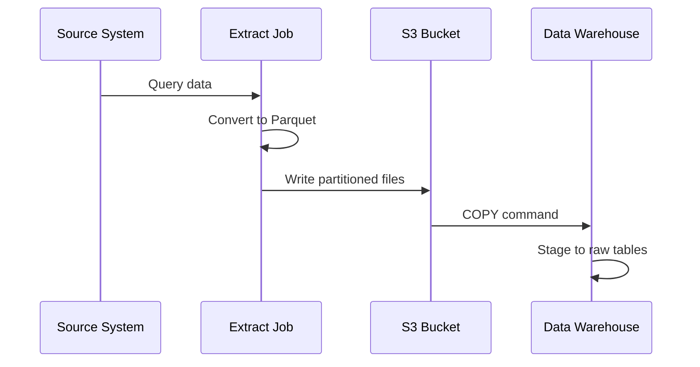
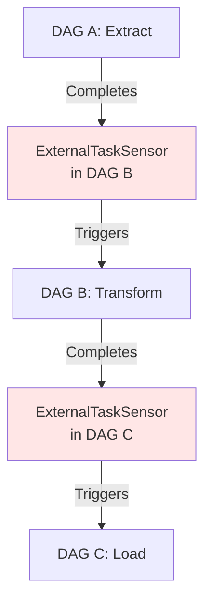
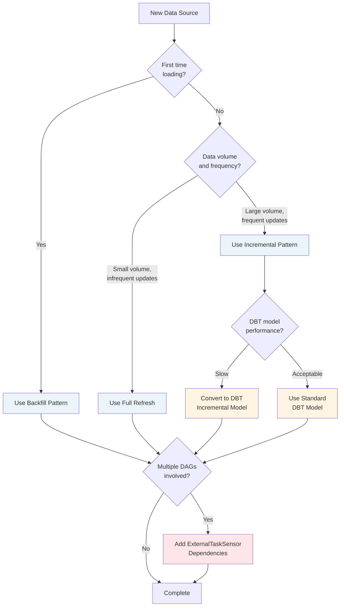
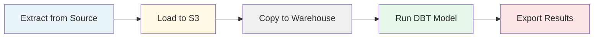

<div style="border-bottom: 1px solid var(--vp-c-divider); padding-bottom: 1rem; margin-bottom: 2rem;">
  <h1 style="margin-bottom: 0.5rem;">Data Flow Patterns</h1>
  <div style="display: flex; gap: 1rem; flex-wrap: wrap; font-size: 0.9rem; color: var(--vp-c-text-2);">
    <span style="display: flex; align-items: center; gap: 0.25rem;">
      📖 <strong>Guide</strong>
    </span>
    <span style="display: flex; align-items: center; gap: 0.25rem;">
      📝 <strong>1,307</strong> words
    </span>
    <span style="display: flex; align-items: center; gap: 0.25rem;">
      ⏱️ <strong>7</strong> min read
    </span>
  </div>
</div>

This guide explains the standard data flow patterns used in the data-airflow-dags repository for moving and transforming data. These patterns are derived from actual implementations and documented practices within the codebase.

## Overview

Data flows in this repository follow a tiered approach through development, staging, and production environments. The primary patterns involve:

- **Backfill operations**: Full historical data loads
- **Incremental loads**: Ongoing updates based on change tracking
- **Extract to S3**: Data extraction in Parquet format
- **DBT transformations**: Tiered SQL transformations
- **DAG dependencies**: Cross-DAG coordination using ExternalTaskSensor

## Environment Tiers

The repository implements a three-tier deployment model that varies by data warehouse platform:



### Snowflake Environment Flow

| Environment | Read From | Write To | Warehouse | Airflow Cluster |
|-------------|-----------|----------|-----------|-----------------|
| **Dev** | violin (prod) | dev - scratch_\<user\> | ETL Dev | local |
| **Stage** | violin (prod) | clarinet/stage - PUBLIC | ETL Dev | Stage |
| **Production** | violin (prod) | violin - PUBLIC | ETL PROD | Production |

### Redshift Environment Flow (Proposal B - Current Implementation)

| Environment | Read From | Write To | Airflow Cluster |
|-------------|-----------|----------|-----------------|
| **Dev** | violin (prod) | violin/dev - scratch_\<user\> | local |
| **Pre-Prod** | violin (prod) | violin - scratch | Production |
| **Production** | violin (prod) | violin - PUBLIC | Production |

> **Note**: Redshift uses "Proposal B" due to security restrictions around copying production data to staging clusters. This means pre-prod and production ETL both run on the production Redshift cluster but write to different schemas.

## Backfill Pattern

Backfill operations perform full historical data loads, typically used for initial setup or recovery scenarios.

### Characteristics

- Loads all records within a specified date range (T1 to T2)
- Uses creation timestamp for filtering
- Runs on-demand rather than on schedule
- May partition large datasets by day to manage load

### Implementation Example

From the Agiloft ETL refactor documentation:

**Employees Backfill**:
- Full load of all employee records from T1 to T2
- Uses `date_created` for filtering
- Handles < 1,000 records
- Triggered manually

**Cases Backfill**:
- Loads by day partitions from T1 to T2
- Uses `date_created` for filtering
- Handles thousands of records
- Partitioning reduces load and buffer size



## Incremental Load Pattern

Incremental loads capture only changed or new records since the last successful run, enabling frequent updates with minimal processing.

### Characteristics

- Uses `date_updated` or equivalent timestamp for filtering
- Runs on a regular schedule (e.g., every 30 minutes, daily)
- Tracks watermarks to determine the last processed timestamp
- Includes lookback period (typically 1 day) to handle late-arriving data

### Implementation Example

**Employees Incremental**:
- Loads 48-hour intervals (L1)
- Runs daily at 12:30 AM
- Uses `date_updated` for incremental detection

**Cases Incremental**:
- Loads 6-hour intervals (L1)
- Runs every 30 minutes
- Uses `date_updated` for incremental detection



### DBT Incremental Models

DBT incremental models add complexity but improve performance for large tables:

- Use a **1-day lookback** to account for late-arriving data
- Require evidence of both initial and incremental runs in PRs
- Changes may require full refresh of the model and downstream tables
- Managed via the `dbt_ad_hoc` DAG for full refreshes

**Key DBT Fields for Incrementals**:

- `executed_at`: Timestamp when DBT executed the model (debugging)
- `composite_updated_at`: Greatest timestamp across multiple source tables' updated_at fields, used as the incremental key

## Watermark Tracking

Watermark tracking maintains state about the last successfully processed data point, enabling reliable incremental loads.

### Implementation Approach

While explicit watermark tracking code is not shown in the provided files, the pattern is implied by:

1. **Timestamp-based filtering**: Using `date_updated` fields to query incremental intervals
2. **Interval definitions**: Fixed intervals (e.g., 6 hours, 48 hours) between runs
3. **Lookback windows**: 1-day lookback in DBT incremental models to handle late data

The watermark is effectively the end timestamp of the last successful run, with the next run starting from that point minus the lookback period.

## Extract to S3 (Parquet Format)

Data extraction follows a pattern of landing data in S3 before loading to the warehouse.

### Pattern Flow



### S3 Storage Structure

Based on the Agiloft implementation:

- **Metadata bucket**: Stores configuration (e.g., `agiloft_jsonpath.json` for COPY commands)
- **Data bucket**: Stores extracted data in Parquet format
- Files are partitioned to manage size and enable parallel loading

### Benefits

- Decouples extraction from loading
- Enables retry without re-extracting
- Parquet format provides compression and columnar storage
- S3 acts as a durable staging layer

## DBT Transformations in Tiered Environments

DBT models execute in different environments based on the deployment tier, with connections managed through DBT profiles.

### DBT Profile Configuration

Environment variables control which database and schema DBT connects to:

```bash
export SNOWFLAKE_USER='<user>'
export SNOWFLAKE_DEVELOPMENT_SCHEMA='<schema>'
export DBT_PROFILES_DIR='profiles/snowflake/'
```

### Transformation Layers

DBT models are organized into layers with specific purposes:

| Layer | Prefix | Materialization | Purpose | Schema |
|-------|--------|-----------------|---------|--------|
| **Source** | `src_` | N/A (YAML) | Define source tables | N/A |
| **Temporary** | `tmp_` | ephemeral | Connect to sources, reusable | N/A |
| **Intermediate** | `int_` | table/view | Non-public physical models | production.intermediate |
| **Final** | (varies) | table/view/incremental | Production models | production.public |

### Tagging for Scheduling

Models use tags to control scheduling behavior:

- `hourly`: Models that run every hour
- `nightly`: Models that run once per day
- `intermediate`: Models that write to the intermediate schema instead of public

### Environment-Specific Behavior

**Development**:
- Individual users run models locally
- Write to personal scratch schemas (`scratch_\<user\>`)
- Test with 10% data samples or views pointing to production

**Stage**:
- Automated runs after merge to master
- Write to stage schema
- Validate output matches expected production behavior

**Production**:
- Automated runs after approval and merge to production branch
- Write to public schema
- Full data processing with production warehouse resources

## ExternalTaskSensor for DAG Dependencies

The ExternalTaskSensor pattern enables DAGs to wait for completion of tasks in other DAGs, creating cross-DAG dependencies.

### Use Cases

- Ensuring upstream data is available before transformation
- Coordinating multi-stage pipelines across DAG boundaries
- Preventing race conditions when multiple DAGs access shared tables

### Pattern Structure



### Best Practices

From the DBT deployment guidelines:

- **DAG Isolation**: Each DAG should be isolated from others. If two DAGs run in parallel, one should not modify tables being used by the other.
- **Explicit Dependencies**: If multiple DAGs need the same table, ensure they follow a specific order by creating dependencies.
- **Avoid Shared State**: DAGs should not rely on implicit ordering; use ExternalTaskSensor to make dependencies explicit.

## Decision Tree: Choosing the Right Pattern

Use this decision tree to select the appropriate data flow pattern:



### Selection Criteria

**Choose Backfill when**:
- Initial data load is required
- Historical data needs to be reprocessed
- Recovery from data quality issues
- Large date ranges need to be loaded

**Choose Incremental when**:
- Data has reliable update timestamps
- Frequent updates are needed (< 4 hours)
- Source system supports change detection
- Volume makes full refresh impractical

**Choose DBT Incremental when**:
- Standard DBT models become slow (> 10 minutes)
- Table size is large (millions of rows)
- Only recent data changes frequently
- Team can manage full refresh complexity

**Use ExternalTaskSensor when**:
- DAG B depends on DAG A's completion
- Shared tables are accessed by multiple DAGs
- Explicit ordering is required to prevent race conditions

## Standard DAG Structure

A typical ETL DAG follows this structure:



### Key Principles

1. **Load data from source** (S3, Postgres, Google Sheets) if necessary
2. **Run DBT model** for transformations
3. **Export data** (S3, Google Sheets) if necessary
4. **Maintain isolation**: Each DAG should not interfere with others running in parallel

## Related Documentation

- [DAG Builder Framework](./dag-builder-framework.md) - Framework for constructing DAGs
- [Extract DAGs](./extract-dags.md) - Patterns for data extraction
- [Transform DAGs](./transform-dags.md) - Transformation-specific patterns
- [DBT Integration](./dbt-integration.md) - Detailed DBT usage
- [S3 Storage Patterns](./s3-storage.md) - S3 storage conventions
- [Creating New DAGs](./creating-new-dags.md) - Step-by-step DAG creation guide