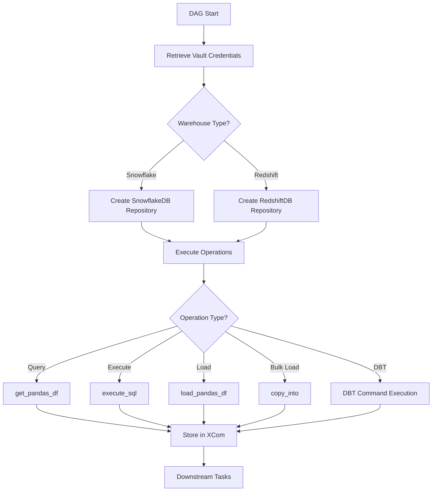
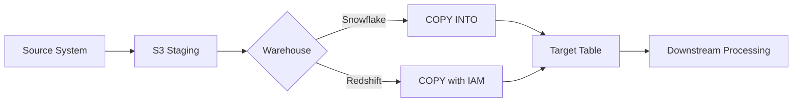

<div style="border-bottom: 1px solid var(--vp-c-divider); padding-bottom: 1rem; margin-bottom: 2rem;">
  <h1 style="margin-bottom: 0.5rem;">Data Warehouse Connections</h1>
  <div style="display: flex; gap: 1rem; flex-wrap: wrap; font-size: 0.9rem; color: var(--vp-c-text-2);">
    <span style="display: flex; align-items: center; gap: 0.25rem;">
      📖 <strong>Guide</strong>
    </span>
    <span style="display: flex; align-items: center; gap: 0.25rem;">
      📝 <strong>899</strong> words
    </span>
    <span style="display: flex; align-items: center; gap: 0.25rem;">
      ⏱️ <strong>5</strong> min read
    </span>
  </div>
</div>

This guide covers the configuration and usage of Snowflake and Redshift data warehouses within the Airflow DAG infrastructure, including credential management, connection patterns, and operational best practices.

## Overview

The repository supports two primary data warehouses:

- **Snowflake**: Primary warehouse for most data operations, used extensively across DBT models and custom scripts
- **Redshift**: Legacy warehouse ("Violin") used for specific workloads and data quality comparisons

Both warehouses are accessed through a database abstraction layer and share common patterns for credential management through HashiCorp Vault.

## Connection Configuration

### Snowflake Configuration

Snowflake connections are configured per environment in `dags/common/utils/config.py`:

```python
"snowflake": {
    "user": "snowflake_user",
    "account": "uva70207.us-east-1",
    "role": "etl_runner",  # production
    "warehouse": "airflow",
    "private_key": "snowsql_private_key",
    "private_key_passphrase": "snowsql_private_key_passphrase",
    "storage_integration": "production_s3",
}
```

**Key Configuration Parameters:**

| Parameter | Purpose | Environment Variation |
|-----------|---------|----------------------|
| `account` | Snowflake account identifier | Same across environments |
| `role` | Execution role | `etl_runner` (prod), `airflow_non_production` (dev/staging) |
| `warehouse` | Compute warehouse | Varies by workload (e.g., `DNA_TEAM`, `airflow_resource_intensive`) |
| `storage_integration` | S3 integration name | Environment-specific (`production_s3`, `staging_s3`, `development_s3`) |

The standardized connection parameters are exposed via:

```python
snowflake_params = {
    "account": snowflake_cred["account"],
    "user": snowflake_cred["user"],
    "role": snowflake_cred["role"],
    "warehouse": snowflake_cred["warehouse"],
}
```

### Redshift Configuration

Redshift connections use password-based authentication:

```python
"redshift_violin": {
    "hostname": "redshift.internal.earnest.com",
    "vault_username": "redshift_violin_user",
    "vault_password": "redshift_violin_password",
    "port": 5439,
    "db_name": "violin",
    "iam_role": "arn:aws:iam::075440130607:role/redshift_s3_rw",
}
```

**Key Configuration Parameters:**

| Parameter | Purpose | Notes |
|-----------|---------|-------|
| `hostname` | Cluster endpoint | Environment-specific |
| `vault_username` / `vault_password` | Vault keys for credentials | Retrieved at runtime |
| `iam_role` | IAM role for S3 operations | Used for COPY/UNLOAD commands |
| `db_name` | Target database | `violin` (prod), `clarinet` (staging), `dev` (development) |

The standardized connection parameters:

```python
redshift_params = {
    "username": redshift_cred["vault_username"],
    "password": redshift_cred["vault_password"],
    "host": redshift_cred["hostname"],
    "port": redshift_cred["port"],
    "database": redshift_cred["db_name"],
    "iam_role": redshift_cred["iam_role"],
}
```

## Credential Management Through Vault

All warehouse credentials are stored in HashiCorp Vault and retrieved at DAG runtime using the `set_envs_from_vault` utility.

### Required Vault Keys

**Snowflake:**
```python
environment_variables = [
    "snowflake_user",
    "snowsql_private_key",
    "snowsql_private_key_passphrase",
]
```

**Redshift:**
```python
environment_variables = [
    "redshift_violin_user",
    "redshift_violin_password",
]
```

### Credential Retrieval Pattern

```python
from common.utils.vault_client import set_envs_from_vault

# Retrieve credentials before DAG definition
set_envs_from_vault(*environment_variables)
```

This pattern ensures credentials are available as environment variables before any database connections are established.

### DBT Credential Handling

DBT operations require additional credential setup through shell scripts:

```python
def get_envs_for_warehouse(warehouse):
    if warehouse == "redshift":
        vault_keys = ("redshift_violin_user", "redshift_violin_password")
    elif warehouse == "snowflake":
        vault_keys = (
            "snowflake_user",
            "snowsql_private_key",
            "snowsql_private_key_passphrase",
            "direct_mail_match_key",
            "monte_carlo_service_accnt_key_id",
            "monte_carlo_service_accnt_secret",
        )
```

The credentials are sourced into the DBT execution environment:

```python
commands = [
    f"source get_envs.sh {' '.join(vault_keys)}",
    "sh create_private_key_file.sh",  # For Snowflake private key
    "export MCD_DEFAULT_API_ID=$MONTE_CARLO_SERVICE_ACCNT_KEY_ID",
    "export MCD_DEFAULT_API_TOKEN=$MONTE_CARLO_SERVICE_ACCNT_SECRET",
    f"{command}",
]
```

## Query Execution Patterns

### Repository Pattern

Both warehouses use a repository abstraction for database operations:

```python
from common.repo import get_repository
from common.db.snowflake import SnowflakeDB
from common.db.redshift import RedshiftDB

# Snowflake repository
get_snowflake_repository_task = PythonOperator(
    task_id="get_repository",
    python_callable=get_repository,
    op_kwargs={
        "repository_type": SnowflakeDB,
        "db_params": snowflake_params,
        "secret_keys": ("snowflake_user"),
    },
)

# Redshift repository
get_redshift_repository_task = PythonOperator(
    task_id="get_redshift_repository",
    python_callable=get_repository,
    op_kwargs={
        "repository_type": RedshiftDB,
        "db_params": redshift_params,
    },
)
```

### Common Operations

**Execute SQL:**
```python
execute_sql_op_kwargs = {
    "sql_statements": sql_statements,
    "query_format": "string",
    "task_ids": "get_repository",
}

execute_sql_task = PythonOperator(
    task_id="execute_sql",
    python_callable=execute_sql,
    op_kwargs=execute_sql_op_kwargs,
    provide_context=True,
)
```

**Query to DataFrame:**
```python
query_op_kwargs = {
    "get_pandas_df_params": {
        "sql": sql_query,
        "query_format": "string",
    },
    "task_ids": "get_repository",
}

query_task = PythonOperator(
    task_id="query_data",
    python_callable=get_pandas_df,
    op_kwargs=query_op_kwargs,
    provide_context=True,
)
```

**Load DataFrame:**
```python
insert_op_kwargs = {
    "load_pandas_df_params": {
        "schema": "data_quality",
        "table_name": "data_quality_metrics",
        "is_append": True,
    },
    "task_ids": {
        "repository": "get_snowflake_repository",
        "df": "query_data",
    },
}

insert_task = PythonOperator(
    task_id="insert_data",
    python_callable=load_pandas_df,
    op_kwargs=insert_op_kwargs,
    provide_context=True,
)
```

### COPY INTO Operations (Snowflake)

Snowflake supports efficient bulk loading from S3:

```python
copy_into_params = {
    "source": "s3://bucket/path/to/files/",
    "target": "RAW.PUBLIC.TABLE_NAME",
    "storage_integration": snowflake_cred["storage_integration"],
    "params": [
        "file_format=(TYPE=PARQUET USE_VECTORIZED_SCANNER=TRUE)",
        "MATCH_BY_COLUMN_NAME = CASE_INSENSITIVE",
        "FORCE = TRUE",
    ],
}

copy_into_op_kwargs = {
    "copy_into_params": copy_into_params,
    "task_ids": "get_repository",
}

copy_into(**copy_into_op_kwargs, **context)
```

## DBT Integration

DBT commands are warehouse-aware and configured through the `dags/common/dbt.py` module.

### Warehouse Selection

```python
def run(models=None, warehouse="redshift", **kwargs):
    target = get_val_env_for_target(warehouse, **kwargs)
    command = DBT_BASE_COMMAND + " --cache-selected-only run"
    command = set_default_settings(command, target, warehouse)
    
    if models:
        command += f" --select {models}"
    
    return get_dbt_command(command, warehouse)
```

### Profile Directory Structure

DBT profiles are organized by warehouse:
- `profiles/redshift/` - Redshift-specific profiles
- `profiles/snowflake/` - Snowflake-specific profiles

The profile is selected automatically:

```python
if warehouse:
    command += f" --profiles-dir profiles/{warehouse}/"
```

### Target Environment Mapping

```python
def get_val_env_for_target(warehouse="redshift", **kwargs):
    target = kwargs.get("target")
    if not target:
        target = (
            "development"
            if os.environ["ENVIRONMENT"] in ("local", "development")
            else "staging"
            if (warehouse == "redshift" and kwargs.get("pre_prod", False))
            else os.environ["ENVIRONMENT"]
        )
    return target
```

**Target Resolution:**

| Environment | Redshift Target | Snowflake Target |
|-------------|----------------|------------------|
| local | development | development |
| development | development | development |
| staging | staging | staging |
| staging (pre_prod=True) | staging | staging |
| production | production | production |

## Warehouse Operations Flow



## Performance Optimization

### Warehouse Sizing (Snowflake)

The repository supports dynamic warehouse selection for resource-intensive operations:

```python
warehouse_map = {
    "normal_warehouse": "airflow",
    "resource_intensive_warehouse": "airflow_resource_intensive",
    "DNA_TEAM": "DNA_TEAM",
}

snowflake_params["warehouse"] = warehouse_map[params["warehouse_compute"]]
```

**Warehouse Selection Guidelines:**

| Warehouse | Use Case | Example Operations |
|-----------|----------|-------------------|
| `airflow` | Standard ETL operations | Regular DBT runs, small queries |
| `airflow_resource_intensive` | Large data processing | Bulk transformations, complex aggregations |
| `DNA_TEAM` | Team-specific workloads | Ad-hoc analysis, development work |

### Query Optimization Features

**Snowflake COPY INTO optimizations:**
- `USE_VECTORIZED_SCANNER=TRUE` - Faster Parquet processing
- `MATCH_BY_COLUMN_NAME = CASE_INSENSITIVE` - Flexible schema matching
- `FORCE = TRUE` - Reload previously loaded files

**DBT optimizations:**
- `--partial-parse` - Faster parsing on subsequent runs
- `--cache-selected-only` - Reduced memory footprint
- Model-specific selection to minimize execution scope

### Metadata Tracking

Snowflake loads can include metadata for lineage:

```python
"INCLUDE_METADATA = (
    earnest_sf_source_file_name=METADATA$FILENAME,
    earnest_sf_source_file_row_number=METADATA$FILE_ROW_NUMBER,
    earnest_sf_record_loaded_at=METADATA$START_SCAN_TIME
)"
```

## Cost Management Considerations

### Compute Cost Control

**Snowflake:**
- Warehouse auto-suspend configured at warehouse level (not visible in DAG code)
- Explicit warehouse selection prevents over-provisioning
- DBT runs use `--cache-selected-only` to reduce compute time

**Redshift:**
- Cluster runs continuously (cost is fixed)
- Query optimization is primary cost control mechanism
- IAM role usage for S3 operations avoids data transfer costs

### Storage Cost Patterns

**S3 Integration:**
- Both warehouses use S3 as staging area for bulk operations
- Redshift uses `iam_role` for COPY/UNLOAD operations
- Snowflake uses `storage_integration` for secure S3 access

**Data Lifecycle:**


### Environment-Specific Cost Considerations

| Environment | Snowflake Role | Typical Warehouse | Cost Profile |
|-------------|---------------|-------------------|--------------|
| production | `etl_runner` | `airflow` | Full production compute |
| staging | `airflow_non_production` | `airflow` | Reduced compute tier |
| development | `airflow_non_production` | `DNA_TEAM` | Shared development resources |

## Cross-Warehouse Operations

The data quality framework demonstrates cross-warehouse query patterns:

```python
target_dw = ["snowflake", "redshift"]

for dw in target_dw:
    run_op_kwargs = {
        "get_pandas_df_params": {
            "sql": generated_sql,
            "query_format": "string",
        },
        "task_ids": f"get_{dw}_repository",
        "dw": dw,
    }
    
    globals()[f"{dw}_run_test_sql"] = PythonOperator(
        task_id=f"{dw}_run_test_sql",
        python_callable=get_pandas_df,
        op_kwargs=run_op_kwargs,
        provide_context=True,
    )
```

This pattern enables:
- Parallel execution of identical queries across warehouses
- Data quality validation by comparing results
- Migration validation when moving workloads between warehouses

## Best Practices

### Connection Management

1. **Always retrieve credentials before DAG definition:**
   ```python
   set_envs_from_vault(*environment_variables)
   # DAG definition follows
   ```

2. **Use repository pattern for all database operations:**
   - Ensures consistent connection handling
   - Enables connection pooling and retry logic
   - Provides abstraction for testing

3. **Specify database explicitly when needed:**
   ```python
   snowflake_params["database"] = "PRODUCTION"
   ```

### Credential Security

1. **Never hardcode credentials** - all credentials must come from Vault
2. **Use appropriate Vault key naming conventions:**
   - Snowflake: `snowflake_user`, `snowsql_private_key`, `snowsql_private_key_passphrase`
   - Redshift: `redshift_violin_user`, `redshift_violin_password`
3. **Include XCom encryption secret** when using XCom for sensitive data:
   ```python
   environment_variables.append("xcom_encrytion_secret")
   ```

### Warehouse Selection

1. **Default to Snowflake for new workloads** - it's the primary warehouse
2. **Use Redshift only when:**
   - Legacy dependencies require it
   - Specific data resides only in Redshift
   - Cross-warehouse validation is needed

3. **Choose appropriate compute resources:**
   - Start with standard warehouse
   - Scale up only when performance issues are observed
   - Document resource-intensive operations

### Error Handling

1. **Set appropriate retries for transient failures:**
   ```python
   retries=3,
   retry_delay=timedelta(minutes=3),
   ```

2. **Use `provide_context=True` for operations needing task context**

3. **Validate prerequisites before expensive operations:**
   - Check table existence
   - Validate column schemas
   - Verify S3 file availability

## Related Documentation

- [Database Abstraction Layer](./database-abstraction.md) - Details on repository pattern and database interfaces
- [DBT Integration](./dbt-integration.md) - Comprehensive DBT usage patterns
- [Configuration Management](./configuration-management.md) - Environment-specific configuration details
- [S3 Storage Patterns](./s3-storage.md) - S3 integration for bulk operations