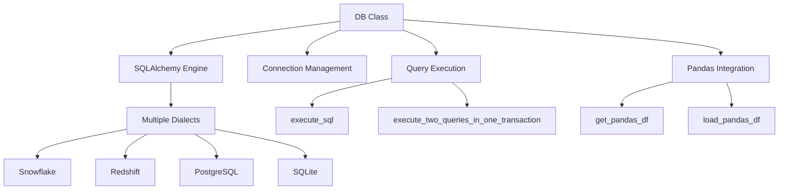
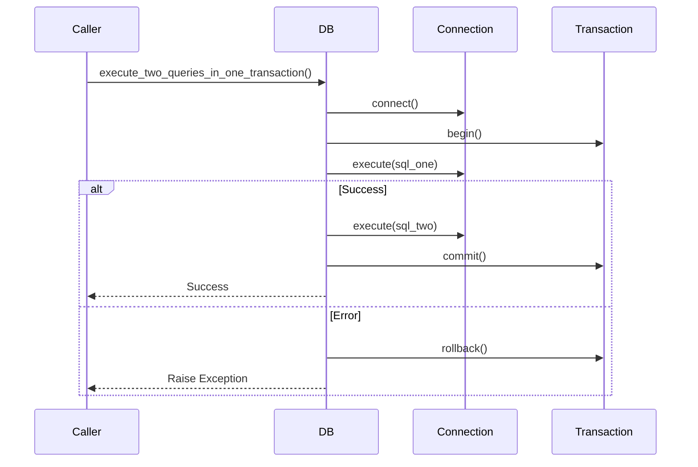
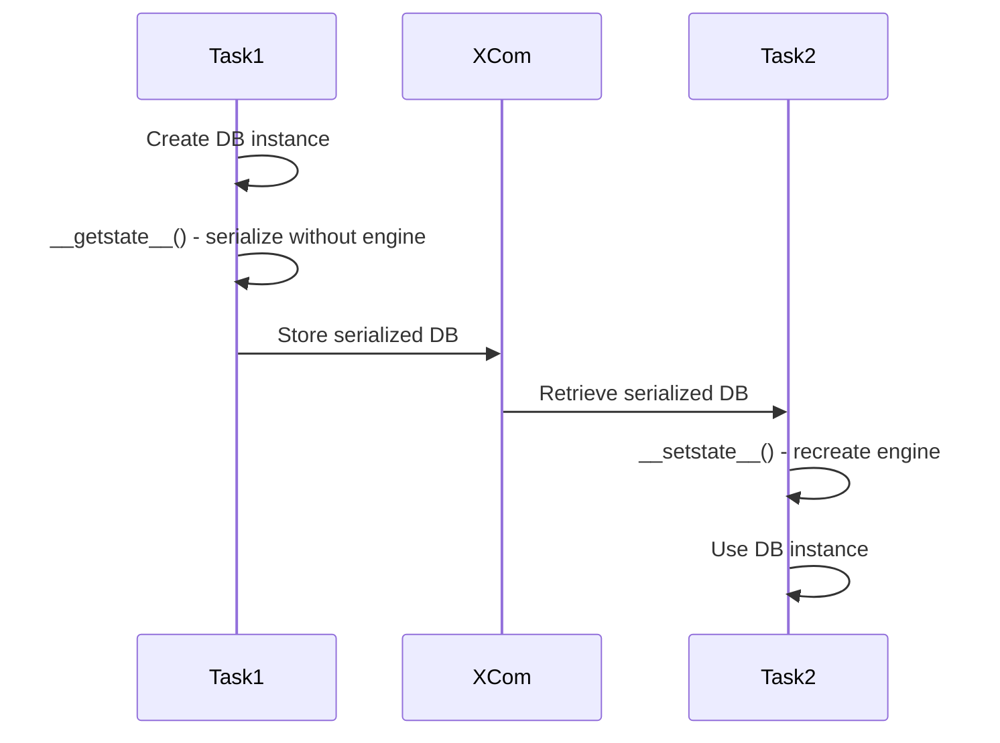

<div style="border-bottom: 1px solid var(--vp-c-divider); padding-bottom: 1rem; margin-bottom: 2rem;">
  <h1 style="margin-bottom: 0.5rem;">Database Abstraction Layer</h1>
  <div style="display: flex; gap: 1rem; flex-wrap: wrap; font-size: 0.9rem; color: var(--vp-c-text-2);">
    <span style="display: flex; align-items: center; gap: 0.25rem;">
      📚 <strong>Reference</strong>
    </span>
    <span style="display: flex; align-items: center; gap: 0.25rem;">
      📝 <strong>781</strong> words
    </span>
    <span style="display: flex; align-items: center; gap: 0.25rem;">
      ⏱️ <strong>4</strong> min read
    </span>
  </div>
</div>

The `db.py` module in `dags/common/db/` provides a unified database abstraction layer for executing SQL queries, managing connections, and integrating with pandas DataFrames across different database backends.

## Overview

The `DB` class wraps SQLAlchemy to provide a consistent interface for database operations throughout the Airflow DAGs. It supports multiple database dialects including Snowflake, Redshift, PostgreSQL, and SQLite, with built-in connection pooling, SSL configuration, and serialization support for Airflow's XCom mechanism.



## Initialization

The `DB` class is initialized with connection parameters that are passed to SQLAlchemy's URL builder:

| Parameter | Type | Description |
|-----------|------|-------------|
| `dialect` | `str` | Database dialect (e.g., `postgresql`, `snowflake`, `redshift`) |
| `username` | `str` | Database username (optional) |
| `password` | `str` | Database password (optional) |
| `host` | `str` | Database host (optional) |
| `port` | `int` | Database port (optional) |
| `database` | `str` | Database name (optional) |
| `query` | `dict` | Additional query parameters for the connection string (optional) |
| `ssl_mode` | `str` | SSL mode for PostgreSQL connections (optional) |
| `ssl` | `dict` | SSL certificate paths (`sslrootcert`, `sslcert`, `sslkey`) (optional) |
| `**engine_kwargs` | `Any` | Additional arguments passed to SQLAlchemy's `create_engine` |

### Example Initialization

```python
from common.db.db import DB

# Basic SQLite connection
db = DB(dialect="sqlite", database="mydb.db")

# PostgreSQL with SSL
db = DB(
    dialect="postgresql",
    username="user",
    password="pass",
    host="localhost",
    port=5432,
    database="mydb",
    ssl_mode="require",
    ssl={
        "sslrootcert": "/path/to/ca.crt",
        "sslcert": "/path/to/client.crt",
        "sslkey": "/path/to/client.key"
    }
)
```

## SQL Execution Methods

### execute_sql

Executes a SQL statement with optional autocommit. Supports both file paths and string queries.

```python
def execute_sql(
    self, 
    sql: str, 
    autocommit: bool = False, 
    query_format: str = "path"
)
```

**Parameters:**
- `sql`: SQL statement or path to SQL file
- `autocommit`: Whether to autocommit the transaction (default: `False`)
- `query_format`: Either `"path"` or `"string"` (default: `"path"`)

**Example:**

```python
# Execute from string
db.execute_sql(
    "INSERT INTO users VALUES (1, 'John')", 
    autocommit=True, 
    query_format="string"
)

# Execute from file
db.execute_sql(
    "/path/to/query.sql", 
    query_format="path"
)
```

### execute_two_queries_in_one_transaction

Executes two SQL statements within a single transaction, with automatic rollback on error.

```python
def execute_two_queries_in_one_transaction(
    self, 
    sql_one: str, 
    sql_two: str, 
    query_format: str = "path"
)
```

**Transaction Flow:**



**Example:**

```python
db.execute_two_queries_in_one_transaction(
    "DELETE FROM staging_table",
    "INSERT INTO staging_table SELECT * FROM source_table",
    query_format="string"
)
```

## Pandas Integration

### get_pandas_df

Executes a SQL query and returns results as a pandas DataFrame. Supports parameterized queries and chunked reading for large datasets.

```python
def get_pandas_df(
    self,
    sql: str,
    parameters: Dict[str, str] = None,
    query_format: str = "path",
    chunksize: int = None,
    connection: Connection = None,
) -> Union[DataFrame, Iterator[DataFrame]]
```

**Parameters:**
- `sql`: SQL query or path to SQL file
- `parameters`: Dictionary of parameters for query rendering
- `query_format`: Either `"path"` or `"string"`
- `chunksize`: If specified, returns an iterator yielding DataFrames of this size
- `connection`: Optional pre-existing connection (caller must close)

**Returns:**
- `DataFrame` if `chunksize` is `None`
- `Iterator[DataFrame]` if `chunksize` is specified

**Example:**

```python
# Simple query
df = db.get_pandas_df("SELECT * FROM users", query_format="string")

# Parameterized query
df = db.get_pandas_df(
    "SELECT * FROM users WHERE status = %(status)s",
    parameters={"status": "active"},
    query_format="string"
)

# Chunked reading for large datasets
for chunk in db.get_pandas_df(
    "SELECT * FROM large_table",
    query_format="string",
    chunksize=10000
):
    process_chunk(chunk)
```

### load_pandas_df

Loads a pandas DataFrame into a database table with support for schema specification, data type casting, and custom insertion methods.

```python
def load_pandas_df(
    self,
    df: DataFrame,
    schema: str,
    table_name: str,
    is_append: bool = True,
    dtypes: Dict = None,
    method: Union[Callable, str] = None,
    chunksize: int = None,
    connection: Connection = None,
    **kwargs,
) -> None
```

**Parameters:**
- `df`: Pandas DataFrame to load
- `schema`: Target schema name
- `table_name`: Target table name
- `is_append`: If `True`, append to table; if `False`, replace table (default: `True`)
- `dtypes`: Dictionary mapping column names to pandas dtypes for casting
- `method`: SQL insertion method (`None`, `'multi'`, or callable)
- `chunksize`: Number of rows per insert batch
- `connection`: Optional pre-existing connection
- `**kwargs`: Additional options (e.g., `is_upper_columns` to uppercase column names)

**Example:**

```python
import pandas as pd

df = pd.DataFrame({
    "id": [1, 2, 3],
    "name": ["Alice", "Bob", "Charlie"]
})

# Append to existing table
db.load_pandas_df(df, schema="public", table_name="users")

# Replace table with type casting
db.load_pandas_df(
    df,
    schema="public",
    table_name="users",
    is_append=False,
    dtypes={"id": "int64"}
)

# Uppercase columns (useful for Snowflake)
db.load_pandas_df(
    df,
    schema="public",
    table_name="users",
    is_upper_columns=True
)
```

## Connection Management

### SSL Configuration

For PostgreSQL connections, the `DB` class automatically configures SSL when `ssl_mode` or `ssl` parameters are provided:

```python
db = DB(
    dialect="postgresql",
    host="db.example.com",
    ssl_mode="require",
    ssl={
        "sslrootcert": "/certs/ca.crt",
        "sslcert": "/certs/client.crt",
        "sslkey": "/certs/client.key"
    }
)
```

The class sets `pool_pre_ping=True` for PostgreSQL SSL connections to ensure connection health before use.

### Connection Pooling

The underlying SQLAlchemy engine manages connection pooling automatically. Custom engine arguments can be passed during initialization:

```python
db = DB(
    dialect="postgresql",
    host="localhost",
    pool_size=10,
    max_overflow=20,
    pool_pre_ping=True
)
```

### Closing Connections

Explicitly dispose of the connection pool when done:

```python
db.close()
```

## Serialization Support

The `DB` class implements custom serialization (`__getstate__` and `__setstate__`) to support Airflow's XCom mechanism, which requires picklable objects. The engine is excluded from serialization and recreated upon deserialization.



This allows `DB` instances to be passed between Airflow tasks via XCom.

## Query Format Enum

The `QueryFormat` enum defines how SQL queries are provided:

```python
class QueryFormat(Enum):
    PATH = "path"      # SQL is a file path
    STRING = "string"  # SQL is a string literal
```

When `query_format="path"`, the module uses `common.utils.read_file()` to load the SQL content from the specified file path.

## Helper Methods

### format_params

Static method to format parameter lists for SQL statements:

```python
params = ["FORMAT CSV", "IGNOREHEADER 1"]
formatted = DB.format_params(params)
# Returns: "FORMAT CSV\nIGNOREHEADER 1"
```

### _cast_to_dtypes

Internal method to cast DataFrame columns to specified data types:

```python
df = DB._cast_to_dtypes(df, {"id": "float", "count": "int64"})
```

### _upper_columns

Internal method to uppercase DataFrame column names:

```python
columns = DB._upper_columns(["id", "name", "email"])
# Returns: ["ID", "NAME", "EMAIL"]
```

## Database Backend Support

The abstraction layer supports multiple database backends through SQLAlchemy dialects:

| Backend | Dialect String | Common Use Cases |
|---------|---------------|------------------|
| Snowflake | `snowflake` | Primary data warehouse |
| Redshift | `redshift+psycopg2` | AWS data warehouse |
| PostgreSQL | `postgresql` | Operational databases |
| SQLite | `sqlite` | Testing and local development |

> **Note:** The actual dialect strings and connection parameters depend on the SQLAlchemy drivers installed in the environment. Snowflake and Redshift require their respective SQLAlchemy connectors.

## Integration with Other Components

The `DB` class is used throughout the codebase for database operations:

- **Extract DAGs**: Reading data from source databases
- **Transform DAGs**: Loading transformed data into warehouses
- **Maintenance DAGs**: Running administrative queries
- **Common utilities**: Shared database operations

For configuration management and credential handling, see [Configuration Management](./configuration-management.md) and [Data Warehouse Connections](./data-warehouses.md).

## Related Components

### Impala JDBC Connection

For Impala connections, the codebase uses a separate `Impala` class in `dags/common/jdbc/impala.py` that uses JayDeBeApi instead of SQLAlchemy:

```python
from common.jdbc.impala import Impala

impala = Impala(
    host="impala.example.com",
    port=21050,
    extra_params={"AuthMech": "3"},
    jar_path="/path/to/impala-jdbc.jar"
)

df = impala.get_pandas_df("SELECT * FROM table")
```

This separate implementation is necessary because Impala requires JDBC connectivity not supported by standard SQLAlchemy dialects.

## Testing

The module includes comprehensive unit tests in `tests/unit/dags/common/db/test_db.py` covering:

- Basic initialization and engine creation
- SQL execution with autocommit
- Pandas DataFrame reading and writing
- Data type casting
- Column name transformation
- Serialization/deserialization for XCom
- Transaction management

Tests use SQLite as the test database backend for simplicity and speed.