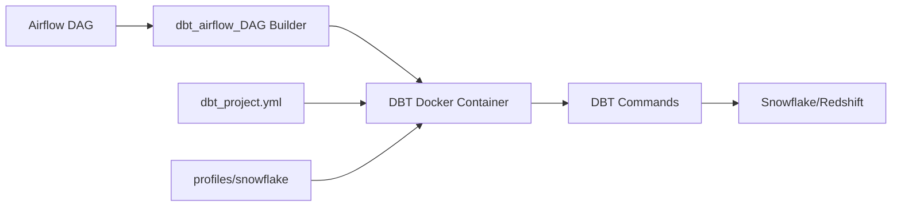
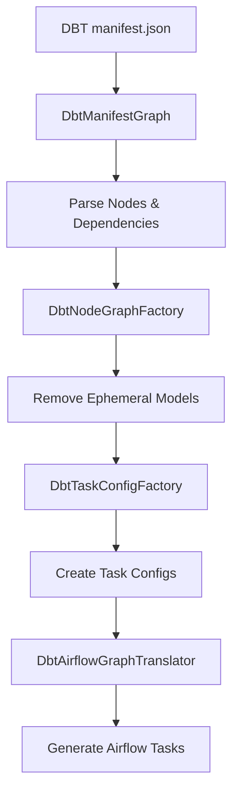

<div style="border-bottom: 1px solid var(--vp-c-divider); padding-bottom: 1rem; margin-bottom: 2rem;">
  <h1 style="margin-bottom: 0.5rem;">DBT Integration</h1>
  <div style="display: flex; gap: 1rem; flex-wrap: wrap; font-size: 0.9rem; color: var(--vp-c-text-2);">
    <span style="display: flex; align-items: center; gap: 0.25rem;">
      📖 <strong>Guide</strong>
    </span>
    <span style="display: flex; align-items: center; gap: 0.25rem;">
      📝 <strong>1,108</strong> words
    </span>
    <span style="display: flex; align-items: center; gap: 0.25rem;">
      ⏱️ <strong>6</strong> min read
    </span>
  </div>
</div>

This guide documents how DBT (Data Build Tool) is integrated with Airflow for data transformations in the data-airflow-dags repository. DBT models are organized by team, executed through Airflow tasks, and support both SQL and Python transformations.

## Overview

DBT is integrated into Airflow DAGs to orchestrate data transformations in Snowflake and Redshift. The integration allows DBT commands (run, test, snapshot, debug, docs) to be executed as Airflow tasks, with models organized by team ownership and scheduled through various DAG patterns.



## DBT Project Configuration

### dbt_project.yml Structure

The project is named `earnest_etl` and requires DBT version `>=1.8.9`. Key configuration elements:

```yaml
name: 'earnest_etl'
config-version: 2
version: '0.0.1'
require-dbt-version: ">=1.8.9"
profile: 'data_warehouse'
```

**Directory Structure:**
- `model-paths`: ["models"]
- `analysis-paths`: ["analysis"]
- `test-paths`: ["tests"]
- `seed-paths`: ["data"]
- `macro-paths`: ["macros"]
- `snapshot-paths`: ["snapshots"]
- `docs-paths`: ["docs"]

### Model Organization by Team

Models are organized under two primary team namespaces:

#### data_team Models

Located under `models.earnest_etl.data_team`, this is the largest collection of models covering various business domains:

| Domain | Materialization | Tags | Schema Override |
|--------|----------------|------|-----------------|
| reporting_models | table | hourly | - |
| reporting_models.marts | table | hourly | - |
| reporting_models.marts.monolith | table | nightly | intermediate (prod) |
| slo_service | table | twice_daily | - |
| boarding_service | varies | nightly (preparation) | staging (staging dir) |
| lending_artifacts_service | varies | hourly (preparation) | staging/intermediate |
| lending_apply_service | varies | hourly (preparation) | staging/intermediate |
| oab_reports | table | - | - |
| fact_service | table | nightly | - |
| peach_servicing | table | twice_daily (intermediate) | staging/intermediate |

> **Note:** Schema overrides use Jinja templating to route models to different schemas based on the target environment. Development models typically use the user's role/schema, while production models use designated schemas like `staging`, `intermediate`, or `public`.

#### data_platform_team Models

Located under `models.earnest_etl.data_platform_team`, focused on data ingestion and monitoring:

**Ingestion Models:**
- Database: `raw` (production) or `raw_test` (non-production)
- Materialization: view (default) or incremental (specific schemas)
- Pre-hooks: Various table creation macros based on schema evolution needs

Example ingestion configurations:
::: v-pre
```yaml
slo_service__public:
    pre-hook: "{{ create_ingestion_table_w_schema_evolution(this) }}"
    tags: ["snowflake_pattern"]

edw__navi_only:
    pre-hook: ["{{ create_fni_edw_ingestion_table(this) }}", "{{ full_refresh_stage_tables(this) }}"]
    materialized: incremental
    incremental_strategy: delete+insert
    transient: false
```
:::


**Monitor Models:**
- Snowpipe status monitoring
- Looker data warehouse error monitoring
- Navient Workday monitoring

### Profiles for Snowflake Connections

DBT profiles are stored in `profiles/snowflake/` and configured via environment variables:

**Required Environment Variables:**
```bash
export SNOWFLAKE_USER='{earnest_email_prefix}'
export SNOWFLAKE_DEVELOPMENT_SCHEMA='{first_initial}{last_name}'
export DBT_PROFILES_DIR='profiles/snowflake/'
```

**Authentication Methods:**
1. **Local Development**: Uses Okta authentication with username
2. **Production/Staging**: Uses private key authentication from Vault

The `serve_docs.sh` script demonstrates the production authentication pattern:
```bash
source get_envs.sh snowflake_user snowsql_private_key snowsql_private_key_passphrase
./create_private_key_file.sh
```

**Target Environments:**
- `development`: For local development
- `staging`: Pre-production environment
- `production`: Production environment

## Model Organization Patterns

### Folder Hierarchy

Models follow a structured folder hierarchy within team directories:

```
models/
├── data_team/
│   ├── {service_name}/
│   │   ├── src_{service_name}.yml          # Source definitions
│   │   ├── staging/                        # Staging models
│   │   │   └── stg_{model}.sql
│   │   ├── preparation/                    # Preparation layer
│   │   ├── intermediate/                   # Intermediate models
│   │   └── {model}.sql                     # Final models
│   └── reporting_models/
│       ├── marts/                          # Business-facing marts
│       └── unions/                         # Union models
└── data_platform_team/
    └── ingestion/
        └── {source}__{schema}/             # Ingestion by source
```

### Naming Conventions

From the README.md:

1. **Folders/Models**: Lowercase with underscores (snake_case)
2. **Prefixes**:
   - `src_`: Source definition files
   - `stg_`: Staging models
   - `tmp_`: Ephemeral temporary models
   - `int_`: Intermediate models
   - `prep_`: Preparation models
3. **No numbers** except as suffixes when absolutely necessary

### Tagging Strategy

Tags control scheduling and behavior:

| Tag | Purpose | Schedule |
|-----|---------|----------|
| hourly | Hourly fan-out execution | Every hour |
| twice_daily | Twice daily execution | 2x per day |
| nightly | Nightly execution | Once per night |
| intermediate | Physical intermediate models | Varies |
| snowflake_pattern | Ingestion pattern indicator | Varies |

Tags are applied in `dbt_project.yml` at the folder level or in individual model config blocks:

::: v-pre
```sql
{{ config(
    materialized = 'table',
    tags = ['hourly'],
) }}
```
:::


## Airflow Integration Points

### DAG Builder Functions

The primary integration uses the `dbt_airflow_DAG` function from `common.dag_builder`:

```python
from common.dag_builder import dbt_airflow_DAG

dbt_settings = {
    "warehouse": "snowflake",
    "models": "data_team.boarding_service+",
}

pre_prod, prod = dbt_airflow_DAG(
    dag_id="dbt_inside_docker",
    dbt_settings=dbt_settings,
    description=description,
    schedule_interval=None,
    tags=["example"],
)
```

**dbt_settings Parameters:**
- `warehouse`: Target warehouse (`snowflake` or `redshift`)
- `models`: DBT model selector (supports DBT selection syntax)

### DBT Task Types

Multiple task creation functions are available:

1. **get_dbt_tasks**: Creates a sequence of DBT operation tasks
2. **dbt_docs_task**: Generates DBT documentation
3. **dbt_airflow_DAG**: Creates pre-production and production DAG pairs

Example from `oab_snowflake_sftp_dag_daily.py`:
```python
dbt_settings_oab_pipeline_report = {
    "warehouse": "snowflake",
    "models": "data_team.oab_reports.oab_pipeline_report",
}

all(
    get_dbt_tasks(
        dbt_settings=dbt_settings_oab_pipeline_report,
        task_id_suffix="_oab_pipeline_report",
    )
)
```

### DBT Operations

The integration supports multiple DBT commands as Airflow operations:

- `debug`: Validates DBT configuration and connections
- `run`: Executes model transformations
- `test`: Runs data quality tests
- `snapshot`: Creates Type 2 slowly changing dimension snapshots
- `docs generate`: Generates documentation artifacts

Operations can be chained together in task groups:
```python
operations=("run", "test")  # Run model then test it
```

## Running DBT Models

### Through Airflow DAGs

**Standard Pattern:**
```python
dbt_settings = {
    "warehouse": "snowflake",
    "models": "data_platform_team.ingestion",
}

pre_prod_dag, prod_dag = dbt_airflow_DAG(
    dag_id="dbt_snowflake_ingestion",
    dbt_settings=dbt_settings,
    schedule_interval=None,
    tags=["ingestion"],
)
```

This creates two DAGs:
- `dbt_snowflake_ingestion_pre_prod`: For staging environment
- `dbt_snowflake_ingestion_prod`: For production environment

### DBT Docs Generation

The `dbt-docs-generator` DAG runs twice daily to generate documentation:

```python
dbt_settings = {
    "warehouse": "snowflake",
}

with airflow_DAG(dag_id="dbt-docs-generator", **dbt_args) as dag:
    start = EmptyOperator(task_id="start", dag=dag)
    generate_docs = dbt_docs_task(dbt_settings=dbt_settings)
    end = EmptyOperator(task_id="end", dag=dag)
    start >> generate_docs >> end
```

Schedule: `"0 6,14 * * *"` (6 AM and 2 PM daily)

### Local Development Execution

From the DBT README:

```bash
# Set environment variables
export SNOWFLAKE_USER='chris.evans'
export SNOWFLAKE_DEVELOPMENT_SCHEMA='cevans'
export DBT_PROFILES_DIR='profiles/snowflake/'

# Install dependencies
dbt deps

# Run specific models
dbt run --target development --profiles-dir ./profiles/snowflake -m model_name

# Run with full refresh
dbt run --target development --profiles-dir ./profiles/snowflake -m model_name --full-refresh
```

## Fan-Out DAG Pattern

Fan-outs create one Airflow task per DBT model for granular control and visibility.

### How Fan-Outs Work



**Key Components from `dbt_fan_outs.py`:**

1. **DbtManifestGraph**: Parses `manifest.json` and builds a directed graph
2. **DbtNodeGraphFactory**: Creates subgraphs and removes ephemeral models while preserving paths
3. **DbtTaskConfigFactory**: Generates task configurations with operations and settings
4. **DbtAirflowGraphTranslator**: Translates DBT graph to Airflow task dependencies

### Adding Models to Fan-Outs

Models are selected for fan-outs via tags in `selectors.yml`:

::: v-pre
```sql
{{ config(
    materialized = 'table',
    cluster_by = 'ticket_id',
    tags = ['hourly'],
) }}
```
:::


To refresh fan-out artifacts after changes:
```bash
bin/generate_artifacts.sh
```

This script generates list artifacts for each selector defined in `dbt/selectors.yml`.

## Python and SQL Model Support

### SQL Models

Standard SQL models are the primary transformation type. Example structure:

::: v-pre
```sql
-- models/data_team/service_name/model_name.sql
{{ config(
    materialized = 'table',
    tags = ['hourly'],
) }}

SELECT
    field1,
    field2,
    {{ macro_name() }} as computed_field
FROM {{ ref('upstream_model') }}
WHERE condition
```
:::


### Python Models

While not explicitly shown in the provided code, the `dbt_project.yml` configuration supports Python models through DBT's standard Python model capabilities (DBT version 1.8.9+).

### Incremental Models

Incremental models are configured with specific strategies:

```yaml
edw__navi_only:
    materialized: incremental
    incremental_strategy: delete+insert
```

From the README best practices:
- Use 1-day lookback for late-arriving data
- Require evidence of initial and incremental runs in PRs
- May require full refresh when modified

## Debugging Transformation Issues

### Local Debugging

**Run DBT Debug:**
```bash
cd dbt
export SNOWFLAKE_USER=sortigoza
export SNOWFLAKE_DEVELOPMENT_SCHEMA=sortigoza
dbt debug --profiles-dir profiles/snowflake
```

**View Local Documentation:**
```bash
dbt docs serve --profiles-dir profiles/snowflake
# Access at http://localhost:8080/
```

### Airflow Task Debugging

The fan-out pattern includes debug tasks:

```python
def build_debug_task(dbt_settings) -> None:
    return [
        *get_dbt_tasks(
            dbt_settings=dbt_settings,
            node_selector={
                "karpenter.sh/nodepool": "data-airflow",
                "karpenter.sh/capacity-type": "on-demand",
            },
            operations=("debug",),
        )
    ]
```

This validates DBT configuration and warehouse connectivity before running models.

### Common Debugging Patterns

**Check Model Execution:**
- Review Airflow task logs for DBT output
- Verify model materialization in target schema
- Check `executed_at` timestamp field (present on production models)

**Test Dependencies:**
Models with tests have both run and test operations:
```python
operations = (
    (command, "test")
    if model in models_with_test_dependencies
    else (command,)
)
```

**Full Refresh:**
For incremental models or schema changes:
```bash
dbt run -m model_name --full-refresh
```

### Artifact Addition Script

The `add_artifact_script.py` demonstrates automated model updates for lending artifacts:

1. Interactive prompt for artifact details
2. Automated insertion into multiple model files
3. DBTClone to sync production data
4. Automated test run of affected models

```python
subprocess.run([
    "dbt", "run",
    "--target", "development",
    "--profiles-dir", "./profiles/snowflake",
    "-m", *model_names,
    "--full-refresh",
])
```

## Integration with Other Systems

### Snowflake Integration

DBT models primarily target Snowflake with:
- Private key authentication in production
- Role-based schema routing
- Pre-hooks for table creation and schema evolution
- Incremental strategies optimized for Snowflake

### Redshift Support

The integration also supports Redshift as a warehouse target:
```python
dbt_settings = {
    "warehouse": "redshift",
    "models": "data_team.boarding_service+",
}
```

### Monitoring Integration

The `dbt_snowflake_monitoring` package is enabled:
::: v-pre
```yaml
dbt_snowflake_monitoring:
    +enabled: true
    +tags:
      - "nightly"
    schema: "{{ 'sf_usage_monitor' if (target.name == 'production') else target.schema }}"
```
:::


This provides query comment tracking and usage monitoring.

## Related Documentation

- [Transform DAGs](./transform-dags.md) - Overview of transformation DAG patterns
- [DBT Models Reference](./dbt-models-reference.md) - Detailed model documentation
- [DAG Builder Framework](./dag-builder-framework.md) - Core DAG construction utilities
- [Data Warehouse Connections](./data-warehouses.md) - Warehouse configuration details
- [Adding DBT Models](./adding-dbt-models.md) - Guide for creating new models