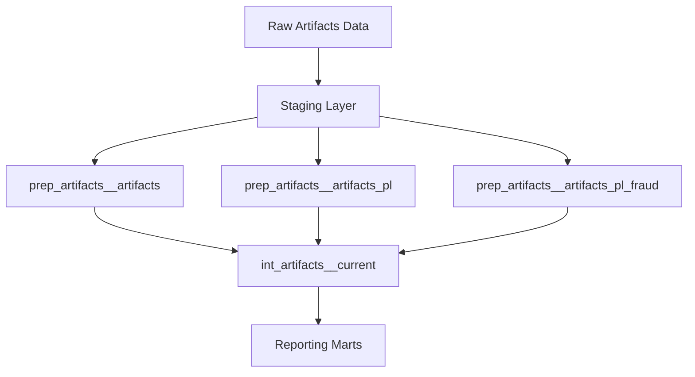

  <h1 style="margin-bottom: 0.5rem;">DBT Models Reference</h1>
  

    
      📚 <strong>Reference</strong>
    
    
      📝 <strong>2,037</strong> words
    
    
      ⏱️ <strong>11</strong> min read
    
  

This page provides a comprehensive reference of the DBT models in the Earnest data transformation pipeline, organized by team ownership and functional domain. The models follow a tiered architecture pattern and are materialized across multiple schemas based on their purpose and maturity level.

## Model Organization Structure

The DBT project is organized under two primary team namespaces:

- **`data_team`**: Business-facing models for analytics, reporting, and operational use cases
- **`data_platform_team`**: Infrastructure models for data ingestion and monitoring

Models are further organized into domain-specific folders that align with microservices, business functions, or data sources.

## Tiered Model Architecture

The project follows a layered transformation pattern with distinct model prefixes indicating their tier:

| Tier | Prefix | Purpose | Materialization | Schema |
|------|--------|---------|-----------------|--------|
| **Source** | `src_` | Source definitions pointing to raw tables | N/A (metadata) | N/A |
| **Staging** | `stg_` | Light transformations, type casting, renaming | View | `staging` |
| **Temporary** | `tmp_` | Ephemeral intermediate calculations | Ephemeral | N/A |
| **Preparation** | `prep_` | Business logic preparation layer | Table/View | `public` or `staging` |
| **Intermediate** | `int_` | Reusable intermediate models | Table | `intermediate` |
| **Marts** | `dim_`, `fct_` | Dimensional models and fact tables | Table | `public` |
| **Activation** | `act_` | Final reporting models for BI tools | Table | `public` |

> **Note**: Models tagged with `intermediate` are materialized to the `intermediate` schema rather than `public`, allowing for physical persistence of costly transformations without exposing them as production tables.

## Scheduling and Tags

Models are scheduled using tags that control their execution frequency:

- **`hourly`**: Run every hour for near-real-time reporting
- **`twice_daily`**: Run twice per day for moderate freshness requirements
- **`nightly`**: Run once per day during off-peak hours
- **`disable`**: Excluded from automated runs

These tags are referenced in the DAG builder framework to generate fan-out execution patterns.

## Data Team Models

### Reporting Models

The reporting models domain contains the core analytical models that power Looker dashboards and business intelligence.

#### Activation Layer (`reporting_models/activation`)

**Purpose**: Final reporting tables optimized for BI tool consumption

**Key Models**:
- `act_applications` - Application-level metrics and attributes
- `act_rate_checks` - Rate check activity and outcomes

**Materialization**: Table  
**Schedule**: Hourly  
**Schema**: `public`

#### Marts Layer (`reporting_models/marts`)

**Purpose**: Dimensional models following star schema patterns

**Key Models**:
- `dim_application_decisioning_attributes` - SLR application decisioning data from Monolith and Lending Platform
- `dim_application_decisioning_attributes_pl` - Personal loan application decisioning attributes
- `dim_application_decisioning_attributes_pl_fraud` - Fraud-specific decisioning attributes for personal loans
- `dim_rate_check_decisioning_attributes` - SLR rate check decisioning data
- `dim_rate_check_decisioning_attributes_pl` - Personal loan rate check decisioning data
- `fct_applications` - Fact table consolidating application data across systems (Lending Platform v2, Monolith, LDS, LAPS)

**Materialization**: Table  
**Schedule**: Hourly  
**Schema**: `public`

**Special Configuration**: The `monolith` subfolder within marts uses the `intermediate` schema and runs nightly.

#### Unions Layer (`reporting_models/unions`)

**Purpose**: Combine data from multiple sources into unified views

**Key Models**:
- `artifacts_union` - Unified view of lending artifacts across SLR and PL products

**Materialization**: Table  
**Schedule**: Hourly

### Lending Artifacts Service

**Purpose**: Process and expose lending decision artifacts (model outputs, scores, attributes) from the artifacts processing service

**Model Structure**:

**Key Models**:
- `prep_artifacts__artifacts` - SLR artifacts preparation with type casting and aliasing
- `prep_artifacts__artifacts_pl` - Personal loan artifacts preparation
- `prep_artifacts__artifacts_pl_fraud` - Fraud detection artifacts for personal loans
- `int_artifacts__current` - Current state of all artifacts (intermediate layer)

**Materialization**: Table  
**Schedule**: Hourly (preparation layer)  
**Schema**: `staging` (staging), `intermediate` (intermediate), `public` (marts)

**Artifact Addition Automation**: The repository includes a script (`scripts/add_artifact_script.py`) that automates the process of adding new artifacts across multiple models and macros. The script:
1. Prompts for artifact metadata (product, name, datatype, journey)
2. Inserts artifact references into preparation models using landmark comments
3. Updates macro definitions for artifact name lists
4. Runs affected models to validate changes

**Supported Products**: SLR (student loan refinance), PL (personal loan), Fraud

**Supported Journeys**: Softpull (rate check), Hardpull (application), Both

### Lending Apply Service

**Purpose**: Transform data from the lending application service

**Model Structure**:
- Staging layer in `staging` schema
- Preparation layer with hourly refresh
- Intermediate layer in `intermediate` schema

**Schedule**: Hourly (preparation)

### Lending Checkout Service

**Purpose**: Process checkout flow data

**Model Structure**:
- Staging layer in `staging` schema
- Preparation layer with hourly refresh

**Schedule**: Hourly (preparation)

### Lending Decisioning Service

**Purpose**: Transform decisioning service data

**Model Structure**:
- Staging layer in `staging` schema
- Preparation layer with hourly refresh

**Schedule**: Hourly (preparation)

### Lending Financial Service

**Purpose**: Process financial data from the lending financial service

**Model Structure**:
- Staging layer in `staging` schema

### SLO Service

**Purpose**: Student Loan Origination service data transformations

**Materialization**: Table  
**Schedule**: Twice daily

### Monolith

**Purpose**: Legacy monolith application data

**Materialization**: Table  
**Schedule**: Twice daily

### Finance

**Purpose**: Financial reporting and accounting models

**Materialization**: Table

### Zendesk

**Purpose**: Customer support ticket and interaction data

**Key Models**:
- `zendesk_deepdive_breakdown` - Detailed breakdown of support tickets by category, channel, product, and resolution metrics

**Materialization**: Table  
**Schedule**: Twice daily

**Key Metrics**: Replies, response times (calendar minutes), resolution times, CSAT scores

### Boarding Service

**Purpose**: Customer onboarding process data

**Model Structure**:
- Staging layer in `staging` schema
- Preparation layer with nightly refresh

**Schedule**: Nightly (preparation)

### Partner Service

**Purpose**: Partner integration and referral data

**Materialization**: Table  
**Schedule**: Twice daily

### Accredited School Service

**Purpose**: School accreditation and eligibility data

**Materialization**: Table  
**Schedule**: Twice daily

### Application Info

**Purpose**: Application information service data

**Materialization**: Table  
**Schedule**: Twice daily

### Additional Information

**Purpose**: Supplemental application information

**Materialization**: Table  
**Schedule**: Twice daily

### Adverse Action

**Purpose**: Adverse action notice tracking and compliance

**Materialization**: Table  
**Schedule**: Twice daily

### Scoring

**Purpose**: Credit scoring and risk assessment models

**Materialization**: Table  
**Schedule**: Twice daily

### Pricing Service V2

**Purpose**: Loan pricing and rate calculation data

**Materialization**: Table  
**Schedule**: Twice daily

### Loan Service

**Purpose**: Loan lifecycle and servicing data

**Model Structure**:
- Staging layer in `staging` schema
- Preparation layer with nightly refresh

**Schedule**: Nightly (preparation)

### NRI Dashboard

**Purpose**: Net Revenue Interest dashboard models

**Materialization**: Table  
**Schedule**: Nightly

### SST (Student Success Team)

**Purpose**: Student success and retention metrics

**Materialization**: Table  
**Schedule**: Nightly

### Credit Report Reviews

**Purpose**: Credit report analysis and review data

**Materialization**: Table  
**Schedule**: Nightly

### Fact Service

**Purpose**: Centralized fact management service

**Materialization**: Table  
**Schedule**: Nightly

### Scholarship Applications Service

**Purpose**: Scholarship application tracking

**Materialization**: Table  
**Schedule**: Nightly

### OAB Reports

**Purpose**: OAB (Originating Bank) reporting models

**Key Models**:
- `oab_transaction_report` - Transaction-level reporting for OAB
- `oab_loan_detail_report` - Detailed loan information for OAB partners

**Materialization**: Table  
**Usage**: Models are executed before data export to SFTP (see `sync_oab_reports_weekend` DAG)

### NEAS Service

**Purpose**: NEAS (New Earnest Application System) user service data

**Model Structure**:
- Staging layer in `staging` schema
- Preparation layer with hourly refresh

**Schedule**: Hourly (preparation)

### Peach Servicing

**Purpose**: Peach loan servicing platform integration

**Model Structure**:
- Staging layer in `staging` schema
- Intermediate layer in `intermediate` schema with twice-daily refresh

**Schedule**: Twice daily (intermediate)

### Segment Events

**Purpose**: Customer event tracking from Segment

**Model Structure**:
- Staging layer in `staging` schema

### Secure Document Service

**Purpose**: Document management and storage tracking

**Model Structure**:
- Staging layer in `staging` schema

### User Service

**Purpose**: User account and profile data

**Model Structure**:
- Staging layer in `staging` schema

### Zendesk Sell

**Purpose**: Zendesk Sell CRM data

**Model Structure**:
- Staging layer in `staging` schema

### MMAX Disbursements

**Purpose**: MMAX disbursement processing

**Model Structure**:
- Staging layer in `staging` schema
- Preparation layer with nightly refresh

**Schedule**: Nightly (preparation)

### Smartreach

**Purpose**: Smartreach dialer and outreach data

**Model Structure**:
- Staging layer in `staging` schema

### Attribution

**Purpose**: Marketing attribution and channel analysis

**Model Structure**:
- Staging layer in `staging` schema

### Braze

**Purpose**: Braze marketing automation data

**Materialization**: Table

**Related Domains**:
- `braze_v2` - Updated Braze integration
- `braze_segment_reports` - Braze segment reporting

### Google Ads

**Purpose**: Google Ads campaign performance

**Schema**: `out_google_ads` (production), development schema (development)

### Google Sheets

**Purpose**: Google Sheets data imports

**Model Structure**:
- Staging layer in `staging` schema (materialized as views)
- Marts layer (materialized as tables)

### Direct Mail

**Purpose**: Direct mail campaign tracking

**Materialization**: Table  
**Schema**: `direct_mail` (production), development schema (development)

### Exact Target

**Purpose**: Exact Target (Salesforce Marketing Cloud) data

**Materialization**: Table

### Loan Tape

**Purpose**: Loan tape reporting for investors

**Materialization**: Table

### Forecast

**Purpose**: Financial forecasting models

**Materialization**: Table

### Agiloft

**Purpose**: Agiloft contract management data

**Materialization**: Table

### Tymeshift

**Purpose**: Tymeshift workforce management data

**Materialization**: Table

### Stella Connect

**Purpose**: Stella Connect customer feedback data

**Materialization**: Table

### Deserve Credit Card

**Purpose**: Deserve credit card partnership data

**Materialization**: Table

### EarnODR

**Purpose**: Earnest ODR (Online Dispute Resolution) data

**Materialization**: Table

### Exports

**Purpose**: Data export preparation models

**Materialization**: Table  
**Schema**: `intermediate` (production), development schema (development)

### Out Blisspoint

**Purpose**: Data sharing with Blisspoint Analytics

**Database**: `out_blisspoint` (production), `development` (development)  
**Schema**: `data_sharing` (production), development schema (development)  
**Schedule**: Nightly

### Disbursements

**Purpose**: Loan disbursement tracking

**Materialization**: Table  
**Schedule**: Twice daily

### Quant Risk

**Purpose**: Quantitative risk modeling

**Materialization**: Table

### Finwise

**Purpose**: Finwise bank partnership data

**Materialization**: Table

### Conversion Model

**Purpose**: Conversion prediction and modeling

**Materialization**: Table

**Source Tables** (from `production.public`):
- `cost_of_funds`
- `act_rate_checks`
- `accountless_quick_scores`
- `act_applications`
- `prep_decisioning__score_curves`

### ACRU Service

**Purpose**: ACRU (Account Receivable Utility) service data

**Materialization**: Table

### SLR Service

**Purpose**: Student Loan Refinance service data

**Materialization**: Table

### EDW (Enterprise Data Warehouse)

**Purpose**: Enterprise data warehouse models for Navient integration

**Key Models**:
- `fni_lender_bal_trans_table` - FNI lender balance transaction data

**Materialization**: Table

**Key Fields**: Surrogate keys, effective dates, source system metadata, balance and transaction details

### Transunion

**Purpose**: Transunion credit bureau data

**Materialization**: Table

### Airflow Alert

**Purpose**: Airflow monitoring and alerting data

### SF Usage Monitor

**Purpose**: Snowflake usage monitoring

### Going Merry

**Purpose**: Going Merry scholarship platform integration

**Database**: `going_merry`  
**Schema**: `public`

**Related Domain**:
- `going_merry_reporting` - Reporting layer for Going Merry data

## Data Platform Team Models

### Ingestion Models

**Purpose**: Raw data ingestion from source systems into Snowflake

**Database**: `raw` (production), `raw_test` (non-production)  
**Materialization**: View (default), Incremental (specific sources)

**Pattern**: Models use pre-hooks to create ingestion tables with schema evolution support

**Key Source Systems**:
- `slo_service__public` - SLO service database replication
- `slr_service__public` - SLR service database replication
- `monolith__public` - Monolith application database
- `loan_service__public` - Loan service database
- `lending_decisioning_service__public` - Decisioning service database
- `lending_checkout_service__public` - Checkout service database
- `lending_artifacts_processing_service__public` - Artifacts processing service
- `peach__public` - Peach servicing platform
- `zendesk__public` - Zendesk support data
- `partner_service__public` - Partner service database
- And 30+ additional microservice sources

**Schema Evolution**: Most ingestion models use the `create_ingestion_table_w_schema_evolution` macro to automatically adapt to source schema changes

**Special Configurations**:
- `edw__navi_only` - Incremental strategy with delete+insert, non-transient tables
- `navient_workday` - Workday integration with custom table creation
- `violin__public` and `violin__rtp_tables` - Violin payment processing data

### Monitor Models

**Purpose**: Data pipeline and warehouse monitoring

**Key Models**:
- `snowpipes_status` - Snowpipe ingestion monitoring
- `monitor_looker_dw_errors` - Looker data warehouse error tracking
- `monitor_navient_workday` - Navient Workday integration monitoring

**Special Permissions**: Monitor models use `ACCOUNTADMIN` role and grant access to `SYSADMIN`

### DBT Snowflake Monitoring

**Purpose**: DBT execution and query performance monitoring

**Package**: `dbt_snowflake_monitoring`  
**Schema**: `sf_usage_monitor` (production), development schema (development)  
**Schedule**: Nightly

## Model Dependencies and Lineage

Models reference each other through the `ref()` function, creating a dependency graph that DBT uses for execution ordering. Key dependency patterns:

1. **Staging → Preparation → Intermediate → Marts → Activation**: Standard flow for most domains
2. **Artifacts flow**: Raw artifacts → Preparation (by product) → Intermediate union → Reporting marts
3. **Cross-domain dependencies**: Reporting models often join data from multiple domain-specific preparation layers

> **Tip**: Use the DBT documentation site's lineage graph feature (green button in bottom right) to visualize model dependencies. Access the docs at `http://localhost:8080/` after running `dbt docs serve`.

## Common Model Patterns

### Executed At Timestamp

Most production models include an `executed_at` field that records when DBT executed the transformation, useful for debugging and data freshness tracking.

### Surrogate Keys

Models use the `dbt_utils.generate_surrogate_key()` macro to create unique identifiers across multiple fields, optimizing for Looker primary key requirements and uniqueness testing.

### Composite Updated At

For incremental models with multiple source tables, a `composite_updated_at` field captures the maximum timestamp across all sources to handle late-arriving data.

### Incremental Models

Incremental models use a 1-day lookback window to account for late-arriving data. Changes to incremental models may require full refresh using the `dbt_ad_hoc` DAG.

## Schema Configuration

Schema assignment follows these patterns:

| Environment | Staging Models | Intermediate Models | Public Models |
|-------------|---------------|---------------------|---------------|
| Development | `{user_schema}` | `{user_schema}` | `{user_schema}` |
| Production | `staging` | `intermediate` | `public` |

Special cases:
- `direct_mail`: Uses dedicated `direct_mail` schema in production
- `out_blisspoint`: Uses dedicated database and `data_sharing` schema
- `google_ads`: Uses `out_google_ads` schema in production
- `going_merry`: Uses dedicated `going_merry` database

## Documentation Standards

Models follow these documentation conventions:

1. **Schema files**: Each model has a corresponding `{model_name}.yml` file defining columns, tests, and metadata
2. **Doc blocks**: Column descriptions reference doc blocks defined in `docs/` folder using `{{ doc('field_name') }}` syntax
3. **Metadata**: Models include `owner` and `contains_pii` metadata tags
4. **Tests**: Schema files define data quality tests (uniqueness, not null, relationships)

## Related Resources

- [DBT Integration](./dbt-integration.md) - How DBT is integrated with Airflow
- [Transform DAGs](./transform-dags.md) - DAG patterns for executing DBT models
- [Adding DBT Models](./adding-dbt-models.md) - Guide for creating new models
- [Data Flow Patterns](./data-flow-patterns.md) - Common data transformation patterns