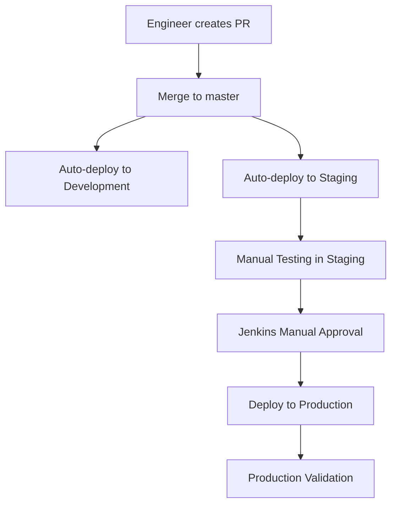
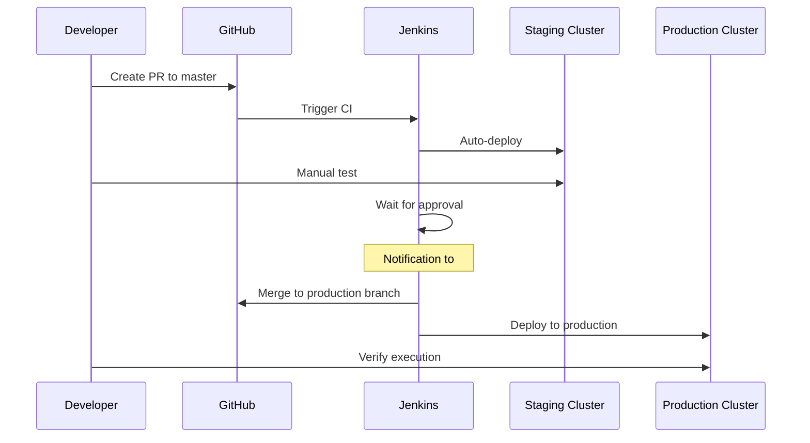

<div style="border-bottom: 1px solid var(--vp-c-divider); padding-bottom: 1rem; margin-bottom: 2rem;">
  <h1 style="margin-bottom: 0.5rem;">Deployment Guide</h1>
  <div style="display: flex; gap: 1rem; flex-wrap: wrap; font-size: 0.9rem; color: var(--vp-c-text-2);">
    <span style="display: flex; align-items: center; gap: 0.25rem;">
      📖 <strong>Guide</strong>
    </span>
    <span style="display: flex; align-items: center; gap: 0.25rem;">
      📝 <strong>996</strong> words
    </span>
    <span style="display: flex; align-items: center; gap: 0.25rem;">
      ⏱️ <strong>5</strong> min read
    </span>
  </div>
</div>

This guide documents the deployment process for the data-airflow-dags repository across different environments (development, staging, and production) using Kubernetes and Helm.

## Overview

The deployment system uses a combination of:
- A `./go deploy` script for orchestrating deployments
- Jenkins CI/CD pipeline (currently with manual approval steps)
- Kubernetes clusters for each environment
- Docker images for both Airflow DAGs and DBT transformations
- Environment-specific configurations managed through profiles and environment variables



## Deployment Script

The primary deployment mechanism is the `./go deploy` script, invoked through the CI wrapper script:

```bash
#!/usr/bin/env bash
set -eu

: "${ENVIRONMENT}"
: "${DEPLOY_KEY}"

./go deploy $ENVIRONMENT
```

**Required Environment Variables:**
- `ENVIRONMENT`: Target environment (development, staging, or production)
- `DEPLOY_KEY`: Authentication credential for deployment

> The actual `./go` script implementation is not visible in the provided codebase, but it is referenced as the core deployment orchestrator.

## Environment Architecture

### Environment Tiers

The deployment follows a three-tier architecture:

| Environment | Purpose | Airflow Cluster | DAG Sync Method | Schedule Behavior |
|-------------|---------|-----------------|-----------------|-------------------|
| **Development** | Individual testing | Local | Hourly sync from `development` branch | Disabled (manual trigger only) |
| **Staging** | Pre-production validation | Staging cluster | Auto-deploy on master merge (~5 min) | Disabled unless `force_schedule=True` |
| **Production** | Live workloads | Production cluster | Manual approval via Jenkins | Active schedules |

### Schedule Control

The `dag_builder.py` module implements environment-aware schedule control:

```python
def get_schedule(var: Any, default: Any, force_schedule: bool) -> Any:
    if os.environ["ENVIRONMENT"] == "production":
        return var
    if os.environ["ENVIRONMENT"] == "staging" and force_schedule:
        return var
    return default
```

This ensures that:
- Production runs on defined schedules
- Development and staging require manual triggers (preventing unnecessary CPU usage)
- Individual DAGs can override this with `force_schedule=True`

## Deployment Workflow

### Standard Deployment Process

1. **Local Development**
   - Create and test DAG locally
   - Verify functionality in local environment
   - See [Local Development Setup](./local-development-setup.md) for details

2. **Development Environment Testing** (Optional)
   - Push changes to `development` branch
   - DAGs sync automatically every hour
   - Test in development Airflow cluster

   ```bash
   git checkout development
   git reset --hard $your-feature-branch
   git push origin development -f
   ```

   > **Warning:** The development branch is unstable and should never be used as a base for new work.

3. **Staging Deployment**
   - Create Pull Request to `master`
   - After approval and merge, changes auto-deploy to staging
   - Deployment typically completes within 5 minutes
   - Manually trigger and test DAGs in staging environment

4. **Production Deployment**
   - Jenkins sends notification to `#airflow-alerts` channel
   - Team member approves deployment in Jenkins
   - Auto-merge to `production` branch occurs
   - DAGs deploy to production cluster
   - Verify successful execution and monitor alerts



## DBT Service Docker Image

The DBT transformations run in a separate Docker image to avoid dependency conflicts with Airflow. This follows the architecture described in RFC 0001.

### Image Structure

- **Base Image**: Created in the `docker-images` repository
- **Custom Image**: Built from `dbt/Dockerfile` in this repository
- **Deployment**: Jenkins builds and pushes to DockerHub with environment-specific tags

### Image Usage in DAGs

DBT tasks are executed using `KubernetesPodOperator`:

```python
KubernetesPodOperator(
    image=(
        "dbt_test:latest"
        if os.environ["ENVIRONMENT"] == "development"
        else dbt_image
    ),
    labels={"task": "dbt_operation_proccess"},
    name=f"dbt_operation_{task_id_suffix}",
    task_id=f"dbt_operation{task_id_suffix}",
    secrets=(
        None if os.environ["ENVIRONMENT"] == "development" else [vault_token_secret]
    ),
    env_vars=vault_envs,
    container_resources=dbt_child_pod_resources,
    # ...
)
```

### Environment-Specific Execution

**Production:**
```bash
source execute_dbt_commands.sh '<dbt_commands>' '<montecarlo_command>'
```

**Non-Production:**
```bash
source get_envs.sh <vault_keys> && sh create_private_key_file.sh && <dbt_commands>
```

The production environment uses pre-configured vault credentials, while development/staging fetch credentials at runtime.

## DBT Deployment Strategy

### Redshift Deployment (Proposal B - Current Implementation)

The repository implements **Proposal B** from the DBT deployment guidelines, which operates without a separate staging data cluster:

| Phase | Read From | Write To | Airflow Cluster |
|-------|-----------|----------|-----------------|
| **Dev** | violin (prod) | violin/development - scratch_\<user\> | Local |
| **Pre-Prod** | violin (prod) | violin - scratch schema | Production |
| **Prod** | violin (prod) | violin - PUBLIC | Production |

**Key Characteristics:**
- Both pre-prod and prod run on the production Airflow cluster
- Pre-prod DAGs are prefixed with `pre_prod_` and manually triggered
- Enables full ETL testing before production deployment
- Mitigates PII security concerns from Proposal A

### Snowflake Deployment

| Phase | Warehouse | Read From | Write To | Airflow Cluster |
|-------|-----------|-----------|----------|-----------------|
| **Dev** | ETL Dev | violin (raw) | dev - scratch_\<user\> | Local |
| **Stage** | ETL Dev | violin (raw) | clarinet/stage - PUBLIC | Staging |
| **Prod** | ETL PROD | violin (raw) | violin - PUBLIC | Production |

Snowflake's multi-database architecture allows better separation using different warehouses while accessing the same data.

### Pre-Production DAG Pattern

For Redshift deployments in production, the system automatically creates duplicate DAGs:

```python
def dbt_airflow_DAG(dag_id, dbt_settings, node_selector=None, **kwargs):
    pre_prod_dag = None
    prod_dag = create_dbt_dag(
        dag_id=dag_id, dbt_settings=dbt_settings, node_selector=node_selector, **kwargs
    )
    if (
        os.environ["ENVIRONMENT"] == "production"
        and dbt_settings["warehouse"] == "redshift"
    ):
        kwargs["schedule_interval"] = None
        dbt_settings["pre_prod"] = True
        pre_dag_id = "pre_prod_" + dag_id
        pre_prod_dag = create_dbt_dag(
            dag_id=pre_dag_id,
            dbt_settings=dbt_settings,
            node_selector=node_selector,
            **kwargs,
        )
    return pre_prod_dag, prod_dag
```

Pre-production DAGs:
- Have `schedule_interval` set to `None` (manual trigger only)
- Are tagged with `pre_prod` for easy identification
- Write to the `scratch` schema instead of `PUBLIC`
- Allow validation before enabling production DAG

## Jenkins CI/CD Setup

### Current Status

The Jenkins pipeline is **currently inactive for fully automated deployments**. The system uses:
- Manual approval step before production deployment
- Notifications to `#airflow-alerts` Slack channel
- Auto-merge to production branch after approval

### Deployment Proposals

The repository documents three deployment architecture proposals in `docs/dags_deployment_proposals.md`:

1. **CronJob and branches**: Scheduled polling of repository
2. **Webhook and branches**: Event-driven updates via Kubernetes API
3. **Kubeconfig in Jenkins**: Direct cluster access from Jenkins

> The implemented approach appears to be a hybrid using Jenkins with manual approval and branch-based deployments, though the exact mechanism is not fully visible in the provided code.

## Configuration Management

### Environment Detection

All deployment logic relies on the `ENVIRONMENT` environment variable:

```python
if os.environ["ENVIRONMENT"] == "production":
    # Production-specific behavior
elif os.environ["ENVIRONMENT"] == "staging":
    # Staging-specific behavior
else:
    # Development behavior
```

### Kubernetes Resources

Environment-specific resource configurations are managed through:
- `k8s_defaults`: Base Kubernetes pod configuration
- `dbt_child_pod_resources`: Resources for DBT execution pods
- `dbt_docs_pod_resources`: Resources for DBT documentation generation
- `vault_token_secret`: Secret for Vault authentication
- `vault_envs`: Environment variables for Vault access

### Node Selection

Production deployments support custom node selection for resource-intensive workloads:

```python
copied_k8s_defaults = k8s_defaults.copy()
if node_selector and os.environ["ENVIRONMENT"] == "production":
    copied_k8s_defaults["node_selector"] = node_selector
```

## Manual Deployment Procedures

### Deploying to Development

```bash
# Force push your branch to development
git checkout development
git reset --hard <your-feature-branch>
git push origin development -f

# Wait up to 1 hour for automatic sync
# Or trigger manual sync if configured
```

### Deploying to Staging

```bash
# Create and merge PR to master
git checkout master
git pull origin master

# Deployment happens automatically within ~5 minutes
# Test in staging Airflow UI
```

### Deploying to Production

```bash
# After staging validation:
# 1. Wait for Jenkins notification in #airflow-alerts
# 2. Review changes in Jenkins
# 3. Approve deployment
# 4. Monitor production Airflow for successful execution
```

### Emergency Rollback

> The codebase does not document an explicit rollback procedure. Rollback would likely involve:
> - Reverting the production branch to a previous commit
> - Re-running the deployment process
> - Manually disabling problematic DAGs in Airflow UI

## Integration with Other Systems

- **Vault**: Provides secrets and credentials for database connections
- **DockerHub**: Hosts built images for Airflow and DBT
- **Kubernetes**: Orchestrates pod execution across environments
- **Helm**: Manages Kubernetes deployments (referenced but not detailed in code)
- **Monte Carlo**: Data observability integration in production DBT runs

For more information on related topics:
- [Configuration Management](./configuration-management.md) - Environment variables and secrets
- [DBT Integration](./dbt-integration.md) - DBT execution patterns
- [Local Development Setup](./local-development-setup.md) - Setting up local environment
- [Monitoring and Alerting](./monitoring-alerting.md) - Production monitoring