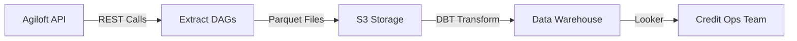
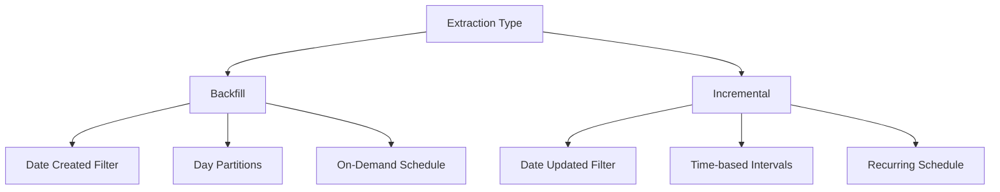
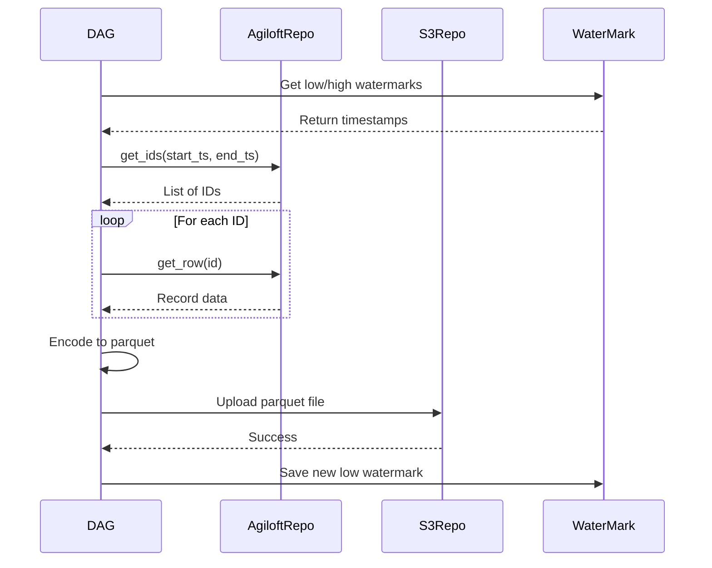

<div style="border-bottom: 1px solid var(--vp-c-divider); padding-bottom: 1rem; margin-bottom: 2rem;">
  <h1 style="margin-bottom: 0.5rem;">External System Integrations</h1>
  <div style="display: flex; gap: 1rem; flex-wrap: wrap; font-size: 0.9rem; color: var(--vp-c-text-2);">
    <span style="display: flex; align-items: center; gap: 0.25rem;">
      📚 <strong>Reference</strong>
    </span>
    <span style="display: flex; align-items: center; gap: 0.25rem;">
      📝 <strong>934</strong> words
    </span>
    <span style="display: flex; align-items: center; gap: 0.25rem;">
      ⏱️ <strong>5</strong> min read
    </span>
  </div>
</div>

This page documents the integration patterns, authentication methods, and operational considerations for external systems integrated with the Airflow data pipeline.

## Overview

The data-airflow-dags repository integrates with external systems primarily through extract DAGs that pull data from third-party APIs and load it into S3 for downstream processing. Based on the available codebase evidence, the primary documented integration is with **Agiloft**, a case management system used by the credit operations team.

> **Note**: While the page definition mentions Braze, Finwise, Zendesk, and Tenable, no implementation evidence for these systems was found in the provided codebase files. This documentation focuses on what is directly observable in the code.

## Agiloft Integration

### System Context

Agiloft is a case management platform that tracks loan application workflows and credit operations processes. The integration extracts data from Agiloft's REST API and loads it into S3 as parquet files for downstream transformation and analysis.



**Environments:**
- Staging: `https://agiloft.staging.earnest.com/ewws/`
- Production: `https://agiloft.internal.earnest.com/ewws/`

### Authentication

Authentication uses basic HTTP authentication with username and password credentials stored in Vault:

```python
agiloft_repo=AgiloftRepo(
    base_url=agiloft_config["base_url"],
    username=get_secret_from_vault("agiloft_username"),
    password=get_secret_from_vault("agiloft_password"),
    service=service,
)
```

**Credential Management:**
- Credentials retrieved from Vault at runtime
- Separate credentials per environment (staging/production)
- No credential caching or rotation logic visible in code

### API Usage Patterns

The Agiloft integration uses two primary REST endpoints from the [Agiloft REST Interface](https://wiki.agiloft.com/display/HELP/REST+Interface):

#### 1. Get IDs Endpoint (EWSelect)

Retrieves record IDs based on date range filters:

```
{base_url}EWSelect?$KB=Earnest&$lang=en&$table={table}&$login={login}&$password={password}&where=date_updated>{start_ts}%20and%20date_updated<{end_ts}
```

**Parameters:**
- `$KB`: Knowledge base name (always "Earnest")
- `$lang`: Language (always "en")
- `$table`: Table name ("case" or "employees")
- `$login`, `$password`: Authentication credentials
- `where`: SQL-like filter clause for date ranges

#### 2. Get Row Endpoint (EWRead)

Retrieves full record data by ID:

```
{base_url}EWRead?$KB=Earnest&$lang=en&$table={table}&$login={login}&$password={password}&id={id}
```

### Data Extraction Strategy

The integration implements two extraction patterns for each table:



#### Cases Table

**Backfill Operation:**
- Partitioned by day using `date_created` field
- Covers years 2016-2020
- Schedule: 11:30 PM PST (6:30 AM UTC) daily
- DAG: `agiloft_case_backfill`

**Incremental Operation:**
- 6-hour intervals using `date_updated` field
- Schedule: Every hour from 5:30 AM to 7:30 PM PST
- DAG: `agiloft_case_increment`
- Watermark-based tracking to avoid reprocessing

#### Employees Table

**Backfill Operation:**
- Full load from 2016-01-01 to 2021-01-01
- On-demand execution only
- DAG: `agiloft_employees_backfill`

**Incremental Operation:**
- 48-hour intervals using `date_updated` field
- Schedule: Daily at 5:30 PM PST (12:30 AM UTC)
- DAG: `agiloft_employees_increment`

### Implementation Architecture

```python
# Configuration structure
Config(
    agiloft_repo=AgiloftRepo(...),      # API client
    s3_repo=S3Repo(...),                # S3 destination
    water_mark_store=WaterMarkStore,    # Airflow Variables for state
    service=Service(...),               # Service metadata
    table_prefix=...                    # Environment prefix
)
```

**Key Components:**

| Component | Purpose | Implementation |
|-----------|---------|----------------|
| `AgiloftRepo` | API client for Agiloft REST calls | Handles authentication and request formatting |
| `S3Repo` | S3 upload operations | Writes parquet files to configured bucket/key |
| `WaterMarkStore` | State tracking for incremental loads | Uses Airflow Variables for persistence |
| `DateField` | Date formatting and manipulation | Converts between Python datetime and Agiloft format |

### Watermark Management

Incremental loads use high/low watermark pattern to track processing state:

```python
water_marks = WaterMarks(
    config.water_mark_store,
    table_name=table_name,
    increment_hrs=increment_hrs,
)
low_wm = water_marks.get_low_water_mark()   # Last processed timestamp
high_wm = water_marks.get_high_water_mark() # Current timestamp
```

**Watermark Storage:**
- Stored in Airflow Variables
- Separate watermarks per table
- Updated after successful S3 upload
- No visible rollback or recovery mechanism

### Data Loading Process



### S3 Output Structure

Parquet files are written to S3 with the following key pattern:

```
{base_key}/{table_name}/{start_ts}_{end_ts}.parquet
```

**Configuration:**
- Bucket: Configured per environment in `agiloft` config property
- Base key: Configured per environment
- Table prefix: Added for non-production environments

### Error Handling

**Retry Configuration:**
- Incremental tasks: 3 retries configured
- Backfill tasks: No explicit retry configuration visible
- No custom retry delay or exponential backoff observed

**Validation:**
```python
config.s3_repo.self_check()      # Validates S3 connectivity
config.agiloft_repo.self_check() # Validates Agiloft API access
```

### Rate Limiting Considerations

> **Important**: No explicit rate limiting, throttling, or backoff logic is visible in the codebase. The implementation makes sequential API calls for each record ID without delays.

**Observed Patterns:**
- Sequential processing of IDs (no parallelization)
- No sleep/delay between requests
- No retry-after header handling
- Relies on schedule intervals to limit request frequency

### Performance Characteristics

**Cases Table:**
- Thousands of records per partition
- Day-based partitioning reduces individual load size
- 6-hour incremental windows balance freshness and load

**Employees Table:**
- Less than 1,000 total records
- 48-hour incremental windows (lower change frequency)
- Full backfill is manageable due to small dataset

### Downstream Integration

The extracted data flows to DBT models for transformation:

**Source Table:**
- `raw.agiloft__earnest.view_cases`

**DBT Models:**
- `agl_loan_requests` - Primary fact table for loan request metrics
- Multiple dimension fields documented in `dbt/docs/agiloft/agl_loan_requests.md`

See [DBT Integration](./dbt-integration.md) and [DBT Models Reference](./dbt-models-reference.md) for transformation details.

### Historical Context

The current implementation replaced a complex multi-language system (Python, Scala, JavaScript) that involved:
- Kinesis streaming
- Firehose delivery
- Lambda functions
- Kubernetes job scheduling

**Migration Goals (from RFC 0003):**
- Simplify architecture
- Improve maintainability
- Reduce latency (target: 1-4 hours)
- Enable testability
- Proper documentation

The current DAG-based approach achieves these goals through:
- Single language (Python)
- Standard Airflow patterns
- Direct S3 loading
- Configurable schedules

### Configuration Reference

**Required Configuration Properties:**

| Property | Description | Example |
|----------|-------------|---------|
| `agiloft.base_url` | Agiloft API endpoint | `https://agiloft.internal.earnest.com/ewws/` |
| `agiloft.bucket_name` | S3 bucket for output | `airflow-etl-production` |
| `agiloft.base_key` | S3 key prefix | `agiloft/` |

**Vault Secrets:**
- `agiloft_username` - API username
- `agiloft_password` - API password

### Monitoring and Observability

**DAG Tags:**
- `extract` - Identifies as extraction DAG
- `agiloft` - System identifier
- `s3` - Destination identifier

**Contact Information:**
- Email: sortigoza@earnest.com
- Slack: @sortigoza

> **Note**: No explicit alerting configuration, SLA definitions, or monitoring dashboards are documented in the provided code.

## Integration Patterns Summary

Based on the Agiloft implementation, the following patterns are observable for external system integrations:

1. **Authentication**: Vault-based credential management
2. **Extraction**: Separate backfill and incremental DAGs
3. **State Management**: Airflow Variables for watermarks
4. **Data Format**: Parquet files in S3
5. **Scheduling**: Cron-based with environment-specific intervals
6. **Error Handling**: Airflow retry mechanisms
7. **Configuration**: Environment-specific via Config class

These patterns likely apply to other external integrations in the repository, though specific implementations for Braze, Finwise, Zendesk, and Tenable are not present in the provided codebase evidence.