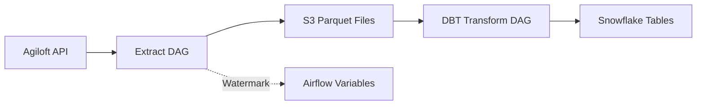
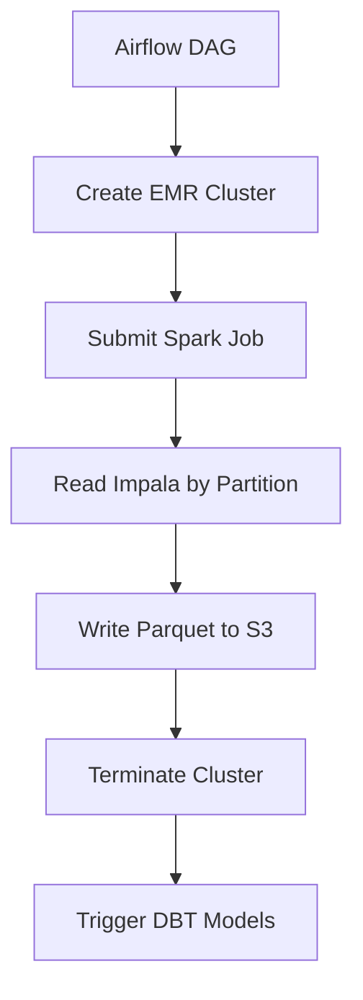
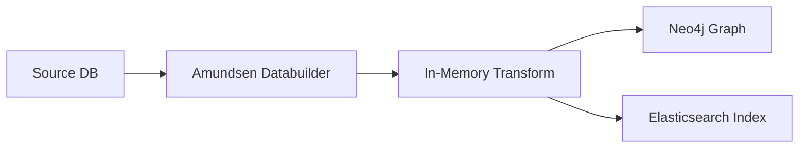

<div style="border-bottom: 1px solid var(--vp-c-divider); padding-bottom: 1rem; margin-bottom: 2rem;">
  <h1 style="margin-bottom: 0.5rem;">Extract DAGs</h1>
  <div style="display: flex; gap: 1rem; flex-wrap: wrap; font-size: 0.9rem; color: var(--vp-c-text-2);">
    <span style="display: flex; align-items: center; gap: 0.25rem;">
      📚 <strong>Reference</strong>
    </span>
    <span style="display: flex; align-items: center; gap: 0.25rem;">
      📝 <strong>896</strong> words
    </span>
    <span style="display: flex; align-items: center; gap: 0.25rem;">
      ⏱️ <strong>5</strong> min read
    </span>
  </div>
</div>

Extract DAGs are responsible for pulling data from external sources and loading it into S3 in Parquet format. These DAGs implement both backfill (historical load) and incremental load patterns, using watermark tracking to manage data freshness.

## Overview

The repository contains extraction DAGs for the following sources:

- **Agiloft API**: Customer support case and employee data
- **Impala/Mohela**: Student loan servicing data from Navient's Hadoop cluster
- **Amundsen**: Metadata extraction from Postgres and Snowflake for data catalog
- **Spark Jobs**: EMR-based extraction for large-scale data migration

All extraction DAGs follow a common pattern: extract data from source → transform to Parquet → load to S3 → trigger downstream DBT transformations.

## Agiloft Extraction

### Architecture

The Agiloft extraction system replaced a complex multi-language pipeline (Python, Scala, JavaScript) with a simplified Airflow-based approach. The original system used Kinesis streams, Firehose, and Lambda functions; the current implementation directly extracts to S3.



### DAG Structure

Four DAGs handle different extraction scenarios:

| DAG | Purpose | Schedule | Increment Window |
|-----|---------|----------|------------------|
| `agiloft_case_backfill` | Historical case data (2016-2020) | `30 23 * * *` (11:30 PM PST) | By year partition |
| `agiloft_case_increment` | Recent case updates | `30 5-19 * * *` (hourly, 5:30 AM - 7:30 PM PST) | 6 hours |
| `agiloft_employees_backfill` | Historical employee data | On-demand | Full range (2016-2021) |
| `agiloft_employees_increment` | Recent employee updates | `30 17 * * *` (5:30 PM PST) | 48 hours |

### Implementation Pattern

The Agiloft DAGs are generated programmatically using a factory pattern:

```python
AgiloftDAG = namedtuple("AgiloftDAG", ["name", "description", "schedule", "tasks"])

agiloft_dags = [
    AgiloftDAG(
        name="case_increment",
        description="Incremental load of agiloft case table data",
        schedule="30 5-19 * * *",
        tasks=[partial(increment_case_task, agiloft_config_obj)],
    ),
    # ... other DAGs
]

for agiloft_dag in agiloft_dags:
    dag_id = f"agiloft_{agiloft_dag.name}"
    globals()[dag_id] = airflow_DAG(
        dag_id=dag_id,
        description=agiloft_dag.description,
        schedule_interval=agiloft_dag.schedule,
        start_date=get_timezone_aware_date(date=(2021, 1, 1)),
        tags=["extract", "agiloft", "s3"],
    )
```

### Watermark Tracking

Incremental loads use Airflow Variables as a watermark store to track the last successfully extracted timestamp:

```python
def case_increment(config: Config, increment_hrs: int):
    water_marks = WaterMarks(
        config.water_mark_store,
        table_name=table_name,
        increment_hrs=increment_hrs,
    )
    low_wm = water_marks.get_low_water_mark()  # Last loaded
    high_wm = water_marks.get_high_water_mark()  # Current increment
    
    # Extract records between watermarks
    case_records = load_records_interval(
        start_ts=low_wm,
        end_ts=high_wm,
        get_ids_func=config.agiloft_repo.get_case_ids_by_date_updated,
        get_row_func=config.agiloft_repo.get_case_row,
    )
    
    # Load to S3 and update watermark
    upload_file_to_s3_and_cleanup(...)
    water_marks.save_new_low_water_mark(high_wm)
```

### Backfill Pattern

Backfill operations partition data by date ranges to manage memory and enable parallel processing:

```python
def case_backfill(config: Config, start_ts: DateField, end_ts: DateField):
    date_range = generate_dates_range(start_ts.value, end_ts.value)
    partitions = [
        CasePartition(config, table_name=table_name, start=DateField(value=x))
        for x in date_range
    ]
    
    while partitions:
        current_partition = partitions.pop(0)
        if current_partition.exist():
            continue  # Skip already loaded partitions
        current_partition.load()
```

Each partition checks S3 for existing files before extraction, enabling idempotent reruns.

### Configuration

Agiloft configuration is built from Airflow config and Vault secrets:

```python
def build_agiloft_config():
    airflow_config = AirflowConfig()
    agiloft_config = airflow_config.get_property("agiloft")
    
    return AgiloftConfig(
        agiloft_repo=AgiloftRepo(
            base_url=agiloft_config["base_url"],
            username=get_secret_from_vault("agiloft_username"),
            password=get_secret_from_vault("agiloft_password"),
            service=service,
        ),
        s3_repo=S3Repo(
            bucket_name=agiloft_config["bucket_name"],
            base_key=agiloft_config["base_key"],
        ),
        water_mark_store=WaterMarkStore,
        table_prefix=f"{airflow_config.environment}__"
            if airflow_config.environment != "production" else "",
    )
```

### Output Format

Data is written to S3 as Parquet files with the following structure:

- **Bucket**: Configured via `agiloft_config["bucket_name"]`
- **Key pattern**: `{base_key}/{table_name}/{start_ts}_{end_ts}.parquet`
- **Table prefix**: Environment-specific prefix for non-production environments

## Impala/Mohela Extraction

### Background

The Impala extraction migrates data from Navient's Hadoop cluster (Cloudera Impala) to S3. The cluster contains 12 views in the `navi_only` database, some with billions of rows.

### Technical Approach

Two options were evaluated:

1. **Spark + EMR**: Distributed extraction using Spark JDBC connectors on ephemeral EMR clusters
2. **Micro-batching with Python**: Partition-based extraction using Airflow workers

> The RFC documents indicate Option A (Spark + EMR) was selected for production use, though the specific implementation DAGs are not present in the provided codebase files.

### Key Constraints

- **Access requirements**: VPN/VPC access, SSL, JKS certificate, credentials
- **Partition structure**: Tables partitioned by year/month/day
- **Connection limits**: Recommended 4 concurrent connections
- **Data updates**: Tables update at midnight, may be temporarily empty
- **Table sizes**: Range from 172K to 3.4B rows

### Extraction Strategy



### JDBC Configuration

Recommended parameters for Impala JDBC driver:

- **RowsFetchedPerBlock**: 10,000
- **BATCH_SIZE**: Same as RowsFetchedPerBlock
- **LogLevel**: 0 (minimal logging)

## Amundsen Metadata Extraction

### Purpose

Amundsen DAGs extract metadata from data sources and load it into Neo4j (graph database) and Elasticsearch for the Amundsen data catalog.

### DAG Implementations

#### Postgres Metadata

```python
dag = airflow_DAG(
    dag_id="amundsen_postgres_loader",
    description="Postgres --> In Memory Transforms -> Amundsen(Neo4j and ES)",
    schedule_interval=None,
    tags=["amundsen", "databuilder", "postgres"],
)

job_tasks = generate_postgres_tasks(
    dag=dag, 
    instances=postgres_cred, 
    neo4j_credentials=neo4j_cred
)
```

#### Snowflake Metadata

```python
dag = airflow_DAG(
    dag_id="amundsen_snowflake_loader",
    description="Snowflake --> In Memory Transforms -> Amundsen(Neo4j and ES)",
    schedule_interval=None,
    tags=["amundsen", "databuilder", "snowflake"],
)

job_tasks = generate_snowflake_tasks(
    dag=dag, 
    snowflake_config=amundsen_snowflake_cred, 
    neo4j_credentials=neo4j_cred
)
```

Both DAGs are on-demand (no schedule) and use the `generate_*_tasks` functions to dynamically create extraction tasks based on configured database instances.

### Data Flow



## Braze Extraction Pattern

While Braze DAGs are primarily reverse ETL (Snowflake → Braze), they demonstrate advanced extraction patterns used elsewhere:

### Export to S3 Pattern

```python
export_profile_data_for_archive = PythonOperator(
    task_id="export_profile_data_for_archive",
    python_callable=braze_export_segment_to_s3,
    op_kwargs={
        "segment_id": braze_segment_id,
        "fields_to_export": fields_to_export,
    },
)
```

### Copy from S3 to Snowflake

```python
copy_into_profile_ids_table_task = PythonOperator(
    task_id="copy_into_profile_ids_table_task",
    python_callable=copy_braze_files_from_s3,
    op_kwargs={
        "bucket": braze_s3_bucket,
        "prefix": default_braze_export_path,
        "target_db": target_db,
        "schema": target_schema,
        "table": raw_api_table,
        "snowflake_cred": snowflake_cred,
    },
)
```

### Validation and Delay

```python
sleep_task = BashOperator(
    task_id="delay_10_min_waiting_braze_data",
    bash_command="sleep 10m",
)

sensor_check_validate_pull_data = PythonOperator(
    task_id="sensor_check_validate_pull_data",
    python_callable=validate_data,
    op_kwargs={
        "braze_table_config": {
            "database": target_db,
            "schema": target_schema,
            "delta_table": raw_api_table,
        },
    },
)
```

This pattern (export → delay → validate) ensures data availability before downstream processing.

## Common Extraction Patterns

### Repository Pattern

Extraction DAGs use repository abstractions to separate data access from business logic:

- **AgiloftRepo**: API client for Agiloft REST interface
- **S3Repo**: S3 operations (upload, check existence)
- **SnowflakeDB**: Snowflake query execution

### Configuration Management

All extraction DAGs follow this configuration pattern:

1. Load base config from Airflow config files
2. Retrieve secrets from Vault
3. Build typed configuration objects
4. Pass to extraction functions

### Environment Handling

Non-production environments use table prefixes to isolate data:

```python
table_prefix=f"{airflow_config.environment}__"
    if airflow_config.environment != "production" else ""
```

### Retry Strategy

Incremental extraction tasks typically configure retries:

```python
PythonOperator(
    task_id="increment_agiloft_case_table",
    python_callable=case_increment,
    retries=3,  # Retry on transient failures
    op_kwargs={"config": config, "increment_hrs": 6},
)
```

## Creating New Extraction DAGs

### Basic Structure

1. **Define configuration**: Create config object with source credentials and S3 target
2. **Implement extraction logic**: Write functions for backfill and incremental loads
3. **Create DAG definition**: Use `airflow_DAG` builder with appropriate schedule
4. **Add watermark tracking**: Use `WaterMarkStore` for incremental loads
5. **Configure downstream**: Link to DBT transform DAG if needed

### Example Template

```python
from common.dag_builder import airflow_DAG
from airflow.operators.python import PythonOperator

def extract_data(config, start_ts, end_ts):
    # Extract from source
    records = source_repo.get_records(start_ts, end_ts)
    
    # Write to S3 as Parquet
    s3_repo.upload_parquet(records, key_name)
    
    # Update watermark
    watermark_store.save(end_ts)

dag = airflow_DAG(
    dag_id="extract_source_name",
    schedule_interval="0 * * * *",
    tags=["extract", "source_name", "s3"],
)

with dag:
    extract_task = PythonOperator(
        task_id="extract_source_data",
        python_callable=extract_data,
        op_kwargs={"config": config},
    )
```

### Partition Strategy

For large datasets, implement partition-based extraction:

- **Time-based**: Partition by day/month/year (Agiloft pattern)
- **ID-based**: Partition by ID ranges (for non-temporal data)
- **Hybrid**: Combine time and ID partitioning for very large tables

### Testing Considerations

- Test backfill on small date ranges first
- Verify Parquet schema matches downstream expectations
- Confirm watermark updates correctly
- Check idempotency (rerunning doesn't duplicate data)

## Integration with Transform DAGs

Extraction DAGs typically trigger downstream DBT transformations:

```python
# Extract DAG: dags/data_platform_team/extract/agiloft_dags.py
# Schedule: Hourly during business hours

# Transform DAG: dags/data_platform_team/transform/dbt_agiloft_dag.py
dbt_settings = {
    "warehouse": "snowflake",
    "models": "data_team.agiloft",
}

_, prod_dag = dbt_airflow_DAG(
    dag_id="dbt_agiloft",
    dbt_settings=dbt_settings,
    schedule_interval="0 6-20 * * *",  # Aligned with extraction
    tags=["DBT", "agiloft"],
)
```

The transform DAG runs on a similar schedule to process newly extracted data. See [Transform DAGs](./transform-dags.md) for details on the transformation layer.

## Monitoring and Troubleshooting

### Watermark Issues

If incremental loads miss data:

1. Check watermark value in Airflow Variables
2. Verify `increment_hrs` matches data update frequency
3. Run backfill for missing date range

### S3 Upload Failures

Extraction tasks check for existing S3 files before uploading:

```python
if current_partition.exist():
    logger.info("partition %s is already loaded skipping", current_partition.name)
    continue
```

This enables safe reruns without data duplication.

### Connection Limits

For sources with connection limits (like Impala), tune:

- Number of parallel tasks
- Batch size per task
- Connection pool settings

See [Troubleshooting Guide](./troubleshooting.md) for common extraction issues and resolutions.