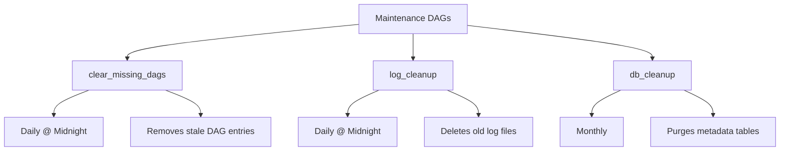
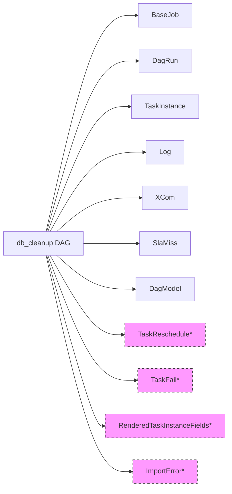
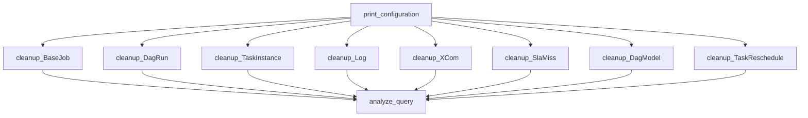

<div style="border-bottom: 1px solid var(--vp-c-divider); padding-bottom: 1rem; margin-bottom: 2rem;">
  <h1 style="margin-bottom: 0.5rem;">Maintenance DAGs</h1>
  <div style="display: flex; gap: 1rem; flex-wrap: wrap; font-size: 0.9rem; color: var(--vp-c-text-2);">
    <span style="display: flex; align-items: center; gap: 0.25rem;">
      📚 <strong>Reference</strong>
    </span>
    <span style="display: flex; align-items: center; gap: 0.25rem;">
      📝 <strong>918</strong> words
    </span>
    <span style="display: flex; align-items: center; gap: 0.25rem;">
      ⏱️ <strong>5</strong> min read
    </span>
  </div>
</div>

The repository includes several maintenance DAGs designed to keep the Airflow environment healthy by cleaning up metadata, logs, and stale database entries. These DAGs run on scheduled intervals and can also be triggered manually for ad-hoc operations.

## Overview

Maintenance DAGs are located in `dags/data_platform_team/maintenance/` and are tagged with `["maintenance"]` for easy identification in the Airflow UI. They handle:

- Clearing missing DAG references from the metadata database
- Cleaning up task logs to prevent disk space issues
- Purging old metadata entries from the Airflow database



## Clear Missing DAGs

**DAG ID:** `clear_missing_dags`  
**File:** `dags/data_platform_team/maintenance/clear_missing_dags_dag.py`  
**Schedule:** `@daily` (midnight UTC)

This DAG removes entries from the Airflow DAG table when the corresponding Python file no longer exists in the repository. This prevents the Airflow web server from displaying deleted or renamed DAGs.

### Configuration

```python
DAG_ID = "clear_missing_dags"
START_DATE = airflow.utils.dates.days_ago(1)
SCHEDULE_INTERVAL = "@daily"
```

### Task Structure

The DAG consists of a single `PythonOperator` that calls `clear_missing_dags_fn` from the maintenance scripts:

```python
clear_missing_dags = PythonOperator(
    task_id="clear_missing_dags",
    python_callable=clear_missing_dags_fn,
    provide_context=True,
    dag=dag,
)
```

### Use Cases

- Automatically clean up after DAG deletions or renames
- Prevent confusion in the Airflow UI from stale DAG references
- Maintain database hygiene without manual intervention

## Log Cleanup

**DAG ID:** `log_cleanup`  
**File:** `dags/data_platform_team/maintenance/log_cleanup_dag.py`  
**Schedule:** `@daily` (midnight UTC)

This DAG periodically removes old task logs to prevent disk space issues. It can be configured to target specific directories and supports manual triggering with custom retention periods.

### Configuration

| Parameter | Default | Description |
|-----------|---------|-------------|
| `SCHEDULE_INTERVAL` | `@daily` | How often to run cleanup |
| `NUMBER_OF_WORKERS` | `1` | Number of Airflow worker nodes |
| `BASE_LOG_FOLDER` | From Airflow config | Base directory for logs |
| `DIRECTORIES_TO_DELETE` | `[BASE_LOG_FOLDER]` | List of directories to clean |

### Task Structure

The DAG creates a `BashOperator` for each worker node and directory combination:

```python
for log_cleanup_id in range(1, NUMBER_OF_WORKERS + 1):
    for dir_id, directory in enumerate(DIRECTORIES_TO_DELETE):
        log_cleanup_op = BashOperator(
            task_id="log_cleanup_worker_num_"
            + str(log_cleanup_id)
            + "_dir_"
            + str(dir_id),
            bash_command=cleanup_script(),
            params={"directory": str(directory), "sleep_time": int(log_cleanup_id) * 3},
            dag=dag,
        )
```

### Manual Triggering with Custom Retention

You can trigger the DAG manually with a custom retention period:

```bash
airflow trigger_dag --conf '{"maxLogAgeInDays":30}' log_cleanup
```

The `maxLogAgeInDays` parameter controls how many days of logs to retain.

## Database Cleanup

**DAG ID:** `db_cleanup`  
**File:** `dags/data_platform_team/maintenance/db_cleanup.py`  
**Schedule:** `@monthly` (midnight UTC on the 1st of each month)

This comprehensive maintenance DAG cleans up old entries from the Airflow metadata database to prevent unbounded growth. It targets multiple tables including DagRun, TaskInstance, Log, XCom, Job, and SlaMiss.

> **Note:** This DAG is based on the [Google Cloud Composer cleanup workflow](https://cloud.google.com/composer/docs/cleanup-airflow-database) and forked from the [teamclairvoyant repository](https://github.com/teamclairvoyant/airflow-maintenance-dags).

### Configuration

| Parameter | Default | Description |
|-----------|---------|-------------|
| `DEFAULT_MAX_DB_ENTRY_AGE_IN_DAYS` | `180` | Retention period for database entries |
| `ENABLE_DELETE` | `True` | Whether to actually delete entries (set to `False` for dry-run) |
| `PRINT_DELETES` | `False` | Whether to log entries being deleted |
| `SCHEDULE_INTERVAL` | `@monthly` | How often to run cleanup |

### Database Objects Cleaned

The DAG cleans the following Airflow metadata tables:



> **Note:** Tables marked with * are conditionally included based on Airflow version compatibility.

### Retention Policies

Each database object has specific retention rules defined in the `DATABASE_OBJECTS` list:

| Model | Age Check Column | Keep Last | Special Filters |
|-------|------------------|-----------|-----------------|
| `BaseJob` | `latest_heartbeat` | No | None |
| `DagRun` | `execution_date` | Yes | Excludes external triggers |
| `TaskInstance` | `start_date` | No | None |
| `Log` | `dttm` | No | None |
| `XCom` | `timestamp` | No | None |
| `SlaMiss` | `execution_date` | No | None |
| `DagModel` | `last_parsed_time` | No | None |

The `keep_last` flag preserves the most recent run for certain tables (e.g., DagRun) to maintain operational history.

### Task Flow



The `print_configuration` task calculates the maximum date for deletion and stores it in XCom. Each cleanup task retrieves this value and processes its respective table. Finally, the `analyze_query` task runs a database ANALYZE operation to update query statistics.

### Dry-Run Mode

To preview what would be deleted without actually removing data:

1. Set `ENABLE_DELETE = False` in the DAG file
2. Set `PRINT_DELETES = True` to see detailed logs
3. Trigger the DAG manually or wait for the scheduled run

The logs will show which entries would be deleted without actually removing them.

## Ad-Hoc DBT Operations

While not strictly maintenance DAGs, the repository includes infrastructure for ad-hoc DBT operations through the `dbt_docs_dag.py`:

**DAG ID:** `dbt-docs-generator`  
**File:** `dags/data_platform_team/dbt_docs/dbt_docs_dag.py`  
**Schedule:** `0 6,14 * * *` (6am and 2pm UTC daily)

This DAG generates DBT documentation JSON files to feed the documentation microservice. It can be triggered manually when documentation needs to be regenerated outside the normal schedule.

### Configuration

```python
dbt_settings = {
    "warehouse": "snowflake",
}
```

The DAG uses the `dbt_docs_task` helper from the [DAG Builder Framework](./dag-builder-framework.md) to create a Kubernetes pod that runs DBT's documentation generation commands.

## Manual Triggering Patterns

All maintenance DAGs can be triggered manually through the Airflow UI or CLI:

### Via Airflow UI
1. Navigate to the DAGs page
2. Filter by the `maintenance` tag
3. Click the play button on the desired DAG
4. Optionally provide configuration JSON

### Via Airflow CLI

```bash
# Trigger with default configuration
airflow dags trigger <dag_id>

# Trigger with custom configuration
airflow dags trigger <dag_id> --conf '{"key": "value"}'
```

### Example: Custom Log Retention

```bash
airflow dags trigger log_cleanup --conf '{"maxLogAgeInDays": 30}'
```

## Scheduling Patterns

Maintenance DAGs use standard Airflow cron expressions:

| Schedule | Expression | Description |
|----------|-----------|-------------|
| Daily | `@daily` | Midnight UTC |
| Monthly | `@monthly` | Midnight UTC on the 1st |
| Custom | `0 6,14 * * *` | Specific times (e.g., 6am and 2pm UTC) |

> **Environment Behavior:** In non-production environments, schedules may be disabled by the `get_schedule` function in the [DAG Builder Framework](./dag-builder-framework.md) unless `force_schedule=True` is set.

## Integration with DAG Builder

Maintenance DAGs use the `airflow_DAG` helper function from `common.dag_builder` to ensure consistent configuration:

```python
dag = airflow_DAG(
    dag_id=DAG_ID,
    description=description,
    schedule_interval=SCHEDULE_INTERVAL,
    start_date=START_DATE,
    tags=["maintenance"],
)
```

This provides:
- Standardized default arguments from [Configuration Management](./configuration-management.md)
- Environment-aware scheduling behavior
- Consistent tagging for filtering and organization

See [DAG Builder Framework](./dag-builder-framework.md) for more details on the builder pattern used across all DAGs.

## Monitoring and Alerts

Maintenance DAGs inherit alerting configuration from the default DAG arguments. The `db_cleanup` DAG explicitly configures email alerts:

```python
default_args = {
    "owner": DAG_OWNER_NAME,
    "email": ALERT_EMAIL_ADDRESSES,
    "email_on_failure": True,
    "email_on_retry": False,
}
```

For general monitoring patterns, see [Monitoring and Alerting](./monitoring-alerting.md).

## Related Documentation

- [DAG Builder Framework](./dag-builder-framework.md) - Core framework used by maintenance DAGs
- [Configuration Management](./configuration-management.md) - Default arguments and environment settings
- [DBT Integration](./dbt-integration.md) - DBT documentation generation patterns
- [Troubleshooting Guide](./troubleshooting.md) - Common issues with maintenance operations