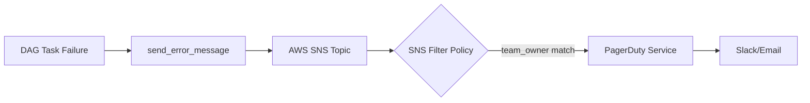
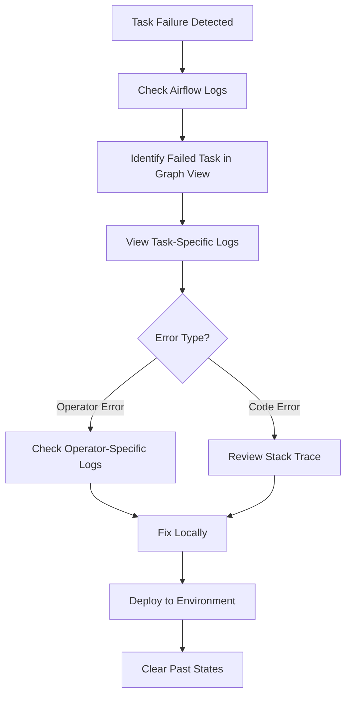
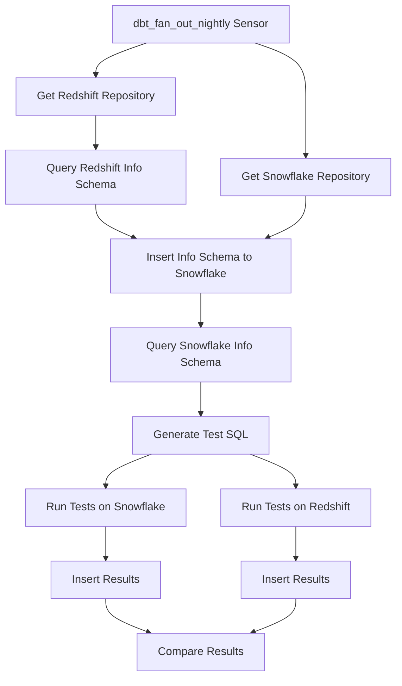
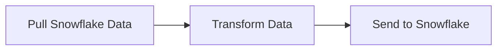

<div style="border-bottom: 1px solid var(--vp-c-divider); padding-bottom: 1rem; margin-bottom: 2rem;">
  <h1 style="margin-bottom: 0.5rem;">Monitoring and Alerting</h1>
  <div style="display: flex; gap: 1rem; flex-wrap: wrap; font-size: 0.9rem; color: var(--vp-c-text-2);">
    <span style="display: flex; align-items: center; gap: 0.25rem;">
      📖 <strong>Guide</strong>
    </span>
    <span style="display: flex; align-items: center; gap: 0.25rem;">
      📝 <strong>1,097</strong> words
    </span>
    <span style="display: flex; align-items: center; gap: 0.25rem;">
      ⏱️ <strong>6</strong> min read
    </span>
  </div>
</div>

This guide documents the observability and alerting strategies implemented in the data-airflow-dags repository, covering DAG execution monitoring, task failure alerting, resource utilization tracking, and data quality checks.

## Alerting Architecture

The repository implements an automated alerting system that routes DAG failure notifications through AWS SNS to PagerDuty.



### Alert Flow

When a DAG task fails, the following sequence occurs:

1. **Failure Detection**: Airflow detects the task failure
2. **Message Processing**: The `send_error_message` function in `dags/common/notifications.py` processes the failure context
3. **Message Creation**: Creates a structured message with failure details and extracts the `team_owner` attribute
4. **SNS Publishing**: Sends the message to the `airflow` SNS topic with the team owner as a message attribute
5. **Filtering**: SNS uses filter policies to route messages based on `team_owner` to the appropriate subscriber
6. **Delivery**: PagerDuty receives the alert and forwards it to configured channels (Slack, email, etc.)

### Team-Based Alert Routing

Alerts are routed to teams using two methods:

**Primary Method - Explicit Team Owner**:
```python
with airflow_DAG(
    dag_id="my_dag_id",
    start_date=datetime(2023, 1, 1),
    schedule_interval="0 12 * * *",
    team_owner="data_platform_team",  # Explicit team assignment
) as dag:
    # DAG definition
```

**Fallback Method - Folder-Based Detection**:
If no `team_owner` property is set, the system determines the team from the DAG's folder location within the `dags/` directory.

Available team values:
- `data_platform_team`
- `data_team`
- `security_team`
- `servicing_team`

> **Note**: The `team_owner` property takes precedence over folder-based detection, allowing DAGs to remain in their current locations while routing alerts to different teams.

## Monitoring DAG Execution

### Airflow Web Interface

The primary tool for monitoring DAG execution is the Airflow web interface, accessible at `http://localhost:8080/` in local development.

**Key Views**:

| View | Purpose | Usage |
|------|---------|-------|
| **Graph View** | Visualize task dependencies and execution status | Navigate to DAG → Graph View; change orientation from LR to RL for large DAGs |
| **Task Logs** | View detailed execution logs for individual tasks | Click failed task → View Log button |
| **DAG Runs** | Track historical execution history | View success/failure patterns over time |

**Task State Colors**:
- **Dark Green**: Task succeeded
- **Red**: Task failed
- **Yellow**: Task upstream failed or skipped
- **Phosphorescent Green**: Task currently running

### Broken DAG Detection

Broken DAGs (DAGs with syntax or import errors) are identified before execution:

1. **Web Interface**: Error message displayed in the DAG list view
2. **Command Line**: Full stack trace available via:
   ```bash
   docker exec -it data-airflow-dags_dev_1 bash -c "airflow list_dags"
   ```

## Task Failure Investigation

### Troubleshooting Workflow



### Step-by-Step Investigation

1. **Access Logs**: Navigate to Airflow web interface
2. **Locate Failure**: Open DAG → Graph View → Click failed task (red border)
3. **View Logs**: Click "View Log" button to see execution details
4. **Analyze Error**: Review stack trace and error messages
5. **Check Operator Logs**: For operator-specific failures, examine additional logs (e.g., Kubernetes pod logs for `KubernetesPodOperator`)

### Viewing Rendered Templates

For tasks with dynamic SQL or configuration:

1. Navigate to the failed task in Airflow UI
2. Click on the task → "Rendered" tab
3. View the `op_kwargs` JSON to see the actual values passed to the operator
4. Copy generated queries or commands for testing in target systems (e.g., Snowflake, databases)

Example from Braze DAG troubleshooting:
```json
{
  "sql_statements": ["CREATE OR REPLACE TABLE...", "SELECT * FROM..."]
}
```

## Resource Utilization Monitoring

### Kubernetes Resource Monitoring

DAGs using `KubernetesPodOperator` specify resource requirements:

```python
container_resources = k8s_models.V1ResourceRequirements(
    limits={"memory": "2Gi"}, 
    requests={"memory": "2Gi"}
)

task = KubernetesPodOperator(
    container_resources=container_resources,
    # ... other parameters
)
```

**Monitoring Approach**:
- Resource limits are defined per task
- Kubernetes enforces memory and CPU constraints
- Pod failures due to OOM (Out of Memory) appear in task logs
- Labels (e.g., `labels={"task": "slo_model_monitoring"}`) enable filtering in Kubernetes monitoring tools

### Database Connection Monitoring

The repository includes a dedicated DAG for monitoring PostgreSQL replication slot lag:

**DAG**: `monitor_replication_slots`
- **Schedule**: Every 30 minutes (`0,30 * * * *`)
- **Purpose**: Monitor replication slot lag to prevent database issues
- **Alert Threshold**: 4 GB lag triggers assertion failure
- **Query**:
  ```sql
  SELECT database, 
         pg_size_pretty(pg_wal_lsn_diff(pg_current_wal_lsn(), restart_lsn)) as lag,
         active
  FROM pg_replication_slots
  ORDER BY 2 DESC
  ```

The task logs lag information and fails if any database exceeds the threshold, triggering the standard alerting flow.

## Data Quality Monitoring

### Data Quality Check DAG

**DAG**: `data_quality_test`
- **Trigger**: External sensor waits for `dbt_fan_out_nightly` completion
- **Purpose**: Run SQL-based data quality tests on Snowflake and Redshift models
- **Results Storage**: `data_quality.data_quality_metrics` table



**Test Execution Flow**:
1. Wait for upstream DBT DAG completion (6-hour timeout)
2. Query information schemas from both Snowflake and Redshift
3. Generate data quality test SQL dynamically based on schema metadata
4. Execute tests against both data warehouses
5. Store results in `data_quality.data_quality_metrics`
6. Compare results across warehouses

### Model Monitoring

**DAG**: `slo_model_monitoring`
- **Schedule**: Daily at 5:00 AM (`0 5 * * *`)
- **Purpose**: Monitor SLO model predictions and feature quality
- **Monitored Metrics**:
  - Application prediction probabilities and scores
  - Score buckets and decline rates
  - Missing features and feature percentiles
  - Feature outliers and weights

**Task Sequence**:


Each task runs in a Kubernetes pod with 2Gi memory allocation.

### Looker Warehouse Monitoring

**DAG**: `dbt_monitor_looker_usage`
- **Schedule**: Every 6 hours (`0 */6 * * *`)
- **Purpose**: Monitor Looker data warehouse errors
- **DBT Model**: `data_platform_team.monitor.monitor_looker_dw_errors`

## Log Aggregation

### Task-Level Logs

Airflow stores task execution logs accessible through:
- **Web Interface**: DAG → Graph View → Task → View Log
- **File System**: Logs stored in Airflow's configured log directory
- **XCom**: Tasks can push/pull data for inter-task communication

### Operator-Specific Logs

Different operators provide additional logging mechanisms:

| Operator Type | Log Location | Access Method |
|---------------|--------------|---------------|
| `PythonOperator` | Airflow task logs | Web UI → View Log |
| `KubernetesPodOperator` | Kubernetes pod logs | `kubectl logs \<pod-name\>` or Airflow UI |
| DBT operators | Airflow logs + DBT run logs | Web UI → View Log (includes DBT output) |
| SQL operators | Airflow logs + query results | Web UI → View Log |

### Kubernetes Pod Logs

For `KubernetesPodOperator` tasks:
- Logs are streamed to Airflow task logs
- Pod labels enable filtering: `labels={"task": "task_name"}`
- Secrets and environment variables are injected from Vault

## Debugging Workflow

### Local Development Debugging

1. **Set Non-Scheduled Execution**:
   ```python
   schedule_interval = None
   catchup = False
   ```

2. **Activate DAG**: Toggle DAG on in Airflow UI

3. **Trigger Manually**: Click "Trigger DAG" button

4. **Monitor Execution**: Watch task states in Graph View

5. **Review Logs**: Click failed tasks → View Log

6. **Fix and Retry**: Make code changes, then "Clear" task states to re-run

### Production Debugging

1. **Check Airflow Logs**: Review task execution logs in the web interface
2. **Identify Failed Tasks**: Use Graph View to locate failures
3. **Analyze Context**: Check rendered templates and XCom values
4. **Reproduce Locally**: Test fixes in local Airflow environment
5. **Deploy Fix**: Push changes through standard deployment process
6. **Clear States**: In Airflow UI, clear past states to re-run from failure point

> **Important**: Always test DAG changes locally before deploying to staging or production environments. Use `./go validate` and `./go test` commands before creating pull requests.

## Contact Information

DAG owners are documented in DAG descriptions and can be contacted for specific monitoring issues:

- **SLO Model Monitoring**: hani.ramezani@earnest.com, nakul.mishra@earnest.com (Slack: @hani.ramezani, @nakul.mishra)
- **Replication Slots Monitoring**: lcarbajal@earnest.com (Slack: @luisc09)
- **Data Quality Checks**: irene.lee@earnest.com (Slack: @irene.lee)

For general troubleshooting guidance, see [Troubleshooting Guide](./troubleshooting.md).

For information on creating new DAGs with proper monitoring configuration, see [Creating New DAGs](./creating-new-dags.md).