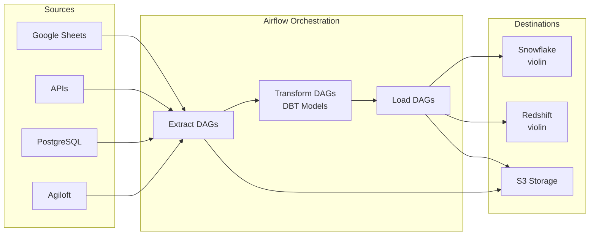

  <h1 style="margin-bottom: 0.5rem;">Repository Overview</h1>
  

    
      🏠 <strong>Overview</strong>
    
    
      📝 <strong>785</strong> words
    
    
      ⏱️ <strong>4</strong> min read
    
  

The `data-airflow-dags` repository is a centralized orchestration platform for Earnest's data engineering pipelines, managing the extraction, transformation, and loading (ETL) of data from multiple sources into data warehouses and storage systems. Built on Apache Airflow, the repository coordinates data workflows that support analytics, reporting, and operational systems across the organization.

## Purpose and Core Capabilities

This repository serves as the primary ETL orchestration layer, providing:

- **Automated data extraction** from external systems including Agiloft, various databases, and APIs
- **Transformation pipelines** using DBT (Data Build Tool) for data modeling and business logic
- **Data loading** into Snowflake, Redshift, and S3 storage
- **Scheduled workflow execution** with dependency management and retry logic
- **Multi-environment deployment** supporting development, staging, and production workflows

## Key Technologies

The platform is built on a modern data engineering stack:

| Technology | Purpose |
|------------|---------|
| **Apache Airflow** | Workflow orchestration and scheduling |
| **DBT (Data Build Tool)** | SQL-based data transformation and modeling |
| **Docker** | Containerization for consistent execution environments |
| **Kubernetes** | Container orchestration and job scheduling |
| **Python** | Primary language for DAG definitions and custom operators |

## Data Sources and Destinations

### Primary Data Sources

- **Agiloft**: Customer relationship and case management system
- **PostgreSQL databases**: Operational data stores
- **Google Sheets**: Manual data inputs and configuration
- **S3**: Raw data files and intermediate storage
- **External APIs**: Various third-party integrations

### Data Destinations

- **Snowflake**: Primary cloud data warehouse (violin database for production)
- **Redshift**: Legacy data warehouse (violin cluster for production, clarinet for staging)
- **S3**: Data lake storage and intermediate processing
- **Google Sheets**: Reporting and data distribution

## Data Flow Architecture

The repository implements a tiered ETL architecture with clear separation between environments:

### Environment-Specific Data Flow

The deployment strategy follows a tiered approach with different data flows per environment:

**Development (Local)**
- Developers read from production data sources (violin/clarinet)
- Write to isolated `scratch_\<user\>` schemas
- Test locally before creating pull requests

**Staging/Pre-Production**
- For Snowflake: Uses staging Airflow cluster, reads from violin, writes to clarinet/stage database
- For Redshift (Proposal B): Uses production Airflow cluster, reads from violin, writes to scratch schema for validation

**Production**
- Runs on production Airflow cluster
- Reads from production sources (violin database)
- Writes to production schemas (PUBLIC/PROD)
- Executes validated and approved code only

> **Note**: The repository implements "Proposal B" for Redshift deployments, which runs both pre-production and production ETL on the same cluster but in different schemas, due to security restrictions around copying production data to staging environments.

## Organizational Structure

The repository is organized around functional teams and ETL phases:

### DAG Organization

DAGs are structured by their role in the data pipeline:

- **Extract DAGs**: Pull data from external sources (e.g., Agiloft, databases)
- **Transform DAGs**: Execute DBT models for data transformation
- **Custom Script DAGs**: Run specialized Python scripts for complex logic
- **Maintenance DAGs**: Handle operational tasks like cleanup and monitoring

For detailed information, see [DAG Organization and Structure](./dag-organization.md).

### DBT Integration

DBT models handle the transformation layer, with profiles configured for each environment:

- **Dev profile**: Connects to development warehouses with user-specific schemas
- **Stage profile**: Connects to staging databases for pre-production validation
- **Prod profile**: Connects to production warehouses for final data delivery

Learn more in [DBT Integration](./dbt-integration.md) and [DBT Models Reference](./dbt-models-reference.md).

## Deployment Pipeline

The repository follows a structured deployment process:

1. **Development**: Build and test queries locally using individual scratch schemas
2. **Pull Request**: Create PR for code review and approval
3. **Staging**: Merge to master branch, deploy to staging environment for validation
4. **Production**: After approval, merge to production branch and deploy to production Airflow cluster
5. **Validation**: Run tests and verify output in production data
6. **Release**: Create versioned releases for significant changes

For setup instructions, see [Local Development Setup](./local-development-setup.md) and [Deployment Guide](./deployment-guide.md).

## Example: Agiloft ETL Workflow

The Agiloft integration demonstrates the repository's ETL capabilities:

**Extract Phase**
- Scheduled jobs query Agiloft REST API for case and employee data
- Incremental loads run every 30 minutes for cases, daily for employees
- Data is written to S3 as intermediate storage

**Transform Phase**
- DBT models process raw Agiloft data
- Transformations create staging tables (`stg_tables.s_agiloft_raw`)
- Working tables (`wrk_tables.w_agl_loan_requests`, `wrk_tables.w_agl_employees`) prepare data for analytics

**Load Phase**
- Final data loaded to Redshift public schema (`public.agl_loan_requests`)
- Available for downstream reporting and analytics in Looker

This pattern reduces data latency from 4 hours to 1-2 hours through more frequent incremental loads.

## Getting Started

To begin working with this repository:

1. **Set up your local environment**: [Local Development Setup](./local-development-setup.md)
2. **Understand the architecture**: [System Architecture](./architecture.md)
3. **Create your first DAG**: [Creating New DAGs](./creating-new-dags.md)
4. **Add DBT models**: [Adding DBT Models](./adding-dbt-models.md)
5. **Configure connections**: [Configuration Management](./configuration-management.md)

For troubleshooting common issues, refer to the [Troubleshooting Guide](./troubleshooting.md).