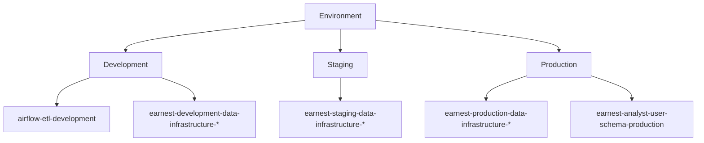
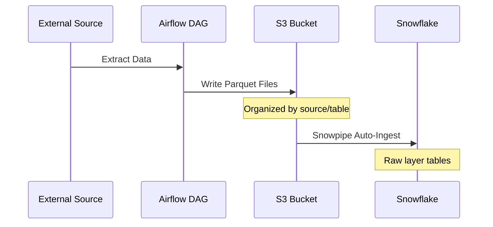

<div style="border-bottom: 1px solid var(--vp-c-divider); padding-bottom: 1rem; margin-bottom: 2rem;">
  <h1 style="margin-bottom: 0.5rem;">S3 Storage Patterns</h1>
  <div style="display: flex; gap: 1rem; flex-wrap: wrap; font-size: 0.9rem; color: var(--vp-c-text-2);">
    <span style="display: flex; align-items: center; gap: 0.25rem;">
      📖 <strong>Guide</strong>
    </span>
    <span style="display: flex; align-items: center; gap: 0.25rem;">
      📝 <strong>793</strong> words
    </span>
    <span style="display: flex; align-items: center; gap: 0.25rem;">
      ⏱️ <strong>4</strong> min read
    </span>
  </div>
</div>

AWS S3 serves as the primary intermediate storage layer in the data pipeline, bridging extraction from source systems and transformation in the data warehouse. This page documents the bucket organization, file format conventions, partitioning strategies, and access patterns observed in the codebase.

## Bucket Organization

The system uses environment-specific S3 buckets organized by data source and purpose. Bucket names follow a consistent naming pattern that includes the environment and purpose.

### Environment-Specific Buckets



### Primary Bucket Types

| Bucket Purpose | Configuration Key | Description |
|----------------|------------------|-------------|
| Redshift Data Stage | `redshift_bucket` | Intermediate storage for Redshift COPY/UNLOAD operations |
| API Data Stage | `api_bucket` | Data extracted from external APIs (CX1, Even, Ada, Zendesk, etc.) |
| SFTP Data Stage | `experian_sftp_bucket`, `navient_sftp_bucket`, `sst_sftp_bucket` | Files received via SFTP from external partners |
| Analyst Bucket | `analyst_bucket` | User-generated files and ad-hoc analysis inputs |
| Airflow Bucket | `airflow_bucket` | DAG artifacts and operational data |
| EMR Resources | `emr.bucket` | Spark scripts, bootstrap scripts, and EMR logs |
| Braze Data Stage | `braze.bucket` | Braze segment export data |
| Data Science | `conversion_model.s3_bucket` | Machine learning model artifacts |

## File Format Conventions

### Parquet as Primary Format

The system standardizes on **Parquet** format for intermediate data storage. The `S3Manager` class provides utilities for converting other formats to Parquet:

```python
def reformat_file_to_parquet(
    self,
    bucket: str,
    source_path: str,
    target_path: str,
    header: List[str],
    delimiter: str,
):
    # Reads CSV/delimited files and converts to Parquet
    df = pd.read_csv(...)
    df.to_parquet(buffer, index=False)
```

### Format by Data Source

| Data Source | Source Format | Target Format | Notes |
|-------------|--------------|---------------|-------|
| Impala (Navient/Mohela) | JDBC Query Results | Parquet | Extracted via Spark on EMR |
| SFTP Files | CSV, Delimited | Parquet | Converted using `reformat_file_to_parquet` |
| API Responses | JSON | Parquet | Processed and stored for Snowpipe ingestion |
| GPG Encrypted Files | Encrypted CSV | Parquet | Decrypted then converted (Deserve integration) |
| Model Artifacts | Pickle | Pickle | ML models stored as-is |

## Partitioning Strategies

### Time-Based Partitioning

Data extracted from Impala sources uses time-based partitioning inherited from the source system:

> **From RFC 0002**: All Impala tables/views are partitioned by `year` and `month`, with some also partitioned by `day`. These partitions enable parallel extraction.

### Source-Specific Path Patterns

Different integrations use distinct S3 path patterns:

**API Integrations (CX1, Zendesk, Even, Ada)**
```
{bucket}/{source}/snow_pipes/{table_name}/
```

Example from configuration:
- `cx1/snow_pipes/completed_contacts/`
- `zendesk/snow_pipes/chat_data/`
- `Even/snow_pipes/lead_events/`

**SFTP Integrations**
```
{bucket}/{source}/raw/
{bucket}/{source}/archive/
{bucket}/{source}/v1/reports/
```

Example from Deserve GPG configuration:
- `deserve/raw/` - Decrypted files
- `deserve/archive/` - Processed files
- `deserve/v1/reports/` - Partitioned reports

**Analyst and Ad-Hoc Data**
```
{bucket}/analytics/{purpose}/
{bucket}/marketing/{campaign}/
```

Examples from `adhoc_ingest_config`:
- `analytics/prepayments/`
- `marketing/direct-mail/`
- `analytics/going_merry/`

## Access Patterns

### Extract → S3 → Transform Flow



### S3Manager Operations

The `S3Manager` class provides standardized operations for S3 interactions:

**Upload Operations**
- `upload_file()` - Single file upload
- `upload_folder()` - Recursive folder upload with path preservation
- `upload_string()` - Direct string content upload

**File Management**
- `list_files()` - Paginated listing with prefix filtering
- `copy_file()` - Server-side copy within bucket
- `copy_folder()` - Batch copy with optional deletion
- `remove_file()` - File deletion

**Format Conversion**
- `reformat_file_to_parquet()` - CSV/delimited to Parquet conversion

**Artifact Loading**
- `load_artifact()` - Pickle artifact deserialization
- `from_s3_download_read_and_load_pickle_fileobj()` - Combined download and unpickle

### IAM and Access Control

Access to S3 buckets is controlled through:

1. **Kubernetes Service Accounts** (non-local environments)
   - Annotated with IAM role ARNs
   - Example: `arn:aws:iam::831351477977:role/de-airflow-c1-de-stg-us-east-1`

2. **Redshift IAM Role** (for COPY/UNLOAD)
   - Configured per environment in `redshift_violin.iam_role`
   - Example: `arn:aws:iam::075440130607:role/redshift_s3_rw`

3. **Snowflake Storage Integration**
   - Configured per environment: `development_s3`, `staging_s3`, `production_s3`
   - Enables Snowpipe to read from S3 buckets

## Lifecycle Policies

> **Note**: Explicit lifecycle policies are not defined in the inspected configuration files. Lifecycle management appears to be handled at the infrastructure level outside this repository.

### Archive Patterns

Some integrations implement manual archiving:

**Deserve GPG Files**
```python
"source_key_prefix": "deserve/home/Inbox/",
"target_folder": "deserve/raw/",
"archive_folder": "deserve/archive/",
```

Files move through stages:
1. Inbox → Raw (after decryption)
2. Raw → Archive (after processing)

## Integration with Data Warehouse

### Snowpipe Ingestion

S3 paths are designed to align with Snowflake Snowpipe auto-ingestion:

```python
# CX1 configuration example
"s3_path_sp_completed_contacts": "cx1/snow_pipes/completed_contacts/"
```

The `snow_pipes/` path segment indicates data staged for Snowpipe consumption.

### Redshift COPY Operations

Redshift integrations use dedicated buckets for staging:

```python
redshift_params = {
    "iam_role": redshift_cred["iam_role"],  # For S3 access
    # ... other params
}
```

The `redshift_bucket` serves as the staging area for COPY and UNLOAD operations.

## EMR and Spark Integration

### EMR Resource Storage

EMR clusters use dedicated S3 buckets for:

**Bootstrap Scripts**
```python
"Path": f"s3://{emr_conf['bucket']}/scripts/bootstrap_script.sh"
```

**Cluster Logs**
```python
"LogUri": f"s3://{emr_conf['bucket']}/logs"
```

### Impala to S3 Migration Pattern

The RFC 0002 document describes the pattern for migrating large datasets from Impala to S3:

1. **Parallel Extraction**: Query Impala by partition (year/month/day)
2. **Spark Processing**: Read via JDBC, write as Parquet
3. **S3 Storage**: Organized by table and partition
4. **Snowpipe Ingestion**: Automatic loading into Snowflake raw layer

This pattern enables handling of large tables (3+ billion rows) through parallelization.

## Configuration Management

S3 bucket configuration is centralized in `dags/common/utils/config.py` and varies by environment:

```python
config = Config()
s3_redshift_bucket = config.get_property("redshift_bucket")
s3_api_bucket = config.get_property("api_bucket")
# ... other bucket references
```

All bucket names are environment-aware and retrieved through the `Config` class, which selects configuration based on the `ENVIRONMENT` variable.

## Related Documentation

- [Extract DAGs](./extract-dags.md) - DAGs that write to S3
- [Transform DAGs](./transform-dags.md) - DAGs that read from S3
- [Data Flow Patterns](./data-flow-patterns.md) - End-to-end data movement
- [External System Integrations](./external-integrations.md) - Source systems writing to S3
- [Configuration Management](./configuration-management.md) - Environment-specific settings