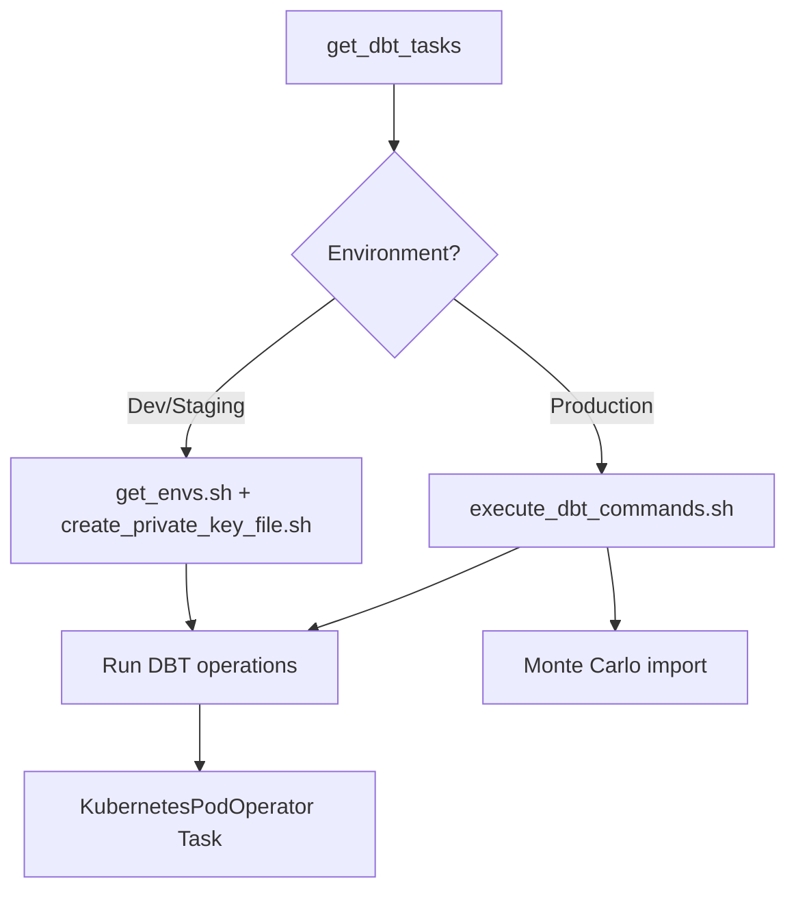
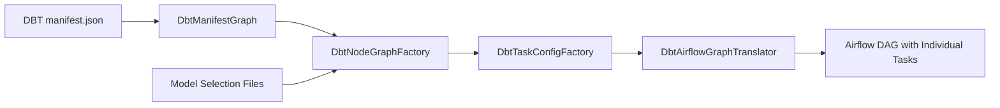

<div style="border-bottom: 1px solid var(--vp-c-divider); padding-bottom: 1rem; margin-bottom: 2rem;">
  <h1 style="margin-bottom: 0.5rem;">Transform DAGs</h1>
  <div style="display: flex; gap: 1rem; flex-wrap: wrap; font-size: 0.9rem; color: var(--vp-c-text-2);">
    <span style="display: flex; align-items: center; gap: 0.25rem;">
      📚 <strong>Reference</strong>
    </span>
    <span style="display: flex; align-items: center; gap: 0.25rem;">
      📝 <strong>916</strong> words
    </span>
    <span style="display: flex; align-items: center; gap: 0.25rem;">
      ⏱️ <strong>5</strong> min read
    </span>
  </div>
</div>

Transform DAGs orchestrate DBT (Data Build Tool) transformations through Airflow, executing data models across multiple environments and schedules. These DAGs use the `KubernetesPodOperator` to run DBT commands in isolated containers, enabling parallel execution and fine-grained control over model runs.

## Overview

The repository contains two primary patterns for DBT orchestration:

1. **Standard DBT DAGs**: Simple DAGs that run a selection of DBT models together
2. **Fan-Out DAGs**: Advanced DAGs that create individual Airflow tasks for each DBT model, enabling granular control and retry logic

All DBT transformations target either Snowflake or Redshift data warehouses, with environment-specific execution patterns for development, staging, and production.

## Dynamic Task Generation

### `get_dbt_tasks()` Function

The core of DBT orchestration is the `get_dbt_tasks()` function in `common/dag_builder.py`, which dynamically generates `KubernetesPodOperator` tasks:

```python
def get_dbt_tasks(
    dbt_settings: Dict,
    operations: Optional[Tuple] = ("debug", "run", "test"),
    task_id_suffix: Optional[str] = "",
    node_selector: Dict = None,
    **kwargs,
) -> KubernetesPodOperator
```

**Key behaviors:**

- **Default operations**: `debug`, `run`, `test` executed sequentially
- **Environment-specific execution**:
  - **Production**: Uses `execute_dbt_commands.sh` script and includes Monte Carlo CLI integration for data observability
  - **Non-production**: Retrieves Vault credentials dynamically and creates private key files at runtime
- **Container resources**: Uses `dbt_child_pod_resources` for resource allocation
- **Node selection**: Supports Kubernetes node selectors for production workloads (e.g., Karpenter-managed nodes)

### Environment-Specific Behavior



**Production execution:**
- Pipes DBT operations through `execute_dbt_commands.sh`
- Sends run results to Monte Carlo for data quality monitoring
- Uses pre-configured Vault secrets via `vault_token_secret`

**Development/Staging execution:**
- Dynamically retrieves Snowflake credentials from Vault
- Creates private key files for authentication
- Chains DBT commands with shell operators

## Standard DBT DAG Pattern

### `create_dbt_dag()` Function

Creates a simple DBT DAG with a single task group:

```python
def create_dbt_dag(dag_id, dbt_settings, node_selector=None, **kwargs):
    if "tags" in kwargs:
        kwargs["tags"].append("dbt")
    else:
        kwargs["tags"] = ["dbt"]

    if dag_id.startswith("pre_prod"):
        kwargs["tags"].append("pre_prod")

    with airflow_DAG(dag_id=dag_id, **kwargs) as dag:
        all(get_dbt_tasks(dbt_settings=dbt_settings, node_selector=node_selector))
        dag.get_task("dbt_operation")

    return dag
```

**Automatic tagging:**
- All DBT DAGs receive the `"dbt"` tag
- Pre-production DAGs (prefixed with `pre_prod`) receive the `"pre_prod"` tag

### `dbt_airflow_DAG()` Wrapper

The `dbt_airflow_DAG()` function creates both production and pre-production DAGs for Redshift warehouses:

```python
def dbt_airflow_DAG(dag_id, dbt_settings, node_selector=None, **kwargs):
    pre_prod_dag = None
    prod_dag = create_dbt_dag(
        dag_id=dag_id, dbt_settings=dbt_settings, node_selector=node_selector, **kwargs
    )
    if (
        os.environ["ENVIRONMENT"] == "production"
        and dbt_settings["warehouse"] == "redshift"
    ):
        kwargs["schedule_interval"] = None
        dbt_settings["pre_prod"] = True
        pre_dag_id = "pre_prod_" + dag_id
        pre_prod_dag = create_dbt_dag(
            dag_id=pre_dag_id,
            dbt_settings=dbt_settings,
            node_selector=node_selector,
            **kwargs,
        )
    return pre_prod_dag, prod_dag
```

**Pre-production DAGs:**
- Only created in production environment for Redshift warehouses
- Schedule is set to `None` (manual trigger only)
- Allows testing transformations against production data before enabling scheduled runs

### Example: Agiloft Transform DAG

```python
models = ["data_team.agiloft"]

dbt_settings = {
    "warehouse": "snowflake",
    "models": " ".join(models),
}

_, prod_dag = dbt_airflow_DAG(
    dag_id="dbt_agiloft",
    dbt_settings=dbt_settings,
    schedule_interval="0 6-20 * * *",
    start_date=get_timezone_aware_date(date=(2021, 1, 1)),
    tags=["DBT", "agiloft"],
)
```

This creates a DAG that runs hourly from 6 AM to 8 PM, executing all models in the `data_team.agiloft` namespace.

## Fan-Out DAG Pattern

Fan-Out DAGs provide granular control by creating individual Airflow tasks for each DBT model, preserving the dependency graph from DBT's manifest.

### Architecture



### Key Components

#### 1. DbtManifestGraph

Parses `manifest.json` to build a directed graph of DBT models:

```python
class DbtManifestGraph(BaseModel):
    nodes: Dict[str, Node]
    graph: DiGraph = None
```

- Extracts nodes (models, tests, snapshots) and their dependencies
- Creates a NetworkX `DiGraph` representing the DBT dependency structure

#### 2. DbtNodeGraphFactory

Creates subgraphs for specific model selections and removes ephemeral models:

```python
@dataclass
class DbtNodeGraphFactory:
    nodes: Dict[str, Node]
    graph: DiGraph

    def __call__(self, model_nodes: List[str]) -> DiGraph:
        H = self.graph.subgraph(model_nodes)
        ephemerals = self._get_materialization_by_type(
            H, DbtMaterializationType.ephemeral
        )
        return self._remove_nodes_perserve_path(H, ephemerals)
```

**Ephemeral handling**: Ephemeral models (CTEs) are removed from the graph while preserving dependency paths between physical materializations.

#### 3. DbtTaskConfigFactory

Generates task configurations for each model:

```python
@dataclass
class DbtTaskConfigFactory:
    dbt_settings: Dict[str, str]
    model_command_mapping: Dict[str, str]
    models_with_test_dependencies: Iterable[str]
    priority_weight_models: Iterable[str]
```

**Task configuration includes:**
- **Operations**: `run` for models, `snapshot` for snapshots, plus `test` if tests exist
- **DBT settings**: Model-specific settings with the model name
- **Priority weights**: Higher priority for models tagged with `priority_weight`

#### 4. DbtAirflowGraphTranslator

Translates the DBT graph into Airflow task dependencies:

```python
@dataclass
class DbtAirflowGraphTranslator:
    dbt_task_configs: List[DbtTaskConfig]
    relationships: Set[Tuple[str, str]]

    def translate_dbt_to_airflow_graph(self, debug_task) -> None:
        dbt_task_groups = self._build_dbt_task_groups(debug_task)
        all(self._set_inter_task_group_dependencies(dbt_task_groups))
```

Each model gets a task with ID `dbt_operation_{model_name}`, and dependencies mirror the DBT graph.

### Fan-Out Configurations

The repository defines multiple fan-out schedules in `dbt_fan_out_dag_factory.py`:

| Fan-Out Name | Schedule | Description |
|--------------|----------|-------------|
| `every_two_hours_weekdays` | `0 0,4-18/2 * * 1-5` | Midnight and every 2 hours from 4-18, Mon-Fri |
| `twice_daily_on_weekends_for_two_hours_weekday_models` | `0 5-17/4 * * 6,0` | Every 4 hours from 5-17, Sat-Sun |
| `hourly_weekdays` | `0 0,6-20 * * *` | Midnight and hourly from 6-20, daily |
| `twice_daily_on_weekends_for_hourly_weekday_models` | `0 21 * * 6,0` | 9 PM, Sat-Sun |
| `twice_daily` | `0 0,12 * * *` | Midnight and noon, daily |
| `nightly` | `0 0 * * *` | Midnight, daily |
| `weekly` | `0 12 * * 1` | Noon on Mondays |
| `monthly` | `0 0 3 * *` | 3rd of each month |
| `navient_daily` | `0 6 * * 1-5` | 6 AM, Mon-Fri |

### Model Selection

Models are selected for fan-outs using DBT selectors defined in `dbt/selectors.yml`. The selection process:

1. Run `bin/generate_artifacts.sh` to generate model lists (e.g., `hourly.txt`, `nightly.txt`)
2. Each artifact file contains JSON-lines with model metadata
3. Models tagged with `ignore_model_to_fan_out` are excluded from fan-out execution

### Fan-Out DAG Example

```python
dag_id = f"dbt_fan_out_{dbt_fan_out_config.name}"

globals()[dag_id] = airflow_DAG(
    dag_id=dag_id,
    start_date=dbt_fan_out_config.start_date,
    schedule_interval=dbt_fan_out_config.schedule,
    tags=["fan_out", "transformation"],
    concurrency=50,
    max_active_runs=1,
)

with globals()[dag_id] as dag:
    debug_task, *_ = build_debug_task(dbt_settings)
    translator.translate_dbt_to_airflow_graph(debug_task)
```

**Concurrency settings:**
- `concurrency=50`: Up to 50 tasks can run simultaneously
- `max_active_runs=1`: Only one DAG run at a time

## DBT Settings Structure

All DBT DAGs use a `dbt_settings` dictionary:

```python
dbt_settings = {
    "warehouse": "snowflake",  # or "redshift"
    "models": "data_team.agiloft",  # Model selection
    "exclusions": "tag:disable",  # Optional: exclude models
    "pre_prod": True,  # Optional: pre-production flag
}
```

**Common settings:**
- `warehouse`: Target data warehouse (`snowflake` or `redshift`)
- `models`: DBT model selector (namespace, tag, or specific model)
- `exclusions`: Models to exclude (typically `tag:disable`)
- `pre_prod`: Flag for pre-production execution (Redshift only)

## DBT Models Organization

> The codebase references "~45+ DBT models organized by team and domain" but the actual DBT models are not visible in the provided files. The models are located in the `dbt/` directory and organized by team namespaces like `data_team`, `data_platform_team`, etc.

Based on observable DAG definitions:

**Team namespaces:**
- `data_team`: Business domain models (e.g., `agiloft`, `conversion_model`)
- `data_platform_team`: Platform and infrastructure models

**Model types:**
- Standard models (materialized as tables or views)
- Snapshots (slowly changing dimensions)
- Incremental models
- Ephemeral models (CTEs, not materialized)

## DBT Documentation Generation

The `dbt-docs-generator` DAG creates documentation artifacts:

```python
dbt_settings = {
    "warehouse": "snowflake",
}

with airflow_DAG(dag_id="dbt-docs-generator", **dbt_args) as dag:
    start = EmptyOperator(task_id="start", dag=dag)
    generate_docs = dbt_docs_task(dbt_settings=dbt_settings)
    end = EmptyOperator(task_id="end", dag=dag)
    start >> generate_docs >> end
```

**Schedule**: `0 6,14 * * *` (6 AM and 2 PM daily)

The `dbt_docs_task()` function runs `dbt docs generate` to create JSON documentation artifacts for consumption by a documentation microservice.

## Integration with Custom Scripts

Transform DAGs can be integrated with custom Python logic, as seen in the conversion model DAG:

```python
dbt_settings_tables = {
    "dbt_settings_conversion_model": {
        "warehouse": "snowflake",
        "models": "data_team.conversion_model.conversion_model_input",
    }
}

with airflow_DAG(dag_id="conversion_model_dag", ...) as dag:
    # Run DBT model first
    all(
        get_dbt_tasks(
            dbt_settings=dbt_settings_tables["dbt_settings_conversion_model"],
            task_id_suffix="_conversion_model",
        )
    )
    
    # Then run custom Python logic
    get_repository_task = PythonOperator(...)
    
    start >> dag.get_task("dbt_operation_conversion_model") >> get_repository_task >> ...
```

This pattern allows DBT transformations to prepare data for downstream machine learning or custom processing tasks.

## Relationship to Other Components

- **[dbt-integration](./dbt-integration.md)**: Details on DBT command generation and Vault integration
- **[dbt-models-reference](./dbt-models-reference.md)**: Comprehensive reference of available DBT models
- **[dag-builder-framework](./dag-builder-framework.md)**: Core DAG construction utilities
- **[data-warehouses](./data-warehouses.md)**: Snowflake and Redshift connection details
- **[deployment-guide](./deployment-guide.md)**: Environment-specific deployment patterns

## Key Constraints

1. **Environment detection**: All environment-specific behavior depends on `os.environ["ENVIRONMENT"]`
2. **Redshift pre-prod**: Pre-production DAGs only created for Redshift in production environment
3. **Kubernetes dependency**: All DBT execution requires Kubernetes cluster with appropriate node pools
4. **Vault integration**: Production execution requires Vault for credential management
5. **Manifest dependency**: Fan-out DAGs require up-to-date `manifest.json` artifacts