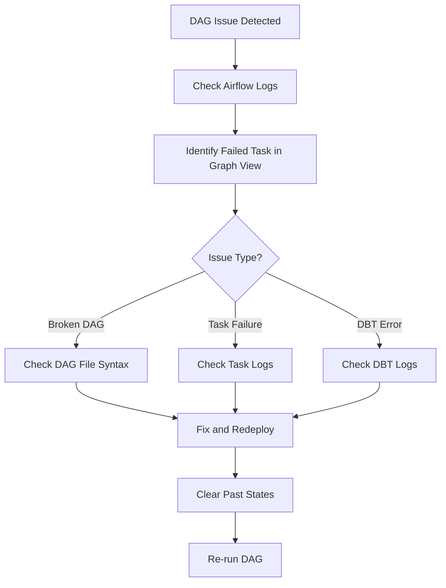

<div style="border-bottom: 1px solid var(--vp-c-divider); padding-bottom: 1rem; margin-bottom: 2rem;">
  <h1 style="margin-bottom: 0.5rem;">Troubleshooting Guide</h1>
  <div style="display: flex; gap: 1rem; flex-wrap: wrap; font-size: 0.9rem; color: var(--vp-c-text-2);">
    <span style="display: flex; align-items: center; gap: 0.25rem;">
      📖 <strong>Guide</strong>
    </span>
    <span style="display: flex; align-items: center; gap: 0.25rem;">
      📝 <strong>1,390</strong> words
    </span>
    <span style="display: flex; align-items: center; gap: 0.25rem;">
      ⏱️ <strong>7</strong> min read
    </span>
  </div>
</div>

This guide documents common issues encountered when developing and running DAGs in the data-airflow-dags repository, along with diagnostic steps and resolution strategies.

## General Troubleshooting Workflow

When a DAG fails or behaves unexpectedly, follow this systematic approach:



### Initial Diagnostic Steps

1. **Check the Airflow logs** for error messages and stack traces
2. **Navigate to the DAG's Graph View** in the Airflow web interface to identify failed task instances
3. **Identify the failure type** (broken DAG vs. task failure)

> **Tip**: For large DAGs, change the graph view orientation from LR to RL by overriding the web server's default `dag_orientation` configuration to make navigation easier.

## Broken DAG Issues

A "broken DAG" occurs when the DAG file itself contains errors that prevent Airflow from parsing or loading it.

### Symptoms

- DAG does not appear in the Airflow UI
- Error message displayed in the DAG list view
- DAG shows as "broken" with a red indicator

### Diagnostic Steps

1. **Check the Airflow UI** for the error message displayed next to the broken DAG
2. **View the full stack trace** by running:
   ```bash
   docker exec -it data-airflow-dags_dev_1 bash -c "airflow list_dags"
   ```

### Common Causes

- **Python syntax errors** in the DAG file
- **Import errors** for missing or incorrectly referenced modules
- **Configuration errors** in DAG parameters
- **Missing dependencies** in the `common` module

### Resolution

1. Fix the syntax or import errors in the DAG file
2. Ensure all required modules are available
3. Validate the DAG locally before deploying
4. Run validation commands:
   ```bash
   ./go validate
   ./go test
   ```

## Task Failure Issues

Task failures occur when a DAG is successfully parsed but individual tasks fail during execution.

### Diagnostic Steps

1. **Navigate to the Graph View** of the failed DAG
2. **Identify the failed task** (indicated by a red perimeter)
3. **Click on the failed task** and select "View Log"
4. **Review the task logs** for error messages and stack traces

### Common Task Failure Categories

#### Operator-Specific Failures

Check operator-specific logs for detailed error information:

- **DBT operators**: Check DBT compilation and execution logs
- **Python operators**: Review Python exception stack traces
- **Bash operators**: Check command exit codes and stderr output
- **Snowflake operators**: Review SQL execution errors

#### Connection Issues

Connection failures typically manifest as timeout or authentication errors.

**Common causes:**
- Invalid credentials in Airflow connections
- Network connectivity issues
- Database/service unavailable
- Expired authentication tokens

**Resolution:**
1. Verify connection configuration in Airflow UI (Admin > Connections)
2. Test connectivity from the Airflow container
3. Check service availability
4. Refresh credentials if expired

## DBT Transformation Errors

DBT-specific errors require special attention due to the complexity of model dependencies and transformations.

### DBT Compilation Errors

**Symptoms:**
- Errors during the `dbt debug` or `dbt compile` phase
- References to missing models or sources
- Jinja templating errors

**Diagnostic steps:**
1. Check the DBT debug task logs in Airflow
2. Review the model's SQL for syntax errors
3. Verify all referenced models exist
4. Check `~/.dbt/profiles.yml` configuration

**Resolution:**
1. Fix SQL syntax or Jinja template errors
2. Ensure all model dependencies are defined
3. Verify DBT profile configuration is correct
4. Run `dbt compile` locally to validate changes

### DBT Execution Errors

**Symptoms:**
- Errors during `dbt run` or `dbt test` tasks
- SQL execution failures in the data warehouse
- Data quality test failures

**Diagnostic steps:**
1. Review the specific model's execution logs
2. Check the rendered SQL in the task logs
3. Verify data warehouse permissions
4. Review test definitions for accuracy

**Resolution:**
1. Fix SQL logic errors in the model
2. Adjust data warehouse permissions if needed
3. Update test thresholds or logic as appropriate
4. Use DBTClone to reproduce production data locally for testing

### DBT Fan-Out DAG Failures

Fan-out DAGs create individual Airflow tasks for each DBT model, providing granular control but introducing specific failure patterns.

**Symptoms:**
- Individual model tasks failing in a fan-out DAG
- Dependency chain failures
- Ephemeral model resolution issues

**Diagnostic steps:**
1. Identify the specific failed model task in the Graph View
2. Check if the failure is in the model itself or its dependencies
3. Review the manifest.json artifact for dependency graph accuracy
4. Verify selector configuration in `dbt/selectors.yml`

**Resolution:**
1. Fix the failing model and retry only that task (no need to rerun the entire workflow)
2. Refresh artifacts if model dependencies changed:
   ```bash
   bin/generate_artifacts.sh
   ```
3. Verify selector tags are correctly applied to models
4. Check that ephemeral models are properly handled in the dependency graph

> **Note**: Fan-out DAGs allow you to retry individual failed models without rerunning the entire pipeline, saving time and compute resources.

## Resource Constraint Issues

Resource constraints can cause tasks to fail or run slowly.

### Memory Issues

**Symptoms:**
- Tasks killed with "Out of Memory" errors
- Slow task execution
- Container restarts

**Resolution:**
1. Increase memory allocation for the task using `task_settings`
2. Optimize SQL queries to reduce memory footprint
3. Process data in smaller batches
4. Use incremental materialization for large DBT models

### Compute Resource Issues

**Symptoms:**
- Tasks timing out
- Warehouse query queueing
- Slow data processing

**Resolution:**
1. Adjust warehouse size in DBT settings
2. Use appropriate node selectors for Kubernetes pods:
   ```python
   node_selector = {
       "karpenter.sh/nodepool": "data-airflow",
       "karpenter.sh/capacity-type": "on-demand",
   }
   ```
3. Optimize query performance
4. Consider breaking large transformations into smaller tasks

### Priority Weight Configuration

For critical models in fan-out DAGs, use priority weights to ensure they execute first:

```python
task_settings = {"priority_weight": 2}
```

This is configured in the `DbtTaskConfigFactory` for models in the `priority_weight_models` list.

## Complex DAG Troubleshooting

Some DAGs have complex workflows that require specialized troubleshooting approaches.

### Dynamic Query Generation Issues

For DAGs that generate SQL dynamically (e.g., Braze delta calculation), debugging requires inspecting the rendered query.

**Steps to view rendered queries:**
1. Navigate to the failed task in Airflow UI
2. Click on the task and select "Rendered"
3. Locate the `op_kwargs` section containing the generated SQL
4. Copy the SQL from the `sql_statements` array
5. Test the query directly in the data warehouse (e.g., Snowflake)
6. Fix the query generation logic in the code

**Example rendered output:**
```json
{
  "sql_statements": ["CREATE OR REPLACE TABLE ...", "INSERT INTO ..."]
}
```

### Monitoring DAG Failures

Monitor DAGs track data quality and system health. When these fail, it may indicate underlying data issues.

**Common monitoring DAG patterns:**
- `dbt_monitor_looker_usage`: Monitors Looker warehouse errors
- `dbt_monitor_secret_schema_usage`: Monitors Navient/Workday schema usage

**Resolution:**
1. Check if the failure indicates a real data quality issue
2. Review the monitored system for problems
3. Adjust monitoring thresholds if needed
4. Fix underlying data issues if detected

## Debugging Techniques

### Local Development Debugging

When developing DAGs locally:

1. **Set `schedule_interval` to `None`** to prevent automatic execution
2. **Set `catchup=False`** to avoid backfilling
3. **Trigger DAGs manually** from the Airflow UI
4. **Monitor task states** using color indicators:
   - Dark green: Success
   - Red: Failed
   - Yellow: Upstream failed
   - Phosphorescent green: Running

### Using DBTClone for Local Testing

DBTClone allows you to reproduce production data locally without running full pipelines:

```bash
dbtclone -m <model_name>
```

**Use cases:**
- Testing model changes against production data
- Debugging data-specific issues
- Comparing development output to production

**Requirements:**
- Must be run from inside the `/dbt` directory
- Requires Snowflake environment variables configured in `~/.zshrc`
- Reads from `target/manifest.json` to identify dependencies

### Clearing Past States

After fixing issues, clear past task states to allow re-execution:

1. Navigate to the DAG in the Airflow UI
2. Select "Clear" from the DAG actions menu
3. Choose the tasks or date range to clear
4. Confirm the action

This allows Airflow to re-run the tasks without manual intervention.

## Environment-Specific Issues

### Pre-Production vs. Production

DAGs are deployed to both pre-production and production environments using the `dbt_airflow_DAG` builder:

```python
pre_prod_dag, prod_dag = dbt_airflow_DAG(
    dag_id="dbt_monitor_looker_usage",
    dbt_settings=DBT_SETTINGS,
    schedule_interval=SCHEDULE_INTERVAL,
    tags=["monitor", "looker-wh", "snowflake"],
    start_date=get_timezone_aware_date(date=(2021, 1, 1)),
)
```

**Troubleshooting environment-specific issues:**
1. Verify the correct environment is being targeted
2. Check environment-specific configuration in `common/utils/config.py`
3. Ensure credentials are correct for the target environment
4. Test in pre-production before deploying to production

## Best Practices for Prevention

### Before Deployment

1. **Validate locally** using `./go validate`
2. **Run tests** using `./go test`
3. **Test in pre-production** before promoting to production
4. **Review DAG configuration** for correct schedule and settings
5. **Verify all dependencies** are available

### During Development

1. **Use appropriate logging** to aid future debugging
2. **Handle errors gracefully** with try-catch blocks where appropriate
3. **Document complex logic** in code comments
4. **Test edge cases** and error conditions
5. **Use idempotent operations** where possible

### After Deployment

1. **Monitor initial runs** closely
2. **Set up appropriate alerts** (see [monitoring-alerting](./monitoring-alerting.md))
3. **Document known issues** and their resolutions
4. **Review logs regularly** for warnings or anomalies

## Related Documentation

- [Local Development Setup](./local-development-setup.md) - Setting up your development environment
- [Creating New DAGs](./creating-new-dags.md) - Best practices for DAG creation
- [DBT Integration](./dbt-integration.md) - Understanding DBT integration patterns
- [Monitoring and Alerting](./monitoring-alerting.md) - Setting up monitoring for DAGs
- [Testing Strategy](./testing-strategy.md) - Testing approaches for DAGs