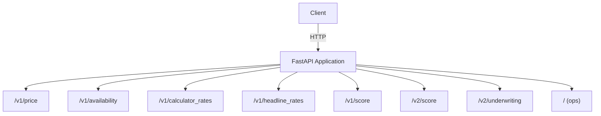
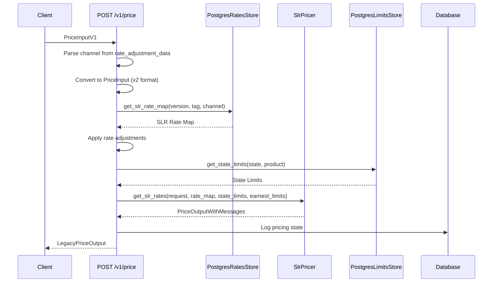
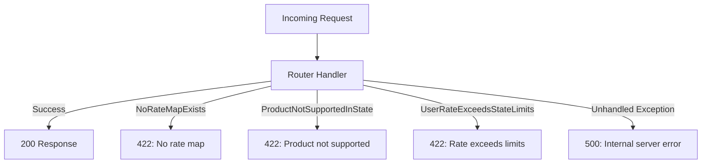

# API Endpoints Reference

Complete reference of all REST API endpoints exposed by the pricing-service-v2. This service generates interest rates and scoring for Earnest's loan products, primarily Student Loan Refinance (SLR) and Student Loan Origination (SLO).

## Overview

The pricing service is built with [FastAPI](./technology-stack.md) and exposes endpoints across multiple versioned prefixes. All endpoints are registered in `pricing_service/main.py` through FastAPI routers.

## Auto-Generated API Documentation

FastAPI automatically generates interactive API documentation. Access varies by environment:

| Environment | ReDoc | Swagger UI |
|-------------|-------|------------|
| PBE (Dev) | `https://pricing-service-v2.slo-dev.earnest.com/redoc` | `https://pricing-service-v2.slo-dev.earnest.com/documentation` |
| Staging | `https://pricing-service-v2.staging.earnest.com/redoc` | `https://pricing-service-v2.staging.earnest.com/documentation` |
| Production | `https://pricing-service-v2.internal.earnest.com/redoc` | Disabled for security |

> **Note:** The Swagger UI endpoint is configured via `get_swagger_docs_endpoint()` and the ReDoc endpoint (`/redoc`) is explicitly disabled in production (`redoc_url=None` when `env == "production"`).

## Router Registration

All routers are registered in `main.py` with specific prefixes and tags:

| Router Module | Prefix | Tag(s) | Description |
|---------------|--------|--------|-------------|
| `ops` | _(none)_ | `ops` | Operational health endpoints |
| `price` | `/v1` | `price` | SLR pricing |
| `slo` | `/v1/price` | `price` | SLO pricing |
| `availability` | `/v1` | `availability` | Product/state availability |
| `calculator_rates` | `/v1` | `calculator` | Calculator rate generation |
| `headline_rates` | `/v1` | `headline` | Headline rates |
| `headline_rates_by_term` | `/v1` | `headline` | Headline rates by loan term |
| `slr_static` | `/v1/score` | `score` | SLR static scoring |
| `slr_dynamic_v1` | `/v1/score` | `score` | SLR dynamic scoring (v1) |
| `slr_dynamic` | `/v2/score` | `score` | SLR dynamic scoring (v2) |
| `pl` | `/v2/score` | `score`, `pl` | Personal loan scoring |
| `underwriting_test` | `/v2/underwriting` | `underwriting` | Underwriting test endpoints |

## Endpoint Groups

### Price Endpoints

#### `POST /v1/price`

Generates prices for the **Student Loan Refinance (SLR)** product.

- **Tag:** `price`
- **Response Model:** `LegacyPriceOutput`
- **Request Body:** `PriceInputV1`

**Request flow:**

**Key behavior:**
- The channel is extracted from `rate_adjustment_data.name`; defaults to `"unknown"` if not provided.
- Rate adjustments (e.g., channel discounts) are applied to the rate map before pricing.
- State limits and Earnest variable limits are validated. If limits are exceeded, a `422` response is returned.
- Every request is logged to the database via `PricingServiceLogSaver`.

**Error responses:**

| Status | Condition |
|--------|-----------|
| `422` | `NoRateMapExists` — no matching rate map found |
| `422` | `ProductNotSupportedInState` — product not available in the requested state |
| `422` | `UserRateExceedsStateLimits` — computed rate exceeds state regulatory limits |

#### SLO Price Endpoint

The `slo` router is mounted at `/v1/price` with the `price` tag. Based on the router registration pattern, SLO pricing endpoints are available under this prefix. The exact endpoint paths and schemas are defined in `pricing_service/routers/slo.py`.

> **Note:** The SLO router source was not provided for inspection. Refer to the auto-generated Swagger/ReDoc documentation for exact request/response schemas.

### Calculator Rates Endpoints

Mounted at `/v1` with the `calculator` tag. These endpoints provide rate information for loan calculators shown to users.

> The exact endpoint paths and schemas are defined in `pricing_service/routers/calculator_rates.py`. Consult the auto-generated API docs for full details.

### Headline Rates Endpoints

Two routers serve headline rate data, both mounted at `/v1` with the `headline` tag:

| Router | Purpose |
|--------|---------|
| `headline_rates` | General headline rates |
| `headline_rates_by_term` | Headline rates filtered by loan term |

Headline rates represent the advertised rates shown to users and are subject to [state-based eligibility rules](./state-eligibility.md).

### Availability Endpoints

Mounted at `/v1` with the `availability` tag. These endpoints determine whether a product is available for underwriting in a given state, based on licensing laws and state constraints.

For details on how state eligibility is determined, see [State-Based Eligibility and Licensing](./state-eligibility.md).

### Scoring Endpoints

The service exposes multiple scoring endpoints across two API versions:

#### Static Scoring — `POST /v1/score/...`

The `slr_static` router provides static scoring for SLR applicants. Static scoring uses predefined scoring curves to evaluate applicants based on financial metrics including:

- FICO score
- Assets-to-loan ratio
- Credit card-to-income ratio
- Free cash flow
- Income
- Degree type

See [Scoring System](./scoring-system.md) for detailed scoring logic.

#### Dynamic Scoring v1 — `/v1/score/...`

The `slr_dynamic_v1` router provides the first version of dynamic scoring, which computes scores per loan term using applicant financial data including income, expenses, and assets.

#### Dynamic Scoring v2 — `/v2/score/...`

The `slr_dynamic` router provides the updated dynamic scoring endpoint. The v2 scoring output includes:

- Per-term score results with subscores
- Backend DTI ratio
- Estimated monthly payments
- Free cash flow and excess free cash flow
- Revised assets
- Optional butterfly model scores and predictions

**Score output structure (per term):**

| Field | Type | Description |
|-------|------|-------------|
| `backend_dti` | `float` | Debt-to-income ratio |
| `estimated_monthly_payment_cents` | `int` | Monthly payment in cents |
| `free_cash_flow_cents` | `int` | Monthly free cash flow in cents |
| `excess_free_cash_flow_cents` | `int` | Excess FCF in cents |
| `revised_assets_cents` | `int` | Assets adjusted for excess FCF |
| `fixed_expenses_cents` | `int` | Total fixed monthly expenses |
| `score` | `float` | Final constrained score |
| `sub_scores` | `SubScores` | Individual metric subscores |
| `term_months` | `int` | Loan term in months |
| `butterfly_score` | `float?` | Butterfly model score (optional) |
| `butterfly_prediction` | `float?` | Butterfly repayment probability (optional) |

#### Personal Loan Scoring — `/v2/score/...`

The `pl` router handles scoring for personal loan products, tagged with both `score` and `pl`.

### Underwriting Test Endpoints

Mounted at `/v2/underwriting` with the `underwriting` tag. These endpoints support underwriting test scenarios.

### Operational Endpoints

The `ops` router provides health and connectivity checks. Based on the middleware logging configuration, the following paths are recognized as operational:

- `/ping` — Health check
- `/connectivity` — Connectivity verification
- `/boom` — Error testing endpoint

These paths are excluded from detailed request/response logging in the middleware.

## Cross-Cutting Concerns

### Request Identification

Every request receives a unique correlation ID via the `X-Request-ID` header:

- If the client provides a valid UUID4 in `X-Request-ID`, it is used.
- Otherwise, a new UUID4 is generated.
- The ID is returned in the `X-Request-ID` response header and bound to structured logs.

### Response Timing

All responses include an `X-Process-Time` header containing the request processing time in milliseconds.

### CORS Configuration

CORS is configured with:
- Origins: determined by `get_cors_allowed_origins()`
- Allowed methods: `GET`, `POST`, `OPTIONS`
- Credentials: enabled
- Exposed headers: `X-Request-ID`

### Request/Response Logging

All requests to `/v1/`, `/v2/`, `/ping`, `/connectivity`, and `/boom` paths are logged with:
- Request body
- Response body
- Correlation ID bound to structured log context

Unhandled exceptions return a generic `500 Internal server error` response and are logged via `log_exception_handler`.

### Error Handling

Domain-specific exceptions are caught at the router level and returned as structured error responses:

## Related Pages

- [Service Overview](./service-overview.md) — High-level service purpose and context
- [Request Flow Through the Service](request-flow) — Detailed request processing pipeline
- [Scoring System](./scoring-system.md) — Scoring algorithms and models
- [Rate Management and Versioning](./rate-management.md) — Rate map loading and versioning
- [State-Based Eligibility and Licensing](./state-eligibility.md) — State limits and product availability
- [Experiments and Feature Flags](experiments-feature-flags) — A/B testing via rate map tags
- [Architecture Overview](./architecture-overview.md) — System architecture and component relationships