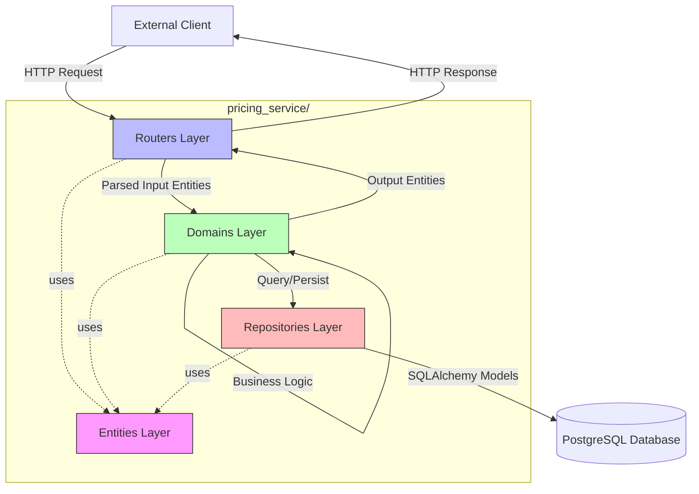
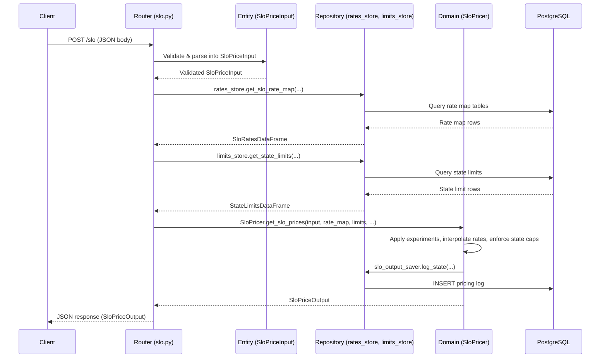
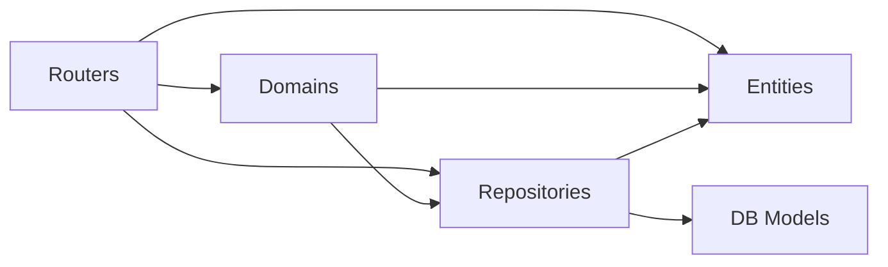

# Architecture Overview

The pricing-service-v2 follows a layered architecture that enforces separation of concerns across four primary layers: **Routers**, **Domains**, **Entities**, and **Repositories**. Each layer has a distinct responsibility, and requests flow through them in a predictable top-down manner.

## Layered Architecture



The folder structure directly mirrors these layers:

```
pricing_service/
├── routers/        # API handlers — HTTP interface
├── domains/        # Business logic
├── entities/       # Data models (Pydantic)
├── repositories/   # Data access layer
├── db/             # SQLAlchemy ORM models
└── utils/          # Shared utilities
```

## Layer Responsibilities

### Routers (API Handlers)

**Location:** `pricing_service/routers/`

Routers define the HTTP endpoints using [FastAPI](https://fastapi.tiangolo.com/) and serve as the entry point for all requests. Their responsibilities are narrowly scoped:

1. **Define endpoints** with request/response models, summaries, and descriptions
2. **Parse and validate input** via Pydantic entity models and FastAPI dependency injection
3. **Delegate to domain logic** for actual computation
4. **Handle errors** by catching domain-level exceptions and returning appropriate HTTP status codes
5. **Manage dependencies** (database sessions, external service clients) via FastAPI's `Depends()` mechanism

Routers do **not** contain business logic. They orchestrate calls to domain objects and repositories, then format the result for HTTP transport.

**Observed router modules:**

| Router Module | Endpoint(s) | Purpose |
|---|---|---|
| `ops.py` | `/ping`, `/boom`, `/connectivity` | Health checks and operational endpoints |
| `slo.py` | `/slo`, `/slo/alloy` | Student Loan Origination pricing |
| `pl.py` | `/pl/alloy/scoring`, `/pl/alloy` | Personal Loan scoring and pricing |
| `headline_rates.py` | `/headline_rates` | Headline rate lookups |
| `headline_rates_by_term.py` | `/headline_rates_by_term` | Headline rates broken down by term |
| `calculator_rates.py` | `/calculator_rates` | Calculator rate lookups |

For full endpoint documentation, see [API Endpoints Reference](./api-endpoints.md).

**Example pattern** — the SLO router (`routers/slo.py`) illustrates the typical structure:

```python
@router.post("/slo", response_model=SloPriceOutput)
def request_slo_prices(request: SloPriceInput, db: Session = Depends(get_db)):
    try:
        bind_ids_for_slo(request)
        return generate_slo_prices(request, db)
    except (NoRateMapExists, ProductNotSupportedInState) as err:
        return JSONResponse(status_code=422, content=[err.message])
```

The router validates input (`SloPriceInput`), injects a database session, delegates to `generate_slo_prices()` (which calls domain and repository objects), and maps domain exceptions to HTTP error responses.

### Domains (Business Logic)

**Location:** `pricing_service/domains/`

The domains layer contains all business logic. This is where pricing calculations, scoring models, experiment resolution, rate interpolation, and state eligibility rules live. Domains are organized by product:

```
domains/
├── slo/                    # Student Loan Origination logic
│   ├── slo_pricer.py       # Core SLO pricing engine
│   ├── slo_fico_scoring.py
│   ├── international_scoring_model.py
│   └── ...
├── pl/                     # Personal Loan logic
│   ├── pl_pricer.py
│   ├── pl_model_client.py
│   └── ...
├── slr_dynamic_score/      # SLR dynamic scoring
│   ├── calculator/
│   └── alloy/parsers/
├── alloy/                  # Shared Alloy integration parsers
├── headline_rates.py       # Headline rate computation
├── calculator_rates.py     # Calculator rate computation
├── experiments.py          # Experiment/feature flag resolution
└── exceptions.py           # Domain-specific exceptions
```

Domain classes are typically stateless or configured at module load time. For example, `SloPricer` uses `@staticmethod` methods extensively and loads scoring models at import time:

```python
slo_fico_scoring_model = FicoModel.from_config("slo_fico_scoring_model.yaml")
slo_graduate_fico_scoring_model = FicoModel.from_config("slo_fico_graduate_scoring_model.yaml")
slo_international_scoring_model = InternationalScoringModel.from_config("slo_international_scoring_model.yaml")
```

The `SloPricer` class delegates to internal helper classes (`SLOComputeEngine`, `RateMapPreProccessing`) that handle rate map interpolation, state limit enforcement, and output formatting. This pattern keeps the top-level domain method readable while encapsulating computational complexity.

Domain exceptions like `NoRateMapExists` and `ProductNotSupportedInState` are defined in `domains/exceptions.py` and are caught by routers to produce appropriate HTTP responses.

For details on specific domain logic, see [Product Domains](./product-domains.md), [Scoring System](./scoring-system.md), and [Experiments and Feature Flags](experiments-feature-flags).

### Entities (Data Models)

**Location:** `pricing_service/entities/`

Entities are [Pydantic](https://pydantic-docs.helpmanual.io/) models that define the shape and validation rules for data flowing through the system. They serve as the contract between layers — routers use them for request/response validation, domains operate on them, and repositories produce or consume them.

```
entities/
├── shared/             # Shared types (numbers, strings, objects)
│   ├── numbers.py      # Constrained numeric types (ConstrainedFico, ConstrainedRate, ConstrainedTerm)
│   ├── string.py       # Enums and string types (Product, StateOrTerritory, RateType, etc.)
│   └── objects.py      # Shared composite types (Rate, PriceCurve, RateMapSubKeys, etc.)
├── slo/
│   ├── input.py        # SloPriceInput
│   └── output.py       # SloPriceOutput, SloPriceCurve
├── slr_static/
│   └── input.py        # SlrStaticScoreInput, SlrStaticScoreParameters
├── slr_dynamic/        # Dynamic scoring entities
├── pl/                 # Personal Loan entities
├── ops/
│   └── output.py       # PingOutput, ConnectivityOutput
├── headline_rates/
├── calculator_rates/
├── capitalizations.py
├── earnest_limits.py
├── rate_maps.py
├── state_limits.py
└── experiments.py
```

Entities enforce validation at the boundary. For example, `SlrStaticScoreParameters` constrains fields with Pydantic validators:

```python
class SlrStaticScoreParameters(BaseModel):
    fico_score: ConstrainedFico = Field(..., example=850)
    income_amount_cents: int = Field(..., ge=1, le=99999999999)
    loan_amount_cents: int = Field(..., ge=0, le=99999999999)
```

> Entities are **not** ORM models. SQLAlchemy database models live separately in `pricing_service/db/`. Entities represent the API and domain contract; DB models represent the persistence schema.

For the database schema, see [Database Schema and Data Model](./data-model.md).

### Repositories (Data Access)

**Location:** `pricing_service/repositories/`

Repositories abstract data access, providing interfaces for reading from and writing to the database (and potentially other stores). They isolate the domain layer from persistence details.

Observed repository modules:

| Repository | Purpose |
|---|---|
| `postgres_rates_store.py` | Retrieves rate maps (SLR, SLO) from PostgreSQL |
| `limits_store.py` | Retrieves state limits, capitalizations, and Earnest variable limits |
| `slo_output_saver.py` | Persists SLO pricing output for audit/logging |
| `pricing_service_log_saver.py` | Logs request/response state for traceability |
| `pl_price_curve_lookup.py` | Looks up PL price curves |

Repositories are instantiated either at module level (e.g., `rates_store = PostgresRatesStore()` in `postgres_rates_store.py`) or injected via FastAPI dependencies when they require a database session:

```python
# Module-level singleton (stateless lookups)
limits_store = PostgresLimitsStore()

# Session-injected (write operations)
slo_output_saver = SloOutputSaver(db=db)
```

## Request Flow Through Layers

The following sequence illustrates how a typical SLO pricing request flows through the architecture:



For a more detailed walkthrough, see [Request Flow Through the Service](request-flow).

## Design Principles

### Separation of Concerns

Each layer has a single, well-defined responsibility:

- **Routers** handle HTTP concerns (routing, status codes, dependency injection) — they never compute rates or query the database directly.
- **Domains** contain pure business logic — they receive already-validated entities and pre-fetched data, then compute results.
- **Entities** define data contracts with validation — they are shared across layers but owned by none.
- **Repositories** encapsulate all data access — domains and routers interact with the database only through repository interfaces.

### Dependency Direction

Dependencies flow inward: Routers depend on Domains and Repositories. Domains depend on Entities. Repositories depend on DB models and Entities. Entities depend on nothing within the application (only Pydantic).



### Product-Oriented Domain Organization

The domains layer is organized by product (SLO, SLR, PL) rather than by technical function. Each product subdirectory contains its own pricer, scoring models, parsers, and field mappings. Shared logic (like Alloy parsing infrastructure) lives in common subdirectories. This structure means adding a new product type involves creating a new domain subdirectory with its own logic. See [Adding a New Product Type](adding-new-product) for guidance.

### Validation at the Boundary

Pydantic entities enforce data validation at the API boundary (router layer). By the time data reaches the domain layer, it has already been validated against type constraints, value ranges, and required fields. This allows domain logic to focus on computation rather than defensive checks.

### Caching and Memoization

Several layers employ caching to avoid redundant computation:

- **Routers** use `@lru_cache` on read-heavy endpoints like `/headline_rates` and `/calculator_rates`
- **Domains** use `toolz.functoolz.memoize` for expensive operations like rate map interpolation function generation (`RateMapPreProccessing._generate_rate_map_dict`)
- **Routers** cache state capitalizations and limits lookups with `@lru_cache` (e.g., `get_primary_and_cosigner_state_cap` in `slo.py`)

### External Service Integration

For products requiring external scoring (PL, SLO Alloy), the architecture introduces client classes within the domains layer (e.g., `ScoringServiceClient`, `PlModelClient` wrapping `SagemakerClient`). These are constructed via factory functions in routers and injected as FastAPI dependencies, keeping the domain logic testable and the external integration swappable.

## Utilities Layer

**Location:** `pricing_service/utils/`

The `utils/` directory contains cross-cutting concerns used by multiple layers:

- `db.py` — Database session management (`get_db` dependency)
- `app.py` — Application metadata (`get_app_name`, `get_app_version`)
- `fast_api_struct_logger.py` — Structured logging
- `experiments.py` — YAML configuration loading for experiments
- `caching_and_memoization.py` — Custom hash functions for memoization

These utilities are intentionally thin and stateless, serving as shared infrastructure rather than a distinct architectural layer.