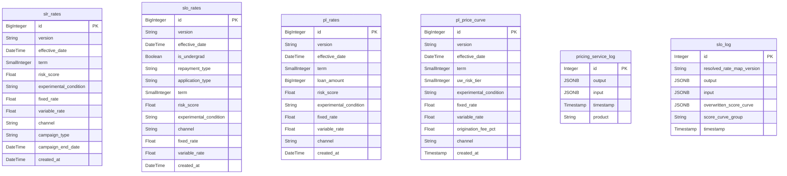
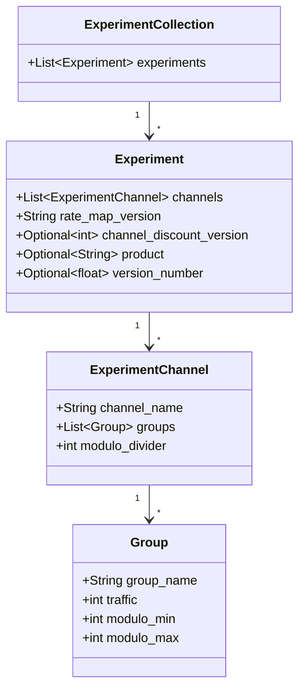
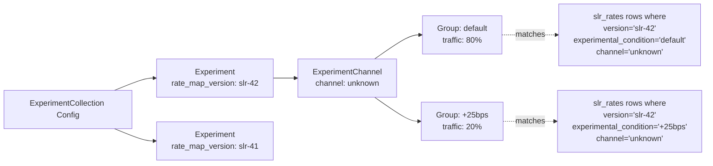

# Database Schema and Data Model

The pricing-service-v2 uses PostgreSQL as its primary data store, with tables organized around three core concerns: **rate storage** (per product), **state-level constraints** (limits and capitalizations), and **audit logging**. Experiment configuration is managed through code-level data structures rather than a dedicated database table.

## Entity Relationship Diagram



## Rate Tables

The service maintains separate rate tables for each product type. All three share a common structural pattern — versioned rows keyed by rate dimensions with a unique constraint preventing duplicate entries.

### `slr_rates` — Student Loan Refinance

Stores rate maps for the SLR product. Each row represents a single rate for a specific combination of version, term, risk score, experimental condition, and channel.

| Column | Type | Nullable | Description |
|---|---|---|---|
| `id` | `BigInteger` | No | Primary key |
| `version` | `String(100)` | No | Rate map version identifier (indexed) |
| `effective_date` | `DateTime(tz)` | No | When this rate becomes effective (indexed) |
| `term` | `SmallInteger` | No | Loan term in months |
| `risk_score` | `Float(2)` | No | Borrower risk score |
| `experimental_condition` | `String(25)` | No | Experiment group name (e.g., `"default"`) |
| `fixed_rate` | `Float(2)` | No | Fixed interest rate |
| `variable_rate` | `Float(2)` | Yes | Variable interest rate (nullable — not all terms offer variable) |
| `channel` | `String(50)` | No | Acquisition channel; defaults to `"unknown"` |
| `campaign_type` | `String(30)` | Yes | Campaign classification |
| `campaign_end_date` | `DateTime(tz)` | Yes | Campaign expiration |
| `created_at` | `DateTime(tz)` | Yes | Row creation timestamp; defaults to `now()` |

**Unique constraint** (`uix_slr_rates`): `(version, effective_date, term, risk_score, experimental_condition, fixed_rate, variable_rate, channel)`

**Indexes**: `version`, `effective_date`

> The `campaign_type` and `campaign_end_date` columns are unique to SLR and support time-limited promotional rate campaigns. These columns are not present on the other rate tables.

### `slo_rates` — Student Loan Origination

The SLO rate table has additional dimensions compared to SLR, reflecting the more complex product structure of origination loans (undergraduate vs. graduate, repayment type, application type).

| Column | Type | Nullable | Description |
|---|---|---|---|
| `id` | `BigInteger` | No | Primary key |
| `version` | `String(100)` | No | Rate map version identifier (indexed) |
| `effective_date` | `DateTime(tz)` | No | When this rate becomes effective (indexed) |
| `is_undergrad` | `Boolean` | No | Whether the rate applies to undergraduate loans |
| `repayment_type` | `String(100)` | No | Repayment plan type |
| `application_type` | `String(100)` | No | Application type (e.g., cosigned, solo) |
| `term` | `SmallInteger` | No | Loan term in months |
| `risk_score` | `Float(2)` | No | Borrower risk score |
| `experimental_condition` | `String(25)` | No | Experiment group name |
| `channel` | `String(50)` | No | Acquisition channel; defaults to `"unknown"` |
| `fixed_rate` | `Float(2)` | Yes | Fixed interest rate (nullable for SLO) |
| `variable_rate` | `Float(2)` | Yes | Variable interest rate |
| `created_at` | `DateTime(tz)` | Yes | Row creation timestamp; defaults to `now()` |

**Unique constraint** (`uix_slo_rates`): `(version, effective_date, is_undergrad, repayment_type, application_type, term, risk_score, experimental_condition, channel, fixed_rate, variable_rate)`

**Indexes**: `version`, `effective_date`

> Note that both `fixed_rate` and `variable_rate` are nullable for SLO, unlike SLR where `fixed_rate` is required. This allows SLO rate maps to define variable-only or fixed-only offerings for certain product combinations.

### `pl_rates` — Personal Loans

The PL rate table adds a `loan_amount` dimension not present in the student loan tables.

| Column | Type | Nullable | Description |
|---|---|---|---|
| `id` | `BigInteger` | No | Primary key |
| `version` | `String(100)` | No | Rate map version identifier (indexed) |
| `effective_date` | `DateTime(tz)` | No | When this rate becomes effective (indexed) |
| `term` | `SmallInteger` | No | Loan term in months |
| `loan_amount` | `BigInteger` | Yes | Loan amount threshold |
| `risk_score` | `Float(2)` | No | Borrower risk score |
| `experimental_condition` | `String(25)` | No | Experiment group name |
| `fixed_rate` | `Float(2)` | No | Fixed interest rate |
| `variable_rate` | `Float(2)` | Yes | Variable interest rate |
| `channel` | `String(50)` | No | Acquisition channel; defaults to `"unknown"` |
| `created_at` | `DateTime(tz)` | Yes | Row creation timestamp; defaults to `now()` |

**Unique constraint** (`uix_pl_rates`): `(version, effective_date, term, loan_amount, risk_score, experimental_condition, fixed_rate, variable_rate, channel)`

**Indexes**: `version`, `effective_date`

### `pl_price_curve` — Personal Loan Price Curve

A separate table for PL pricing that uses underwriting risk tiers instead of continuous risk scores, and includes an origination fee dimension.

| Column | Type | Nullable | Description |
|---|---|---|---|
| `id` | `BigInteger` | No | Primary key (auto-increment) |
| `version` | `String(100)` | No | Rate map version identifier (indexed) |
| `effective_date` | `DateTime(tz)` | No | When this rate becomes effective (indexed) |
| `term` | `SmallInteger` | No | Loan term in months |
| `uw_risk_tier` | `SmallInteger` | No | Underwriting risk tier (discrete) |
| `experimental_condition` | `String(25)` | No | Experiment group name |
| `fixed_rate` | `Float(2)` | No | Fixed interest rate |
| `variable_rate` | `Float(2)` | Yes | Variable interest rate |
| `origination_fee_pct` | `Float(15)` | Yes | Origination fee as a percentage |
| `channel` | `String(50)` | No | Acquisition channel; defaults to `"unknown"` |
| `created_at` | `Timestamp(tz)` | Yes | Row creation timestamp; defaults to `now()` |

**Unique constraint** (`uix_pl_rates`): `(version, term, uw_risk_tier, experimental_condition, channel)`

> The `pl_price_curve` unique constraint is notably narrower than `pl_rates` — it does not include `effective_date`, `fixed_rate`, or `variable_rate`. This means a given version can only have one rate per term/tier/condition/channel combination.

## Common Rate Table Patterns

All rate tables share these structural conventions:

- **Versioning**: Every rate row belongs to a `version` string (e.g., `"slr-42"`, `"slo-28"`). Versions are indexed for fast lookup.
- **Effective dates**: Indexed `effective_date` columns enable temporal queries to determine which rate map is active.
- **Experimental conditions**: The `experimental_condition` column ties each rate to an experiment group. The value `"default"` represents the control/baseline group.
- **Channel segmentation**: All tables include a `channel` column defaulting to `"unknown"`, enabling channel-specific pricing.
- **Audit timestamps**: `created_at` columns with `server_default=func.now()` record when rows were inserted.

## State Limits and Capitalizations Tables

The Alembic migration environment (`alembic/env.py`) registers three metadata sources for schema management:

```python
from pricing_service.db.capitalizations import Base as CapitalizationsBase
from pricing_service.db.limits import Base as LimitsBase
from pricing_service.db.rates import Base as RatesBase

target_metadata = [CapitalizationsBase.metadata, LimitsBase.metadata, RatesBase.metadata]
```

The `capitalizations` and `limits` tables are referenced in the migration configuration and are used for [state-based eligibility and licensing](./state-eligibility.md) rules. While the full model definitions for these tables were not available for direct inspection, their presence in the Alembic target metadata confirms they are managed database tables with SQLAlchemy ORM models, subject to the same migration workflow as the rate tables.

> The exact column definitions for `capitalizations` and `limits` tables could not be verified from the inspected files. See [Database Migrations with Alembic](database-migrations) for how these schemas are managed.

## Audit / Logging Tables

Two logging tables capture the full input/output of pricing requests for audit and debugging purposes.

### `pricing_service_log`

General-purpose pricing log used for SLR and other product endpoints.

| Column | Type | Nullable | Description |
|---|---|---|---|
| `id` | `Integer` | No | Primary key (auto-increment) |
| `input` | `JSONB` | Yes | Full request payload (stored as `null` when absent, not JSON `null`) |
| `output` | `JSONB` | Yes | Full response payload |
| `timestamp` | `Timestamp(tz)` | No | Request timestamp; defaults to `current_timestamp()` (indexed) |
| `product` | `VARCHAR(100)` | No | Product identifier for the request |

**Indexes**: `timestamp`

> The `none_as_null=True` JSONB configuration means Python `None` values are stored as SQL `NULL` rather than JSON `null`. This is an intentional distinction for query filtering.

### `slo_log`

Dedicated log table for Student Loan Origination requests, capturing additional SLO-specific context.

| Column | Type | Nullable | Description |
|---|---|---|---|
| `id` | `Integer` | No | Primary key (auto-increment) |
| `resolved_rate_map_version` | `String` | Yes | The rate map version that was resolved for this request |
| `input` | `JSONB` | Yes | Full request payload |
| `output` | `JSONB` | Yes | Full response payload |
| `overwritten_score_curve` | `JSONB` | Yes | Score curve override data, if any |
| `score_curve_group` | `String` | Yes | Score curve group used |
| `timestamp` | `Timestamp(tz)` | No | Request timestamp; defaults to `current_timestamp()` (indexed, also part of composite PK) |

**Indexes**: `timestamp`

> The `slo_log` table has a composite primary key of `(timestamp, id)`. This is unusual and may be related to partitioning or time-series query optimization.

## Experiments Configuration

Experiments are **not stored in a database table**. Instead, they are defined as structured configuration validated through Pydantic models. The key data structures are:



Each `Experiment` is tied to a `rate_map_version` string that corresponds to the `version` column in the rate tables. The `experimental_condition` values stored in rate tables must match the `group_name` values defined in experiment groups.

Key validation rules enforced by the Pydantic models:

- Every experiment must have at least one channel named `"unknown"`
- No duplicate channel names within an experiment
- Traffic percentages across groups within a channel must sum to 100%
- Modulo ranges must not overlap across groups
- Every channel must have a `"default"` group
- Group names must be valid members of product-specific enums (`BPSType`, `SloFicoGroups`, `SLRAssetLiteGroups`, `SLRChannelPricingGroups`)
- Rate map versions within a collection must be ordered by version number (monotonically increasing)
- All experiments in a collection must belong to the same product

For more details, see [Experiments and Feature Flags](experiments-feature-flags).

## Relationship Between Rate Tables and Experiments



The `version` and `experimental_condition` columns in rate tables serve as the join point between experiment configuration and stored rates. When a pricing request is processed, the experiment assignment determines which `experimental_condition` rows are queried from the appropriate rate table.

## Schema Management

All database tables under the `rates`, `limits`, and `capitalizations` models are managed through Alembic migrations. The log tables (`pricing_service_log`, `slo_log`) use separate SQLAlchemy `Base` declarations and are not included in the Alembic migration target metadata, suggesting they may be managed through a different migration path or created independently.

For migration procedures and versioning, see [Database Migrations with Alembic](database-migrations).