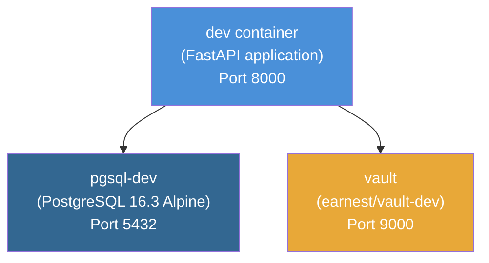
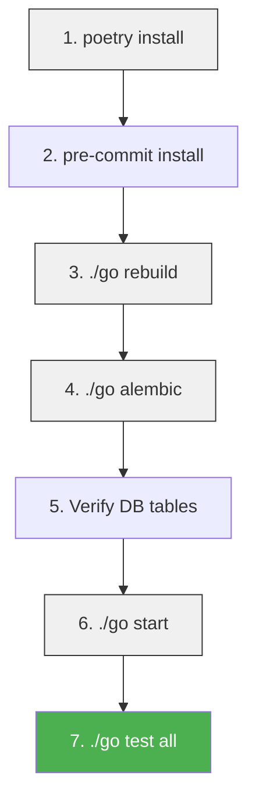

# Local Development Setup

This guide walks through setting up the pricing-service-v2 for local development, covering prerequisites, Docker-based environment setup, database initialization, running the FastAPI service, and accessing API documentation.

## Prerequisites

The following tools must be installed before setting up the project:

| Tool | Installation | Notes |
|------|-------------|-------|
| **Python 3.7.3** | `brew install pyenv` → `pyenv install 3.7.3` | Add `eval "$(pyenv init -)"` to `~/.bash_profile` |
| **Poetry** | `pip install poetry` | Dependency management for Python |
| **Docker** | [Docker for Mac](https://docs.docker.com/v17.12/docker-for-mac/install/) | Required for all containerized services |
| **gobase** | `pip install gobase` | Earnest's `./go` script framework |
| **pre-commit** | Installed via Poetry | Git hooks for formatting enforcement |

### Pip Configuration

Configure pip to use Earnest's internal artifact repository. Place the following in `~/.pip/pip.conf`:

```ini
[global]
index-url = https://artifactory.tools.earnest.com/api/pypi/earnest-py/simple
extra-index-url= https://pypi.org/simple
```

## Environment Architecture

The local development environment runs entirely in Docker via `docker-compose.yml`. Three services are orchestrated together:



| Service | Image | Port | Purpose |
|---------|-------|------|---------|
| `dev` | Built from local `Dockerfile` (target: `dev`) | 8000 | FastAPI application container |
| `pgsql-dev` | `postgres:16.3-alpine` | 5432 | PostgreSQL database |
| `vault` | `earnest/vault-dev:5.2.13-d413009` | 9000 | Local secrets management |

> **Note:** The `dev` container uses `platform: linux/amd64`, which is relevant if you're developing on Apple Silicon (ARM) hardware. Docker will emulate x86_64.

### Environment Variables

The `dev` container is preconfigured with the following key environment variables:

| Variable | Value | Purpose |
|----------|-------|---------|
| `APP_ENV` | `development` | Application environment identifier |
| `POSTGRES_USER` | `service` | Database username |
| `POSTGRES_PASSWORD` | `password` | Database password |
| `POSTGRES_DB` | `database` | Database name |
| `POSTGRES_HOST` | `localhost` | Database host |
| `VAULT_HOST` | `vault` | Vault service hostname |
| `VAULT_AUTH_TOKEN` | `fnord` | Local Vault authentication token |
| `SCORING_SERVICE_URL` | `http://scoringdev:8001` | Scoring service dependency |

AWS credentials (`AWS_ACCESS_KEY_ID`, `AWS_SECRET_ACCESS_KEY`, `AWS_SESSION_TOKEN`, `AWS_DEFAULT_REGION`) are passed through from your host environment. Ensure these are set in your shell if features requiring AWS access are needed.

## Step-by-Step Setup

### 1. Install Project Dependencies

Install Python dependencies into a local virtual environment:

```bash
poetry install
```

Poetry creates a `.venv` directory in the project root by default.

### 2. Install Pre-commit Hooks

The project enforces formatting via black, flake8, isort, and autoflake through pre-commit hooks:

```bash
pre-commit install
```

These hooks run automatically on `git commit`. See the [Testing Strategy and Practices](testing-strategy) page for more on code quality tooling.

### 3. Build the Docker Environment

Build all Docker containers:

```bash
./go rebuild
```

This runs `docker-compose build`, which builds the `dev` container from the local Dockerfile and pulls the PostgreSQL and Vault images.

### 4. Initialize the Database

Run Alembic migrations to create and populate the database schema:

```bash
./go alembic
```

This executes all migration files located in `alembic/versions/`, creating the required tables. For detailed information on the migration system, see [Database Migrations with Alembic](database-migrations).

### 5. Verify Database Setup

After running migrations, confirm the following tables exist using a database client (e.g., DBeaver, DataGrip) with these connection details:

| Parameter | Value |
|-----------|-------|
| Host | `localhost` |
| Port | `5432` |
| Database | `database` |
| Username | `service` |
| Password | `password` |

Expected tables:

- `alembic_versions`
- `earnest_limits`
- `pl_rates`
- `slo_rates`
- `slr_rates`
- `state_interest_capitalizations`
- `state_limits`

For details on the schema, see [Database Schema and Data Model](./data-model.md).

### 6. Start the Service

Start the development container and all dependencies:

```bash
./go start
```

This runs `docker-compose up dev`, which brings up the `dev`, `pgsql-dev`, and `vault` services. The `dev` container's entrypoint is `./dev_tools/service.docker-entrypoint.sh`.

The FastAPI application will be available at **http://localhost:8000**.

### 7. Verify Everything Works

Run the full test suite to confirm the setup is correct:

```bash
./go test all
```

## Setup Flow Summary



## Accessing API Documentation

The FastAPI application exposes interactive API documentation when running in the `development` environment:

| Documentation Type | URL | Description |
|-------------------|-----|-------------|
| **Swagger UI** | http://localhost:8000/documentation | Interactive API explorer |
| **ReDoc** | http://localhost:8000/redoc | Read-only API reference |

> **Note:** In production, Swagger docs are disabled for security reasons (`docs_url` is set to `None`). ReDoc is also disabled in production. The Swagger endpoint path is determined by `get_swagger_docs_endpoint()` in `pricing_service/utils/app.py`, and the ReDoc endpoint is conditionally set based on `APP_ENV`.

For a complete reference of available endpoints, see [API Endpoints Reference](./api-endpoints.md).

## Useful Go Commands for Development

Once the environment is running, these commands are frequently used during development:

| Command | Description |
|---------|-------------|
| `./go shell` | Open a terminal session inside the dev container |
| `./go run \<command\>` | Run an arbitrary command in the dev container (e.g., `./go run python foo.py`) |
| `./go test all` | Run the full pytest suite |
| `./go lint` | Run black, flake8, and isort to auto-fix formatting |
| `./go mypy` | Run static type checking on application code |
| `./go alembic` | Run database migrations (upgrade to head) |
| `./go alembic downgrade` | Revert the most recent migration |
| `./go stop` | Stop all running containers |
| `./go clean` | Remove the project containers and dependencies locally |
| `./go nuke` | Remove **all** Docker images (including unrelated ones) |

Run `./go` with no arguments to see the full list, or use the `-h` flag on any subcommand for details (e.g., `./go alembic -h`).

## Adding Rate Maps and State Data

After initial setup, you may need to load rate maps or state constraint data into your local database:

- **Rate maps:** `./go add_rates {product}.csv` (e.g., `./go add_rates slr.csv`)
- **State constraints:** `./go update_state_constraints {file}.csv` (e.g., `./go update_state_constraints state_limits.csv`)

These commands validate the CSV data and generate Alembic migration files. See [Rate Management and Versioning](./rate-management.md) and [State-Based Eligibility and Licensing](./state-eligibility.md) for details on data formats and requirements.

## Stopping and Cleaning Up

```bash
# Stop running containers
./go stop

# Remove containers and local dependencies
./go clean

# Clear pytest cache
./go pycache_clean

# Clear poetry cache (useful for TooManyRedirects errors)
./go poetry_cache_clean
```

## Troubleshooting

- **Port conflicts on 5432 or 8000:** Ensure no other services are using these ports. The Docker network uses a dedicated subnet (`10.68.0.0/24`) named `pricing_service_no_staging_conflict` to avoid collisions with other local services.
- **ARM/Apple Silicon issues:** The dev container is pinned to `platform: linux/amd64`. Docker Desktop's Rosetta emulation handles this, but builds may be slower.
- **AWS credential errors:** Ensure `AWS_ACCESS_KEY_ID`, `AWS_SECRET_ACCESS_KEY`, `AWS_SESSION_TOKEN`, and `AWS_DEFAULT_REGION` are exported in your shell before running `./go start`.
- **Poetry dependency issues:** Try `./go poetry_cache_clean` followed by `poetry install`.

For additional troubleshooting guidance, see [Troubleshooting Common Issues](troubleshooting).