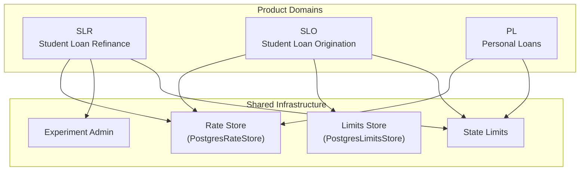
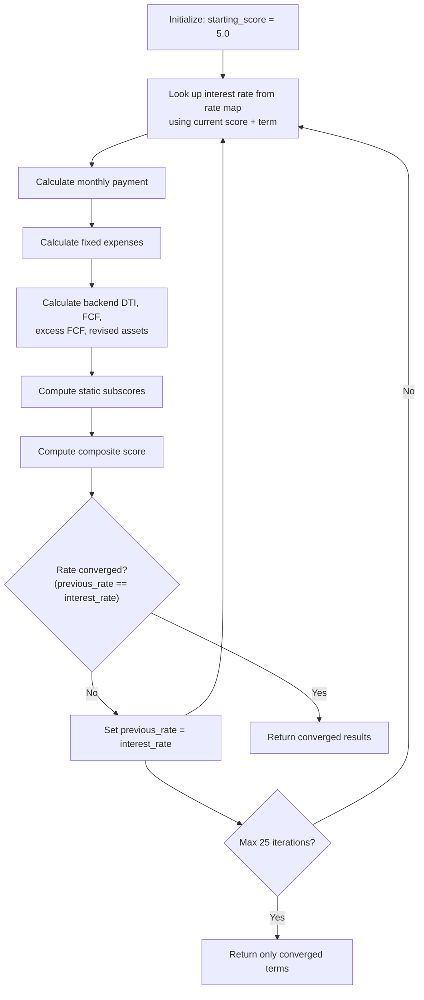
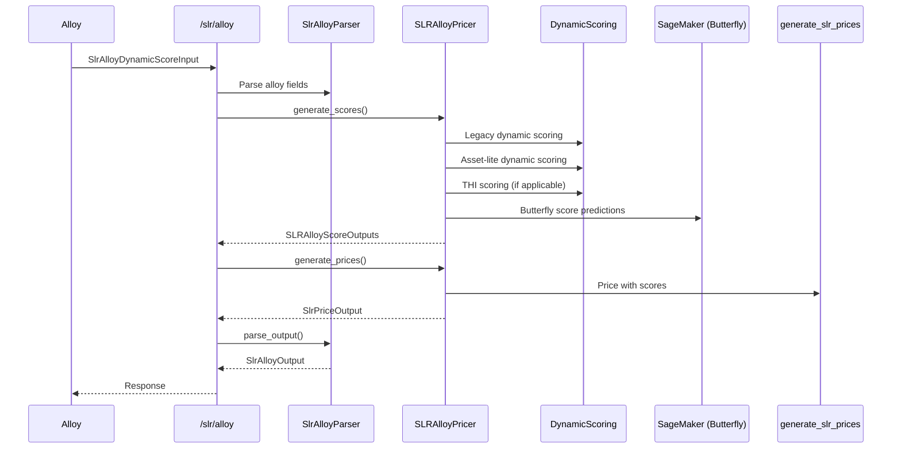
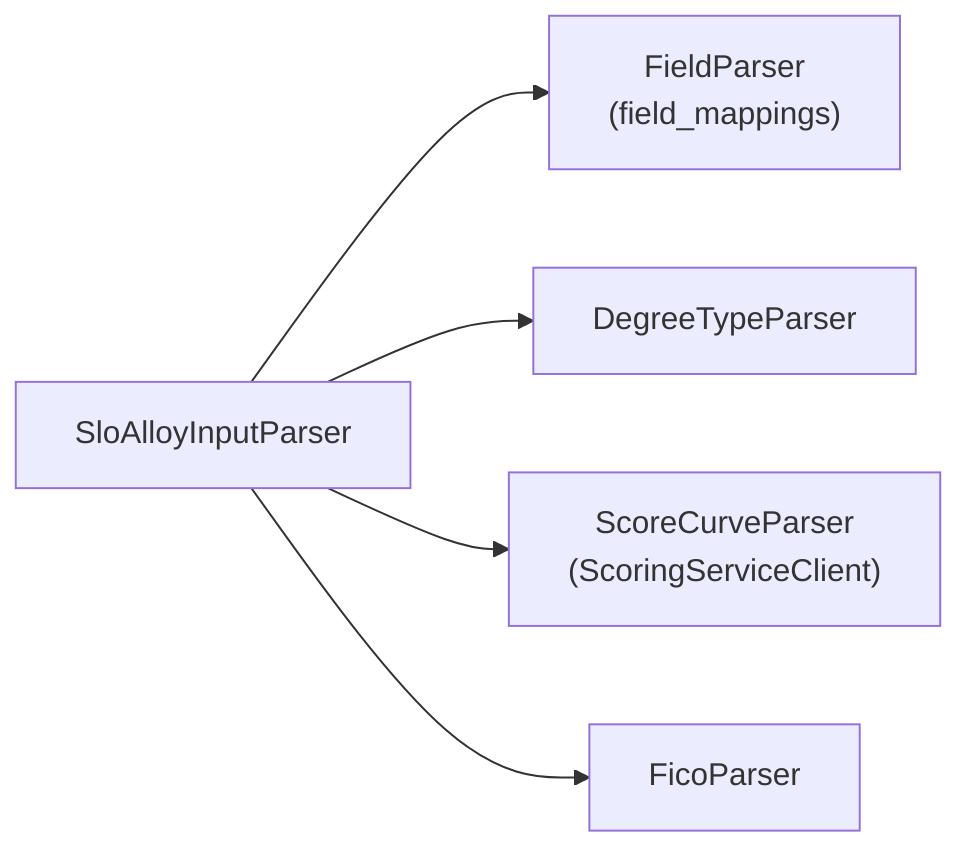
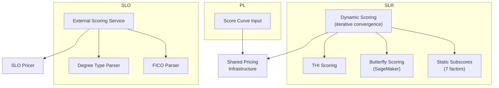

# Product Domains

The pricing-service-v2 supports three distinct product types, each with its own domain-specific business logic, scoring algorithms, pricing flows, and eligibility rules. This page details the **SLR (Student Loan Refinance)**, **SLO (Student Loan Origination)**, and **PL (Personal Loans)** product domains as implemented in the codebase.

## Product Overview



| Product | Code Identifier | Primary Domain Path | Scoring Approach |
|---------|----------------|---------------------|------------------|
| Student Loan Refinance | `slr` / `Product.student_loan_refinance` | `pricing_service/domains/slr_*` | Dynamic scoring with iterative convergence |
| Student Loan Origination | `slo` / `Product.student_loan_origination` | `pricing_service/domains/slo/` | External scoring service + FICO-based |
| Personal Loans | `pl` / `Product.personal_loan` | `pricing_service/routers/price.py` | Score curve-based pricing (shared pricer) |

## SLR — Student Loan Refinance

SLR is the most complex product domain, featuring a dynamic scoring algorithm, multiple scoring strategies, cosigner support, Alloy integration, SageMaker-based butterfly scoring, and total household income (THI) calculations.

### Scoring Algorithm: Dynamic Scoring

SLR uses an iterative **dynamic scoring** process implemented in `DynamicScoring`. The algorithm starts with an initial score and iteratively recalculates financial metrics until the interest rate converges:



The convergence loop runs for up to **25 iterations** (`num_iterations = 25`). For each term (60–240 months), the system:

1. **Looks up the interest rate** from the rate map using the current score via `RegularGridInterpolator`
2. **Calculates monthly payment** using standard amortization: `loan_amount × monthly_rate / (1 - (1 + monthly_rate)^(-term))`
3. **Computes fixed expenses**: `housing + non_real_estate + monthly_payment - student_loan_expenses`
4. **Derives financial ratios**:
   - **Backend DTI**: `12 × fixed_expenses / income`
   - **Free Cash Flow (FCF)**: `net_annual_income / 12 - fixed_expenses`
   - **Excess FCF**: Factors in months since graduation/residency (capped at 24), income, and credit card balance
   - **Assets-to-Loan Ratio**: Accounts for revised assets (assets + excess FCF - credit card balance) relative to total loan amount
   - **Credit Card Balance-to-Income Ratio**: `credit_card_balance / income`
5. **Applies an FCF adjustment**: If `primary_loan_amount > $275,000`, FCF is reduced by $1,000
6. **Computes static subscores** for each factor and combines them into a final score

### Static Subscores

The static scoring component (`StaticScoring`) computes subscores for seven factors using pre-defined scoring curves:

| Subscore | Input | Notes |
|----------|-------|-------|
| `degree_type` | Degree type enum | Static lookup |
| `income` | `income_amount_cents` | Static lookup |
| `fico` | `fico_score` | Static lookup |
| `assets_to_loan_ratio` | Computed ratio | Dynamic per iteration |
| `assets` | `liquid_assets_amount_cents` (revised) | Dynamic per iteration |
| `credit_card_to_income_ratio` | Computed ratio | Dynamic per iteration |
| `free_cash_flow` | `fcf_amount_cents` | Dynamic per iteration |

Two scoring strategy implementations exist:
- **`LegacyStaticScoringAdjustment`** — Used with standard scoring curves
- **`SlrClipStaticScoreAdjustment`** — Used with asset-lite scoring, clips scores to min/max thresholds from bucket scalers

### Revised Assets Logic

The revised assets calculation has special handling for low-asset borrowers:

```python
if total_assets < 3_000_00 and credit_card_balance > total_assets:
    # Assets-to-loan ratio capped at 0 (minimum)
    # Revised assets capped at $3,000
    return np.minimum(3_000_00, assets_plus_excess_free_cash_flow)
```

### Cosigner Support

SLR supports cosigner applications. When a cosigner is present:

- The **total loan amount** is computed as `primary_loan_amount + cosigner_loan_balance`
- Separate parameter types are used: `SlrDynamicScorePrimaryParameters`, `SlrDynamicScoreCosignerParameters`, and `SlrDynamicScorePrimaryParametersForCosigner`
- The `CosignerScoreAndPricer` component handles combined scoring and pricing
- The scored user is identified by `ApplicationRole` (primary vs. cosigner)

### Total Household Income (THI)

The `TotalHouseholdIncomeFcfAndDtiCalculator` computes an alternative score that incorporates other household income:

1. Parses other household income from the Alloy request
2. Adds it to the scored user's income: `income_amount_cents = other_household_income + parameters.income_amount_cents`
3. Recalculates net income using `IncomeCalculator.gross_to_net()` with the other household member's state
4. Recalculates housing expenses for the THI scenario
5. Runs the full dynamic scoring loop with these adjusted parameters

Both **legacy THI** and **asset-lite THI** scoring calculators are instantiated, each using their respective `DynamicScoring` instance.

### SLR Alloy Integration

The `/slr/alloy` endpoint processes requests from the Alloy decisioning platform. The `SLRAlloyPricer` orchestrates:



The Alloy parser extracts data from three attribute groups:
- **`Earnest_Meta`** — Application metadata (user ID, state, rate map version, applicant role, channel data)
- **`Experian`** — Credit bureau data (credit features for butterfly scoring)
- **`Earnest_Output_Attributes`** — Derived attributes (e.g., `nri_def_flag`)

### SLR Rate Adjustments and Discounts

SLR supports multiple adjustment mechanisms:
- **Rate adjustment data** — Channel-specific rate adjustments (via `rate_adjustment_data`)
- **Auto-pay adjustment** (`AutoPayAdjustment`)
- **HBG discount** (`HBGDiscountAdjustment`)
- **Campaign discount** (`CampaignDiscountAdjustment`)
- **Channel discount** (`ChannelDiscountResolver`) — Loaded from configuration

### SLR Experiment Support

Experimental conditions are resolved via `ExperimentAdmin.get_slr_experimental_condition()`, using:
- `seed_id` of the user
- `rate_map_version`
- Channel (from `SLRChannels` enum)

The experimental condition determines which rate map variant is used. See [Experiments and Feature Flags](experiments-feature-flags) for details.

### Degree Types for Asset-Lite Scoring

A specific set of degree types triggers asset-lite scoring behavior:

```python
{
    StructuredDegree.dds,
    StructuredDegree.do,
    StructuredDegree.dvm,
    StructuredDegree.mba,
    StructuredDegree.md,
    StructuredDegree.medical_other,
    StructuredDegree.pharmd,
    StructuredDegree.jd,
}
```

### SLR API Endpoints

| Endpoint | Version | Description |
|----------|---------|-------------|
| `POST /v1/slr` | V1 | Legacy dynamic scoring (single user, flat parameters) |
| `POST /v2/slr` | V2 | Dynamic scoring with multi-user support (primary + cosigner) |
| `POST /v2/slr/alloy` | V2 | Full Alloy integration: scoring + pricing |

> The V1 endpoint uses `SlrDynamicScoreInputV1` with flat parameters, while V2 uses `SlrDynamicScoreInput` with a `user_data` list supporting multiple applicants.

## SLO — Student Loan Origination

SLO handles pricing for new student loan originations. Unlike SLR's internal dynamic scoring, SLO relies on an **external scoring service** and applies scores to rate maps with state-specific limits and interest capitalization rules.

### SLO Scoring

SLO scoring is performed by an external auto-decision scoring service, accessed via `ScoringServiceClient`. The Alloy integration parses scores through a pipeline of parsers:



| Parser | Purpose |
|--------|---------|
| `FieldParser` | Maps Alloy attribute names to SLO input fields |
| `DegreeTypeParser` | Parses and validates degree type |
| `ScoreCurveParser` | Calls the external scoring service with credit features to obtain score curves |
| `FicoParser` | Extracts FICO score |

The `ScoreCurveParser` sends credit bureau features to the scoring service, including:
- `total_installment_balance_on_open_trades`
- `credit_summary_monthly_payment_amount`
- `credit_summary_number_of_inquiries`
- `highest_credit_limit_on_all_revolving_accounts`
- `mean_credit_limit_on_open_revolving_accounts`
- `utilization_for_trade_with_biggest_balance`
- `mths_since_last_delinq`, `mths_since_recent_bc`
- And many more (see `scoring_call_field_mappings` for the full list)

### SLO Pricing Logic

The `SloPricer` generates prices using:

1. **Rate map lookup** — `rates_store.get_slo_rate_map()` with version, tag filter, and channel flag
2. **Discount application** — `slo_rate_map.apply_discount(request.discount_amount)`
3. **State limits** — Both primary and cosigner state limits are fetched
4. **State interest capitalization** — Determines how interest capitalizes per state regulations
5. **Earnest variable limits** — Global limits from `limits_store.get_earnest_variable_limits()`

```python
slo_pricer.get_slo_prices(
    input_data=request,
    rate_map=slo_rate_map_discount_applied,
    primary_state_limits=primary_state_limit,
    primary_state_caps=primary_state_cap,
    earnest_limits=earnest_limits,
    cosigner_state_limits=cosigner_state_limit,
    cosigner_state_caps=cosigner_state_cap,
)
```

### SLO Cosigner Handling

SLO supports cosigner applications with state-specific logic:

- **Cosigner state limits** are fetched separately; if the cosigner's state doesn't support SLO, `None` is returned (graceful degradation via `ProductNotSupportedInState` catch)
- **State interest capitalization** rules are resolved independently for both primary and cosigner states
- Results are cached using `@lru_cache` for performance

### SLO Field Mappings

SLO maps Alloy fields to internal pricing input fields:

| Alloy Field | Internal Field | Type |
|-------------|---------------|------|
| `userId` | `id` | `str` |
| `estimateId` | `rate_estimate_id` | `str` |
| `applicantRole` | `application_type` | `SloFullApplicationType` |
| `state` | `state` | `StateOrTerritory` |
| `loanData_claimedLoanAmount` | `loan_amount_cents` | `int` |
| `quickScoreData_rateMapVersion` | `rate_map_version` | `str` |
| `quickScoreData_rateMapTag` | `tag` | `SLOChannels` |
| `quickScoreData_rateAdjustmentData_amount` | `discount_amount` | `int` |
| `cosigner_state` | `cosigner_state` | `str` |

### SLO API Endpoints

| Endpoint | Description |
|----------|-------------|
| `POST /slo` | Direct SLO pricing with pre-computed scores |
| `POST /slo/alloy` | Alloy-integrated SLO pricing (parses Alloy input, calls scoring service, then prices) |

### SLO Output Persistence

SLO pricing results are persisted via `SloOutputSaver`, which writes to the database within the same session. Both endpoints also log state via `PricingServiceLogSaver`.

## PL — Personal Loans

Personal Loans share the general pricing infrastructure with SLR but operate as a distinct product type. Based on the codebase evidence:

- PL uses the `Product.personal_loan` identifier
- PL pricing flows through the shared `generate_slr_prices` function in `pricing_service/routers/price.py`
- PL uses score curve-based pricing (similar to SLR's pricing step, but without the dynamic scoring loop)
- State eligibility and limits are resolved per the `Product.personal_loan` product type

> The PL domain has less dedicated domain logic visible in the inspected files compared to SLR and SLO. It appears to leverage the shared pricing infrastructure rather than implementing a separate scoring algorithm. The exact scoring mechanism for PL is not fully evident from the provided codebase files.

## Cross-Product Comparison



| Feature | SLR | SLO | PL |
|---------|-----|-----|----|
| Scoring | Internal dynamic (iterative) | External scoring service | Score curve input |
| Cosigner support | Yes (multi-user) | Yes (state-aware) | Not evident |
| State capitalization | Via shared limits | Explicit per primary/cosigner | Via shared limits |
| Alloy integration | Full (scoring + pricing) | Full (scoring + pricing) | Not evident |
| Rate adjustments | Multiple (auto-pay, HBG, campaign, channel) | Discount amount | Not evident |
| Experiment support | Yes (condition-based rate maps) | Via rate map tags | Not evident |
| Butterfly scoring | Yes (SageMaker) | No | No |
| THI calculation | Yes | No | No |
| Output persistence | `PricingServiceLogSaver` | `SloOutputSaver` + `PricingServiceLogSaver` | Not evident |

## Error Handling

All product domains handle two common exceptions:

- **`NoRateMapExists`** — Returned as HTTP 422 when the requested rate map version/tag combination doesn't exist
- **`ProductNotSupportedInState`** — Returned as HTTP 422 when the product is not available in the borrower's state

SLR additionally handles:
- **`UserRateExceedsStateLimits`** — HTTP 422 when the computed rate exceeds state-mandated limits

See [State-Based Eligibility and Licensing](./state-eligibility.md) for details on state restrictions and [Rate Management and Versioning](./rate-management.md) for rate map resolution logic.

## Related Pages

- [Scoring System](./scoring-system.md) — Detailed scoring algorithm documentation
- [State-Based Eligibility and Licensing](./state-eligibility.md) — State limits and capitalization rules
- [Rate Management and Versioning](./rate-management.md) — Rate map storage and versioning
- [Experiments and Feature Flags](experiments-feature-flags) — Experimental condition resolution
- [Request Flow Through the Service](request-flow) — End-to-end request processing
- [Adding a New Product Type](adding-new-product) — Guide for extending the product domain