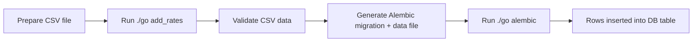
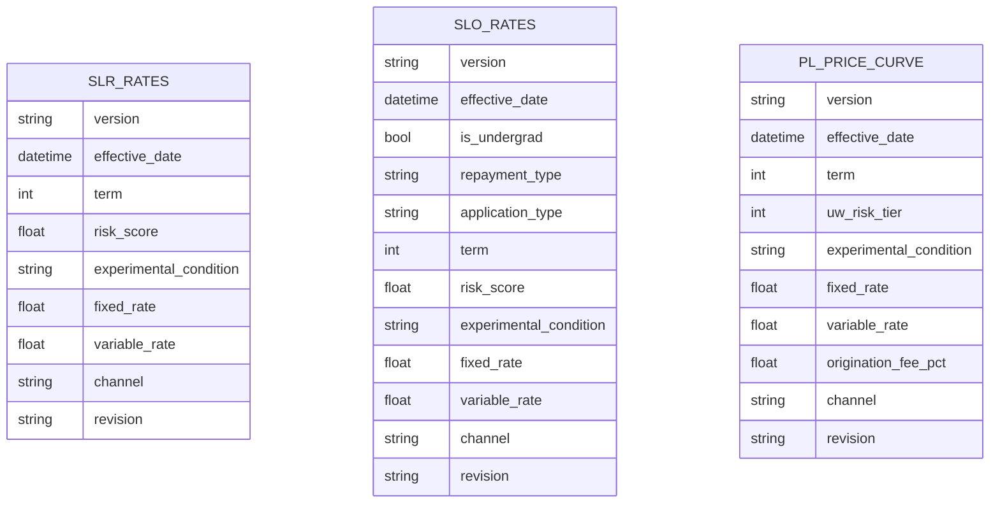
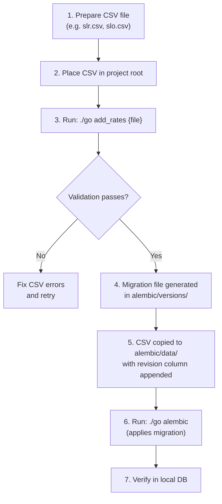

# Rate Management and Versioning

This guide explains how interest rates are stored, versioned, and updated in pricing-service-v2. Rate data is the core asset of the service — it drives the interest rates offered across all Earnest loan products.

## Overview

Rate data lives in PostgreSQL database tables, one per product type. New rates are introduced through a CSV-based workflow that validates the data, generates an Alembic migration file, and bulk-inserts the rows into the appropriate table. Each rate map carries a **version** identifier and a **revision** (the Alembic migration hash), enabling historical traceability and safe rollback.



## Rate Table Structure

Each product has its own rate table with a distinct schema reflecting the product's pricing dimensions.

### Product-to-Table Mapping

| Product | CSV Filename | Database Table |
|---------|-------------|----------------|
| SLR (Student Loan Refinance) | `slr.csv` | `slr_rates` |
| SLO (Student Loan Origination) | `slo.csv` | `slo_rates` |
| PL (Personal Loans) | `pl.csv` | `pl_price_curve` |

### SLR Rate Table Fields

| Field | Type | Description |
|-------|------|-------------|
| `version` | string | Rate map version identifier (numeric, e.g. `123`, `133`) |
| `effective_date` | datetime | When this rate map becomes effective |
| `term` | int | Loan term in months; allowed values: 60, 72, 84, …, 240 (12-month increments) |
| `risk_score` | float | Borrower risk score; range 1.5–7.0 |
| `experimental_condition` | string (nullable) | Experiment group name (e.g. `default`, `plus_10_bps_test`) |
| `fixed_rate` | float | Fixed interest rate |
| `variable_rate` | float | Variable interest rate |
| `channel` | string | Distribution channel (defaults to `unknown`) |
| `revision` | string | Alembic migration hash (added automatically during migration) |
| `created_at` | datetime | Timestamp of insertion |

**Uniqueness constraint:** `(version, term, risk_score, experimental_condition, channel)`

### SLO Rate Table Fields

| Field | Type | Description |
|-------|------|-------------|
| `version` | string | Rate map version (prefixed with `slo-`, e.g. `slo-21`) |
| `effective_date` | datetime | Effective date |
| `is_undergrad` | bool | Whether the borrower is an undergraduate |
| `repayment_type` | string | One of: `fixed`, `deferred`, `interest`, `principal_interest` |
| `application_type` | string | One of: `primary`, `cosigner`, `parent` |
| `term` | int | Loan term in months; allowed values: 60, 72, 84, …, 180 |
| `risk_score` | float | Borrower risk score; range 1.5–7.0 |
| `experimental_condition` | string (nullable) | Experiment group name |
| `fixed_rate` | float | Fixed interest rate |
| `variable_rate` | float | Variable interest rate |
| `channel` | string | Distribution channel |
| `revision` | string | Alembic migration hash |

**Uniqueness constraint:** `(version, is_undergrad, repayment_type, application_type, term, risk_score, experimental_condition, channel)`

### PL Price Curve Fields

| Field | Type | Description |
|-------|------|-------------|
| `version` | string | Rate map version identifier |
| `effective_date` | datetime | Effective date |
| `term` | int | Loan term in months; allowed values: 24–84 |
| `uw_risk_tier` | int | Underwriting risk tier; range 1–5 |
| `experimental_condition` | string | Experiment group name |
| `fixed_rate` | float | Fixed interest rate |
| `variable_rate` | float | Variable interest rate |
| `origination_fee_pct` | float | Origination fee percentage |
| `channel` | string | Distribution channel |
| `revision` | string | Alembic migration hash |

**Uniqueness constraint:** `(version, term, uw_risk_tier, experimental_condition, channel)`

### Conceptual Relationships



## Rate Versioning Strategy

### Version Identifiers

Each rate map is tagged with a `version` string:

- **SLR and PL**: Numeric version strings (e.g. `123`, `133`, `165.1`)
- **SLO**: Prefixed with `slo-` followed by a numeric version (e.g. `slo-21`, `slo-42`)

Versions must be **monotonically increasing** across experiment configurations. A single version encompasses all experimental conditions and channels for that product at that point in time.

### Revision Tracking

When a CSV is processed into a migration, the tooling appends a `revision` column to every row. This revision is the 12-character Alembic migration hash, providing a direct link between each rate row and the migration that inserted it. This enables:

- **Targeted rollback**: The downgrade function deletes rows by revision:
  ```python
  op.execute("delete from ${table_name} where revision = '${next_migration_id}'")
  ```
- **Audit trail**: Each row can be traced to a specific migration file and its corresponding CSV in `alembic/data/`.

### Experimental Conditions

Rate tables support multiple `experimental_condition` values within a single version. This allows A/B testing of rate adjustments (e.g. `plus_10_bps_test`, `minus_10_bps_test`, `default`). The experiment configuration that routes traffic to these conditions is managed separately via YAML files — see [Experiments and Feature Flags](experiments-feature-flags) for details.

### Channels

The `channel` field segments rates by distribution channel (e.g. `unknown`, `direct_mail_pricing_headline`, `leveredge`). The default channel is `unknown`. Allowed channel values are defined in the `SLRChannels` and `SLOChannels` classes in `pricing_service/entities/shared/string.py`.

## Rate Update Process

### Step-by-Step Workflow



### What `./go add_rates` Does

The command invokes `dev_tools/migrations/add_rates.py`, which performs two main operations:

**1. Validation** (`validate_rate`):
- Determines the product from the filename (e.g. `slr.csv` → SLR)
- Validates column names match the expected schema
- Checks for null values (all fields required except `experimental_condition` for SLR/SLO)
- Validates data types (int, float, datetime, string, bool as appropriate)
- Checks for duplicate rows based on the uniqueness key
- Validates field value ranges (e.g. terms, risk scores, risk tiers)
- Performs **monotonic increase checks** — rates must increase monotonically with risk score (descending) and term (ascending)

**2. Migration Generation** (`write_migration_file`):
- Reads the current Alembic head revision
- Generates a new 12-character hash as the next revision ID
- Copies the CSV to `alembic/data/` with the revision column appended
- Renders an Alembic migration file from the Mako template at `dev_tools/migrations/alembic_data_migration.mako`

### Validation Rules Summary

| Check | SLR | SLO | PL |
|-------|-----|-----|----|
| Term range | 60–240 (step 12) | 60–180 (step 12) | 24–84 |
| Risk dimension | `risk_score`: 1.5–7.0 | `risk_score`: 1.5–7.0 | `uw_risk_tier`: 1–5 |
| Monotonic rates by risk | ✓ (descending score) | ✓ (descending score) | ✓ (ascending tier) |
| Monotonic rates by term | ✓ (ascending) | ✓ (ascending) | ✓ (ascending) |
| `application_type` values | N/A | `primary`, `cosigner`, `parent` | N/A |
| `repayment_type` values | N/A | `fixed`, `deferred`, `interest`, `principal_interest` | N/A |
| Origination fee | N/A | N/A | Required |

### Generated Migration File

The Mako template produces a migration file with this structure:

```python
from pricing_service.utils.db import TableLoader as RatesUtil

revision = "\<new_hash\>"
down_revision = "\<current_head\>"

def upgrade():
    RatesUtil.bulk_insert_csv(
        table_name="slr_rates",
        base_csv_abs_file_path=f"{dirname(dirname(abspath(__file__)))}/data",
        csv_file_name="\<timestamped_csv_name\>",
        string_columns=["version", "experimental_condition", "channel", "revision"],
    )

def downgrade():
    op.execute("delete from slr_rates where revision = '\<new_hash\>'")
```

The `bulk_insert_csv` utility from `pricing_service.utils.db.TableLoader` handles reading the CSV and inserting rows. The `string_columns` parameter ensures those columns are treated as strings during import (preventing pandas from misinterpreting version numbers like `123` as integers).

### File Artifacts

Each rate update produces two files:

| Location | File | Purpose |
|----------|------|---------|
| `alembic/versions/` | `{timestamp}_{hash}_{table}_version_{ver}.py` | Alembic migration script |
| `alembic/data/` | `{timestamp}_{hash}_{table}_version_{ver}.csv` | Rate data with revision column |

For example, from the repository:
- `alembic/data/2020-06-05_13_12_08_f3c36446b6d0_slr_rates_version_123.csv`
- `alembic/data/2020-11-11_02_15_23_578c293efbc6_slr_rates_version_133.csv`

## State Constraint Data

In addition to rate maps, the service manages state-level regulatory constraints through a similar CSV-to-migration workflow using `./go update_state_constraints`. This covers two tables:

| Table | Key Fields | Purpose |
|-------|-----------|---------|
| `state_limits` | `version`, `state`, `loan_amount_from`, `product`, `rate_limit` | State-specific rate caps by loan amount |
| `state_interest_capitalizations` | `version`, `state`, `product`, `deferred_repayment_option_available` | Whether deferred repayment is available per state |

The validation and migration generation logic in `dev_tools/migrations/update_state_constraints.py` follows the same pattern as rate maps. See [State-Based Eligibility and Licensing](./state-eligibility.md) for more on how these constraints are applied.

## Rolling Back a Rate Update

To revert the most recent rate migration:

1. Run `./go alembic downgrade` — this executes the `downgrade()` function, which deletes rows matching the migration's revision hash
2. Delete the corresponding CSV from `alembic/data/`
3. Delete the corresponding migration file from `alembic/versions/`

> **Important:** The downgrade is scoped by the `revision` column, so only rows from that specific migration are removed. Historical rate versions from earlier migrations remain intact.

## How Rates Connect to the Broader System

- **Experiment configuration** (YAML files in `/experiments`) determines which `experimental_condition` and `channel` a user is routed to — see [Experiments and Feature Flags](experiments-feature-flags)
- **Scoring** produces the `risk_score` used to look up rates — see [Scoring System](./scoring-system.md)
- **State constraints** may cap or restrict rates returned — see [State-Based Eligibility and Licensing](./state-eligibility.md)
- **Database migrations** are managed by Alembic — see [Database Migrations with Alembic](database-migrations)
- **API endpoints** query these tables to return rates to callers — see [API Endpoints Reference](./api-endpoints.md)