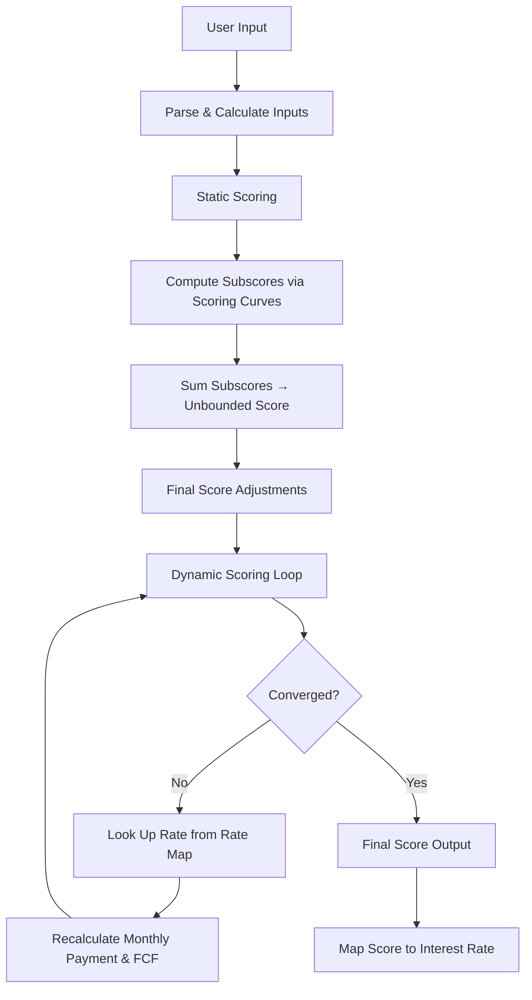
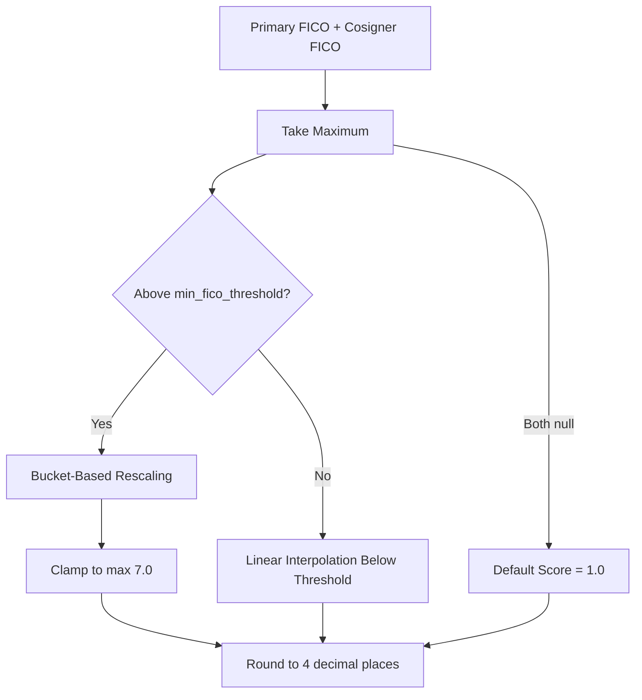

# Scoring System

The pricing service calculates risk scores for loan applications using product-specific scoring models. This page details how scores are computed for Student Loan Refinancing (SLR) and Student Loan Origination (SLO), the input factors involved, the scoring algorithms, and how scores ultimately map to interest rates.

## Scoring Endpoints

The service exposes several endpoints that trigger scoring calculations:

| Endpoint | Router | Product | Description |
|----------|--------|---------|-------------|
| `POST /slr` | `slr_dynamic.py` | SLR | Dynamic scoring returning final score and subscores |
| `POST /slr` (v1) | `slr_dynamic_v1.py` | SLR | V1 dynamic scoring endpoint |
| `POST /slr/alloy` | `slr_dynamic.py` | SLR | Combined scoring and pricing from Alloy inputs |

The `/slr` endpoint performs dynamic scoring only, while `/slr/alloy` performs both scoring and pricing in a single request, parsing applicant data from Alloy inputs. For SLO, scoring is handled through FICO-based score models (see [SLO FICO Scoring](#slo-fico-scoring) below).

For full endpoint specifications, see [API Endpoints Reference](./api-endpoints.md).

## SLR Scoring Architecture

SLR scoring uses a two-layer approach: **static scoring** computes a base score from financial metrics, and **dynamic scoring** iterates to convergence by incorporating rate-dependent calculations.



### Dynamic Scoring Process

As described in the endpoint documentation, dynamic scoring works as follows:

1. An initial set of user inputs is used to compute a score
2. The score is used to look up an interest rate from a rate map
3. The interest rate recalculates inputs (e.g., estimated monthly payment, which affects FCF)
4. This process repeats until convergence

The `DynamicScoring` class orchestrates this loop, delegating static score computation to `StaticScoring`.

## SLR Input Factors

### Income

Income is parsed hierarchically from Alloy inputs by `SlrIncomeParser`:

1. **Verified Income** (highest priority) — aggregated from verified salary, bonus, rental, K1, disability, social security/pension, child support/alimony, and investments
2. **Claimed Annual Income** — sum of all reported income fields
3. **Employment Income** — calculated from employment data, considering employment status (employed, self-employed, retired, future employment within 6 months)

Net income is derived from gross income using `IncomeCalculator.gross_to_net()`, which applies federal taxes, state taxes (by applicant state), and other taxes (FICA) using bracket-based calculations.

### Housing Expenses

Calculated by `HousingExpenseCalculator`:

- **Reported expenses**: Sole mortgage + 75% of joint mortgage + rent (factual values preferred over claimed)
- **Fallback**: If no expenses reported, uses 90% of median one-bedroom housing cost for the applicant's ZIP code (via FIPS code lookup), defaulting to $1,012.00 if ZIP/FIPS not found

### Free Cash Flow (FCF)

```
FCF = (Net Annual Income / 12) - Fixed Expenses
```

Where fixed expenses are:
```
Fixed Expenses = Housing Expense + Non-Real Estate Expense + Loan Monthly Payment - Student Loan Expense
```

Student loan expense is subtracted to avoid double-counting (since the loan being refinanced replaces existing student loan payments).

**FCF Adjustment**: If the loan amount exceeds $275,000, FCF is reduced by $1,000.

### Excess Free Cash Flow

```
Excess FCF = (FCF - (0.2/12) × Income - 0.1 × Credit Card Balance) × (24 - months_to_use)
```

Clamped to a minimum of 0. This represents additional cash available over time, factoring in months since graduation or residency.

### Assets

- **Revised Assets**: Total assets + max(Excess FCF, 0), with a cap of $3,000 when total assets < $3,000 and credit card balance exceeds total assets
- **Assets-to-Loan Ratio**: (Total Assets + max(Excess FCF, 0) - Credit Card Balance) / Loan Amount, capped at 0 under the same low-asset condition

### Other Factors

| Factor | Description |
|--------|-------------|
| **FICO Score** | Credit score mapped through FicoCurve |
| **Degree Type** | Mapped via DegreeTypeCurve lookup |
| **Credit Card to Income Ratio** | Credit card balance relative to income |
| **Backend DTI** | `12 × Fixed Expenses / Annual Income`, rounded to 4 decimal places |
| **Loan Amount** | Uses approved amount if available, otherwise requested amount |

For cosigner applications, total loan amount includes the primary loan plus any existing cosigner loan balance.

## SLR Static Score Calculation

### Scoring Curves

The `StaticScoring` class uses interpolation functions built from predefined scoring curves. Two curve sets exist:

| Curve Set | Usage |
|-----------|-------|
| `scoring_curves` | Standard SLR scoring |
| `assets_lite_scoring_curves` | Asset-lite scoring variant with different weights |

Each set defines curves for seven factors:

| Curve | Maps From |
|-------|-----------|
| `FicoCurve` | FICO score → subscore |
| `AssetsToLoanCurve` | Assets-to-loan ratio → subscore |
| `CreditCardToIncomeCurve` | Credit card/income ratio → subscore |
| `FreeCashFlowCurve` | FCF amount → subscore |
| `IncomeCurve` | Income amount → subscore |
| `AssetsCurve` | Liquid assets → subscore |
| `DegreeTypeCurve` | Degree type → subscore (lookup, not interpolation) |

### Subscore Aggregation

The unbounded score is computed by summing all subscores plus a default adjustment of 0.5:

```python
unbounded_score = (
    max(0, assets_to_loan_ratio)
    + max(0, assets)
    + fico
    + degree_type
    + income
    + credit_card_to_income_ratio
    + free_cash_flow
    + 0.5  # default_adjustment
)
```

> Note: `assets_to_loan_ratio` and `assets` subscores are floored at 0 before aggregation.

### Final Score Adjustments

The unbounded score is passed through a final adjustment strategy. Two strategies exist:

| Strategy | Used By |
|----------|---------|
| `LegacyStaticScoringAdjustment` | Standard SLR scoring |
| `SlrClipStaticScoreAdjustment` | Asset-lite scoring (clips score to bucket-defined range) |

The legacy adjustment uses these parameters:

| Parameter | Default Value |
|-----------|---------------|
| `lower_score_rate_map` | 6.99 |
| `upper_score_rate_map` | 7.0 |
| `lower_score_output_cutoff` | 7.7 |
| `upper_score_output_cutoff` | 8.35 |

## SLR Score Output Structure

Each scoring result contains per-term items with:

| Field | Description |
|-------|-------------|
| `score` | Final constrained risk score |
| `sub_scores` | Individual subscores (assets, assets_to_loan_ratio, credit_card_to_income_ratio, degree_type, fico, free_cash_flow, income, school_cdr_effect, school_rank) |
| `backend_dti` | Debt-to-income ratio |
| `estimated_monthly_payment_cents` | Monthly payment for the term |
| `free_cash_flow_cents` | Computed FCF |
| `excess_free_cash_flow_cents` | Computed excess FCF |
| `revised_assets_cents` | Revised asset value |
| `fixed_expenses_cents` | Total fixed expenses |
| `term_months` | Loan term |

> `school_cdr_effect` and `school_rank` are always 0 in SLR scoring — they are not used.

For Alloy-based scoring, additional fields include `butterfly_score`, `butterfly_contribution`, and `butterfly_prediction` from the butterfly underwriting model (via SageMaker).

### Combined Scoring (Cosigner)

When a cosigner is present, the system produces separate score outputs for primary and cosigner applicants. The `combined_scoring` flag indicates whether scores and/or prices were combined. Cosigner scoring is handled by `CosignerScoreAndPricer`, which applies score filtering and generates separate price outputs.

## Score-to-Rate Mapping

Scores are mapped to interest rates through **rate maps** stored in the database. The mapping process:

1. A rate map is loaded from `PostgresRateStore` based on `rate_map_version` and optional `experimental_condition`
2. `SlrPricer._generate_rate_map_funs()` creates interpolation functions from the rate map data
3. The fixed-rate interpolation function maps a risk score to an interest rate
4. Rate map details include `min_score` and `max_score` boundaries from the rate data

Rate maps are versioned and may have experimental conditions applied via the [Experiments and Feature Flags](experiments-feature-flags) system. Rate adjustments (e.g., channel-specific, auto-pay, HBG discount, campaign discount) are applied on top of the base rate. See [Rate Management and Versioning](./rate-management.md) for details.

## SLO FICO Scoring

SLO uses a fundamentally different scoring approach based on FICO credit scores rather than the multi-factor model used by SLR.

### FICO Score Model

The `FicoModel` class (in `slo_fico_scoring.py`) loads its configuration from YAML files under `pricing_service/domains/slo/models/`:

```python
FicoModel.from_config("slo_fico_scoring_model.yaml")
```

The configuration defines:
- **`score_buckets`**: Ranges of FICO scores mapped to internal score ranges
- **`min_fico_threshold_for_buckets`**: Minimum FICO score for bucket-based scoring
- **`min_approve_score`**: Minimum internal score for approval

### FICO Score Computation



**Above threshold** — The FICO score is rescaled within the matching bucket:

```python
score = score_max - ((max_fico - fico) / (max_fico - min_fico)) * (score_max - score_min)
```

The result is clamped to a maximum of 7.0.

**At or below threshold** — A linear interpolation is used:

```python
score = (fico - min_threshold) * (1 - min_approve_score) / (1 - min_threshold) + min_approve_score
```

**No FICO scores available** — Defaults to 1.0.

### SLO Score Curves

The FICO model can override score curves passed to the SLO endpoint via `get_experimental_score_curves()`. When active, this replaces all score values in the score curve with the FICO-derived score. This is controlled through SLO scoring experiments (configured in `slo_scoring_experiments.yaml`).

> **Important constraint**: SLO experiments and SLO scoring experiments cannot be active simultaneously for the same rate map version. Unit tests enforce this.

## Product-Specific Scoring Differences

| Aspect | SLR | SLO |
|--------|-----|-----|
| **Primary scoring model** | Multi-factor static + dynamic scoring | FICO-based scoring |
| **Input factors** | Income, assets, FICO, degree, FCF, DTI, credit card ratio | FICO score (primary and/or cosigner) |
| **Scoring curves** | 7 interpolation curves (assets, income, FICO, etc.) | Score buckets with linear rescaling |
| **Dynamic iteration** | Yes — iterates until convergence with rate map | No — direct FICO-to-score mapping |
| **Score range** | Bounded by adjustment parameters (e.g., 6.99–8.35) | Bounded by bucket config (max 7.0) |
| **Asset-lite variant** | Yes (`assets_lite_scoring_curves`) | No |
| **Cosigner handling** | Separate scoring with optional combination | Takes max of primary/cosigner FICO |
| **Experiment config** | `slr_experiments.yaml` | `slo_experiments.yaml` + `slo_scoring_experiments.yaml` |
| **Model configuration** | Code-defined curves in `slr_static.py` | YAML-defined in `slo_fico_scoring_model.yaml` |

For more on how products are structured, see [Product Domains](./product-domains.md). For how scores flow through the full request lifecycle, see [Request Flow Through the Service](request-flow).