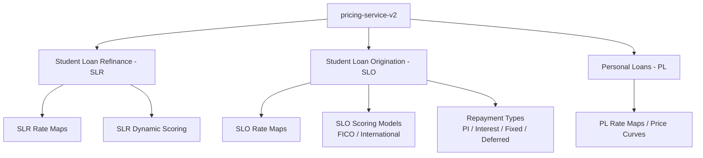
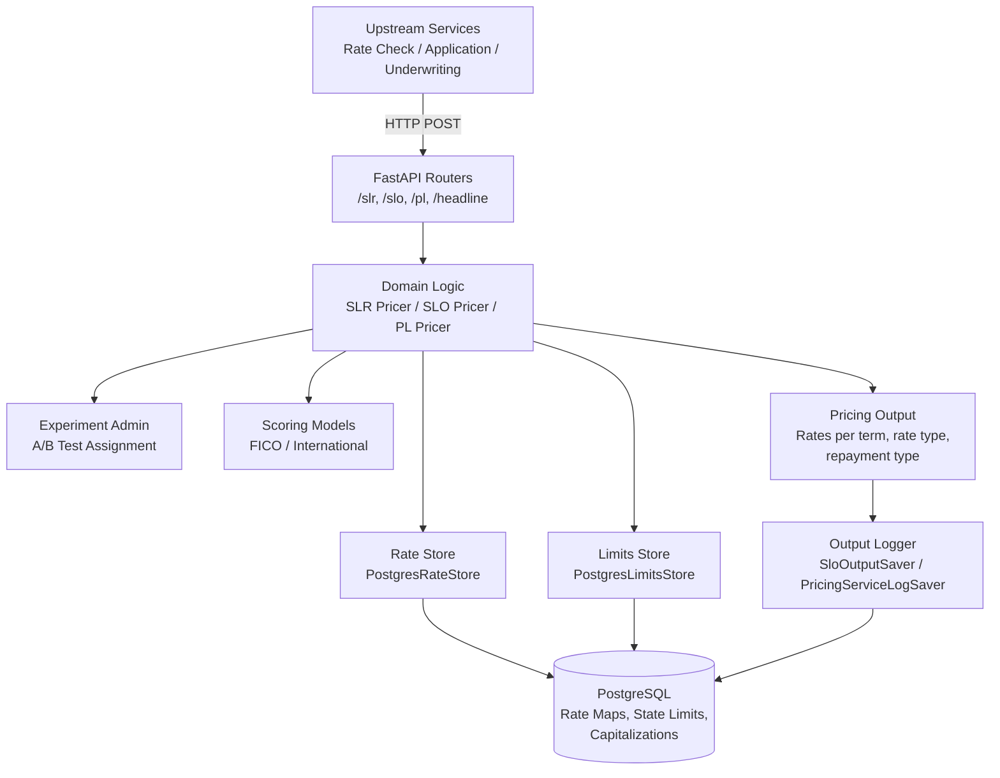
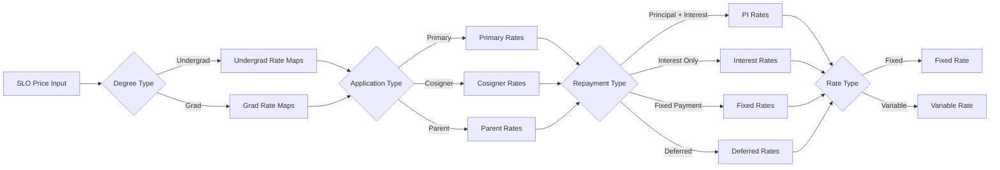

# Service Overview

The **pricing-service-v2** is a core backend service at Earnest responsible for computing interest rates, risk scores, and loan pricing across all supported loan products. It determines whether a borrower is eligible for a loan based on state licensing laws, generates personalized rate offers, and supports experimentation through A/B testing of pricing strategies.

## Purpose

As stated in the repository:

> This service has several business purposes:
> - It provides interest rates for all the products supported by Earnest.
> - It provides headline rates and eligibility of underwriting a loan given different state licensing laws.
> - It provides scoring for the SLR population in the form of static scores and dynamic scoring.

The service sits at the intersection of borrower data, regulatory constraints, and business pricing strategy — translating risk scores and rate maps into concrete loan offers.

## Supported Product Types

The service prices three distinct Earnest loan products, each with its own rate maps, channels, and business logic:

| Product | Code | Description | Key Characteristics |
|---------|------|-------------|---------------------|
| **Student Loan Refinance** | `slr` | Refinancing existing student loans | Channel-based pricing (direct mail, high-balance grads), dynamic scoring, asset-lite experiments |
| **Student Loan Origination** | `slo` | New student loans for current students | Undergrad/grad degree types, multiple application types (primary/cosigner/parent), repayment type variants (deferred, interest-only, fixed, principal+interest), international scoring |
| **Personal Loans** | `pl` | General-purpose personal loans | Channel-based pricing with its own rate curve structure |

Each product maintains independent rate map versions, state eligibility rules, and experimental conditions. For detailed product-specific logic, see [Product Domains](./product-domains.md).

## When the Service Is Invoked

The service is called at multiple stages of the loan application lifecycle:

| Stage | Description |
|-------|-------------|
| **Rate Check** | Early in the funnel, when a prospective borrower checks what rates they might qualify for. The service generates indicative pricing based on available borrower data. |
| **Application Submission** | When a borrower formally submits a loan application. The service produces binding rate offers. |
| **Underwriting** | During the underwriting decision process, where final pricing is determined based on complete borrower and loan data. |

The specific stage can influence which scoring model is applied and whether experimental conditions are active. For example, the SLO pricer checks whether a user has already completed a rate check (`rate_estimate_id`) to determine whether scoring experiments should apply.

For the full request lifecycle, see [Request Flow Through the Service](request-flow).

## Key Capabilities

### Multi-Product Pricing

The service maintains separate pricing engines, rate map stores, and domain logic for each product type. Rate maps are versioned independently (e.g., `slr-42`, `slo-48`) and stored in PostgreSQL. The `PostgresRateStore` handles retrieval and caching of rate data, with LRU caching and database pre-warming on startup to minimize latency.

Rate maps are loaded as DataFrames and processed into interpolation functions (using `scipy.RegularGridInterpolator`) that map `(term, risk_score)` pairs to interest rates for both fixed and variable rate types.

### Dynamic Scoring

For SLO, the service supports multiple scoring models selected based on borrower characteristics:

- **FICO Scoring Model** (`FicoModel`) — applied to graduate borrowers on rate map versions ≥ 48, using primary and cosigner FICO scores
- **Graduate FICO Scoring Model** — a separate FICO model configuration for graduate-level applicants
- **International Scoring Model** (`InternationalScoringModel`) — applied when the channel is `international`, using country, sub-degree type, and Nova score

Scoring model selection is determined at runtime based on degree type, channel, rate map version, and experiment assignment. See [Scoring System](./scoring-system.md) for details.

### State-Based Eligibility

Every pricing request is evaluated against state-specific constraints:

- **State limits** define minimum loan amounts and maximum allowed interest rates per state and product, with loan-amount-based tiers
- **State interest capitalizations** control whether certain repayment options (e.g., deferred) are available in a given state
- **Cosigner state handling** — when a cosigner is present, the service selects the more restrictive state limit between the primary borrower's and cosigner's states

If a computed rate exceeds the state's maximum allowed interest rate, that rate is suppressed (returned as `NaN` / excluded from output). If the loan amount is below the state minimum, no rates are returned.

For the full eligibility system, see [State-Based Eligibility and Licensing](./state-eligibility.md).

### Headline Rates

The service provides headline rates — the best available rates shown in marketing and pre-qualification contexts — for all products. Headline rate types are enumerated as:

- `slr` — Student Loan Refinance
- `pl` — Personal Loans
- `slo` — Student Loan Origination (aggregate)
- `slo_pu`, `slo_pg`, `slo_cu`, `slo_cg`, `slo_au`, `slo_ag` — SLO broken down by application type (primary/cosigner/parent) and degree level (undergrad/grad)

Headline rates always use the `default` experimental condition and the latest effective rate map version.

### A/B Testing and Experiments

The service has a sophisticated experimentation framework that supports A/B testing of pricing strategies. Experiments are defined per rate map version and product, with:

- **Channel-based segmentation** — different experiment configurations per channel (e.g., `unknown`, `leveredge`, `international`)
- **Modulo-based user assignment** — users are assigned to experiment groups deterministically based on `user_id % modulo_divider`
- **BPS (basis points) test groups** — experiment groups that apply rate adjustments (e.g., `minus_25_bps_test`, `plus_50_bps_test`)
- **Scoring experiments** — separate experiment track that can swap the scoring model used for a user

Experiment assignment affects both which rate map rows are used (via `experimental_condition` filtering) and which scoring model is applied. The system ensures that scoring experiments and SLO rate experiments don't conflict — scoring experiments only activate when the SLO rate experiment is inactive for a given rate map version.

For configuration details, see [Experiments and Feature Flags](experiments-feature-flags).

## High-Level Architecture

The service follows a layered architecture: **routers** handle HTTP concerns, **domains** contain business logic and pricing engines, **repositories** manage data access, and **entities** define the data contracts. For the full architecture breakdown, see [Architecture Overview](./architecture-overview.md).

## SLO Product Complexity

The SLO product is the most complex, with pricing varying across multiple dimensions:

Each combination produces rates across multiple loan terms, resulting in a rich pricing surface that is interpolated from the rate map data.

## Related Documentation

| Page | Description |
|------|-------------|
| [Technology Stack](./technology-stack.md) | Core frameworks and libraries used |
| [Local Development Setup](./local-development-setup.md) | Getting the service running locally |
| [Architecture Overview](./architecture-overview.md) | Detailed system architecture |
| [API Endpoints Reference](./api-endpoints.md) | Complete API documentation |
| [Product Domains](./product-domains.md) | Deep dive into each product's pricing logic |
| [Request Flow Through the Service](request-flow) | End-to-end request processing |
| [Scoring System](./scoring-system.md) | Scoring models and selection logic |
| [State-Based Eligibility and Licensing](./state-eligibility.md) | State constraint enforcement |
| [Experiments and Feature Flags](experiments-feature-flags) | A/B testing configuration |
| [Rate Management and Versioning](./rate-management.md) | Rate map lifecycle and versioning |