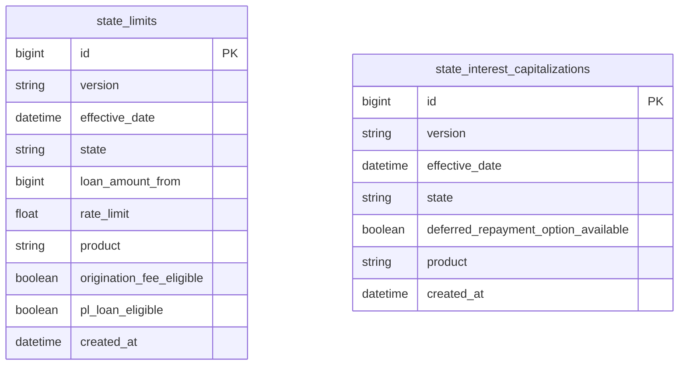
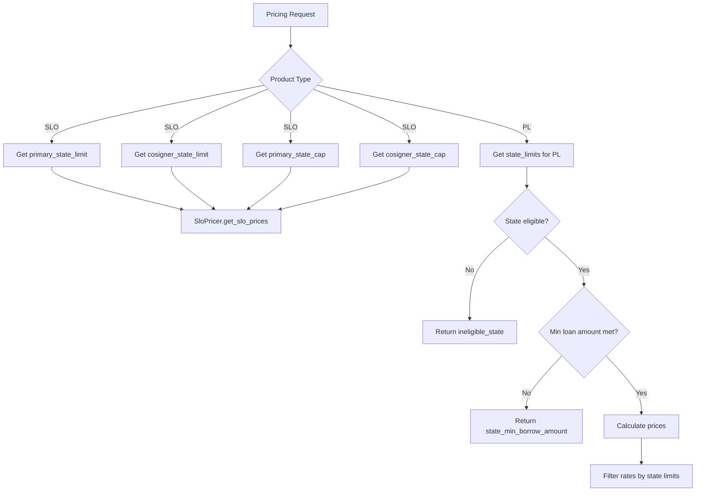
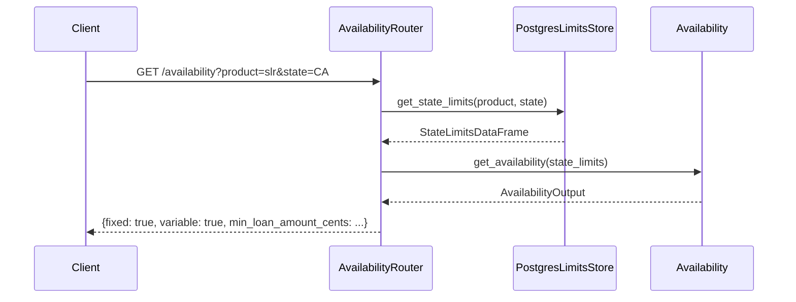

# State-Based Eligibility and Licensing

The pricing service enforces state-specific lending rules through two database tables—`state_limits` and `state_interest_capitalizations`—that govern rate caps, loan amount thresholds, and interest capitalization behavior per state and product. These constraints are loaded at runtime and used across pricing endpoints and the `/availability` endpoint to determine whether a product can be offered in a given state.

## Database Tables



### `state_limits`

This table stores state-level lending constraints for all products. Each row defines a rule for a specific state, product, and loan amount tier.

| Column | Type | Nullable | Description |
|--------|------|----------|-------------|
| `id` | BigInteger | No | Primary key |
| `version` | String(100) | No | Version identifier for the constraint set |
| `effective_date` | DateTime (tz) | No | When this constraint becomes active |
| `state` | String(2) | No | Two-letter state/territory code |
| `loan_amount_from` | BigInteger | No | Lower bound of the loan amount tier (in cents) |
| `rate_limit` | Float | **Yes** | Maximum allowed rate for this tier; null means no cap |
| `product` | String(20) | No | Product identifier (`slr`, `slo`, `pl_v2`) |
| `origination_fee_eligible` | Boolean | Yes | Whether origination fees are allowed in this state |
| `pl_loan_eligible` | Boolean | Yes | Whether personal loans are eligible in this state |
| `created_at` | DateTime (tz) | No | Auto-set on insert |

**Unique constraint:** `(version, effective_date, state, loan_amount_from, product)`

Multiple rows per state/product combination are expected—each `loan_amount_from` value defines a tier with its own `rate_limit`. This allows tiered rate caps (e.g., different caps for loans above $10,000 vs. above $25,000).

### `state_interest_capitalizations`

This table controls whether deferred repayment options are available in a given state. Currently used only for the SLO (Student Loan Origination) product.

| Column | Type | Nullable | Description |
|--------|------|----------|-------------|
| `id` | BigInteger | No | Primary key |
| `version` | String(100) | No | Version identifier |
| `effective_date` | DateTime (tz) | No | When this rule becomes active |
| `state` | String(2) | No | Two-letter state/territory code |
| `deferred_repayment_option_available` | Boolean | No | Whether deferred repayment is offered |
| `product` | String(20) | No | Product identifier |
| `created_at` | DateTime (tz) | No | Auto-set on insert |

**Unique constraint per migration validation:** `(version, state, product)`

## How State Data Is Loaded

The `PostgresLimitsStore` class in [`pricing_service/repositories/limits_store.py`](./data-model.md) provides cached access to both tables.

### State Limits Retrieval

`get_latest_state_limits()` uses a windowed query to fetch only the most recent effective version per product/state combination:

```sql
with latest_state_limits as (
    select *,
        dense_rank() over (partition by product, state order by effective_date desc) as rank_date
    from state_limits 
    where effective_date <= now()
)
select * from latest_state_limits where rank_date = 1
```

This ensures that only currently-effective constraints are used, and newer versions automatically supersede older ones based on `effective_date`.

`get_state_limits(product, state)` filters the cached result for a specific product and state, returning a `StateLimitsDataFrame` wrapper. Note that the personal loans product is stored as `pl_v2` in the database but referenced as `Product.personal_loans` in code—the store handles this mapping explicitly.

### State Capitalizations Retrieval

`get_state_capitalizations(state, product)` queries for the most recent effective capitalization record for a given state and product, returning a `StateInterestCapitalization` entity.

> Both `get_state_limits` and `get_state_capitalizations` are decorated with `@lru_cache`, meaning results are cached in memory for the lifetime of the process. Cache size is 128 entries.

## How State Data Is Used in Pricing



### Student Loan Origination (SLO)

The SLO router retrieves four pieces of state data for each pricing request:

1. **Primary state limits** — from `limits_store.get_state_limits(state, Product.student_loan_origination)`
2. **Cosigner state limits** — if a cosigner state is provided; returns `None` if the state is not supported (catches `ProductNotSupportedInState`)
3. **Primary state capitalizations** — determines if deferred repayment is available
4. **Cosigner state capitalizations** — same check for the cosigner's state

All four are passed into `SloPricer.get_slo_prices()`, which uses them to constrain the generated price curves.

> Cosigner state limit and capitalization lookups are independently cached with `@lru_cache` in the SLO router.

### Personal Loans (PL)

The `PlPricer` performs a sequence of state-based eligibility checks:

1. **`is_pl_loan_eligible(loan_amount)`** — checks the `pl_loan_eligible` flag on the state limits
2. **`get_min_loan_amount_allowed()`** — verifies the offered loan amount meets the state minimum
3. **`is_origination_fee_eligible(loan_amount)`** — checks the `origination_fee_eligible` flag
4. **`PlStateLimitFilter.filter_rates()`** — removes rate options that exceed the state's `rate_limit`

If the state has no limits data or the loan is ineligible, the pricer returns an empty price curve with a descriptive `NoPricesMessage` (e.g., `ineligible_state` or `state_min_borrow_amount`).

## Availability Endpoint

The `/availability` endpoint provides a lightweight check of whether a product is available in a given state.



The implementation composes `Availability.get_availability` with `PostgresLimitsStore.get_state_limits` via `toolz.compose`:

```python
get_product_state_availability = compose(Availability.get_availability, PostgresLimitsStore.get_state_limits)
```

**Response behavior:**

| Scenario | `fixed` | `variable` | `min_loan_amount_cents` |
|----------|---------|------------|------------------------|
| State limits exist for product/state | `true` | `true` | Minimum loan amount from state limits |
| No state limits, validation error, or unsupported state | `false` | `false` | `null` |

The endpoint catches `ValidationError`, `ProductNotSupportedInState`, and `NoRateMapExists` exceptions, returning the "unavailable" response for all of them. Results are cached with `@lru_cache(maxsize=256)`.

> The `Availability` domain class currently always returns `fixed=True` and `variable=True` when state limits exist. The differentiation between fixed and variable availability is not state-dependent in the current implementation.

## Valid States and Products

The `StateOrTerritory` enum (from `pricing_service.entities.shared.string`) defines all accepted state/territory codes. Both the migration validation and the API input parsing use this enum for validation.

**Accepted products per table:**

| Table | Valid Products |
|-------|---------------|
| `state_limits` | `slr`, `slo`, `pl_v2` |
| `state_interest_capitalizations` | `slo` (validated in migration; only SLO uses this table) |

## Managing State Constraints

State limits and capitalizations are managed through CSV-based [database migrations](database-migrations). The workflow uses `dev_tools/migrations/update_state_constraints.py` and is invoked via:

```bash
./go update_state_constraints state_limits.csv
./go update_state_constraints state_interest_capitalizations.csv
```

### CSV Formats

**`state_limits.csv`:**

| Field | Type | Required | Notes |
|-------|------|----------|-------|
| `version` | string | Yes | Version identifier |
| `effective_date` | datetime | Yes | When the constraint takes effect |
| `state` | string | Yes | Must be a valid `StateOrTerritory` value |
| `loan_amount_from` | int | Yes | Lower bound of loan amount tier |
| `rate_limit` | float | **No** | Nullable; no cap if omitted |
| `product` | string | Yes | One of `slr`, `slo`, `pl_v2` |

**`state_interest_capitalizations.csv`:**

| Field | Type | Required | Notes |
|-------|------|----------|-------|
| `version` | string | Yes | Version identifier |
| `effective_date` | datetime | Yes | When the rule takes effect |
| `state` | string | Yes | Must be a valid `StateOrTerritory` value |
| `deferred_repayment_option_available` | bool | Yes | Whether deferred repayment is offered |
| `product` | string | Yes | Currently only `slo` |

### Validation Rules

The migration script performs these validations before generating an Alembic migration file:

- **Field names** must exactly match the expected schema
- **No null values** in required columns (`rate_limit` is the only nullable field in state limits)
- **Data types** are checked against expected types
- **No duplicate rows** based on composite keys (`version, state, loan_amount_from, product` for limits; `version, state, product` for capitalizations)
- **Field values** are validated against allowed enums (`StateOrTerritory` for states, product lists for products)

If validation passes, the script generates an Alembic migration file from a Mako template and copies the CSV to `alembic/data/` for reproducible migrations.

## Relationship to Other Components

- The [API Endpoints Reference](./api-endpoints.md) documents the `/availability` endpoint and product-specific pricing endpoints that consume state data
- The [Data Model](./data-model.md) page covers the full database schema including these tables
- The [Request Flow](request-flow) page traces how state checks fit into the overall pricing pipeline
- The [Database Migrations](database-migrations) page covers the Alembic migration infrastructure used to deploy state constraint changes
- The [Product Domains](./product-domains.md) page describes how each product type (SLR, SLO, PL) integrates state rules into its pricing logic