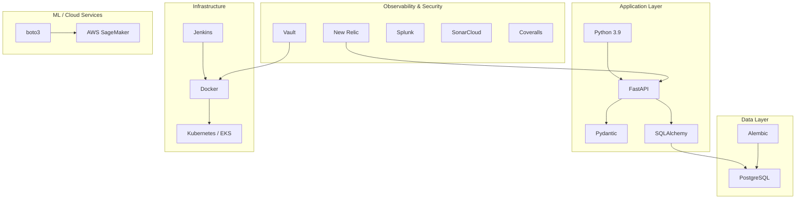
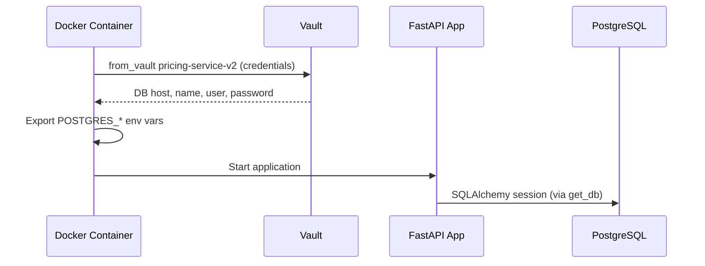
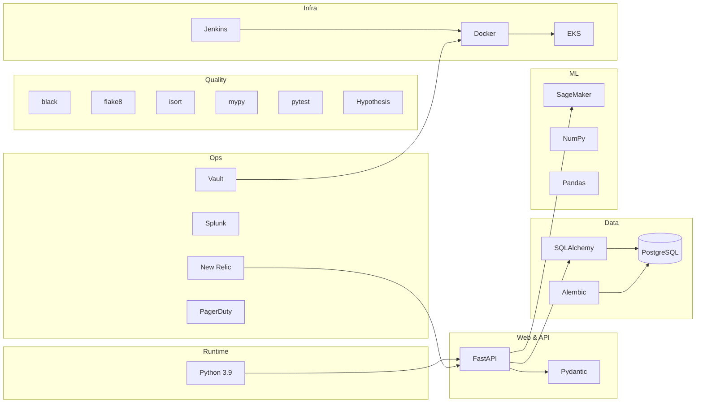

# Technology Stack

This page provides a complete inventory of the technologies, frameworks, and tools used in pricing-service-v2, along with rationale for key choices where evident from codebase patterns.

## Overview

pricing-service-v2 is a Python-based microservice built on FastAPI, backed by PostgreSQL, and deployed to Kubernetes (EKS) via a Jenkins CI/CD pipeline. The stack is oriented around type safety, structured data validation, and database-driven configuration management.

## Core Application Technologies

| Technology | Role | Evidence |
|---|---|---|
| **Python 3.9** | Runtime language | `.pre-commit-config.yaml` specifies `language_version: python3.9` for black. README mentions Python 3.7.3 in legacy setup instructions, but pre-commit config confirms 3.9 is the current version. |
| **FastAPI** | Web framework / API layer | Routers use `from fastapi import APIRouter, Depends`. Dependency injection via `Depends()` is used extensively for database sessions, service construction, and parser wiring. |
| **Pydantic** | Request/response validation and data modeling | Listed as a core technology ("Case classes and validation tool"). Entity classes use Pydantic models (e.g., `PlAlloyConfigs.parse_raw()`, typed request/response objects). |
| **SQLAlchemy** | Database ORM | Listed as core technology. Used via `pricing_service/db/` for models and `pricing_service/repositories/` for data access. Database sessions are injected through FastAPI's `Depends(get_db)`. |
| **Alembic** | Database migrations | Dedicated `alembic/` directory with `data/` (seed files for rate maps and state limits) and `versions/` (migration files). The `./go alembic` command runs migrations. Rate CSV files are converted into Alembic migration files via `./go add_rates`. |

> **Rationale — FastAPI**: The use of FastAPI's dependency injection (`Depends`) is a central architectural pattern. Routers construct complex object graphs (parsers, calculators, pricers, model clients) through dependency functions, enabling testability and separation of concerns. The framework also provides automatic OpenAPI documentation, exposed at `/redoc` and `/documentation` endpoints across environments.

> **Rationale — Alembic**: Alembic is used not just for schema migrations but also as the mechanism for loading rate data and state constraints into the database. The `./go add_rates` and `./go update_state_constraints` commands generate migration files from CSV data, making rate versioning auditable through migration history. See [Database Migrations with Alembic](database-migrations) for details.

## Data Layer

| Technology | Role | Evidence |
|---|---|---|
| **PostgreSQL** | Primary database | `docker-cmd.sh` references `POSTGRES_HOST`, `POSTGRES_DB`, `POSTGRES_USER`, `POSTGRES_PASSWORD` environment variables sourced from Vault. |

Database credentials are retrieved at container startup from Vault and exported as environment variables. The connection pattern flows through SQLAlchemy's session management, exposed to FastAPI routes via the `get_db` dependency.

## Machine Learning & Cloud Services

| Technology | Role | Evidence |
|---|---|---|
| **AWS SageMaker** | ML model inference | `boto3.client("sagemaker-runtime")` in `routers/pl.py`; `SagemakerClient` wraps the runtime client; model endpoint configured via `PL_MODEL_ENDPOINT` env var. |
| **boto3** | AWS SDK | Used to create SageMaker runtime clients for model prediction. |

The PL (Personal Loans) product domain uses SageMaker for dynamic scoring. The `PlModelClient` wraps a `SagemakerClient` which calls a SageMaker endpoint to produce dragonfly prediction outputs.

## Infrastructure & Deployment

| Technology | Role | Evidence |
|---|---|---|
| **Docker** | Containerization | `docker-cmd.sh` serves as the container entrypoint. `./go build`, `./go push`, `./go rebuild`, `./go start` commands manage Docker lifecycle. `docker-compose` is used for local development. |
| **Kubernetes (EKS)** | Container orchestration | Deployment targets referenced in README (environments: `slo-dev`, `staging`, `internal`/production). |
| **Jenkins** | CI/CD pipeline | README references Jenkins pipeline stages (e.g., "Validate Code Format" stage). `./go lint_jenkinsfile` command validates the Jenkinsfile. `scripts/ci/` directory contains CI-specific scripts and `requirements-ci.txt`. |

The deployment flow follows a **Gitflow** model with specific branch conventions:

- `staging-pricing` branch for staging deployments
- `master` branch for production deployments
- Branch types: `feature`, `fix`, `release`, `hotfix`

See [Deployment Pipeline and Process](deployment-pipeline) for the full deployment workflow.

### Docker Container Startup

The `docker-cmd.sh` entrypoint handles two modes:

1. **Migration mode** (`migrate` argument): Runs `alembic upgrade head`
2. **Application mode**: Executes the passed command (typically the FastAPI server)

Both modes first retrieve secrets from Vault and export them as environment variables.

## Observability & Monitoring

| Technology | Role | Evidence |
|---|---|---|
| **New Relic** | Application performance monitoring | `new_relic_license_key` retrieved from Vault in `docker-cmd.sh` and exported as `NEW_RELIC_LICENSE_KEY`. |
| **Splunk** | Log aggregation and dashboards | README links to Splunk dashboard and describes Splunk-based alerting for staging and production. |
| **python-json-logger** | Structured JSON logging | Listed as core technology. `FastAPIStructLogger` is used across routers for structured logging with bound context (e.g., `decisioning_request_id`, `application_id`, `seed_id`). |
| **PagerDuty** | Incident alerting | README links to PagerDuty service directory for incident reporting. |

> **Rationale — Structured Logging**: The `FastAPIStructLogger` pattern binds contextual identifiers (user IDs, request IDs, application IDs) to log entries, enabling correlation of log events across the request lifecycle. This is visible in router code where `struct_logger.bind(...)` is called with domain-specific identifiers before processing.

See [Monitoring and Observability](monitoring-observability) for detailed coverage.

## Secrets Management

| Technology | Role | Evidence |
|---|---|---|
| **Vault** | Secrets storage and retrieval | `docker-cmd.sh` uses `from_vault pricing-service-v2` to fetch database credentials and the New Relic license key. `vault-data/secret/` directory provides local development secrets. Environment-specific configuration uses `PlAlloyConfigs.parse_raw(os.environ["PL_ALLOY_CONFIGS"])` pattern for runtime config. |

The `from_vault` utility retrieves secrets at container startup. The codebase supports both a legacy Vault path and a PBE (Platform-Based Environment) path, with the `exportNonNull` function selecting the appropriate value.

See [Secrets Management with Vault](secrets-management) for details.

## Code Quality & Static Analysis

| Technology | Role | Evidence |
|---|---|---|
| **SonarCloud** | Code quality, maintainability, security analysis | README badges for Maintainability Rating, Technical Debt, Vulnerabilities, Security Rating. |
| **Coveralls** | Test coverage tracking | README badge for Coverage Status. |
| **black** (v25.1.0) | Code formatting | `.pre-commit-config.yaml`; enforced in pre-commit hooks and Jenkins pipeline. |
| **flake8** | Linting | `.pre-commit-config.yaml`; part of pre-commit and CI validation. |
| **isort** (v6.0.1) | Import sorting | `.pre-commit-config.yaml`; part of pre-commit and CI validation. |
| **autoflake** (v2.3.1) | Unused import removal | `.pre-commit-config.yaml`; removes all unused imports automatically. |
| **mypy** | Static type checking | `./go mypy` command runs type checking on application directory (excludes tests). |
| **pre-commit** (v4.1.0) | Git hook management | `.pre-commit-config.yaml` orchestrates all formatting and linting hooks. |

## Testing & Data Analysis

| Technology | Role | Evidence |
|---|---|---|
| **pytest** | Test framework | `./go test` runs pytest in the dev container. `tests/` directory at project root. |
| **Hypothesis** | Property-based testing | Listed as core technology for property-based testing. |
| **NumPy** | Numerical computing | Listed as core technology; likely used in rate calculations and scoring. |
| **Pandas** | Data manipulation | Listed as core technology; likely used for rate map processing and data transformations. |
| **JupyterLab** | Interactive analysis | `./go jupyterlab` starts a JupyterLab instance via Docker. |

See [Testing Strategy and Practices](testing-strategy) for the testing approach.

## Dependency Management

| Technology | Role | Evidence |
|---|---|---|
| **Poetry** | Dependency management and virtual environments | Listed as core technology. README setup instructions describe `poetry install` creating a `.venv` in the project directory. `./go poetry_cache_clean` available for cache issues. |

## Complete Technology Map

## Related Pages

- [Service Overview](./service-overview.md) — Business purpose and high-level context
- [Local Development Setup](./local-development-setup.md) — Setting up the development environment
- [Architecture Overview](./architecture-overview.md) — System architecture and component relationships
- [Database Migrations with Alembic](database-migrations) — Migration workflows and rate data loading
- [Deployment Pipeline and Process](deployment-pipeline) — CI/CD pipeline details
- [Monitoring and Observability](monitoring-observability) — New Relic, Splunk, and alerting setup
- [Secrets Management with Vault](secrets-management) — Vault integration details